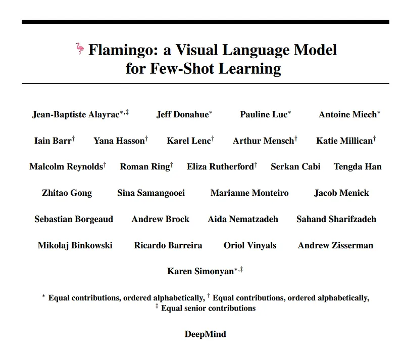
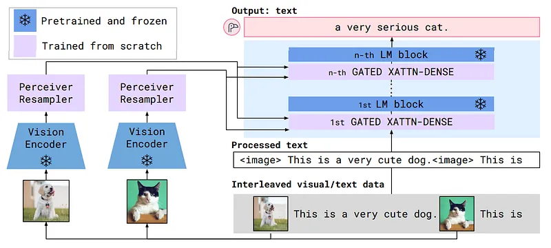
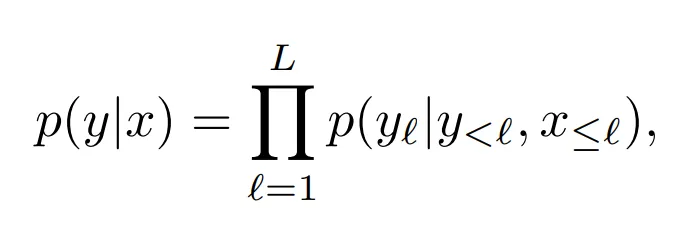
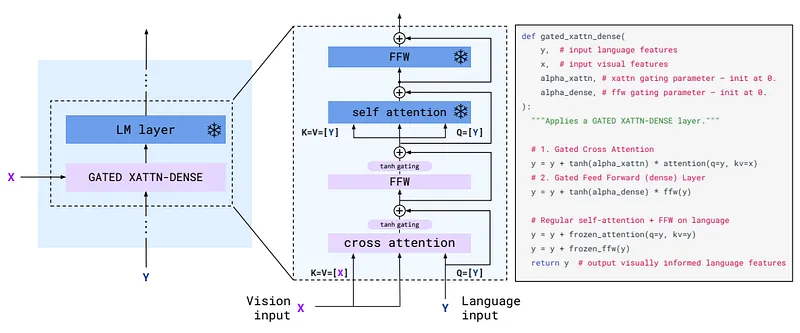
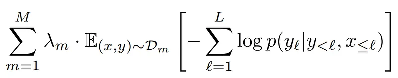
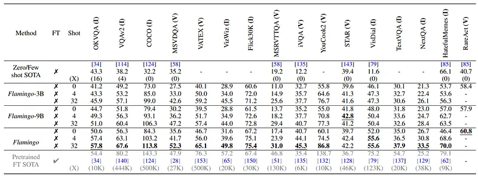
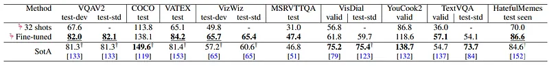
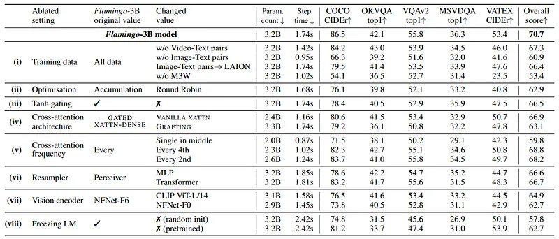

# Papers Explained 82 - Flamingo

Flamingo is a family of visual language models (VLMs) that take as input visual data interleaved with text and produce free-form text as output.

This page ingests the source article into the wiki and connects it to [[Papers Explained Corpus]], [[Vision Language Models]], [[Large Language Models]].

## Source Metadata

- Source file: `raw/2023-12-22_Papers-Explained-82--Flamingo-8c124c394cdb.md`
- Source title: Papers Explained 82: Flamingo
- Published: 2023-12-22
- Canonical: [https://medium.com/@ritvik19/papers-explained-82-flamingo-8c124c394cdb](https://medium.com/@ritvik19/papers-explained-82-flamingo-8c124c394cdb)

## Key Ideas

- This paper proposes key architectural innovations to:
- bridge powerful pretrained vision-only and language-only models
- handle sequences of arbitrarily interleaved visual and textual data
- seamlessly ingest images or videos as inputs.
- where 𝑦ℓ is the ℓ-th language token of the input text, 𝑦<ℓ is the set of preceding tokens, 𝑥≤ℓ is the set of images/videos preceding token 𝑦ℓ in the interleaved sequence and 𝑝 is parametrized by a Flamingo model.

## Notes

Flamingo is a family of visual language models (VLMs) that take as input visual data interleaved with text and produce free-form text as output. Flamingo models can be trained on large-scale multi-modal web corpora containing arbitrarily interleaved text and images, which is key to endow them with in-context few-shot learning capabilities.

This paper proposes key architectural innovations to:

- bridge powerful pretrained vision-only and language-only models

- handle sequences of arbitrarily interleaved visual and textual data

- seamlessly ingest images or videos as inputs.

*Figure: Flamingo architecture overview*

## Approach

The architectural components are chosen to leverage pretrained vision and language models and bridge them effectively. First, the Perceiver Resampler receives spatio-temporal features from the Vision Encoder and outputs a fixed number of visual tokens. Second, these visual tokens are used to condition the frozen LM using freshly initialised cross-attention layers that are interleaved between the pretrained LM layers. These new layers offer an expressive way for the LM to incorporate visual information for the next-token prediction task. Flamingo models the likelihood of text 𝑦 conditioned on interleaved images and videos 𝑥 as follows:

where 𝑦ℓ is the ℓ-th language token of the input text, 𝑦<ℓ is the set of preceding tokens, 𝑥≤ℓ is the set of images/videos preceding token 𝑦ℓ in the interleaved sequence and 𝑝 is parametrized by a Flamingo model.

### Vision Encoder: from pixels to features

The pretrained and frozen Normalizer-Free ResNet (NFNet) F6 is used as our vision encoder. The vision encoder is pretrained using a contrastive objective on our datasets of image and text pairs, with the two-term contrastive loss being employed. The output of the final stage is a 2D spatial grid of features, which is flattened to a 1D sequence. For video inputs, frames are sampled at 1 FPS and encoded independently to obtain a 3D spatio-temporal grid of features, to which learned temporal embeddings are added. The features are then flattened to 1D before being fed to the Perceiver Resampler

### Perceiver Resampler: from varying-size large feature maps to few visual tokens

This module connects the vision encoder to the frozen language model. It takes as input a variable number of image or video features from the vision encoder and produces a fixed number of visual outputs (64), reducing the computational complexity of the vision-text cross-attention.

### Conditioning frozen language models on visual representations

Text generation is performed by a Transformer decoder, conditioned on the visual representations produced by the Perceiver Resampler. Pretrained and frozen text-only LM blocks are interleaved with blocks trained from scratch, which cross-attend to the visual output from the Perceiver Resampler.

*Figure: GATED XATTN-DENSE layers.*

### Interleaving new GATED XATTN-DENSE layers within a frozen pretrained LM

The pretrained LM blocks are frozen, and gated cross-attention dense blocks are inserted between the original layers, being trained from scratch. To ensure that at initialization, the conditioned model yields the same results as the original language model, a tanh-gating mechanism is used . This multiplies the output of a newly added layer by tanh(𝛼) before adding it to the input representation from the residual connection, where 𝛼 is a layer-specific learnable scalar initialized to 0. Thus, at initialization, the model output matches that of the pretrained LM, improving training stability and final performance.

### Varying model sizes

Experiments were performed across three model sizes, building on the 1.4B, 7B, and 70B parameter Chinchilla models; they are called Flamingo-3B, Flamingo-9B, and Flamingo-80B respectively.

While increasing the parameter count of the frozen LM and the trainable vision-text GATED XATTN-DENSE modules, a fixed-size frozen vision encoder and trainable Perceiver Resampler were maintained across the different models.

### Multi-visual input support: per-image/video attention masking

The image-causal modelling is obtained by masking the full text-to-image cross-attention matrix, limiting which visual tokens the model sees at each text token. At a given text token, the model attends to the visual tokens of the image that appeared just before it in the interleaved sequence, rather than to all previous images. Though the model only directly attends to a single image at a time, the dependency on all previous images remains via self-attention in the LM. This single-image cross-attention scheme importantly allows the model to seamlessly generalise to any number of visual inputs, regardless of how many are used during training.

## Training

The Flamingo models are trained on a mixture of three kinds of datasets, all scraped from the web: an interleaved image and text dataset derived from webpages, image-text pairs, and video-text pairs.

### M3W: Interleaved image and text dataset

The few-shot capabilities of Flamingo models rely on training on interleaved text and image data. For this purpose, the MultiModal MassiveWeb (M3W) dataset is collected. Both text and images are extracted from the HTML of approximately 43 million webpages, and the positions of images relative to the text are determined based on the relative positions of the text and image elements in the Document Object Model (DOM). An example is then constructed by inserting tags in plain text at the locations of the images on the page, and inserting a special (end of chunk) token (added to the vocabulary and learnt) prior to any image and at the end of the document. A random subsequence of 𝐿 = 256 tokens is sampled from each document, and up to the first 𝑁 = 5 images included in the sampled sequence are taken.

### Pairs of image/video and text

The ALIGN dataset, composed of 1.8 billion images paired with alt-text, is first leveraged for our image and text pairs. To complement this dataset, a dataset of image and text pairs targeting better quality and longer descriptions is collected: LTIP (Long Text & Image Pairs), consisting of 312 million image and text pairs. Additionally, a similar dataset but with videos instead of still images is collected: VTP (Video & Text Pairs), consisting of 27 million short videos (approximately 22 seconds on average) paired with sentence descriptions. The syntax of paired datasets is aligned with the syntax of M3W by prepending and appending to each training caption.

### Multi-objective training and optimisation strategy

The model are trained by minimizing a weighted sum of per-dataset expected negative log-likelihoods of text, given the visual inputs:

where 𝒟𝑚 and 𝜆𝑚 are the 𝑚-th dataset and its weighting, respectively. Tuning the per-dataset weights 𝜆𝑚 is key to performance.

## Experiments

### Few-shot learning on vision-language tasks

*Figure: Comparison to the state of the art.*

A single Flamingo model reaches the state of the art on a wide array of image (I) and video (V) understanding tasks with few-shot learning, significantly outperforming previous best zero- and few-shot methods with as few as four examples. More importantly, using only 32 examples and without adapting any model weights, Flamingo outperforms the current best methods — fine-tuned on thousands of annotated examples — on seven tasks. Best few-shot numbers are in bold, best numbers overall are underlined.

### Fine-tuning Flamingo as a pretrained vision-language model

*Figure: Comparison to SotA when fine-tuning Flamingo.*

Flamingo is finetuned on all nine tasks where Flamingo does not achieve SotA with few-shot learning. Flamingo sets a new SotA on five of them, outperfoming methods (marked with †) that use tricks such as model ensembling or domain-specific metric optimisation (e.g., CIDEr optimisation).

### Ablation studies

*Figure: Ablation studies*

Each row should be compared to the baseline Flamingo run (top row). Step time measures the time spent to perform gradient updates on all training datasets.

## Paper

Flamingo: a Visual Language Model for Few-Shot Learning [2204.14198](https://arxiv.org/abs/2204.14198)

## Figures

Figures from the Medium HTML export (`raw/2023-12-22_Papers-Explained-82--Flamingo-8c124c394cdb.md`); local copies under `wiki/assets/papers-explained-82-flamingo/` when download succeeded.

| Figure | Caption |
|--------|---------|
|  | Title card: Flamingo. |
|  | Flamingo architecture overview. |
|  | The architectural components are chosen to leverage pretrained vision and language models and bridge them effectively. |
|  | GATED XATTN-DENSE layers. |
|  | The model are trained by minimizing a weighted sum of per-dataset expected negative log-likelihoods of text, given the visual inputs. |
|  | Comparison to the state of the art. |
|  | Comparison to SotA when fine-tuning Flamingo. |
|  | Ablation studies. |
## Related

- [[Papers Explained Corpus]]
- [[Vision Language Models]]
- [[Large Language Models]]
- [[Papers Explained 81 - An In-depth Look at Gemini’s Language Abilities]]
- [[Papers Explained 83 - Are Emergent Abilities of Large Language Models a Mirage]]

#summary #topic
