# Papers Explained 84 - NF Net

NF Net is an improved class of Normalizer-Free ResNets that achieves competitive test accuracies with batch-normalized networks, offers faster training times, and introduces an adaptive gradient clipping technique to overcome instabilities associated with deep ResNets.

This page ingests the source article into the wiki and connects it to [[Papers Explained Corpus]], [[Model Compression and Efficiency]].

## Source Metadata

- Source file: `raw/2023-12-29_Papers-Explained-84--NF-Net-b8efa03d6b26.html`
- Source title: Papers Explained 84: NF Net
- Published: 2023-12-29
- Canonical: [https://medium.com/@ritvik19/papers-explained-84-nf-net-b8efa03d6b26](https://medium.com/@ritvik19/papers-explained-84-nf-net-b8efa03d6b26)

## Key Ideas

- NF Net is an improved class of Normalizer-Free ResNets that achieves competitive test accuracies with batch-normalized networks, offers faster training times, and introduces an adaptive gradient clipping technique to overcome instabilities associated with...
- Recommended Readings: [Papers Explained Review 01: Convolutional Neural Networks](https://ritvik19.medium.com/papers-explained-review-01-convolutional-neural-networks-78aeff61dcb3) [[Papers Explained 29...
- Batch Normalization (BN) is a technique commonly used in deep neural networks to improve training stability and convergence. Four main benefits of Batch Normalization:
- Batch Normalization, when applied to the residual branch of a network, plays a crucial role in enabling the training of very deep networks with thousands of layers.
- By using skip connections and Batch Normalization together, the scale of hidden activations on the residual branches is reduced during initialization.

## Notes

NF Net is an improved class of Normalizer-Free ResNets that achieves competitive test accuracies with batch-normalized networks, offers faster training times, and introduces an adaptive gradient clipping technique to overcome instabilities associated with deep ResNets.

Recommended Readings: [Papers Explained Review 01: Convolutional Neural Networks](https://ritvik19.medium.com/papers-explained-review-01-convolutional-neural-networks-78aeff61dcb3) [Papers Explained 29: ConvMixer](https://ritvik19.medium.com/papers-explained-29-convmixer-f073f0356526)

## Understanding Batch Normalization

Batch Normalization (BN) is a technique commonly used in deep neural networks to improve training stability and convergence. Four main benefits of Batch Normalization:

### Downscaling the Residual Branch:

Batch Normalization, when applied to the residual branch of a network, plays a crucial role in enabling the training of very deep networks with thousands of layers.

By using skip connections and Batch Normalization together, the scale of hidden activations on the residual branches is reduced during initialization.

This reduction in scale biases the signal towards the skip path, ensuring that the network has well-behaved gradients early in training. This, in turn, facilitates efficient optimization.

### Eliminating Mean-Shift:

Activation functions like ReLUs or GELUs, which are not anti-symmetric, can result in non-zero mean activations.

In deep networks, this non-zero mean can lead to a ‘mean-shift’ in the activations of different training examples on a single channel, causing issues like predicting the same label for all training examples at initialization.

Batch Normalization ensures that the mean activation on each channel is zero across the current batch, thus eliminating mean shift and improving the behavior of the network.

### Regularizing Effect:

Batch Normalization is believed to act as a regularizer, enhancing the accuracy of the test set.

The noise introduced by batch statistics, computed on a subset of the training data, is thought to contribute to this regularization effect.

Tuning the batch size or using techniques like ghost batch normalization in distributed training can further improve test accuracy.

### Efficient Large-Batch Training:

Batch Normalization has a smoothing effect on the loss landscape, increasing the largest stable learning rate.

While this property may not be beneficial with small batch sizes, it becomes crucial for efficient training with large batch sizes.

Training at larger learning rates is essential for achieving faster convergence, especially when parallelizing training across multiple devices.

## Towards Removing Batch Normalization

Prior attempts involved suppressing the scale of activations in the residual branch at initialization using small constants or learnable scalars.

Some works observed improved performance with additional regularization but found it insufficient to achieve competitive test accuracies.

NF-ResNets are preactivation ResNets that can be trained to competitive accuracies without normalization layers. They use a specific form of residual block where the function in the residual branch is designed to be variance-preserving at initialization.

*Figure: hi denotes the inputs to the i th residual block, and fi denotes the function computed by the i th residual branch.*

The function fi is parameterized to be variance preserving at initialization, such that Var(fi(z)) = Var(z) for all i. The scalar α controls the rate at which the variance of activations increases after each residual block.

The scalar βi is determined by predicting the standard deviation of the inputs to the i th residual block, βi = p Var(hi), where Var(hi+1) = Var(hi) + α 2 , except for transition blocks (where spatial downsampling occurs), for which the skip path operates on the downscaled input (hi/βi), and the expected variance is reset after the transition block to hi+1 = 1 + α 2 .

Squeeze-excite layers’ outputs are multiplied by a factor of 2. Additionally, a learnable scalar initialized to zero at the end of each residual branch is included.

To prevent the emergence of mean-shift in hidden activations, Scaled Weight Standardization is introduced as a modification of Weight Standardization.

Convolutional layers are reparameterized using scaled weights based on mean (µi) and standard deviation (σi) calculations.

*Figure: N denotes the fan-in.*

Activation functions are scaled by a non-linearity specific scalar gain (γ) to ensure variance preservation.

NF-ResNets, with additional regularization like Dropout and Stochastic Depth, match test accuracies achieved by batch-normalized pre-activation ResNets on ImageNet at a batch size of 1024. They outperform batch-normalized networks for very small batch sizes but perform worse for large batch sizes (4096 or higher). However, NF-ResNets do not match the performance of state-of-the-art networks like EfficientNets.

## Adaptive Gradient Clipping for Efficient Large-Batch Training

Gradient clipping is known to stabilize training and enable the use of larger learning rates, which is crucial for poorly conditioned loss landscapes or when training with large batch sizes. The standard gradient clipping algorithm constrains the norm of the gradient vector. It scales the gradient vector if its norm exceeds a certain threshold (λ).

This standard clipping algorithm is sensitive to the choice of the clipping threshold (λ). Fine-tuning is required when varying model depth, batch size, or learning rate. Hence, AGC is introduced as a solution to the sensitivity of the standard clipping algorithm.

AGC is motivated by the ratio of the norm of gradients to the norm of weights for each layer. The intuition is that the ratio provides a measure of how much a single gradient descent step will change the original weights.

*Figure: || · ||F denote the Frobenius norm*

|| Wi || * F = max(|| Wi || F , ∈), with default ∈ = 10−3

AGC clips gradients based on unit-wise ratios of gradient norms to parameter norms. The clipping threshold (λ) is a scalar hyperparameter. The clipping is performed for each unit in the gradient of a layer, preventing unstable training by limiting the update size based on the parameter norm.

Using AGC, the authors achieve stable training of NF-ResNets with large batch sizes (up to 4096) and strong data augmentations. AGC outperforms other methods, such as LARS (a normalized optimizer), in terms of performance.

## Architecture

### SE-ResNeXt-D Model as Baseline

This is a specific type of neural network architecture, namely a ResNeXt (a variant of ResNet) enhanced with Squeeze-and-Excitation (SE) blocks. SE blocks aim to capture channel-wise dependencies and recalibrate feature responses.

### Group Width Adjustment

The number of channels in the 3x3 convolutions is set to 128, regardless of the block width. Smaller group widths reduce theoretical Floating-Point Operations (FLOPS). However, on modern accelerators like TPUv3, no actual speedup is realized unless the per-device batch size is sufficiently large due to memory constraints.

### Backbone Modification

The default depth scaling pattern for ResNets involves non-uniformly increasing the number of layers in the second and third stages. This is found to be suboptimal and a modified depth scaling pattern [1, 2, 6, 3] is proposed for the smallest model variant (F0).

The default width pattern in ResNets, where the first stage has 256 channels which are doubled at each subsequent stage, is reconsidered. An alternative width pattern [256, 512, 1536, 1536] is proposed to increase capacity in the third stage while slightly reducing capacity in the fourth stage, preserving training speed.

### Bottleneck Residual Block Modification

*Figure: Summary of NFNet bottleneck block design and architectural differences.*

An additional 3x3 grouped convolution is added after the first convolution in the bottleneck residual block. This modification minimally impacts FLOPS and has almost no impact on training time on target accelerators.

### Scaling Strategy

*Figure: NFNet family depths, drop rates, and input resolutions.*

A scaling strategy inspired by EfficientNet is adopted, which involves scaling model depth, input resolution, and width. However, width scaling is found to be ineffective for ResNet backbones. Instead, depth is scaled as described above, and training resolution is scaled such that each variant is approximately half as fast to train as its predecessor.

### Regularization

As the model’s capacity increases, the regularization strength is increased. However, modifying weight decay or stochastic depth rate was found to be ineffective. Instead, the drop rate of Dropout is scaled to provide explicit regularization, compensating for the lack of implicit regularization from batch normalization.

*Figure: The effect of architectural modifications and data augmentation on ImageNet Top-1 accuracy,*

## Evaluation

### NFNet Model Evaluation on ImageNet

*Figure: ImageNet Accuracy comparison for NFNets and a representative set of models.*

Data Augmentation Effects:

- Strong data augmentations substantially improve model performance.

- The addition of MixUp, RandAugment, and CutMix enhances overall performance.

Comparison with Default ResNet Stage Widths:

- The modified pattern in the third and fourth stages of the model yields improvements compared to the default ResNet stage widths.

Batch Normalization vs. NF Strategy:

- Models with batch normalization achieve slightly lower test accuracies and are 20–40% slower to train.

- Larger model variants (F4 and F5) are not stable with batch normalization, possibly due to numerical imprecision with bfloat16 training.

Summary of Model Variants:

- NFNet-F5 achieves a top-1 validation accuracy of 86.0%, outperforming EfficientNet-B8 with MaxUp.

- NFNet-F1 matches the accuracy of EfficientNet-B7 with RA and is 8.7 times faster to train.

- NFNet-F5 with SAM (Sharpness-Aware Minimization) attains 86.3% top-1, and NFNet-F6 attains 86.5%, substantially improving over the existing state of the art on ImageNet without extra data.

### Evaluating NFNets under Transfer

*Figure: ImageNet Transfer Top-1 accuracy after pre-training.*

- Pre-training NF-ResNets on a dataset of 300 million labeled images and fine-tuning on ImageNet results in better performance compared to batch-normalized counterparts, with NF networks consistently outperforming by around 1% absolute top-1 accuracy.

- The removal of batch normalization in transfer learning scenarios directly benefits final performance.

- NFNet models, specifically NFNet-F4+ pre-trained for 20 epochs, achieve an ImageNet top-1 accuracy of 89.2%, surpassing other models with extra training data and establishing the highest accuracy using transfer learning.

- The results indicate that NFNet models are particularly effective in transfer learning regimes and can outperform batch-normalized counterparts in such scenarios.

## Paper

High-Performance Large-Scale Image Recognition Without Normalization [2102.06171](https://arxiv.org/abs/2102.06171)

## Figures

Figures from the Medium HTML export (`raw/2023-12-29_Papers-Explained-84--NF-Net-b8efa03d6b26.html`); local copies under `wiki/assets/papers-explained-84-nf-net/` when download succeeded.

| Figure | Caption |
|--------|---------|
| 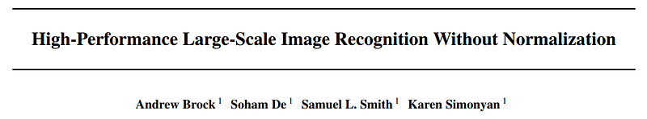 | Title card: NF Net. |
| 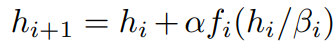 | hi denotes the inputs to the i th residual block, and fi denotes the function computed by the i th residual branch. |
| 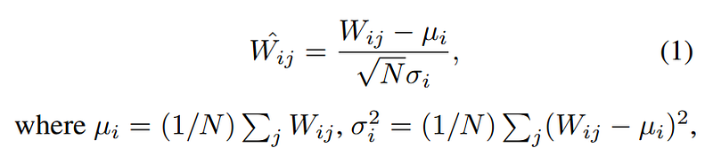 | N denotes the fan-in. |
| 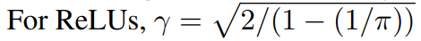 | Activation functions are scaled by a non-linearity specific scalar gain (γ) to ensure variance preservation. |
| 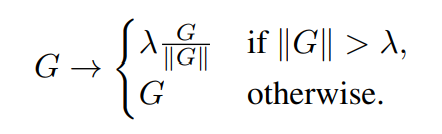 | This standard clipping algorithm is sensitive to the choice of the clipping threshold (λ). |
| 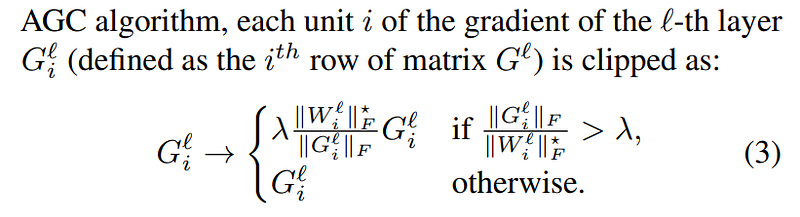 | || · ||F denote the Frobenius norm. |
| 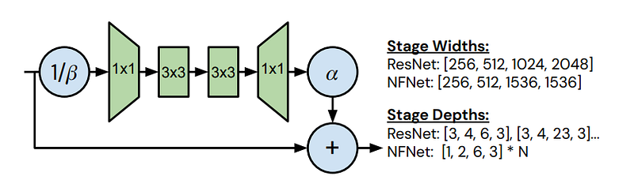 | Summary of NFNet bottleneck block design and architectural differences. |
| 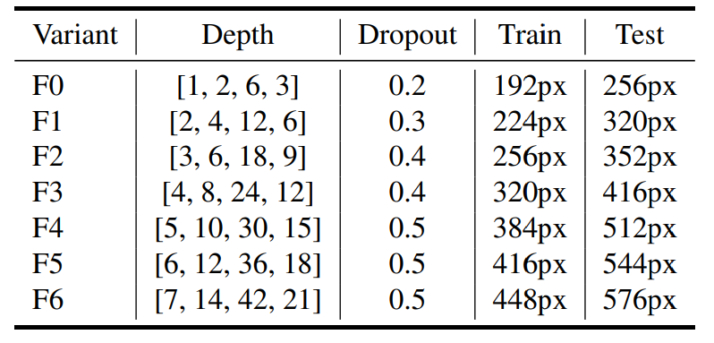 | NFNet family depths, drop rates, and input resolutions. |
| 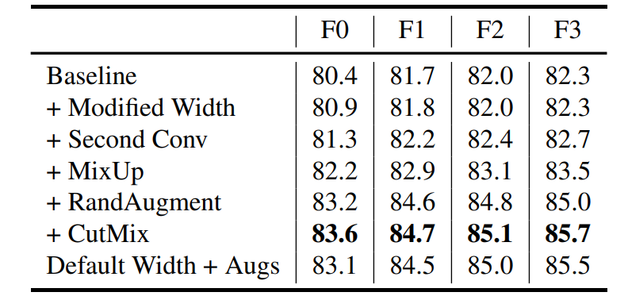 | The effect of architectural modifications and data augmentation on ImageNet Top-1 accuracy,. |
| 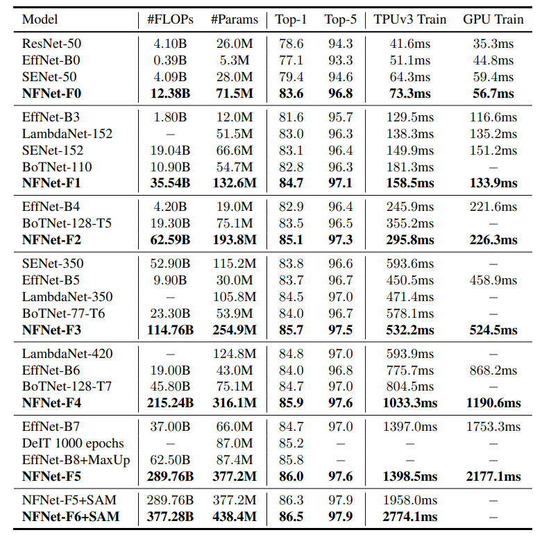 | ImageNet Accuracy comparison for NFNets and a representative set of models. |
| 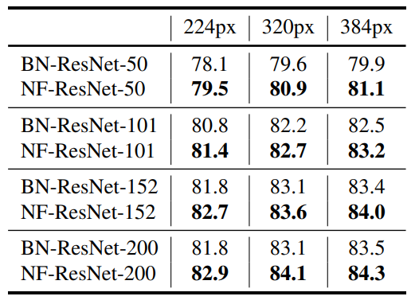 | ImageNet Transfer Top-1 accuracy after pre-training. |
## Related

- [[Papers Explained Corpus]]
- [[Model Compression and Efficiency]]
- [[Papers Explained 83 - Are Emergent Abilities of Large Language Models a Mirage]]
- [[Papers Explained 85 - Scaling Data-Constrained Language Models]]

#summary #topic
