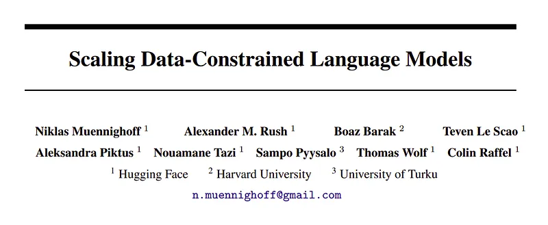
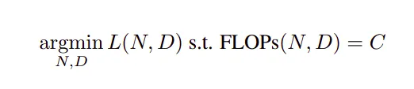
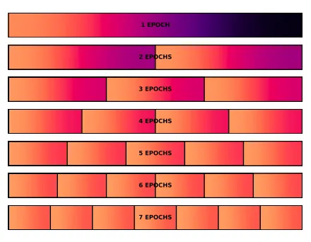
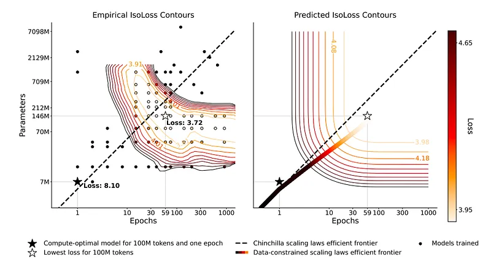
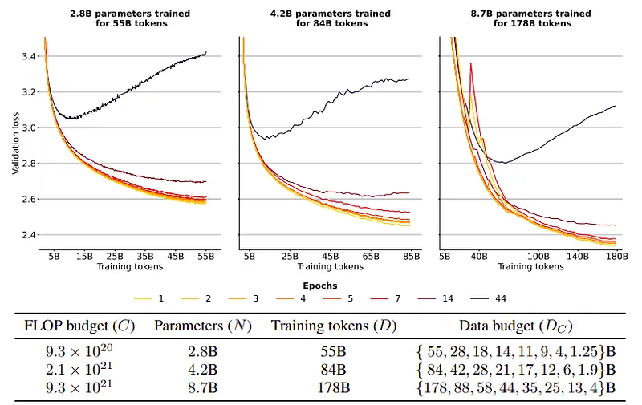
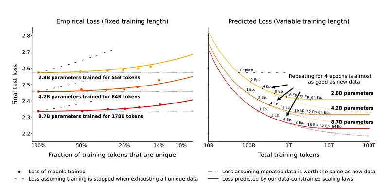
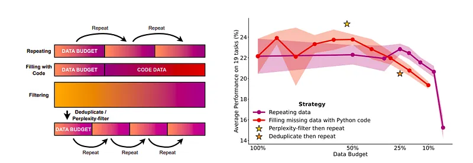

# Papers Explained 85 - Scaling Data-Constrained Language Models

Extrapolating the current trend of scaling language models i.e. increasing both parameter count and training dataset size suggests that training dataset size may soon be limited by the amount of text data available on the internet.

This page ingests the source article into the wiki and connects it to [[Papers Explained Corpus]], [[Large Language Models]], [[Synthetic Data]].

## Source Metadata

- Source file: `raw/2024-01-01_Papers-Explained-85--Scaling-Data-Constrained-Language-Models-2a4c18bcc7d3.md`
- Source title: Papers Explained 85: Scaling Data-Constrained Language Models
- Published: 2024-01-01
- Canonical: [https://medium.com/@ritvik19/papers-explained-85-scaling-data-constrained-language-models-2a4c18bcc7d3](https://medium.com/@ritvik19/papers-explained-85-scaling-data-constrained-language-models-2a4c18bcc7d3)

## Key Ideas

- Motivated by this limit, this study investigates scaling language models in data-constrained regimes. Models and datasets from all the training runs are freely available at [GitHub](https://github.com/huggingface/datablations).
- Recommended Reading: [Papers Explained 47: Gopher](https://ritvik19.medium.com/papers-explained-47-gopher-2e71bbef9e87) [Papers Explained 49: Chinchilla](https://ritvik19.medium.com/papers-explained-49-chinchilla-a7ad826d945e)
- For scaling LLMs, the resource is compute (measured in FLOPs). The metric used to quantify progress is the model’s loss on held-out data, i.e. the ability to predict the underlying data as measured in the model’s cross-entropy.
- Chinchilla uses three methods for making scaling predictions:
- (Fixed Parameters) Train with a fixed model size but on varying amounts of data.

## Notes

Extrapolating the current trend of scaling language models i.e. increasing both parameter count and training dataset size suggests that training dataset size may soon be limited by the amount of text data available on the internet.

Motivated by this limit, this study investigates scaling language models in data-constrained regimes. Models and datasets from all the training runs are freely available at [GitHub](https://github.com/huggingface/datablations).

Recommended Reading: [Papers Explained 47: Gopher](https://ritvik19.medium.com/papers-explained-47-gopher-2e71bbef9e87) [Papers Explained 49: Chinchilla](https://ritvik19.medium.com/papers-explained-49-chinchilla-a7ad826d945e)

## Background

For scaling LLMs, the resource is compute (measured in FLOPs). The metric used to quantify progress is the model’s loss on held-out data, i.e. the ability to predict the underlying data as measured in the model’s cross-entropy. The aim is to minimize the loss (L) subject to a compute resource constraint (C) via optimal allocation to number of parameters (N) and training tokens (D) as:

Chinchilla uses three methods for making scaling predictions:

- (Fixed Parameters) Train with a fixed model size but on varying amounts of data.

- (Fixed FLOPs) Train with fixed computation while parameters and training tokens vary.

- (Parametric Fit) Derive and fit a formula for the loss.

These methods lead to the conclusion that N and D should be scaled proportionally for compute-optimal training.

## Method: Data-Constrained Scaling Laws

The aim is to introduce a modified version of the scaling laws that accounts for data constraints.

To empirically explore the scaling behaviour in a data-limited setting, three different experimental protocols are considered in this work:

- (Fixed Unique Data) Fix the data constraint DC and train models varying epochs and parameters. These experiments target Allocation, specifically trade-off of D and N.

- (Fixed FLOPs) Fix the computation available and vary DC. These experiments target Return, i.e. how well does repeating scale compared to having more unique data.

- (Parametric Fit) Fit a generalised version of the Chinchilla formula on all the training runs and evaluate its predictive capability.

## Experimental Setup

For all experiments, models with the GPT-2 architecture and tokenizer, having up to 8.7 billion parameters are trained for up to 900 billion total tokens.

Early stopping is not used in order to also explore the extent of over-fitting when repeating.

*Figure: Dataset setup.*

Models are trained on subsets of C4. The data constraints are carefully defined to ensure maximal overlap. The entire available data is repeated rather than subsets of it. Data is shuffled after each epoch.

Runs using less data (more epochs) always use a subset of the data used in runs with more data (fewer epochs).

## Resource Allocation for Data-Constrained Scaling

- Optimal allocation is achieved by scaling epochs faster than adding parameters across all three data budgets.

- Empirical confirmation: A model with fewer parameters but following the data-constrained efficient frontier performs better than a model suggested by Chinchilla scaling laws.

- A smaller model from data-constrained scaling laws can lead to cheaper inference, but additional parameters aid in parallelizing training across GPUs.

- Too much compute (parameters or epochs) can lead to a decrease and eventual increase in loss, indicating that excessive compute might hurt performance.

*Figure: IsoLoss contours for 100 million unique tokens. (Left): 93 models trained with varying parameters and epochs on a fixed dataset. (Right): Comparison with the loss predictions from our proposed scaling laws for the same budget of 100 million unique tokens and the predicted efficient frontier.*

Left:

- Scaling experiments conducted with fixed data budgets (100M, 400M, and 1.5B tokens) and varied compute allocation for language models.

- Results show a significant reduction in loss (more than 50%) by training for multiple epochs and increasing model size beyond what would be compute-optimal for the given data budget.

- Optimal loss achieved at around 20–60 times more parameters and epochs, corresponding to a substantial increase in FLOPs (around 7000 times more).

- Indicates that single-epoch models under-utilize data, and extracting more signal is possible by repeating data and adding parameters, despite sub-optimal compute utilization.

Right:

- Predicted contours based on data-constrained scaling laws derived from 182 training runs.

- Single-epoch models with near compute-optimal parameters show overlapping efficient frontiers between the actual and predicted scaling equations (Chinchilla equation).

- Data-constrained efficient frontier suggests allocating additional compute more to epochs than parameters, contrasting the Chinchilla scaling laws that recommend scaling both equally.

## Resource Return for Data-Constrained Scaling

- Three FLOP budgets and eight data budgets were used to quantify Return on scaling.

- Models were trained on the same number of total tokens.

### Impact of Repeated Data:

*Figure: Validation Loss for Different Data Constraints (IsoFLOP)*

- Consistent with intuition and prior work on deduplication, models trained on less unique data (more epochs) exhibit higher loss.

- The loss difference is negligible for a few epochs.

- Example: N = 8.7 billion parameter model trained for four epochs has only 0.5% higher validation loss than the single-epoch model.

*Figure: Empirical and Extrapolated loss with constrained data. (Left): Loss as a function of repeated tokens for three different training budgets each with fixed number of parameters. . (Right): Extrapolating from the proposed data-constrained scaling law.*

### Comparison of Final Test Loss:

- (left) compares the final test loss of each model to predictions from a parametric fit.

- Data-constrained scaling laws accurately measure the decay in the value of repeated data.

- Underestimation occurs for failing models with loss increase midway through training (not depicted).

### Extrapolation of Budgets:

- (right) extrapolates three budgets by further scaling compute while keeping data constraints (DC) at 55B, 84B, and 178B tokens.

- Parameter R∗ D represents the “half-life” of epochs, where repeated tokens lose 1/e of their value.

- R∗ D ≈ 15, corresponding to 15 repetitions (or 16 epochs).

- Diminishing returns are observed beyond the 16-epoch marker.

### Overall Return on Repeating Data:

- The Return when repeating data is relatively good.

- Meaningful gains from repeating data can be made up to around 16 epochs (R∗ D), beyond which returns diminish extremely fast.

## Complementary Strategies for Obtaining Additional Data

*Figure: Strategies for data-constrained settings and their downstream performance.*

### Scaling Strategies:

- Code augmentation using Python code from The Stack to compensate for missing natural language data.

- Adapting filtering strategies: Deduplication and perplexity filtering.

- Maximum data budget (DC) set at 84 billion tokens, with variations in the availability of data for repetition and code filling.

- Perplexity filtering selects top 25% samples, resulting in 44 billion tokens.

- Deduplication filtering removes samples with a 100-char overlap, resulting in 21 billion tokens.

- Evaluation tasks based on 19 natural language tasks with zero to five in-context few-shot exemplars.

### Evaluation Metric Challenges:

- Loss is deemed inadequate as an evaluation metric due to different data distributions across models.

- Models evaluated on 19 natural language tasks with rescaled scores to ensure comparability.

### Comparison of Downstream Performance:

- Repeating data shows insignificant differences for up to around 4 epochs (25% budget) before dropping.

- Filling up to 50% of data with code (42 billion tokens) exhibits no deterioration, but performance decreases beyond that.

- Adding more code data may benefit non-natural language tasks, with jumps in performance noted for specific tasks.

- Deduplication filtering is found to be ineffective, while perplexity filtering proves effective.

### Recommendations for Data-Constrained Regimes:

- Perplexity filtering is recommended, while deduplication is not found beneficial.

- Filtering is suggested for noisy datasets, and both code augmentation and data repetition are recommended to increase data tokens.

- Doubling available data by adding code and repeating the new dataset for four epochs can result in 8× more training tokens.

## Conclusion

- Training large language models for multiple epochs by repeating data is beneficial and that scaling laws continue to hold in the multi-epoch regime, albeit with diminishing returns.

- Code gives the ability to scale an additional 2×.

- There are limits on the scaling horizon. In addition to collecting additional data, researchers should explore using current data in a more effective manner.

## Paper

Scaling Data-Constrained Language Models: [2305.16264](https://arxiv.org/abs/2305.16264)

## Figures

Figures from the Medium HTML export (`raw/2024-01-01_Papers-Explained-85--Scaling-Data-Constrained-Language-Models-2a4c18bcc7d3.md`); local copies under `wiki/assets/papers-explained-85-scaling-data-constrained-language-models/` when download succeeded.

| Figure | Caption |
|--------|---------|
|  | Title card: Scaling Data-Constrained Language Models. |
|  | Chinchilla uses three methods for making scaling predictions. |
|  | Dataset setup. |
|  | IsoLoss contours for 100 million unique tokens. (Left): 93 models trained with varying parameters and epochs on a fixed dataset. (Right): Comparison with the loss predictions from our proposed scaling laws for the same budget of 100 million unique tokens and the predicted efficient frontier. |
|  | Validation Loss for Different Data Constraints (IsoFLOP). |
|  | Empirical and Extrapolated loss with constrained data. (Left): Loss as a function of repeated tokens for three different training budgets each with fixed number of parameters.. (Right): Extrapolating from the proposed data-constrained scaling law. |
|  | Strategies for data-constrained settings and their downstream performance. |
## Related

- [[Papers Explained Corpus]]
- [[Large Language Models]]
- [[Synthetic Data]]
- [[Papers Explained 84 - NF Net]]
- [[Papers Explained 86 - Dense Passage Retriever]]

#summary #topic
