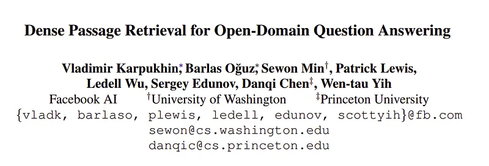
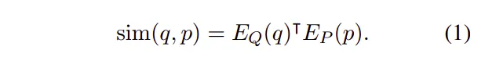
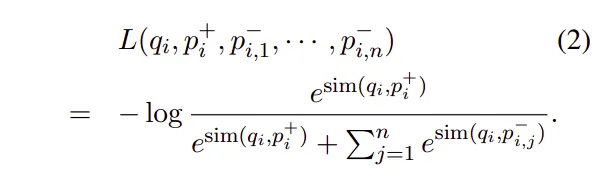
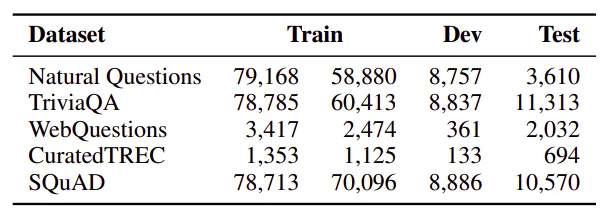
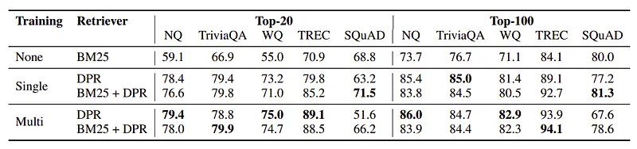

# Papers Explained 86 - Dense Passage Retriever

This paper shows that retrieval can be practically implemented using dense representations alone, where embeddings are learned from a small number of questions and passages by a simple dual encoder framework.

This page ingests the source article into the wiki and connects it to [[Papers Explained Corpus]], [[Embedding and Retrieval]], [[Model Compression and Efficiency]], [[Large Language Models]], [[Document AI]], [[Agentic AI]], [[Supervised Fine-Tuning]].

## Source Metadata

- Source file: `raw/2024-01-05_Papers-Explained-86--Dense-Passage-Retriever-c4742fdf27ed.md`
- Source title: Papers Explained 86: Dense Passage Retriever
- Published: 2024-01-05
- Canonical: [https://medium.com/@ritvik19/papers-explained-86-dense-passage-retriever-c4742fdf27ed](https://medium.com/@ritvik19/papers-explained-86-dense-passage-retriever-c4742fdf27ed)

## Key Ideas

- It demonstrates that with the proper training setup, simply fine-tuning the question and passage encoders on existing question-passage pairs is sufficient to greatly outperform BM25.
- Given a collection of M text passages, the goal of dense passage retriever (DPR) is to index all the passages in a low-dimensional and continuous space, such that it can efficiently retrieve the top k passages relevant to the input question for the reader at...
- The dense passage retriever (DPR) uses a dense encoder EP(·) which maps any text passage to a d-dimensional real-valued vector and builds an index for all the M passages that we will use for retrieval.
- At run-time, DPR applies a different encoder EQ(·) that maps the input question to a d-dimensional vector, and retrieves k passages of which vectors are the closest to the question vector.
- Although in principle the question and passage encoders can be implemented by any neural networks, this work uses two independent BERT networks (base, uncased) and takes the representation at the [CLS] token as the output, so d = 768.

## Notes

This paper shows that retrieval can be practically implemented using dense representations alone, where embeddings are learned from a small number of questions and passages by a simple dual encoder framework.

It demonstrates that with the proper training setup, simply fine-tuning the question and passage encoders on existing question-passage pairs is sufficient to greatly outperform BM25. It further verifies that, in the context of open-domain question answering, a higher retrieval precision indeed translates to a higher end-to-end QA accuracy.

## Dense Passage Retriever (DPR)

Given a collection of M text passages, the goal of dense passage retriever (DPR) is to index all the passages in a low-dimensional and continuous space, such that it can efficiently retrieve the top k passages relevant to the input question for the reader at run-time.

The dense passage retriever (DPR) uses a dense encoder EP(·) which maps any text passage to a d-dimensional real-valued vector and builds an index for all the M passages that we will use for retrieval.

At run-time, DPR applies a different encoder EQ(·) that maps the input question to a d-dimensional vector, and retrieves k passages of which vectors are the closest to the question vector. The similarity between the question and the passage is defined as the dot product of their vectors:

Although in principle the question and passage encoders can be implemented by any neural networks, this work uses two independent BERT networks (base, uncased) and takes the representation at the [CLS] token as the output, so d = 768.

During inference time, the passage encoder EP is applied to all the passages and indexed using FAISS, an extremely efficient, open-source library for similarity search and clustering of dense vectors, which can easily be applied to billions of vectors. Given a question q at run-time, its embeddings are derived vq = EQ(q) and the top k passages with embeddings closest to vq are retrieved.

## Training

Training the encoders so that the dot-product similarity becomes a good ranking function for retrieval is essentially a metric learning problem. The goal is to create a vector space such that relevant pairs of questions and passages will have smaller distance than the irrelevant ones, by learning a better embedding function.

Let D = {qi, p+i , p− i,1, · · · , p− i,n}m i=1 be the training data that consists of m instances. Each instance contains one question qi and one relevant (positive) passage p+i , along with n irrelevant (negative) passages p− i,j . We optimize the loss function as the negative log likelihood of the positive passage:

Positive and negative passages For retrieval problems, it is often the case that positive examples are available explicitly, while negative examples need to be selected from an extremely large pool.

Three different types of negatives are considered : (1) Random: any random passage from the corpus; (2) BM25: top passages returned by BM25 which don’t contain the answer but match most question tokens; (3) Gold: positive passages paired with other questions which appear in the training set.

The best model uses gold passages from the same mini-batch and one BM25 negative passage. In particular, re-using gold passages from the same batch as negatives can make the computation efficient while achieving great performance.

## Datasets

The English Wikipedia dump from Dec. 20, 2018 is used as the source documents for answering questions.Text portions are extracted and cleaned from the dump. Semi structured data such as tables, infoboxes, lists, as well as the disambiguation pages are also removed.

Each article is then split into multiple, disjoint text blocks of 100 words as passages, serving as our basic retrieval units which results in 21,015,324 passages in the end. Each passage is also prepended with the title of the Wikipedia article where the passage is from, along with an [SEP] token.

Following five QA datasets are used:

- Natural Questions (NQ): designed for end-to-end question answering. The questions were mined from real Google search queries and the answers were spans in Wikipedia articles identified by annotators.

- TriviaQA: contains a set of trivia questions with answers that were originally scraped from the Web.

- WebQuestions (WQ): consists of questions selected using Google Suggest API, where the answers are entities in Freebase.

- CuratedTREC (TREC): sources questions from TREC QA tracks as well as various Web sources and is intended for open-domain QA from unstructured corpora.

- SQuAD v1.1: a popular benchmark dataset for reading comprehension.

*Figure: Number of questions in each QA dataset. The two columns of Train denote the original training examples in the dataset and the actual questions used for training DPR after filtering.*

Because only pairs of questions and answers are provided in TREC, WebQuestions and TriviaQA, the highest-ranked passage from BM25 that contains the answer are used as the positive passage. If none of the top 100 retrieved passages has the answer, the question will be discarded.

For SQuAD and Natural Questions, since the original passages have been split and processed differently than the pool of candidate passages, each gold passage is matched and replaced with the corresponding passage in the candidate pool. The questions are discarded when the matching fails due to different Wikipedia versions or pre-processing.

## Evaluation: Passage Retrieval

DPR is trained using in-batch negative setting with a batch size of 128 and an additional BM25 negative passage per question.

Epochs varied based on dataset size (up to 40 for large datasets like NQ, TriviaQA, SQuAD, and 100 for smaller datasets like TREC, WQ).

A multidataset encoder was also trained by combining data from all datasets except SQuAD to create a retriever adaptable across various datasets.

DPR is evaluated against BM25 and a hybrid approach, BM25+DPR, using BM25(q,p) + λ · sim(q, p) as the ranking function. λ = 1.1 is used based on the retrieval accuracy in the development set.

- DPR consistently outperforms BM25 across most datasets except SQuAD, especially noticeable at smaller k values (e.g., 78.4% vs. 59.1% for top-20 accuracy on Natural Questions).

- Combining DPR with BM25, in both single- and multi-dataset settings, yields further improvements in some cases.

- TREC, the smallest dataset among the five, benefits significantly from more training on multiple datasets.

- Natural Questions and WebQuestions show modest improvement, while TriviaQA slightly degrades when trained with multiple datasets.

- Lower performance of DPR on SQuAD is attributed to two reasons:

- Annotators writing questions after seeing the passage, leading to high lexical overlap favoring BM25.

- Data collected from only 500+ Wikipedia articles, resulting in an extremely biased distribution of training examples.

## Paper

Dense Passage Retrieval for Open-Domain Question Answering [2004.04906](https://arxiv.org/abs/2004.04906)

Recommended Reading: [Retrieval and Representation Learning](https://ritvik19.medium.com/list/retrieval-and-representation-learning-bcd23de0bd8e)

## Figures

Figures from the Medium HTML export (`raw/2024-01-05_Papers-Explained-86--Dense-Passage-Retriever-c4742fdf27ed.md`); local copies under `wiki/assets/papers-explained-86-dense-passage-retriever/` when download succeeded.

| Figure | Caption |
|--------|---------|
|  | Title card: Dense Passage Retriever. |
|  | Although in principle the question and passage encoders can be implemented by any neural networks, this work uses two independent BERT... |
|  | Let D = {qi, p+i, p− i,1, · · ·, p− i,n}m i=1 be the training data that consists of m instances. |
|  | Number of questions in each QA dataset. The two columns of Train denote the original training examples in the dataset and the actual questions used for training DPR after filtering. |
|  | DPR is evaluated against BM25 and a hybrid approach, BM25+DPR, using BM25(q,p) + λ · sim(q, p) as the ranking function. |
## Related

- [[Papers Explained Corpus]]
- [[Embedding and Retrieval]]
- [[Model Compression and Efficiency]]
- [[Large Language Models]]
- [[Document AI]]
- [[Agentic AI]]
- [[Supervised Fine-Tuning]]
- [[Papers Explained 85 - Scaling Data-Constrained Language Models]]
- [[Papers Explained 87 - DocLLM]]

#summary #topic
