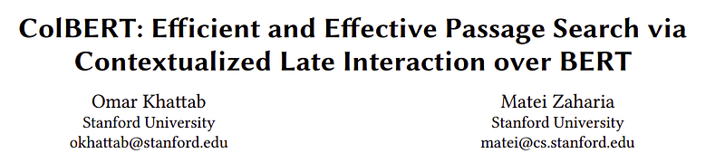
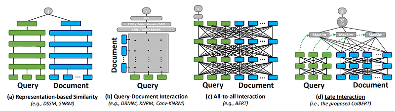
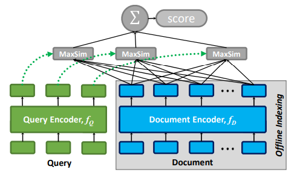
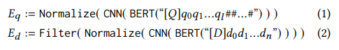
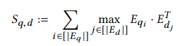
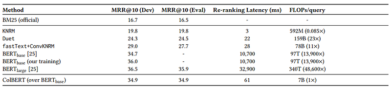
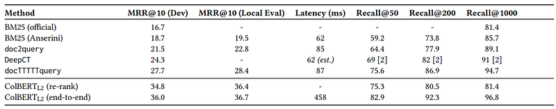

# Papers Explained 88 - ColBERT

ColBERT is a novel ranking model that adapts deep LMs (in particular, BERT) for efficient retrieval. It introduces a late interaction architecture that independently encodes the query and the document using BERT and then employs a cheap yet powerful interaction step that models their fine-grained similarity.

This page ingests the source article into the wiki and connects it to [[Papers Explained Corpus]], [[Embedding and Retrieval]], [[Document AI]], [[Large Language Models]], [[Model Compression and Efficiency]].

## Source Metadata

- Source file: `raw/2024-01-10_Papers-Explained-88--ColBERT-fe2fd0509649.html`
- Source title: Papers Explained 88: ColBERT
- Published: 2024-01-10
- Canonical: [https://medium.com/@ritvik19/papers-explained-88-colbert-fe2fd0509649](https://medium.com/@ritvik19/papers-explained-88-colbert-fe2fd0509649)

## Key Ideas

- ColBERT is a novel ranking model that adapts deep LMs (in particular, BERT) for efficient retrieval.
- Recommended Reading [Papers Explained 86: Dense Passage Retriever](https://ritvik19.medium.com/papers-explained-86-dense-passage-retriever-c4742fdf27ed)
- Given a query q and document d, fQ encodes q into a bag of fixed-size embeddings Eq while fD encodes d into another bag Ed
- Using Eq and Ed , ColBERT computes the relevance score between q and d via late interaction, which we define as a summation of maximum similarity (MaxSim) operators.
- We share a single BERT model among our query and document encoders but distinguish input sequences that correspond to queries and documents by prepending a special token [Q] to queries and another token [D] to documents.

## Notes

ColBERT is a novel ranking model that adapts deep LMs (in particular, BERT) for efficient retrieval. It introduces a late interaction architecture that independently encodes the query and the document using BERT and then employs a cheap yet powerful interaction step that models their fine-grained similarity.

*Figure: Schematic diagrams illustrating query–document matching paradigms in neural IR*

Recommended Reading [Papers Explained 86: Dense Passage Retriever](https://ritvik19.medium.com/papers-explained-86-dense-passage-retriever-c4742fdf27ed)

## Architecture

*Figure: The general architecture of ColBERT given a query q and a document d.*

ColBERT comprises:

- a query encoder fQ

- a document encoder fD

- the late interaction mechanism.

Given a query q and document d, fQ encodes q into a bag of fixed-size embeddings Eq while fD encodes d into another bag Ed

Using Eq and Ed , ColBERT computes the relevance score between q and d via late interaction, which we define as a summation of maximum similarity (MaxSim) operators. In particular, we find the maximum cosine similarity of each v ∈ Eq with vectors in Ed , and combine the outputs via summation. Besides cosine, we also evaluate squared L2 distance as a measure of vector similarity.

### Query & Document Encoders

We share a single BERT model among our query and document encoders but distinguish input sequences that correspond to queries and documents by prepending a special token [Q] to queries and another token [D] to documents. We place this token right after BERT’s sequencestart token [CLS].

given q = q0q1…ql and d = d0d1…dn, we compute the bags of embeddings Eq and Ed in the following manner, where # refers to the [mask] tokens:

### Late Interaction

Given the representation of a query q and a document d, the relevance score of d to q, denoted as Sq,d , is estimated:

ColBERT is differentiable end-to-end. Given a triple (q,d +,d −) with query q, positive document d + and negative document d −, ColBERT is used to produce a score for each document individually and is optimized via pairwise softmax cross-entropy loss over the computed scores of d + and d−.

## Evaluation

MS MARCO is a dataset introduced by Microsoft in 2016 for reading comprehension and adapted in 2018 for retrieval. It is a collection of 8.8M passages from Web pages, which were gathered from Bing’s results to 1M real-world queries. Each query is associated with sparse relevance judgements of one (or very few) documents marked as relevant and no documents explicitly indicated as irrelevant. As per the offcial evaluation, MRR@10 is used to measure effectiveness.

### Quality–Cost Tradeo: Top-k Re-ranking

*Figure: “Re-ranking” results on MS MARCO.*

- 170× lower latency and 13,900× lower FLOPs compared to BERTbase, with competitive effectiveness

### End-to-end Top-k Retrieval

*Figure: End-to-end retrieval results on MS MARCO.*

- ColBERT’s end-to-end retrieval surpasses its re-ranking capability, showcasing significant gains in MRR@10 and Recall@k (50, 200, and 1000).

- ColBERT’s Recall@50 exceeds BM25’s Recall@1000 and nearly matches docTTTTTquery’s Recall@200, highlighting the value of ColBERT’s end-to-end retrieval.

## Late Interaction, No Interaction and Cross Encoders

### No Interaction

No interaction models, also known as representation-based models, encode queries and documents into single-vector representations and rely on simple similarity measures like cosine similarity to determine relevance.

This approach often under performs compared to interaction-based models because it fails to capture the complex nuances and relationships between query and document terms. The aggregated embeddings for documents and queries struggle to provide a deep, contextual understanding of the terms involved, which is crucial for effective information retrieval.

### Cross Encoders

Cross encoders process pairs of queries and documents together, feeding them into a model (such as BERT) to compute a single relevance score for each pair.

While cross encoders can be highly accurate due to their ability to consider the full context of both the query and the document simultaneously, they are less efficient for large-scale tasks. This inefficiency stems from the computational cost of evaluating every possible query-document pair, making them impractical for real-time applications or when dealing with large document collections.

### Late Interaction

Late interaction refers to the process where the interaction between the query and document representations occurs late in the retrieval process, after both have been independently encoded.

In ColBERT, both the query and the document are first independently encoded into dense vector representations for each token. This results in a bag of embeddings for the query and a separate bag for the document. The late interaction occurs through a cheap yet powerful step that models the fine-grained similarity between these embeddings. Specifically, a batch dot-product is computed between the query embeddings and document embeddings to generate term-wise similarity scores. Max-pooling is then applied across document terms to find the highest similarity for each query term, and these scores are summed across query terms to derive the total document score. This approach allows for the pre-computation of document representations, significantly speeding up query processing.

## Paper

ColBERT: Efficient and Effective Passage Search via Contextualized Late Interaction over BERT [2004.12832](https://arxiv.org/abs/2004.12832)

Recommended Reading: [Retrieval and Representation Learning](https://ritvik19.medium.com/list/retrieval-and-representation-learning-bcd23de0bd8e)

## Figures

Figures from the Medium HTML export (`raw/2024-01-10_Papers-Explained-88--ColBERT-fe2fd0509649.html`); local copies under `wiki/assets/papers-explained-88-colbert/` when download succeeded.

| Figure | Caption |
|--------|---------|
|  | Title card: ColBERT. |
|  | Schematic diagrams illustrating query–document matching paradigms in neural IR. |
|  | The general architecture of ColBERT given a query q and a document d. |
|  | given q = q0q1…ql and d = d0d1…dn, we compute the bags of embeddings Eq and Ed in the following manner, where # refers to the [mask] tokens. |
|  | Given the representation of a query q and a document d, the relevance score of d to q, denoted as Sq,d, is estimated. |
|  | “Re-ranking” results on MS MARCO. |
|  | End-to-end retrieval results on MS MARCO. |
## Related

- [[Papers Explained Corpus]]
- [[Embedding and Retrieval]]
- [[Document AI]]
- [[Large Language Models]]
- [[Model Compression and Efficiency]]
- [[Papers Explained 87 - DocLLM]]
- [[Papers Explained 89 - ColBERTv2]]

#summary #topic
