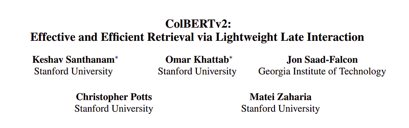
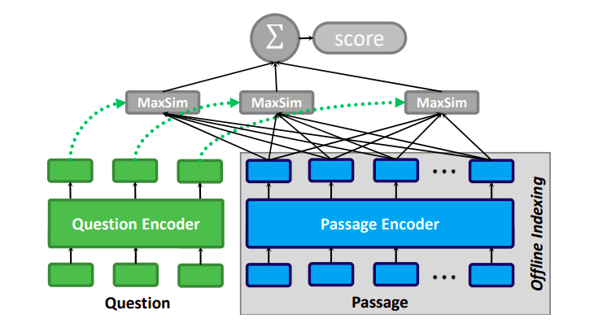
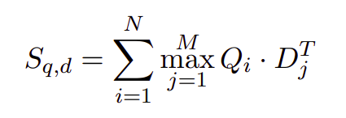
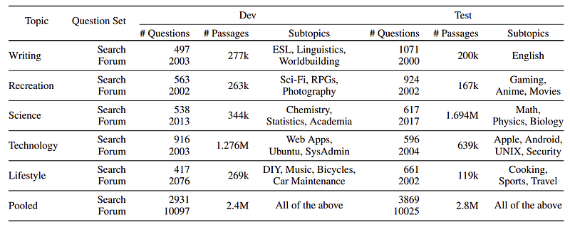
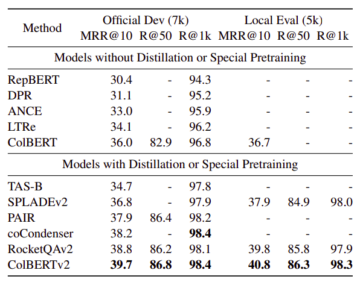
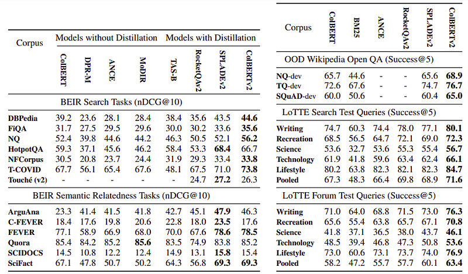

# Papers Explained 89 - ColBERTv2

Late interaction models produce multi-vector representations at the granularity of each token and decompose relevance modeling into scalable token-level computations. This decomposition has been shown to make late interaction more effective, but it inflates the space footprint of these models by an order of magnitude.

This page ingests the source article into the wiki and connects it to [[Papers Explained Corpus]], [[Embedding and Retrieval]], [[Model Compression and Efficiency]], [[Large Language Models]], [[Agentic AI]], [[Model Distillation]].

## Source Metadata

- Source file: `raw/2024-01-12_Papers-Explained-89--ColBERTv2-7d921ee6e0d9.html`
- Source title: Papers Explained 89: ColBERTv2
- Published: 2024-01-12
- Canonical: [https://medium.com/@ritvik19/papers-explained-89-colbertv2-7d921ee6e0d9](https://medium.com/@ritvik19/papers-explained-89-colbertv2-7d921ee6e0d9)

## Key Ideas

- Late interaction models produce multi-vector representations at the granularity of each token and decompose relevance modeling into scalable token-level computations.
- ColBERTv2 is a retriever that couples an aggressive residual compression mechanism with a denoised supervision strategy to simultaneously improve the quality and space footprint of late interaction.
- Recommended Reading [Papers Explained 88: ColBERT](https://ritvik19.medium.com/papers-explained-88-colbert-fe2fd0509649)
- ColBERTv2 adopts the late interaction architecture of ColBERT. Queries and passages are independently encoded with BERT and the output embeddings encoding each token are projected to a lower dimension.
- During offline indexing, every passage d in the corpus is encoded into a set of vectors, and these vectors are stored.

## Notes

Late interaction models produce multi-vector representations at the granularity of each token and decompose relevance modeling into scalable token-level computations. This decomposition has been shown to make late interaction more effective, but it inflates the space footprint of these models by an order of magnitude.

ColBERTv2 is a retriever that couples an aggressive residual compression mechanism with a denoised supervision strategy to simultaneously improve the quality and space footprint of late interaction.

Recommended Reading [Papers Explained 88: ColBERT](https://ritvik19.medium.com/papers-explained-88-colbert-fe2fd0509649)

## Approach

### Modeling

*Figure: The late interaction architecture.*

ColBERTv2 adopts the late interaction architecture of ColBERT. Queries and passages are independently encoded with BERT and the output embeddings encoding each token are projected to a lower dimension.

During offline indexing, every passage d in the corpus is encoded into a set of vectors, and these vectors are stored. At search time, the query q is encoded into a multi-vector representation, and its similarity to a passage d is computed as the summation of query-side “MaxSim’’ operations, namely, the largest cosine similarity between each query token embedding and all passage token embeddings:

where Q is a matrix encoding the query with N vectors and D encodes the passage with M vectors.

The intuition of this architecture is to align each query token with the most contextually relevant passage token, quantify these matches, and combine the partial scores across the query.

### Supervision

A ColBERT model is employed to index the training passages using ColBERTv2 compression. For each training query top-k passages are retrieved. Each of these query — passage pairs are fed into a 23M MiniLM cross-encoder reranker trained via distillation. Then w-way (w=64) tuples consisting of a query, a highly-ranked passage (or labeled positive), and one or more lower-ranked passages are collected.

KL-Divergence loss is used to distill the cross-encoder’s scores into the ColBERT architecture. As ColBERT produces scores with a restricted scale, which may not align directly with the output scores of the cross-encoder.

### Representation

It is hypothesized that the ColBERT vectors cluster into regions that capture highly-specific token semantics. Evidence suggests that vectors corresponding to each sense of a word cluster closely, with only minor variation due to context. This regularity is exploited with a residual representation that dramatically reduces the space footprint of late interaction models, completely off-the-shelf without architectural or training changes.

Given a set of centroids C, ColBERTv2 encodes each vector v as the index of its closest centroid Ct and a quantized vector ˜r that approximates the residual r = v −Ct. At search time, the centroid index t and residual ˜r are used to recover an approximate ˜v = Ct + ˜r.

To encode ˜r, every dimension of r is quantized into one or two bits. In principle, the b-bit encoding of n-dimensional vectors needs log |C| + bn bits per vector. In practice, with n = 128, four bytes are used to capture up to 232 centroids and 16 or 32 bytes (for b = 1 or b = 2) to encode the residual. This total of 20 or 36 bytes per vector contrasts with ColBERT’s use of 256-byte vector encodings at 16-bit precision.

### Indexing

Given a corpus of passages, the indexing stage precomputes all passage embeddings and organizes their representations to support fast nearest neighbor search. ColBERTv2 divides indexing into three stages:

Centroid Selection: Typically, it is empirically observed that setting |C| proportional to the square root of nembeddings in the corpus works well.

Passage Encoding: This entails invoking the BERT encoder and compressing the output embeddings assigning each embedding to the nearest centroid and computing a quantized residual. Once a chunk of passages is encoded, the compressed representations are saved to disk.

Index Inversion: The embedding IDs that correspond to each centroid are grouped together, and this inverted list is saved to disk. At search time, this allows to quickly find token-level embeddings similar to those in a query.

### Retrieval

Given a query representation Q, retrieval starts with candidate generation. For every vector Qi in the query, the nearest nprobe ≥ 1 centroids are found. Using the inverted list, ColBERTv2 identifies the passage embeddings close to these centroids, decompresses them, and computes their cosine similarity with every query vector. The scores are then grouped by passage ID for each query vector, and scores corresponding to the same passage are max reduced. This allows ColBERTv2 to conduct an approximate “MaxSim” operation per query vector.This computes a lower-bound on the true MaxSim using the embeddings identified via the inverted list.

These lower bounds are summed across the query tokens, and the top-scoring n_candidate candidate passages based on these approximate scores are selected for ranking, which loads the complete set of embeddings of each passage, and conducts the same scoring function using all embeddings per document.

The result passages are then sorted by score and returned.

## LoTTE: Long-Tail, Cross-Domain Retrieval Evaluation

*Figure: Composition of LoTTE.*

This paper also introduces LoTTE (pronounced latte), a new dataset for Long-Tail Topic-stratified Evaluation for IR. To complement the out-of-domain tests of BEIR, LoTTE focuses on natural user queries that pertain to long-tail topics, ones that might not be covered by an entity-centric knowledge base like Wikipedia. LoTTE consists of 12 test sets, each with 500–2000 queries and 100k–2M passages.

## Evaluation

### In-Domain Retrieval Quality

*Figure: In-domain performance on the development set of MS MARCO Passage Ranking as well the “Local Eval” test set.*

On Development set:

- ColBERT outperforms single-vector systems (RepBERT, ANCE, TAS-B).

- Distillation from cross-encoders improves systems like SPLADEv2, PAIR, and RocketQAv2 over vanilla ColBERT.

- Supervision gains challenge the value of fine-grained late interaction.

- It’s unclear whether ColBERT-like models can achieve similar gains under distillation with compressed representations.

- ColBERTv2 achieves the highest quality with denoised supervision and residual compression.

- ColBERTv2 exhibits competitive space footprint compared to single-vector models and lower than vanilla ColBERT.

On Local Eval Test Set:

- ColBERTv2 obtains 40.8% MRR@10 on the test set, outperforming baselines, including RocketQAv2.

- Note: RocketQAv2 uses document titles in addition to passage text.

### Out-of-Domain Retrieval Quality

*Figure: Zero-shot evaluation results.*

BEIR:

- ColBERT outperforms single-vector systems (DPR, ANCE, MoDIR) in most tasks.

- ColBERT often surpasses TAS-B (with distillation) on most datasets.

- Distillation-based models generally stronger, ColBERTv2 and SPLADEv2 strongest.

- ColBERTv2 advantage on six benchmarks, ties on two, with significant improvements on NQ, TREC-COVID, and FiQA-2018.

- SPLADEv2 leads on five benchmarks, major gains on Climate-FEVER and HotPotQA.

- Climate-FEVER and HotPotQA have unique characteristics affecting model performance.

Wikipedia Open QA

- ColBERTv2 outperforms BM25, vanilla ColBERT, and SPLADEv2 across three query sets.

- Improvements of up to 4.6 points over SPLADEv2 observed.

LoTTE

- ANCE and vanilla ColBERT outperform BM25 on all topics.

- Methods using distillation are generally the strongest.

- ColBERTv2 outperforms baselines (SPLADEv2 and RocketQAv2) across all topics for both query types.

- ColBERTv2 improves upon SPLADEv2 and RocketQAv2 by up to 3.7 and 8.1 points, respectively.

- RocketQAv2 has a slight advantage over SPLADEv2 on “search” queries.

- SPLADEv2 is considerably more effective on “forum” tests.

## Paper

ColBERTv2: Effective and Efficient Retrieval via Lightweight Late Interaction [2112.01488](https://arxiv.org/abs/2112.01488)

Recommended Reading: [Retrieval and Representation Learning](https://ritvik19.medium.com/list/retrieval-and-representation-learning-bcd23de0bd8e)

## Figures

Figures from the Medium HTML export (`raw/2024-01-12_Papers-Explained-89--ColBERTv2-7d921ee6e0d9.html`); local copies under `wiki/assets/papers-explained-89-colbertv2/` when download succeeded.

| Figure | Caption |
|--------|---------|
|  | Title card: ColBERTv2. |
|  | The late interaction architecture. |
|  | During offline indexing, every passage d in the corpus is encoded into a set of vectors, and these vectors are stored. |
|  | Composition of LoTTE. |
|  | In-domain performance on the development set of MS MARCO Passage Ranking as well the “Local Eval” test set. |
|  | Zero-shot evaluation results. |
## Related

- [[Papers Explained Corpus]]
- [[Embedding and Retrieval]]
- [[Model Compression and Efficiency]]
- [[Large Language Models]]
- [[Agentic AI]]
- [[Model Distillation]]
- [[Papers Explained 88 - ColBERT]]
- [[Papers Explained 90 - E5]]

#summary #topic
