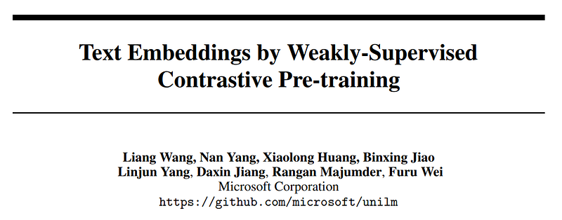
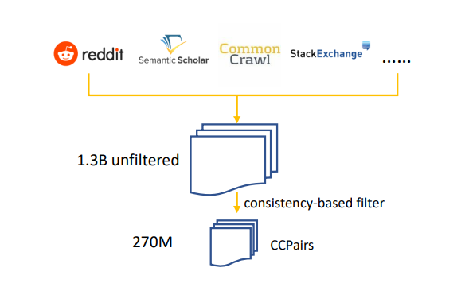
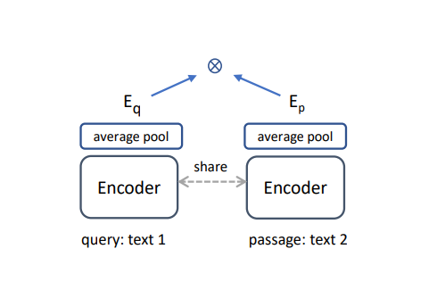
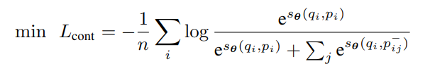
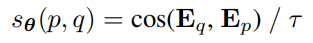
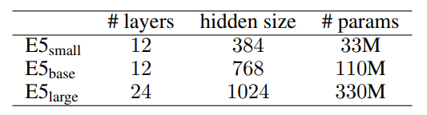
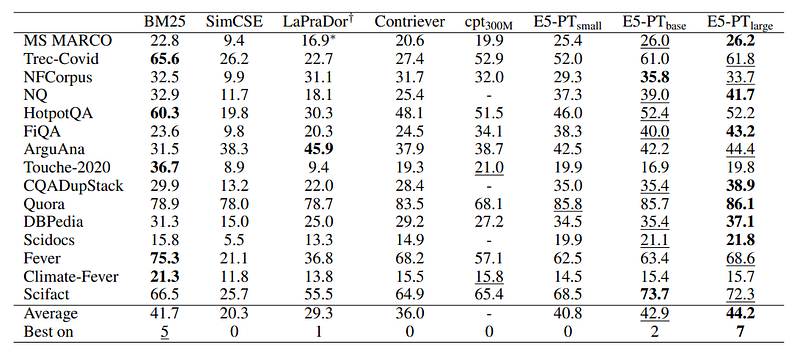
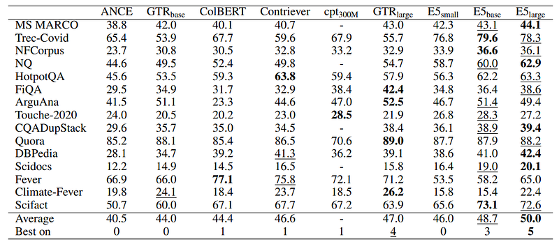
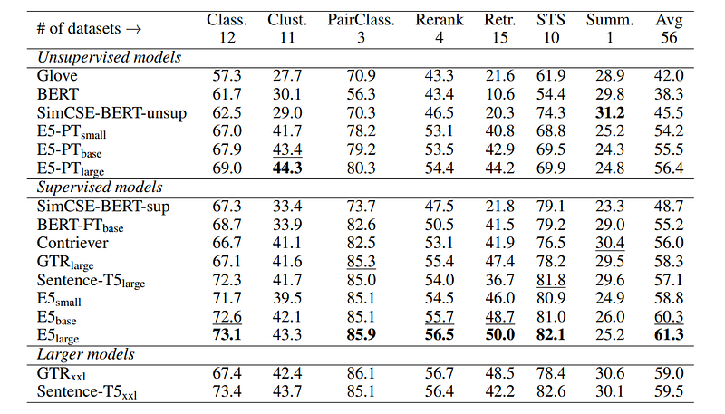

# Papers Explained 90 - E5

E5 (EmbEddings from bidirEctional Encoder rEpresentations) is a family of state-of-the-art text embeddings trained in a contrastive manner with weak supervision signals from a curated large-scale text pair dataset (called CCPairs (Colossal Clean text Pairs)), that transfer well to a wide range of tasks.

This page ingests the source article into the wiki and connects it to [[Papers Explained Corpus]], [[Embedding and Retrieval]], [[Synthetic Data]], [[Evaluation and Benchmarks]], [[Supervised Fine-Tuning]].

## Source Metadata

- Source file: `raw/2024-01-15_Papers-Explained-90--E5-75ea1519efad.html`
- Source title: Papers Explained 90: E5
- Published: 2024-01-15
- Canonical: [https://medium.com/@ritvik19/papers-explained-90-e5-75ea1519efad](https://medium.com/@ritvik19/papers-explained-90-e5-75ea1519efad)

## Key Ideas

- E5 (EmbEddings from bidirEctional Encoder rEpresentations) is a family of state-of-the-art text embeddings trained in a contrastive manner with weak supervision signals from a curated large-scale text pair dataset (called CCPairs (Colossal Clean text Pairs))...
- Recommended Reading [Papers Explained 86: Dense Passage Retriever](https://ritvik19.medium.com/papers-explained-86-dense-passage-retriever-c4742fdf27ed) [[Papers Explained 89...
- CCPairs is curated by harvesting heterogeneous semi-structured data sources. (q, p) denotes a text pair consisting of a query q and a passage p.
- The dataset includes (post, comment) pairs from Reddit, (question, upvoted answer) pairs from Stackexchange, (entity name + section title, passage) pairs from English Wikipedia, (title, abstract) and citation pairs from Scientific papers, and (title, passage)...
- Simple heuristic rules are applied to filter data from Reddit and Common Crawl. After preliminary filtering, ∼ 1.3 billion text pairs are curated, most of which come from Reddit and Common Crawl.

## Notes

E5 (EmbEddings from bidirEctional Encoder rEpresentations) is a family of state-of-the-art text embeddings trained in a contrastive manner with weak supervision signals from a curated large-scale text pair dataset (called CCPairs (Colossal Clean text Pairs)), that transfer well to a wide range of tasks.

Recommended Reading [Papers Explained 86: Dense Passage Retriever](https://ritvik19.medium.com/papers-explained-86-dense-passage-retriever-c4742fdf27ed) [Papers Explained 89: ColBERTv2](https://medium.com/@ritvik19/papers-explained-89-colbertv2-7d921ee6e0d9)

## CCPairs

CCPairs is curated by harvesting heterogeneous semi-structured data sources. (q, p) denotes a text pair consisting of a query q and a passage p.

The dataset includes (post, comment) pairs from Reddit, (question, upvoted answer) pairs from Stackexchange, (entity name + section title, passage) pairs from English Wikipedia, (title, abstract) and citation pairs from Scientific papers, and (title, passage) pairs from Common Crawl web pages and various News sources.

*Figure: Overview of data curation pipeline.*

Simple heuristic rules are applied to filter data from Reddit and Common Crawl. After preliminary filtering, ∼ 1.3 billion text pairs are curated, most of which come from Reddit and Common Crawl.

To further improve data quality and make training costs manageable, a consistency-based data filtering technique is used: a model is first trained on the 1.3B noisy text pairs, and then used to rank each pair against a pool of 1 million random passages. A text pair is kept only if it falls in the top-k(k=2) ranked lists. In other words, the model’s prediction should be consistent with the training labels.

After this step, ∼ 270M text pairs for contrastive pre-training are curated.

## Method

*Figure: Overview of Model Architecture*

The embeddings can be trained with only unlabeled text pairs from CCPairs with contrastive pretraining. A second-stage fine-tuning on small, high-quality labeled datasets can be performed to further boost the quality of the resulted embeddings.

### Contrastive Pre-training with Unlabeled Data

Contrastive pre-training aims to distinguish the relevant text pairs from other irrelevant or negative pairs. Given a collection of text pairs {(qi , pi)} n i=1, a list of negative passages {p − ij} m j=1 are assigned for the i-th example. Then the InfoNCE contrastive loss is as follows:

where sθ(q, p) is a scoring function between query q and passage p parameterized by θ. A shared pre-trained Transformer encoder and average pooling over the output layer is used to get fixed-size text embeddings Eq and Ep. The score is the cosine similarity scaled by a temperature hyper-parameter τ (set to 0.01):

To break the symmetry two prefix identifiers “query:” and “passage:” are added to q and d respectively.

### Fine-tuning with Labeled Data

While contrastive pre-training on the CCPairs provides a solid foundation for general-purpose embeddings, further training on labeled data can inject human knowledge into the model to boost the performance.

The model is further trained with a combination of 3 datasets: NLI 6 (Natural Language Inference), MS-MARCO passage ranking dataset, and NQ (Natural Questions) dataset.

Three model sizes are trained: E5small, E5base and E5large initialized from MiniLM, bert-base-uncased, and bert-large-uncased-whole-wordmasking respectively.

*Figure: Model configurations.*

## Evaluation

### Results on BEIR benchmark

*Figure: Unsupervised methods on the BEIR benchmark*

- E5-PTbase outperforms BM25 by 1.2 points across 15 datasets. Marks the first reported instance of an unsupervised model surpassing BM25 on the BEIR benchmark.

- Scaling to E5-PTlarge shows enhanced performance from 42.9 to 44.2.

*Figure: Supervised fine-tuning results on the BEIR benchmark.*

- Zero-shot transfer results are observed for other datasets.

- E5base model achieves an average nDCG@10 of 48.7, surpassing GTRlarge despite having fewer parameters.

- Most datasets show improvement with supervised fine-tuning, except for FiQA, Scidocs, Fever, etc., possibly due to limited domain diversity in fine-tuning datasets.

### Results on MTEB benchmark

*Figure: Results on the MTEB benchmark*

- E5 models outperform similar-sized existing models significantly.

- Match the results of much larger models like GTRxxl and Sentence-T5xxl.

- E5large model (300M parameters) outperforms GTRxxl and Sentence-T5xxl models (4.8B parameters) which are over 10 times larger.

## Paper

Text Embeddings by Weakly-Supervised Contrastive Pre-training [2212.03533](https://arxiv.org/abs/2212.03533)

Recommended Reading: [Retrieval and Representation Learning](https://ritvik19.medium.com/list/retrieval-and-representation-learning-bcd23de0bd8e)

## Figures

Figures from the Medium HTML export (`raw/2024-01-15_Papers-Explained-90--E5-75ea1519efad.html`); local copies under `wiki/assets/papers-explained-90-e5/` when download succeeded.

| Figure | Caption |
|--------|---------|
|  | Title card: E5. |
|  | Overview of data curation pipeline. |
|  | Overview of Model Architecture. |
|  | Contrastive pre-training aims to distinguish the relevant text pairs from other irrelevant or negative pairs. |
|  | where sθ(q, p) is a scoring function between query q and passage p parameterized by θ. |
|  | Model configurations. |
|  | Unsupervised methods on the BEIR benchmark. |
|  | Supervised fine-tuning results on the BEIR benchmark. |
|  | Results on the MTEB benchmark. |
## Related

- [[Papers Explained Corpus]]
- [[Embedding and Retrieval]]
- [[Synthetic Data]]
- [[Evaluation and Benchmarks]]
- [[Supervised Fine-Tuning]]
- [[Papers Explained 89 - ColBERTv2]]
- [[Papers Explained 91 - E5 Mistral-7B]]

#summary #topic
