# Papers Explained 91 - E5 Mistral-7B

This paper introduces a novel and simple method for obtaining high-quality text embeddings using only synthetic data and less than 1k training steps. It leverages proprietary LLMs to generate diverse synthetic data for hundreds of thousands of text embedding tasks across nearly 100 languages.

This page ingests the source article into the wiki and connects it to [[Papers Explained Corpus]], [[Synthetic Data]], [[Embedding and Retrieval]], [[Large Language Models]], [[Document AI]].

## Source Metadata

- Source file: `raw/2024-01-17_Papers-Explained-91--E5-Mistral-7B-23890f40f83a.md`
- Source title: Papers Explained 91: E5 Mistral-7B
- Published: 2024-01-17
- Canonical: [https://medium.com/@ritvik19/papers-explained-91-e5-mistral-7b-23890f40f83a](https://medium.com/@ritvik19/papers-explained-91-e5-mistral-7b-23890f40f83a)

## Key Ideas

- This paper introduces a novel and simple method for obtaining high-quality text embeddings using only synthetic data and less than 1k training steps.
- The model and dataset release information is available at [GitHub](https://github.com/microsoft/unilm/tree/master/e5).
- Recommended Reading [Papers Explained 89: E5](https://ritvik19.medium.com/papers-explained-90-e5-75ea1519efad) [Papers Explained 64: Mistral 7B](https://medium.com/dair-ai/papers-explained-mistral-7b-b9632dedf580)
- To generate diverse synthetic data, embedding tasks are divided into several groups, and then different prompt templates are applied to each group.
- Asymmetric Tasks category comprises tasks where the query and document are semantically related but are not paraphrases of each other.

## Notes

This paper introduces a novel and simple method for obtaining high-quality text embeddings using only synthetic data and less than 1k training steps. It leverages proprietary LLMs to generate diverse synthetic data for hundreds of thousands of text embedding tasks across nearly 100 languages. Then open-source decoder-only LLMs are finetuned on the synthetic data using standard contrastive loss to achieve strong performance on highly competitive text embedding benchmarks.

The model and dataset release information is available at [GitHub](https://github.com/microsoft/unilm/tree/master/e5).

Recommended Reading [Papers Explained 89: E5](https://ritvik19.medium.com/papers-explained-90-e5-75ea1519efad) [Papers Explained 64: Mistral 7B](https://medium.com/dair-ai/papers-explained-mistral-7b-b9632dedf580)

## Synthetic Data Generation

*Figure: An example two-step prompt template for generating synthetic data with GPT-4.*

To generate diverse synthetic data, embedding tasks are divided into several groups, and then different prompt templates are applied to each group.

Asymmetric Tasks category comprises tasks where the query and document are semantically related but are not paraphrases of each other. Depending on the length of the query and document, these are further subdivided into four subgroups: short-long match, long-short match, short-short match, and long-long match.

For each subgroup, a two-step prompt template is designed that first prompts LLMs brainstorm a list of tasks, and then generates a concrete example conditioned on the task definition.

Symmetric tasks involve queries and documents that have similar semantic meanings but different surface forms.

Two application scenarios are examined: monolingual semantic textual similarity (STS) and bitext retrieval. Two distinct prompt templates are designed for each scenario, tailored to their specific objectives.

Since the task definition is straightforward, The brainstorming step is omitted for symmetric tasks.

To further boost the diversity of the prompts and thus the synthetic data, several placeholders are incorporated in each prompt template, whose values are randomly sampled at runtime.

### Statistics of Synthetic Data

*Figure: Task type and language statistics of the generated synthetic data.*

In total 500k examples with 150k unique instructions are generated, among which 25% are generated by GPT-35-Turbo and others are generated by GPT-4.

The predominant language is English, with coverage extending to a total of 93 languages. For the bottom 75 low-resource languages, there are about 1k examples per language on average.

## Training

Given a relevant query-document pair (q +, d+), the following instruction template is applied to the original query q + to generate a new one q + inst:

*Figure: Instructions for each training dataset.*

The document side is not modified with any instruction prefix. In this way, the document index can be prebuilt, and the task to perform can be customised by changing only the query side.

Given a pretrained LLM, an [EOS] token is appended to the end of the query and document, and then fed into the LLM to obtain the query and document embeddings (hq + inst , hd+ ) by taking the last layer [EOS] vector.

To train the embedding model, t the standard InfoNCE loss is adopted over the in-batch negatives and hard negatives:

where N denotes the set of all negatives, and ϕ(q, d) is a function that computes the matching score between query q and document d. (temperature-scaled cosine similarity)

τ is a temperature hyper-parameter, (fixed to 0.02).

The pretrained Mistral-7b checkpoint is fine-tuned for 1 epoch. For the training data, both the generated synthetic data and a collection of 13 public datasets are utilised, yielding approximately 1.8M examples after sampling. The trained model is evaluated on the MTEB benchmark.

Note that the retrieval category in MTEB corresponds to the 15 publicly available datasets in the BEIR benchmark.

Training Datasets:

ELI5 , HotpotQA , FEVER , MIRACL , MSMARCO passage ranking and document ranking, NQ, NLI, SQuAD, TriviaQA, Quora Duplicate Questions, MrTyDi, DuReader, and T2Ranking.

## Results

*Figure: Results on the MTEB benchmark*

- “E5mistral-7b + full data” outperforms the previous state-of-the-art model by 2.4 points on the MTEB benchmark.

- Even in the “w/ synthetic data only” setting where no labeled data is used, the performance remains competitive.

*Figure: Comparison with commercial models and the model that tops the MTEB leaderboard.*

- The model outperforms the current commercial models by a significant margin.

- However, due to the lack of transparency and documentation about these models, a fair comparison is not feasible.

- Evaluation conducted on the MIRACL dataset [51] covering 18 languages.

- Model outperforms mE5large in high-resource languages, particularly English.

- In low-resource languages, the model lags behind mE5base.

- The model’s English-centric pre-training (Mistral-7B) contributes to its suboptimal performance in low-resource languages.

### Is Contrastive Pre-training Necessary?

*Figure: Effects of contrastive pre-training.*

- Contrastive pre-training has a substantial impact on XLM-Rlarge but has negligible effects on Mistral-7B based models.

- This suggests that extensive auto-regressive pre-training enables LLMs to acquire strong text representations. Minimal fine-tuning suffices to transform them into effective embedding models.

## Paper

Improving Text Embeddings with Large Language Models [2401.00368](https://arxiv.org/abs/2401.00368)

Recommended Reading: [Retrieval and Representation Learning](https://ritvik19.medium.com/list/retrieval-and-representation-learning-bcd23de0bd8e)

## Figures

Figures from the Medium HTML export (`raw/2024-01-17_Papers-Explained-91--E5-Mistral-7B-23890f40f83a.md`); local copies under `wiki/assets/papers-explained-91-e5-mistral-7b/` when download succeeded.

| Figure | Caption |
|--------|---------|
| 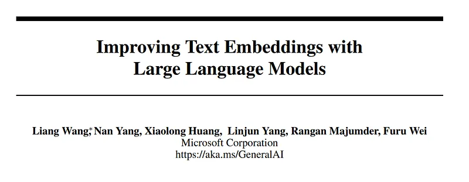 | Title card: E5 Mistral-7B. |
| 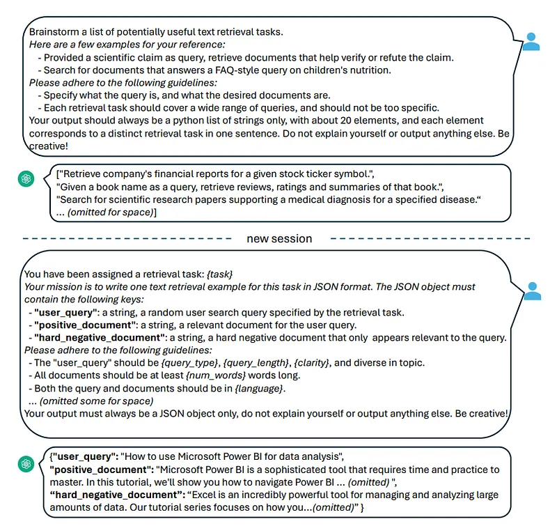 | An example two-step prompt template for generating synthetic data with GPT-4. |
| 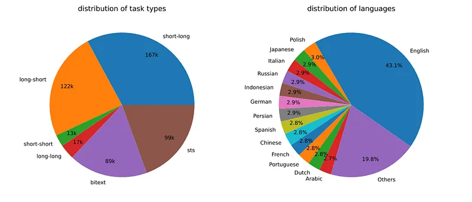 | Task type and language statistics of the generated synthetic data. |
| 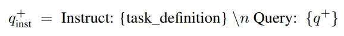 | Given a relevant query-document pair (q +, d+), the following instruction template is applied to the original query q + to generate a new one q + inst. |
| 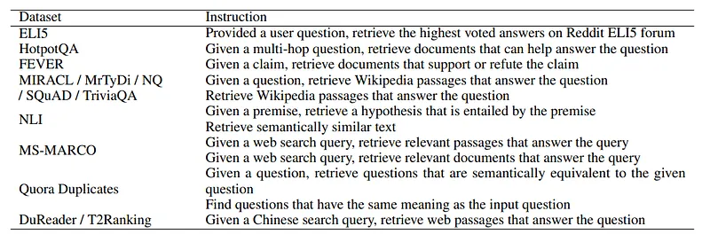 | Instructions for each training dataset. |
| 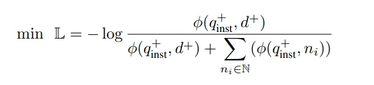 | To train the embedding model, t the standard InfoNCE loss is adopted over the in-batch negatives and hard negatives. |
| 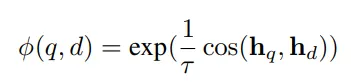 | where N denotes the set of all negatives, and ϕ(q, d) is a function that computes the matching score between query q and document d. |
| 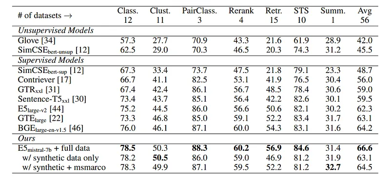 | Results on the MTEB benchmark. |
| 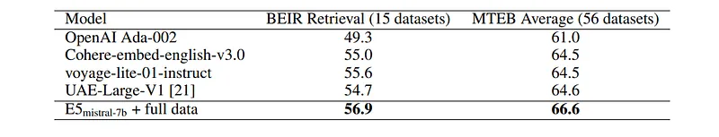 | Comparison with commercial models and the model that tops the MTEB leaderboard. |
| 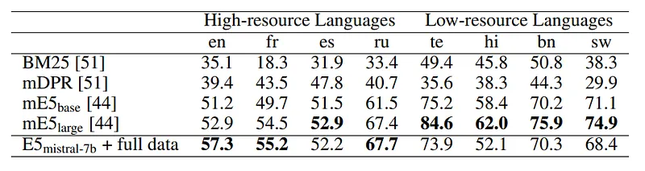 | Training Datasets. |
| 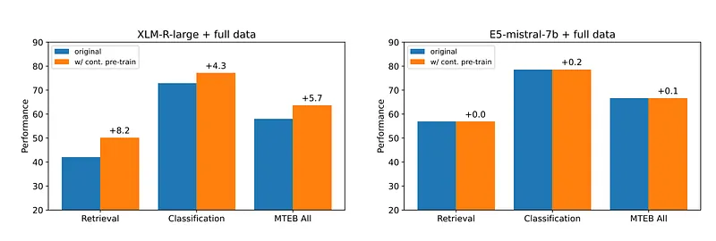 | Effects of contrastive pre-training. |
## Related

- [[Papers Explained Corpus]]
- [[Synthetic Data]]
- [[Embedding and Retrieval]]
- [[Large Language Models]]
- [[Document AI]]
- [[Papers Explained 90 - E5]]
- [[Papers Explained 92 - ConvNeXt]]

#summary #topic
