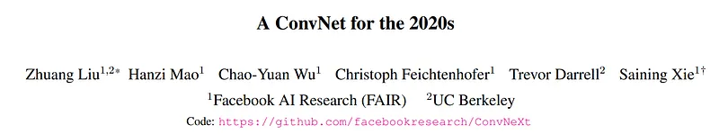
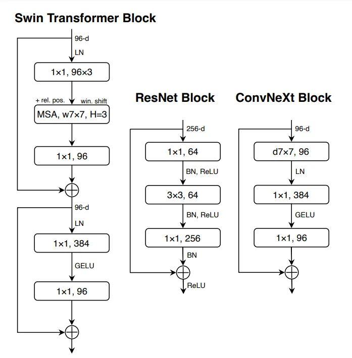
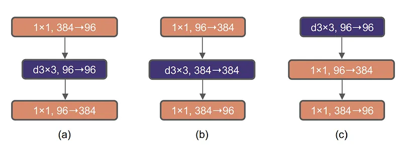
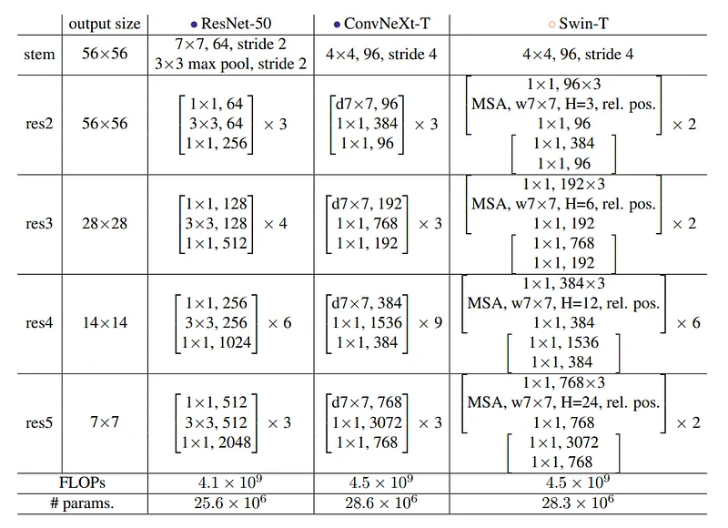
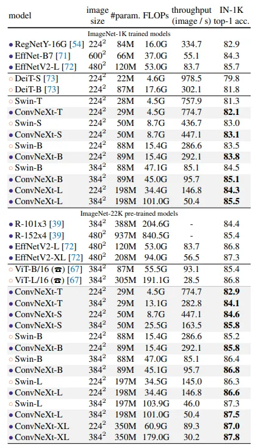
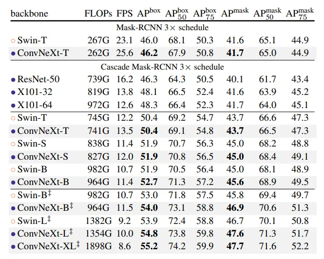
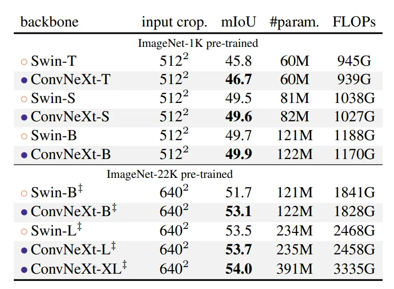

# Papers Explained 92 - ConvNeXt

The starting point is a ResNet-50 model. It is first trained using similar training techniques employed for training vision Transformers, resulting in much improved results compared to the original ResNet-50. This serves as the baseline.

This page ingests the source article into the wiki and connects it to [[Papers Explained Corpus]], [[Computer Vision]], [[Large Language Models]].

## Source Metadata

- Source file: `raw/2024-01-19_Papers-Explained-92--ConvNeXt-d13385d9177d.md`
- Source title: Papers Explained 92: ConvNeXt
- Published: 2024-01-19
- Canonical: [https://medium.com/@ritvik19/papers-explained-92-convnext-d13385d9177d](https://medium.com/@ritvik19/papers-explained-92-convnext-d13385d9177d)

## Key Ideas

- The original ResNet design distributed computation across stages empirically, with a focus on the “res4” stage for object detection tasks. Swin-T followed a similar principle but with a 1:1:3:1 stage compute ratio, improving accuracy.
- Stem cell designs determine how input images are processed at a network’s beginning. In both ConvNets and Vision Transformers, a common stem cell downsamples input images to an appropriate feature map size.
- Using depthwise convolutions reduces the FLOPs but the accuracy is reduced as well. Increasing the width of the network from 64 to 96 (same number of channels as Swin-T) brings the network performance to 80.5%.
- The Transformer block design includes an inverted bottleneck with an MLP block having a hidden dimension four times wider than the input.
- To explore large kernels,the prerequisite is to move up the position of depthwise conv layer, which results in a temporary performance degradation to 79.9%. Using a 7×7 kernel increases the performance to 80.6%.

## Notes

Vision Transformers (ViTs) initially outperformed ConvNets in image classification, but they struggled with tasks like object detection and semantic segmentation. Hierarchical Transformers like Swin Transformers reintroduced ConvNet principles, making Transformers effective for various vision tasks. But these hybrid approaches credit Transformer superiority, rather than the inherent inductive biases of convolutions. ConvNeXt is a pure ConvNet model, evolved from standard ResNet design, and competes well with Transformers in accuracy and scalability.

## Road Map to ConvNeXt

*Figure: Block Designs for Swin Transformer, ResNet and ConvNeXt*

The starting point is a ResNet-50 model. It is first trained using similar training techniques employed for training vision Transformers, resulting in much improved results compared to the original ResNet-50. This serves as the baseline.

### Training Techniques

The training has been extended to 300 epochs from the original 90 epochs for ResNets. AdamW optimizer is used, along with data augmentation techniques such as Mixup, Cutmix, RandAugment, Random Erasing, and regularization schemes including Stochastic Depth and Label Smoothing. By itself, this enhanced training recipe led to an increase in the performance of the ResNet-50 model from 76.1% to 78.8%, implying that a significant portion of the performance difference between traditional ConvNets and vision Transformers may be attributed to the training techniques.

### Macro Design

The original ResNet design distributed computation across stages empirically, with a focus on the “res4” stage for object detection tasks. Swin-T followed a similar principle but with a 1:1:3:1 stage compute ratio, improving accuracy. Adjusting ResNet-50’s block numbers to match Swin-T’s ratio increased accuracy to 79.4%.

Stem cell designs determine how input images are processed at a network’s beginning. In both ConvNets and Vision Transformers, a common stem cell downsamples input images to an appropriate feature map size. While ResNet uses a 7×7 convolution with stride 2, Swin Transformer uses a “patchify” layer with a smaller patch size. Replacing ResNet’s stem cell with this layer (implemented using a 4×4, stride 4 convolutional layer), improved accuracy from 79.4% to 79.5%.

Using depthwise convolutions reduces the FLOPs but the accuracy is reduced as well. Increasing the width of the network from 64 to 96 (same number of channels as Swin-T) brings the network performance to 80.5%.

*Figure: Block modifications and resulted specifications. (a) ResNeXt block (b) an inverted bottleneck block (c) the position of the spatial depthwise conv layer is moved up.*

The Transformer block design includes an inverted bottleneck with an MLP block having a hidden dimension four times wider than the input. This design is related to a ConvNet concept with a 4x expansion ratio, initially popularized by MobileNetV2, and now seen in various ConvNet architectures. This approach reduces the network’s FLOPs and enhances performance to 80.6%.

To explore large kernels,the prerequisite is to move up the position of depthwise conv layer, which results in a temporary performance degradation to 79.9%. Using a 7×7 kernel increases the performance to 80.6%.

### Micro Design

ReLU can be substituted with a smoother variant, GELU, although the accuracy stays unchanged.

The difference between a Transformer and a ResNet block is that Transformers have fewer activation functions. When applying the same activation strategy to a ResNet block, removing most GELU layers except for one between 1 × 1 layers, the performance improves by 0.7% to 81.3%, closely resembling the performance of Swin-T.

Transformer blocks usually have fewer normalization layers as well. Here two BatchNorm (BN) layers are removed, leaving only one BN layer before the conv 1 × 1 layers. This further boosts the performance to 81.4%, already surpassing Swin-T’s result.

BatchNorm is widely used in ConvNets to enhance convergence and reduce overfitting, but its complexities can harm model performance. Despite alternative normalization attempts, BatchNorm remains popular in vision tasks, while simpler Layer Normalization (LN) excels in Transformers. Substituting LN for BN in a ConvNet model doesn’t hinder training and even improves performance slightly, achieving 81.5% accuracy.

In ResNet, spatial downsampling is achieved using 3×3 conv with stride 2 at the start of each stage, while in Swin Transformers, a separate downsampling layer is inserted between stages. Using 2×2 conv layers with stride 2 leads to unstable training. Adding normalization layers at resolution changes, improves stability and boosts accuracy to 82.0%, surpassing Swin-T’s 81.3%.

*Figure: Detailed architecture specifications for ResNet-50, ConvNeXt-T and Swin-T.*

## Experiments

Different ConvNeXt variants, namely ConvNeXtT/S/B/L, were constructed to match the complexities of Swin-T/S/B/L. ConvNeXt-T/B resulted from applying the “modernizing” process to the ResNet-50/200 regime, respectively. Furthermore, ConvNeXt was extended to a larger ConvNeXt-XL to assess its scalability. The variants solely vary in terms of the number of channels C and the quantity of blocks B within each stage.

- ConvNeXt-T: C = (96, 192, 384, 768), B = (3, 3, 9, 3)

- ConvNeXt-S: C = (96, 192, 384, 768), B = (3, 3, 27, 3)

- ConvNeXt-B: C = (128, 256, 512, 1024), B = (3, 3, 27, 3)

- ConvNeXt-L: C = (192, 384, 768, 1536), B = (3, 3, 27, 3)

- ConvNeXt-XL: C = (256, 512, 1024, 2048), B = (3, 3, 27, 3)

Models are trained on ImageNet-22K for 90 epochs with a warmup of 5 epochs. Pre-trained models are Fine Tuned on ImageNet-1K for 30 epochs.

## Results

### Image Classification on ImageNet-1K

*Figure: Classification accuracy on ImageNet-1K*

- Similar to Transformers, ConvNeXt also shows promising scaling behavior with higher-capacity models and a larger (pre-training) dataset

- ConvNeXt-B at 384² outperforms Swin-B by 0.6% , with 12.5% higher inference throughput.

### Object detection and segmentation on COCO

*Figure: COCO object detection and segmentation results using Mask-RCNN and Cascade Mask-RCNN*

- ConvNeXt demonstrates similar or superior performance to Swin Transformer across various model complexities.

- For larger models (ConvNeXt-B/L/XL), ConvNeXt often outperforms Swin Transformer in terms of box and mask Average Precision (AP).

### Semantic segmentation on ADE20K

*Figure: ADE20K validation results using UperNet*

- ConvNeXt models demonstrate competitive performance across various model capacities, confirming the success of the architecture design.

## Paper

A ConvNet for the 2020s [2201.03545](https://arxiv.org/abs/2201.03545)

Recommended Reading [Convolutional Neural Networks](https://medium.com/@ritvik19/list/convolutional-neural-networks-5b875ce3b689)

## Figures

Figures from the Medium HTML export (`raw/2024-01-19_Papers-Explained-92--ConvNeXt-d13385d9177d.md`); local copies under `wiki/assets/papers-explained-92-convnext/` when download succeeded.

| Figure | Caption |
|--------|---------|
|  | Title card: ConvNeXt. |
|  | Block Designs for Swin Transformer, ResNet and ConvNeXt. |
|  | Block modifications and resulted specifications. (a) ResNeXt block (b) an inverted bottleneck block (c) the position of the spatial depthwise conv layer is moved up. |
|  | Detailed architecture specifications for ResNet-50, ConvNeXt-T and Swin-T. |
|  | Classification accuracy on ImageNet-1K. |
|  | COCO object detection and segmentation results using Mask-RCNN and Cascade Mask-RCNN. |
|  | ADE20K validation results using UperNet. |
## Related

- [[Papers Explained Corpus]]
- [[Computer Vision]]
- [[Large Language Models]]
- [[Papers Explained 91 - E5 Mistral-7B]]
- [[Papers Explained 93 - TinyLlama]]

#summary #topic
