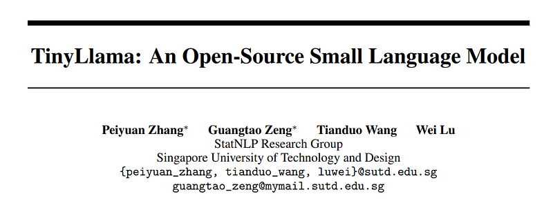
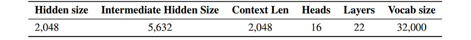
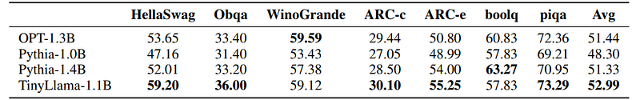
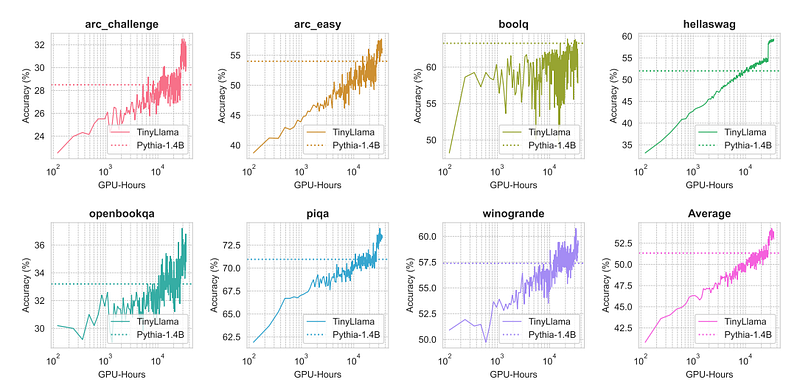
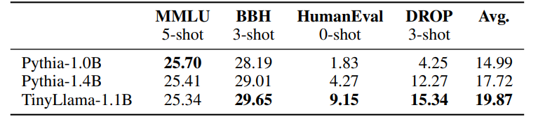

# Papers Explained 93 - TinyLlama

TinyLlama is a compact 1.1B language model built upon the architecture and tokenizer of Llama 2, pre-trained on around 1 trillion tokens for approximately 3 epochs, leveraging various advances (e.g., FlashAttention), to achieve better computational efficiency.

This page ingests the source article into the wiki and connects it to [[Papers Explained Corpus]], [[Large Language Models]], [[Code Models]], [[Model Compression and Efficiency]], [[Reasoning Models]].

## Source Metadata

- Source file: `raw/2024-01-22_Papers-Explained-93--TinyLlama-6ef140170da9.html`
- Source title: Papers Explained 93: TinyLlama
- Published: 2024-01-22
- Canonical: [https://medium.com/@ritvik19/papers-explained-93-tinyllama-6ef140170da9](https://medium.com/@ritvik19/papers-explained-93-tinyllama-6ef140170da9)

## Key Ideas

- The model checkpoints and code are publicly available on [GitHub](https://github.com/jzhang38/TinyLlama)
- Recommended Reading [Papers Explained 55: LLaMA](https://medium.com/dair-ai/papers-explained-55-llama-c4f302809d6b) [Papers Explained 60: Llama 2](https://medium.com/dair-ai/papers-explained-60-llama-v2-3e415c5b9b17)
- A mixture of natural language data and code data is used to pre-train TinyLlama, sourcing natural language data from SlimPajama and code data from Starcoderdata.
- SlimPajama is a large open-source corpus derived by cleaning and deduplicating the original RedPajama,. which is an open-source research effort aimed at reproducing Llama’s pre-training data.
- Starcoderdata was collected to train StarCoder, comprising approximately 250 billion tokens across 86 programming languages.

## Notes

TinyLlama is a compact 1.1B language model built upon the architecture and tokenizer of Llama 2, pre-trained on around 1 trillion tokens for approximately 3 epochs, leveraging various advances (e.g., FlashAttention), to achieve better computational efficiency.

The model checkpoints and code are publicly available on [GitHub](https://github.com/jzhang38/TinyLlama)

Recommended Reading [Papers Explained 55: LLaMA](https://medium.com/dair-ai/papers-explained-55-llama-c4f302809d6b) [Papers Explained 60: Llama 2](https://medium.com/dair-ai/papers-explained-60-llama-v2-3e415c5b9b17)

## Approach

### Pre-training data

A mixture of natural language data and code data is used to pre-train TinyLlama, sourcing natural language data from SlimPajama and code data from Starcoderdata.

SlimPajama is a large open-source corpus derived by cleaning and deduplicating the original RedPajama,. which is an open-source research effort aimed at reproducing Llama’s pre-training data.

Starcoderdata was collected to train StarCoder, comprising approximately 250 billion tokens across 86 programming languages.

Combining these two corpora yields approximately 950 billion tokens for pre-training in total. TinyLlama is trained on these tokens for approximately three epochs. During training, the natural language data is sampled to achieve a ratio of around 7:3 between natural language data and code data.

### Architecture

*Figure: Details of model architecture.*

A similar model architecture to Llama 2 is adopted with the following details:

- RoPE (Rotary Positional Embedding) to inject positional information into the model.

- In pre-normalization, to attain a more stable training, the input is normalized before each transformer sub-layer using RMSNorm, which can improve training efficiency.

- Following Llama 2 SwiGLU is used as the activation function.

- To reduce memory bandwidth overhead and speed up inference, grouped-query attention is used. There are 32 heads for query attention and 4 groups of key-value heads. With this technique, the model can share key and value representations across multiple heads without sacrificing much performance.

- Another critical improvement is the integration of Flash Attention 2, an optimized attention mechanism. The repository also provides fused layernorm, fused cross entropy loss, and fused rotary positional embedding, which together play a pivotal role in boosting computational throughput

## Evaluation

### Commonsense reasoning tasks

*Figure: Zero-shot performance on commonsense reasoning tasks.*

- TinyLlama achieved the highest average scores among the evaluated models.

### Evolution of performance during training

*Figure: Evolution of performance in commonsense reasoning benchmarks during pre-training.*

- Improvement in TinyLlama’s performance with increased computational resources

- Surpassed Pythia-1.4B accuracy in most benchmarks

### Problem-solving evaluation

*Figure: Performance of problem-solving tasks on the InstructEval Benchmark.*

- TinyLlama demonstrates better problem-solving skills compared to existing models.

## Paper

TinyLlama: An Open-Source Small Language Model [2401.02385](https://arxiv.org/abs/2401.02385)

Recommended Reading [Decoder-Only Language Transformers](https://ritvik19.medium.com/list/decoderonly-language-transformers-5448110c6046)

## Figures

Figures from the Medium HTML export (`raw/2024-01-22_Papers-Explained-93--TinyLlama-6ef140170da9.html`); local copies under `wiki/assets/papers-explained-93-tinyllama/` when download succeeded.

| Figure | Caption |
|--------|---------|
|  | Title card: TinyLlama. |
|  | Details of model architecture. |
|  | Zero-shot performance on commonsense reasoning tasks. |
|  | Evolution of performance in commonsense reasoning benchmarks during pre-training. |
|  | Performance of problem-solving tasks on the InstructEval Benchmark. |
## Related

- [[Papers Explained Corpus]]
- [[Large Language Models]]
- [[Code Models]]
- [[Model Compression and Efficiency]]
- [[Reasoning Models]]
- [[Papers Explained 92 - ConvNeXt]]
- [[Papers Explained 94 - ConvNeXt V2]]

#summary #topic
