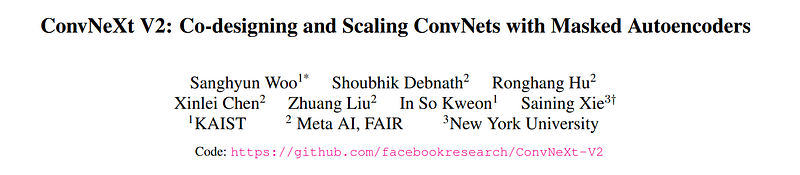
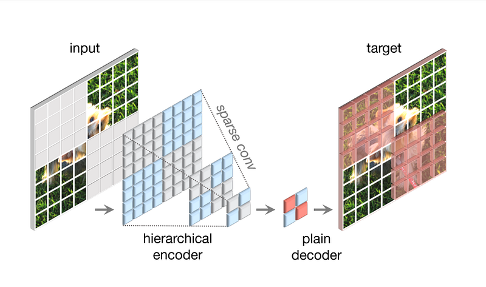
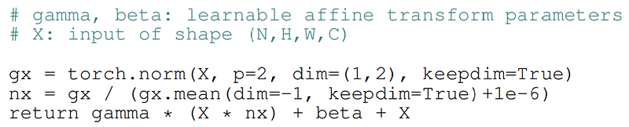
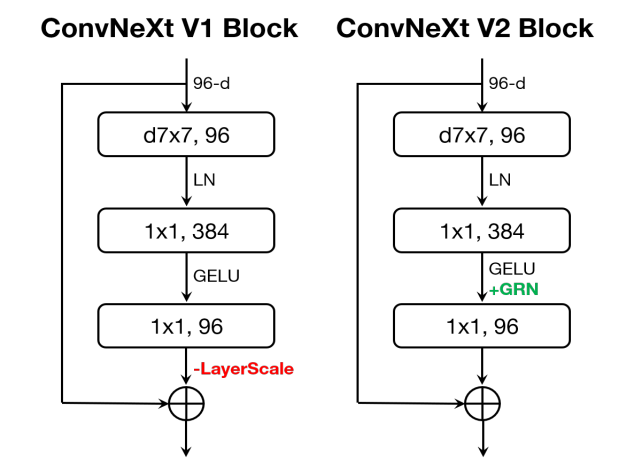
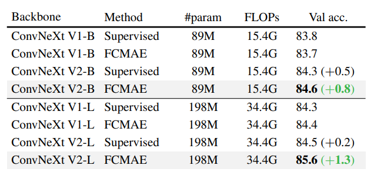
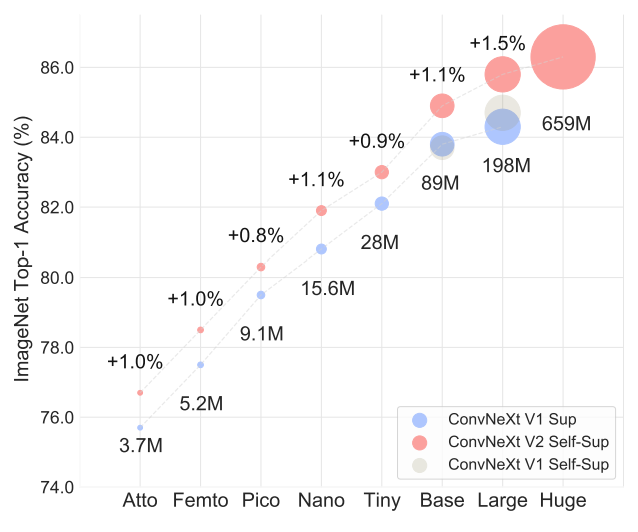
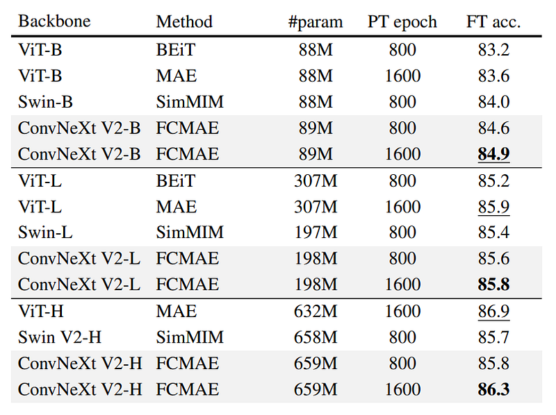
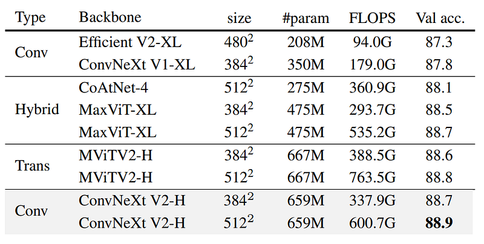
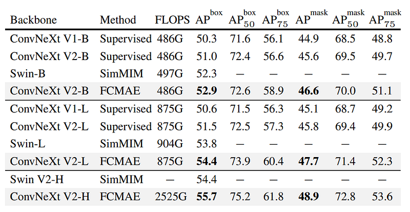
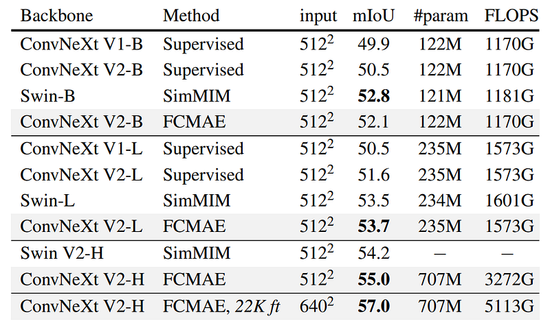

# Papers Explained 94 - ConvNeXt V2

The ConvNeXt model demonstrated strong results but struggles when combined with self-supervised learning (MAE). ConvNeXt V2 addresses this by incorporating a fully convolutional masked autoencoder framework and a Global Response Normalization (GRN) layer, boosting performance across multiple benchmarks.

This page ingests the source article into the wiki and connects it to [[Papers Explained Corpus]], [[Computer Vision]], [[Synthetic Data]].

## Source Metadata

- Source file: `raw/2024-01-24_Papers-Explained-94--ConvNeXt-V2-2ecdabf2081c.html`
- Source title: Papers Explained 94: ConvNeXt V2
- Published: 2024-01-24
- Canonical: [https://medium.com/@ritvik19/papers-explained-94-convnext-v2-2ecdabf2081c](https://medium.com/@ritvik19/papers-explained-94-convnext-v2-2ecdabf2081c)

## Key Ideas

- The ConvNeXt model demonstrated strong results but struggles when combined with self-supervised learning (MAE).
- Recommended Readings: [Papers Explained 92: ConvNeXt](https://ritvik19.medium.com/papers-explained-92-convnext-d13385d9177d)
- 60% of the 32×32 patches are randomly removed from the original image. Only random resized cropping is used for data augmentation.
- Conv Next model is used as the encoder. However during pre-training the standard convolution layer are converted to sub manifold parse convolutions so that the model operates only on the visible data points.
- A lightweight, plain ConvNeXt block is used as the decoder.

## Notes

The ConvNeXt model demonstrated strong results but struggles when combined with self-supervised learning (MAE). ConvNeXt V2 addresses this by incorporating a fully convolutional masked autoencoder framework and a Global Response Normalization (GRN) layer, boosting performance across multiple benchmarks.

Recommended Readings: [Papers Explained 92: ConvNeXt](https://ritvik19.medium.com/papers-explained-92-convnext-d13385d9177d)

## Fully Convolutional Masked Autoencoder

*Figure: Fully Convolutional Masked Autoencoder Framework*

### Masking

60% of the 32×32 patches are randomly removed from the original image. Only random resized cropping is used for data augmentation.

### Encoder Design

Conv Next model is used as the encoder. However during pre-training the standard convolution layer are converted to sub manifold parse convolutions so that the model operates only on the visible data points. The sparse convolutions can be converted back to standard convolutions at the fine turning stage without requiring any additional handling.

### Decoder Design

A lightweight, plain ConvNeXt block is used as the decoder.

### Reconstruction Target

Mean Squared Error is computed between the masked patches of the reconstructed image and patch-wise normalized original image.

### Experiment Setup

Pre Training & Fine Tuning are done on the ImageNet-1K dataset for 800 & 100 epochs respectively.

## Global Response Normalization

GRN aims to increase the contrast and selectivity of channels. Given an input feature, the GRN unit performs three steps: 1) global feature aggregation, 2) feature normalization, and 3) feature calibration.

*Figure: Pseudocode of GRN in a PyTorch-like style*

In ConvNeXt V2, the GRN layer is added after the dimension expansion MLP layer. and the LayerScale is dropped as it becomes redundant.

*Figure: ConvNeXt Block Designs*

## Experiments

### ImageNet-1K

*Figure: Co-design matters*

- Using FCMAE alone without modifying model architecture has limited impact on representation learning quality.

- The new GRN layer has a minor effect on performance in supervised setup.

- Combining FCMAE framework and GRN layer leads to significant improvement in fine-tuning performance.

*Figure: Model Scaling*

- Model performance consistently improves with increasing model size, as demonstrated by strong scaling behavior across the range of sizes (3.7M to 650M).

- Pretraining models using the proposed FCMAE framework and fine-tuning yields better results compared to fully supervised training.

*Figure: Comparisons with previous masked image modeling approaches.*

- The framework outperforms the Swin transformer pre-trained with SimMIM across all model sizes.

- In comparison to the plain ViT pre-trained with MAE, the proposed approach performs similarly up to the Large model regime while using fewer parameters.

- In the huge model regime, the proposed approach slightly lags behind, potentially due to the potential greater benefit of self-supervised pre-training for large ViT models.

*Figure: ImageNet-1K fine-tuning results using IN-21K labels*

- The ConvNeXt V2 Huge model equipped with the FCMAE pretraining outperforms other architectures and sets a new state-ofthe-art accuracy of 88.9% among methods using public data only.

### Object detection and segmentation on COCO

*Figure: COCO object detection and instance segmentation results using Mask-RCNN*

- Moving from supervised to FCMAE-based self-supervised learning further improves model performance.

- The combination of the introduced GRN layer and FCMAE-based self-supervised learning leads to the best performance.

- ConvNeXt V2 pre-trained on FCMAE outperforms Swin transformer models across all model sizes in terms of performance.

### Semantic segmentation on ADE20K

*Figure: ADE20K semantic segmentation results using UPerNet.*

- UperNet framework improves semantic segmentation on the ADE20K dataset compared to V1 supervised counterparts and performs competitively with Swin transformer models, especially outperforming Swin in the huge model regime.

## Paper

ConvNeXt V2: Co-designing and Scaling ConvNets with Masked Autoencoders [2301.00808](https://arxiv.org/abs/2301.00808)

Recommended Reading [Convolutional Neural Networks](https://medium.com/@ritvik19/list/convolutional-neural-networks-5b875ce3b689)

## Figures

Figures from the Medium HTML export (`raw/2024-01-24_Papers-Explained-94--ConvNeXt-V2-2ecdabf2081c.html`); local copies under `wiki/assets/papers-explained-94-convnext-v2/` when download succeeded.

| Figure | Caption |
|--------|---------|
|  | Title card: ConvNeXt V2. |
|  | Fully Convolutional Masked Autoencoder Framework. |
|  | Pseudocode of GRN in a PyTorch-like style. |
|  | ConvNeXt Block Designs. |
|  | Co-design matters. |
|  | Model Scaling. |
|  | Comparisons with previous masked image modeling approaches. |
|  | ImageNet-1K fine-tuning results using IN-21K labels. |
|  | COCO object detection and instance segmentation results using Mask-RCNN. |
|  | ADE20K semantic segmentation results using UPerNet. |
## Related

- [[Papers Explained Corpus]]
- [[Computer Vision]]
- [[Synthetic Data]]
- [[Papers Explained 93 - TinyLlama]]
- [[Papers Explained Review 05 - Generative Adversarial Networks]]

#summary #topic
