# Papers Explained 95 - Mixtral 8x7B

Mixtral 8x7B is a Sparse Mixture of Experts (SMoE) language model trained with multilingual data using a context size of 32k tokens. The paper also presents Mixtral 8x7B — Instruct, a chat model fine-tuned to follow instructions using supervised fine-tuning and Direct Preference Optimization

This page ingests the source article into the wiki and connects it to [[Papers Explained Corpus]], [[Mixture of Experts]], [[Large Language Models]], [[Reinforcement Learning Topic]], [[Multilingual Models]], [[Embedding and Retrieval]], [[Supervised Fine-Tuning]].

## Source Metadata

- Source file: `raw/2024-01-29_Papers-Explained-95--Mixtral-8x7B-9e9f40ebb745.html`
- Source title: Papers Explained 95: Mixtral 8x7B
- Published: 2024-01-29
- Canonical: [https://medium.com/@ritvik19/papers-explained-95-mixtral-8x7b-9e9f40ebb745](https://medium.com/@ritvik19/papers-explained-95-mixtral-8x7b-9e9f40ebb745)

## Key Ideas

- Mixtral 8x7B is a Sparse Mixture of Experts (SMoE) language model trained with multilingual data using a context size of 32k tokens.
- The code is available at [GitHub](https://github.com/mistralai/mistral-src)
- The output of the MoE module for a given input x is determined by the weighted sum of the outputs of the expert networks, where the weights are given by the gating network’s output. i.e.
- Here, G(x)i denotes the n-dimensional output of the gating network for the i-th expert, and Ei(x) is the output of the i-th expert network. If the gating vector is sparse, computing the outputs of experts whose gates are zero can be avoided .
- The value of K — the number of experts used per token — is a hyper-parameter that modulates the amount of compute used to process each token.

## Notes

Mixtral 8x7B is a Sparse Mixture of Experts (SMoE) language model trained with multilingual data using a context size of 32k tokens. The paper also presents Mixtral 8x7B — Instruct, a chat model fine-tuned to follow instructions using supervised fine-tuning and Direct Preference Optimization

The code is available at [GitHub](https://github.com/mistralai/mistral-src)

## Mixtral 8x7B Architecture

Mixtral has the same architecture as Mistral 7B, with the difference that each layer is composed of 8 feedforward blocks (i.e. experts). It is a decoder-only model where the feedforward block picks from a set of 8 distinct groups of parameters. At every layer, for every token, a router network chooses two of these groups (the “experts”) to process the token and combine their output additively. Even though each token only sees two experts, the selected experts can be different at each timestep. As a result, each token has access to 47B parameters, but only uses 13B active parameters during inference.

*Figure: Model Architecture Hyperparameters.*

### Sparse Mixture of Experts

*Figure: Mixture of Experts Layer. Each input vector is assigned to 2 of the 8 experts by a router. The layer’s output is the weighted sum of the outputs of the two selected experts.*

The output of the MoE module for a given input x is determined by the weighted sum of the outputs of the expert networks, where the weights are given by the gating network’s output. i.e. given n expert networks {E0, Ei, …, En−1}, the output of the expert layer is given by

Here, G(x)i denotes the n-dimensional output of the gating network for the i-th expert, and Ei(x) is the output of the i-th expert network. If the gating vector is sparse, computing the outputs of experts whose gates are zero can be avoided . There are multiple alternative ways of implementing G(x), but a simple and performant one is implemented by taking the softmax over the Top-K logits of a linear layer :

The value of K — the number of experts used per token — is a hyper-parameter that modulates the amount of compute used to process each token. If one increases n while keeping K fixed, one can increase the model’s parameter count while keeping its computational cost effectively constant.

In a Transformer model, the MoE layer is applied independently per token and replaces the feed-forward (FFN) sub-block of the transformer block. For Mixtral, the same SwiGLU architecture is used as the expert function Ei(x) and set K = 2. This means each token is routed to two SwiGLU sub-blocks with different sets of weights. Taking this all together, the output y for an input token x is computed as

This formulation is similar to the GShard architecture, with the exceptions that Mixtral replaces all FFN sub-blocks by MoE layers while GShard replaces every other block, and that GShard uses a more elaborate gating strategy for the second expert assigned to each token.

## Evaluation

*Figure: Performance of Mixtral and different Llama models on a wide range of benchmarks.*

> Mixtral outperforms or matches Llama 2 70B on all benchmarks.

> In particular, it is vastly superior in mathematics and code generation.

*Figure: Comparison of Mixtral with Llama.*

> Mixtral outperforms or matches Llama 2 70B performance on almost all popular benchmarks while using 5x fewer active parameters during inference.

*Figure: Results on MMLU, commonsense reasoning, world knowledge and reading comprehension, math and code for Mistral (7B/8x7B) vs Llama 2 (7B/13B/70B).*

> Mixtral largely outperforms Llama 2 70B on all benchmarks, except on reading comprehension benchmarks while using 5x lower active parameters. It is also vastly superior to Llama 2 70B on code and math.

*Figure: Comparison of Mixtral with Llama 2 70B and GPT-3.5*

> Mixtral outperforms or matches Llama 2 70B and GPT-3.5 performance on most metrics.

*Figure: Comparison of Mixtral with Llama on Multilingual Benchmarks.*

> On ARC Challenge, Hellaswag, and MMLU, Mixtral outperforms Llama 2 70B on 4 languages: French, German, Spanish, and Italian.

### Routing analysis

*Figure: Proportion of tokens assigned to each expert on different domains from The Pile dataset for layers 0, 15, and 31.*

- No obvious patterns in expert assignment based on topics (e.g., ArXiv papers, biology, philosophy).

- Marginally different distribution for DM Mathematics, especially noticeable at the first and last layers.

*Figure: Percentage of expert assignment repetitions.*

- Consecutive tokens often assigned to the same experts.

- Higher layers show significantly higher proportion of repeated consecutive assignments.

## Mixtral 8x22B

The Mixtral 8x22B is a new open model that sets a new standard for performance and efficiency. It is a sparse Mixture-of-Experts (SMoE) model that uses only 39B active parameters out of 141B, making it cost-efficient for its size. The model has several strengths, including:

- Fluency in five languages: English, French, Italian, German, and Spanish

- Strong mathematics and coding capabilities

- Native function calling capability, allowing for application development and tech stack modernization at scale

- A 64K tokens context window for precise information recall from large documents

The model is released under the Apache 2.0 open-source license, allowing anyone to use it without restrictions.

The Mixtral 8x22B’s sparse activation patterns make it faster than dense 70B models, while being more capable than other open-weight models. The base model’s availability makes it an excellent basis for fine-tuning use cases.

### Efficiency at its finest

*Figure: Measure of the performance (MMLU) versus inference budget tradeoff (number of active parameters)*

> Mistral 7B, Mixtral 8x7B and Mixtral 8x22B all belong to a family of highly efficient models compared to the other open models.

### Reasoning and knowledge

*Figure: Performance on widespread common sense, reasoning and knowledge benchmarks of the top-leading LLM open models.*

> Mixtral 8x22B is optimized for reasoning.

### Multilingual capabilities

*Figure: Comparison of Mistral open source models and LLaMA 2 70B on HellaSwag, Arc Challenge and MMLU in French, German, Spanish and Italian.*

> Mixtral 8x22B has native multilingual capabilities. It strongly outperforms LLaMA 2 70B on HellaSwag, Arc Challenge and MMLU benchmarks in French, German, Spanish and Italian.

### Maths & Coding

*Figure: Performance on popular coding and maths benchmarks of the leading open models.*

> Mixtral 8x22B performs best in coding and maths tasks compared to the other open models.

> The instructed version of the Mixtral 8x22B released today shows even better math performance, with a score of 90.8% on GSM8K maj@8 and a Math maj@4 score of 44.6%.

## Paper

Mixtral of Experts [2401.04088](https://arxiv.org/abs/2401.04088)

https://mistral.ai/news/mixtral-8x22b/

## Figures

Figures from the Medium HTML export (`raw/2024-01-29_Papers-Explained-95--Mixtral-8x7B-9e9f40ebb745.html`); local copies under `wiki/assets/papers-explained-95-mixtral-8x7b/` when download succeeded.

| Figure | Caption |
|--------|---------|
| 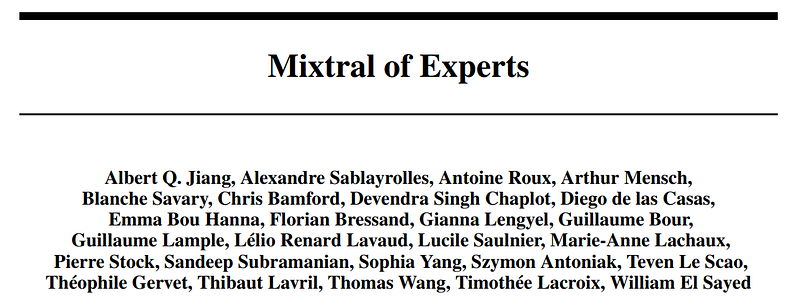 | Title card: Mixtral 8x7B. |
| 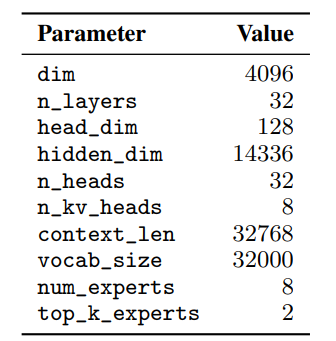 | Model Architecture Hyperparameters. |
| 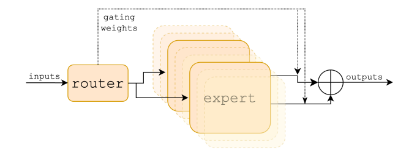 | Mixture of Experts Layer. Each input vector is assigned to 2 of the 8 experts by a router. The layer’s output is the weighted sum of the outputs of the two selected experts. |
| 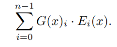 | The code is available at GitHub. |
| 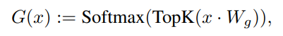 | Here, G(x)i denotes the n-dimensional output of the gating network for the i-th expert, and Ei(x) is the output of the i-th expert network. |
| 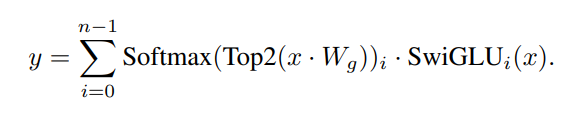 | In a Transformer model, the MoE layer is applied independently per token and replaces the feed-forward (FFN) sub-block of the transformer... |
| 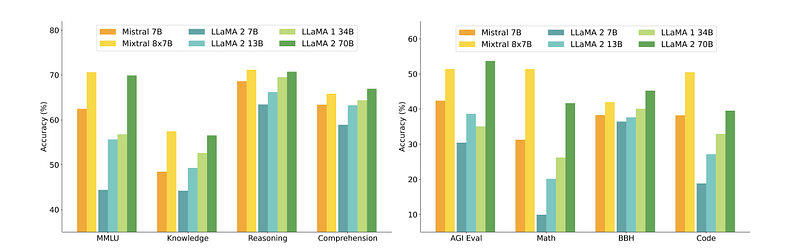 | Performance of Mixtral and different Llama models on a wide range of benchmarks. |
| 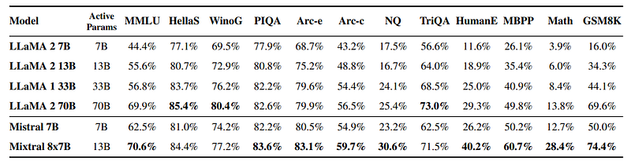 | Comparison of Mixtral with Llama. |
| 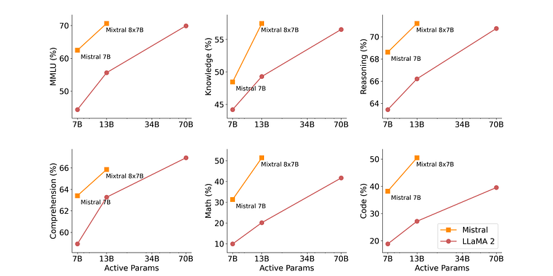 | Results on MMLU, commonsense reasoning, world knowledge and reading comprehension, math and code for Mistral (7B/8x7B) vs Llama 2 (7B/13B/70B). |
| 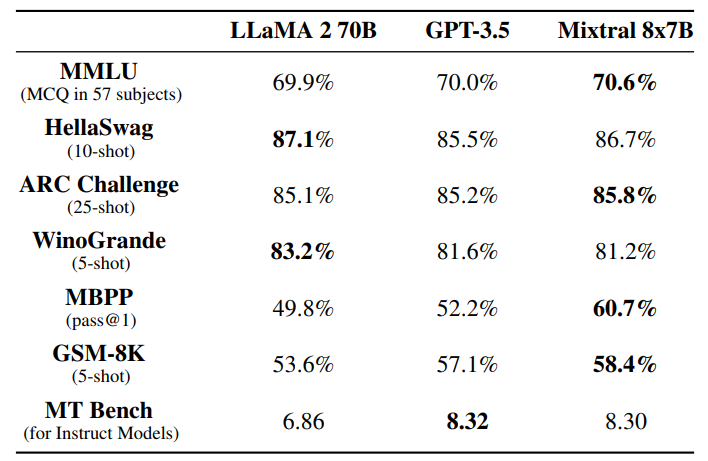 | Comparison of Mixtral with Llama 2 70B and GPT-3.5. |
| 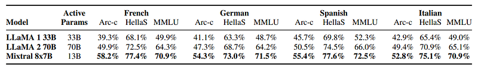 | Comparison of Mixtral with Llama on Multilingual Benchmarks. |
| 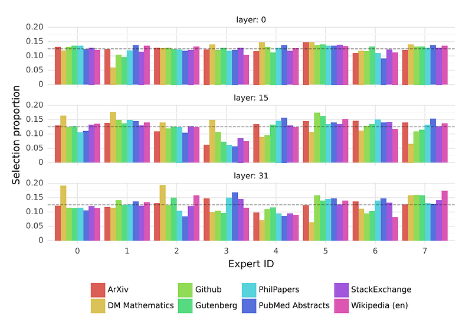 | Proportion of tokens assigned to each expert on different domains from The Pile dataset for layers 0, 15, and 31. |
| 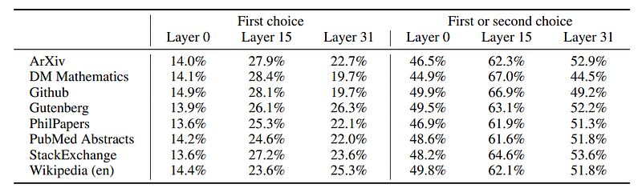 | Percentage of expert assignment repetitions. |
| 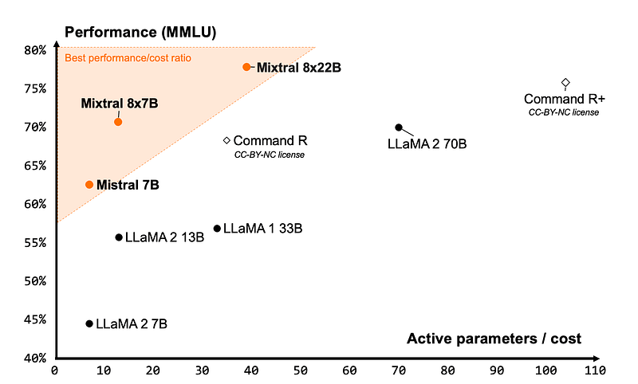 | Measure of the performance (MMLU) versus inference budget tradeoff (number of active parameters). |
| 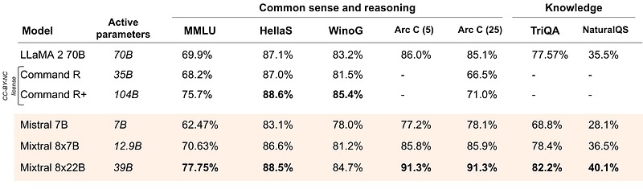 | Performance on widespread common sense, reasoning and knowledge benchmarks of the top-leading LLM open models. |
| 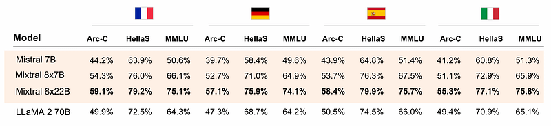 | Comparison of Mistral open source models and LLaMA 2 70B on HellaSwag, Arc Challenge and MMLU in French, German, Spanish and Italian. |
| 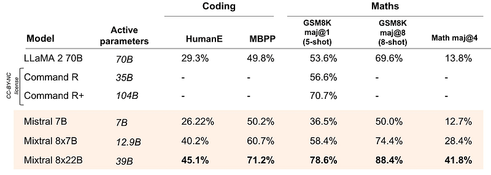 | Performance on popular coding and maths benchmarks of the leading open models. |
## Related

- [[Mixtral of experts]] — official Mistral AI Mixtral 8x7B launch blog (Apache 2.0, DPO instruct, vLLM).
- [[Papers Explained Corpus]]
- [[Mixture of Experts]]
- [[Large Language Models]]
- [[Reinforcement Learning Topic]]
- [[Multilingual Models]]
- [[Embedding and Retrieval]]
- [[Supervised Fine-Tuning]]
- [[Papers Explained Review 05 - Generative Adversarial Networks]]
- [[Papers Explained 96 - Matryoshka Representation Learning]]

#summary #topic
