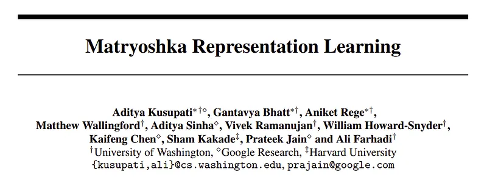
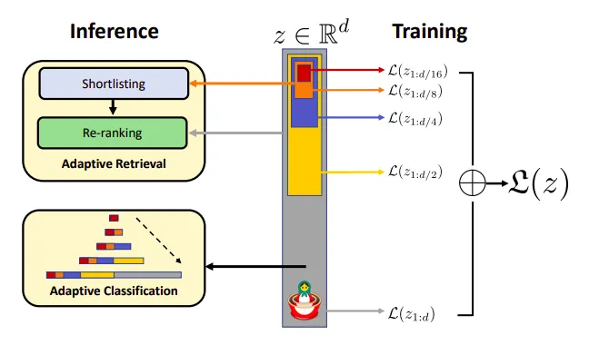
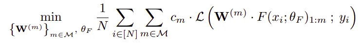
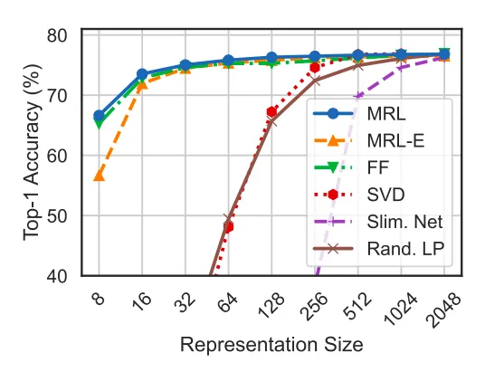
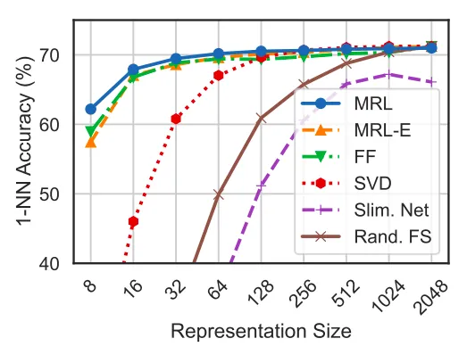
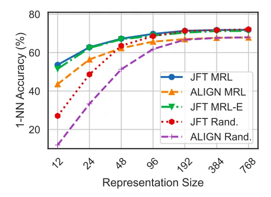
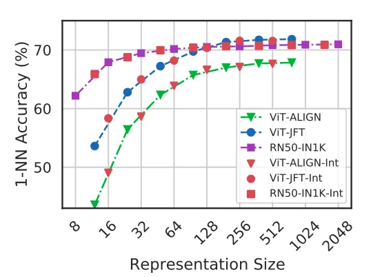
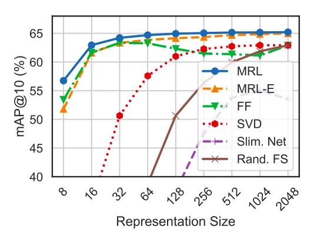

# Papers Explained 96 - Matryoshka Representation Learning

Matryoshka Representation Learning (MRL) encodes information at different granularities and allows a flexible representation that can adapt to multiple downstream tasks with varying computational resources using a single embedding.

This page ingests the source article into the wiki and connects it to [[Papers Explained Corpus]], [[Embedding and Retrieval]], [[Model Compression and Efficiency]], [[Code Models]].

## Source Metadata

- Source file: `raw/2024-01-31_Papers-Explained-96--Matryoshka-Representation-Learning-e7a139f6ad27.md`
- Source title: Papers Explained 96: Matryoshka Representation Learning
- Published: 2024-01-31
- Canonical: [https://medium.com/@ritvik19/papers-explained-matryoshka-representation-learning-e7a139f6ad27](https://medium.com/@ritvik19/papers-explained-matryoshka-representation-learning-e7a139f6ad27)

## Key Ideas

- MRL code and pretrained models are available at [GitHub](https://github.com/RAIVNLab/MRL).
- MRL involves learning a d-dimensional representation vector, z ∈ Rd, for a given datapoint x in the input domain X. The representation vector is obtained using a deep neural network, F( · ; θF), parameterized by learnable weights θF.
- The multi-granularity is captured through the set of the chosen dimensions M, consisting of consistent halving until the representation size hits a low information bottleneck.
- Matryoshka Representation Learning modifies the typical setting to become a multi-scale representation learning problem on the same task.
- where L is the multiclass softmax cross-entropy loss function.

## Notes

Matryoshka Representation Learning (MRL) encodes information at different granularities and allows a flexible representation that can adapt to multiple downstream tasks with varying computational resources using a single embedding. MRL minimally modifies existing representation learning pipelines and imposes no additional cost during inference and deployment.

MRL code and pretrained models are available at [GitHub](https://github.com/RAIVNLab/MRL).

## Matryoshka Representation Learning

MRL involves learning a d-dimensional representation vector, z ∈ Rd, for a given datapoint x in the input domain X. The representation vector is obtained using a deep neural network, F( · ; θF), parameterized by learnable weights θF. The goal is to ensure that each of the first m dimensions of the embedding vector, z1: m ∈ Rm, where m ∈ M, can independently serve as a transferable and general-purpose representation of the datapoint x.

The multi-granularity is captured through the set of the chosen dimensions M, consisting of consistent halving until the representation size hits a low information bottleneck.

Matryoshka Representation Learning modifies the typical setting to become a multi-scale representation learning problem on the same task.

Given a labeled dataset, D = {(x1, y1), . . . , (xN, yN)}, where xi ∈ X is an input point and yi ∈ [L] represents the label of xi. MRL optimizes the multi-class classification loss for each nested dimension, m ∈ M, using standard empirical risk minimization. This is achieved by employing a separate linear classifier, parameterized by W(m) ∈ RL×m, for each dimension. The losses obtained from these classifiers are then aggregated, taking into account their relative importance (cm ≥ 0) m∈M. That is, the following is optimized:

where L is the multiclass softmax cross-entropy loss function.

Pytorch code for Matryoshka Cross-Entropy Loss:

```text
class
Matryoshka_CE_Loss
(nn.Module):
def
__init__
(
self, relative_importance, **kwargs
):
super
(Matryoshka_CE_Loss, self).__init__()
self.criterion = nn.CrossEntropyLoss(**kwargs)
self.relative_importance = relative_importance
# usually set to all ones
def
forward
(
self, output, target
):
loss=
0
for
i
in
range
(
len
(output)):
loss+= self.relative_importance[i] * self.criterion(output[i], target)
return
loss
```

This formulation is called Matryoshka Representation Learning (MRL). A natural way to make this efficient is through weight-tying across all the linear classifiers, i.e., by defining W(m) =W1:m for a set of common weights W. This would reduce the memory cost due to the linear classifiers by almost half, which would be crucial in cases of extremely large output spaces. This variant is called Efficient Matryoshka Representation Learning (MRL–E).

Pytorch code for MRL Linear Layer:

```text
class
MRL_Linear_Layer
(nn.Module):
def
__init__
(
self, nesting_list:
List
, num_classes=
1000
, efficient=
False
, **kwargs
):
super
(MRL_Linear_Layer, self).__init__()
self.nesting_list=nesting_list
# set of m in M
self.num_classes=num_classes
self.is_efficient=efficient
# flag for MRL-E
if
not
is_efficient:
for
i, num_feat
in
enumerate
(self.nesting_list):
setattr
(self,
f"nesting_classifier_
{i}
"
, nn.Linear(num_feat, self.num_classes, **kwargs))
else
:
# Instantiating one nn.Linear layer for MRL-E
setattr
(self,
"nesting_classifier_0"
, nn.Linear(self.nesting_list[-
1
], self.num_classes, **kwargs))
def
forward
(
self, x
):
nesting_logits = ()
for
i, num_feat
in
enumerate
(self.nesting_list):
if
(self.is_efficient):
efficient_logit = torch.matmul(x[:, :num_feat], (self.nesting_classifier_0.weight[:, :num_feat]).t())
else
:
nesting_logits.append(
getattr
(self,
f"nesting_classifier_
{i}
"
)(x[:, :num_feat]))
if
(self.is_efficient):
nesting_logits.append(efficient_logit)
return
nesting_logits
```

## Experiments

- Matryoshka Representation Learning (MRL) is adapted to various representation learning setups including supervised learning for vision, contrastive learning for vision + language, and masked language modelling.

- The models used include ResNet50, ViT-B/16, and BERT.

- The datasets used include ImageNet-1K, JFT-300M, ALIGN data, English Wikipedia, and BooksCorpus.

- ResNet50 outputs a 2048-dimensional representation, while ViT-B/16 and BERT-Base output 768-dimensional embeddings.

- MRL uses explicitly optimized nested dimensions M = {8, 16, 32, 64, 128, 256, 512, 1024, 2048} and M = {12, 24, 48, 96, 192, 384, 768}.

### Classification

*Figure: ImageNet-1K linear classification accuracy of ResNet50 models.*

- ResNet50–MRL model matches or surpasses the accuracy of FF models across all representation sizes on ImageNet-1K.

- MRL–E model is within 1% accuracy starting from 16-dim representations compared to FF models on ImageNet-1K.

*Figure: ImageNet-1K 1-NN accuracy of ResNet50 models measuring the representation quality for downstream task.*

- Matryoshka Representations show up to 2% higher accuracy than fixed-feature (FF) counterparts at lower dimensions, maintaining comparable accuracy at higher dimensions, as demonstrated through 1-NN accuracy on ImageNet-1K.

- 1-NN accuracy serves as a cost-effective measure for evaluating the utility of learned representations in downstream tasks.

*Figure: ImageNet-1K 1-NN accuracy for ViT-B/16 models trained on JFT-300M & as part of ALIGN.*

- Experiments with ViT-B/16 on JFT-300M and the ALIGN model demonstrate that MRL models offer a favorable cost-vs-accuracy balance, especially at lower dimensions, in web-scale settings.

- MRL models are shown to scale effectively to large-scale models and datasets, providing cost-efficient multifidelity representations for downstream tasks.

*Figure: ImageNet-1K 1-NN accuracy for various models.*

- Post-hoc compression methods, linear probe on random features, and sub-net style slimmable networks significantly lose accuracy at smaller representation sizes compared to MRL models.

- MRL optimizes for O(log(d)) nested representations, removing the dependency on O(d) and allowing for coarse-to-fine grained information across all dimensions, enhancing flexibility for adaptive deployment.

### Retrieval

*Figure: mAP@10 for Image Retrieval on ImageNet-1K with ResNet50.*

- Matryoshka Representations often outperform other methods, being up to 3% better than the FF baselines in mAP@10 performance.

- Post-hoc compression and slimmable network baselines experience a significant drop in retrieval mAP@10 with ≤ 256 dimensions.

- Matryoshka Representations allow for accurate retrieval at various granularities without the need for multiple model forward passes, making them suitable for web-scale databases.

- FF models generate independent databases which are expensive to store and switch between.

- Matryoshka Representations enable adaptive retrieval, reducing the need for full-capacity representations for all data and tasks.

- Vector compression techniques used in ANNS pipelines are complementary to Matryoshka Representations, potentially improving the efficiency-vs-accuracy trade-off.

## Paper

Matryoshka Representation Learning [2205.13147](https://arxiv.org/abs/2205.13147)

Recommended Reading: [Retrieval and Representation Learning](https://ritvik19.medium.com/list/retrieval-and-representation-learning-bcd23de0bd8e)

## Figures

Figures from the Medium HTML export (`raw/2024-01-31_Papers-Explained-96--Matryoshka-Representation-Learning-e7a139f6ad27.md`); local copies under `wiki/assets/papers-explained-96-matryoshka-representation-learning/` when download succeeded.

| Figure | Caption |
|--------|---------|
|  | Title card: Matryoshka Representation Learning. |
|  | MRL code and pretrained models are available at GitHub. |
|  | Given a labeled dataset, D = {(x1, y1),. |
|  | ImageNet-1K linear classification accuracy of ResNet50 models. |
|  | ImageNet-1K 1-NN accuracy of ResNet50 models measuring the representation quality for downstream task. |
|  | ImageNet-1K 1-NN accuracy for ViT-B/16 models trained on JFT-300M & as part of ALIGN. |
|  | ImageNet-1K 1-NN accuracy for various models. |
|  | mAP@10 for Image Retrieval on ImageNet-1K with ResNet50. |
## HF Blog Cross-References

- [Introduction to Matryoshka Embedding Models](https://huggingface.co/blog/matryoshka) — a practical Sentence Transformers guide to training and using Matryoshka embedding models (applying the MRL idea above to text embeddings): truncating a single embedding to shorter prefixes for a storage/speed-vs-accuracy trade-off, with a `MatryoshkaLoss` wrapper usable on top of any base loss. Distinct from [[Papers Explained 204 - Matryoshka Adaptor]], which adapts frozen embeddings post-hoc rather than training nested representations directly.

## Related

- [[Papers Explained Corpus]]
- [[Embedding and Retrieval]]
- [[Model Compression and Efficiency]]
- [[Code Models]]
- [[Papers Explained 95 - Mixtral 8x7B]]
- [[Papers Explained 97 - Dolma]]

#summary #topic
