# Papers Explained 97 - Dolma

Dolma (Data for Open Language Models’ Appetite) is an open corpus of three trillion tokens designed to support language model pretraining research, sourced from a diverse mix of web content, scientific papers, code, public-domain books, social media, and encyclopedic materials.

This page ingests the source article into the wiki and connects it to [[Papers Explained Corpus]], [[Large Language Models]], [[Synthetic Data]], [[Code Models]].

## Source Metadata

- Source file: `raw/2024-02-05_Papers-Explained-97--Dolma-a656169269cb.html`
- Source title: Papers Explained 97: Dolma
- Published: 2024-02-05
- Canonical: [https://medium.com/@ritvik19/papers-explained-97-dolma-a656169269cb](https://medium.com/@ritvik19/papers-explained-97-dolma-a656169269cb)

## Key Ideas

- Dolma (Data for Open Language Models’ Appetite) is an open corpus of three trillion tokens designed to support language model pretraining research, sourced from a diverse mix of web content, scientific papers, code, public-domain books, social media, and...
- The dataset is available at [HuggingFace](https://huggingface.co/datasets/allenai/dolma).
- Dolma’s curation should be consistent with prior language model pretraining recipes. Notably, this also means scoping Dolma to English-only text.
- Dolma should support training of large models. It aims for a sufficiently large corpus to allow further study of the relationship between model and dataset size.
- Dolma should contribute to open corpora. Limitations in the prior corpora have motivated need for Dolma:

## Notes

Dolma (Data for Open Language Models’ Appetite) is an open corpus of three trillion tokens designed to support language model pretraining research, sourced from a diverse mix of web content, scientific papers, code, public-domain books, social media, and encyclopedic materials. This paper further contributes to the research community by releasing the Dolma Corpus and Toolkit, facilitating transparency, reproducibility, and broader participation in language model development and analysis.

The dataset is available at [HuggingFace](https://huggingface.co/datasets/allenai/dolma).

*Figure: The Dolma corpus at-a-glance.*

## Dolma Design Goals

- Dolma’s curation should be consistent with prior language model pretraining recipes. Notably, this also means scoping Dolma to English-only text.

- Dolma should support training of large models. It aims for a sufficiently large corpus to allow further study of the relationship between model and dataset size.

- Dolma should contribute to open corpora. Limitations in the prior corpora have motivated need for Dolma:

- C4, Pile, and Falcon are high quality datasets with demonstrated use in training language models, but are unfortunately limited in scale.

- RedPajama v2 meets the criteria of scale but don’t reflect representative distributions over sources of content commonly seen in curating the largest language models.

- RedPajama v1 being a reproduction of the LLaMA training data, still lacks larger collections of scientific papers and conversational forums like Reddit.

- Dolma’s curation should minimize risk of harm to individuals. Broadly accepted practices are followed when available (e.g., masking of certain personal identifiable information). A measured approach is taken when diverging opinions exist in the literature. Tools to request data removal are provided as well.

## Creating Dolma

Four kinds of data transformations are developed

- Language filtering. To create our English-only corpus fastText’s language ID model is used. It should be noted that language filtering is never perfect, and multilingual data is never completely removed from pre-training corpora.

- Quality filtering. Model based quality filtering like those used for LLaMA and GPT3 are avoided and instead heuristics used in C4 and Gopher are reimplemented.

- Content filtering. To reduce the risk of toxic generation, a mix of rules- and classifier-based toxicity filtering techniques are implemented depending on the source.

- Deduplication. A combination of URL, document, and paragraph-level deduplication is used. Linear-time deduplication is achieved through the use of Bloom filters. Deduplication across files from the same subset is performed but not across sources.

### Web Pipeline

The web subset of Dolma was derived from Common Crawl.

Data distribution

- The data mostly comes from 2020–2022.

- The most common internet domains in Dolma, per token, are patents.google.com, followed by www.nature.com and www.frontiersin.org.

- 63.6% of Dolma’s web documents are from ‘.com’ sites

- The most common language after English is not well identified (‘un’) with 0.86% of the documents, followed by 0.06% of the documents identified as Chinese.

### Code Pipeline

The code subset of Dolma is derived from The Stack

### Conversational Forums Pipeline

The conversational subset of Dolma was derived from the Pushshift Reddit dataset

### Other Data Sources

- C4 for Curated Web Content

- PeS2o for Academic Literature

- Project Gutenberg for Books

- Wikipedia and Wikibooks for Encyclopedic Content

Regex used:

```text
email_address =
r"[.\s@,?!;:)(]*([\^\s@]+@[\^\s@,?!;:)(]+?)[.\s@,?!;:)(]?[\s\n\r]"
ip_address =
r"\s+\(?(\d{3})\)?[-\. ]*(\d{3})[-. ]?(\d{4})"
phone_number =
r"(?:(?:25[0-5]|2[0-4][0-9]|[01]?[0-9]{1,2})\.){3} (?:25[0-5]|2[0-4][0-9]|[01]?[0-9]{1,2})"
```

[NSFW fastText tagger](https://huggingface.co/allenai/dolma-jigsaw-fasttext-bigrams-nsfw) and [hate fastText tagger](https://huggingface.co/allenai/dolma-jigsaw-fasttext-bigrams-hatespeech) are also available at HuggingFace.

## Training a Language Model on Dolma

Potential approaches additional dataset curation decisions specific to model training.

- an approach to remove benchmark tasks i.e., decontaminate from Dolma.

- considerations when combining i.e., mixing the various document subsets in Dolma to obtain the final pretraining corpus.

### Strategies for Benchmark Decontamination in Dolma

- Large-scale language datasets often contain copies of benchmarks, leading to a debated impact on model performance.

- Removing duplicates from pre-training data can increase perplexity, but studies show no consistent impact on downstream task performance.

- The study focuses on removing perplexity benchmark contamination and measures downstream task contamination.

- A paragraph-based decontamination strategy is preferred over document-based due to higher detection of contaminated content.

- Preliminary experiments show minimal impact on token and document removal, leading to the decision to remove whole documents to preserve reading order.

*Figure: Performance differences with and without our decontamination on 1B models trained on RedPajama v1.*

- Decontamination experiments on a 221B token subset show minimal and inconsistent differences in perplexity and downstream task performance, indicating no significant performance degradation.

- The decontamination approach for Olmo-1b involves removing documents overlapping with the Paloma benchmark, with special consideration for punctuation, spaces, and emoji to avoid unnecessary removal.

- Less than 0.001% of characters and fewer than 0.02% of documents in the Dolma corpus used for training Olmo-1b were found contaminated and removed.

*Figure: Contamination percentages of datasets from PromptSource.*

- Analysis of possible downstream task contamination in Dolma reveals six datasets with 100% contamination and several others with over 90% contamination, which are excluded from model evaluation.

### Strategies for Subsets Mixing and Upsampling with Dolma

- The study investigates the importance of including code in the pre-training data, given that mixing code has been suggested to improve performance on reasoning tasks.

- Three mixtures containing 0%, 5%, and 15% of code data were created from the C4 and Stack subsets to train 1B models, which were then evaluated on reasoning tasks: bAbI, WebNLG, and GSM8k.

*Figure: Performance of three models pre-trained with increasing amounts of code on three datasets, across 5 random seeds.*

- Adding code to pre-training data improves In-Context Learning (ICL) performance on bAbI and WebNLG tasks, corroborating findings that code enhances long-range state-tracking capabilities (

- For the GSM8k benchmark, all models failed in an ICL setup, but models pre-trained on code outperformed the C4-only model when fine-tuned on program-aided output, showing the utility of code generation in challenging reasoning tasks.

*Figure: Overview of the mixtures and their composition.*

- The study evaluates different mixing strategies for pretraining on Dolma using the Paloma evaluation suite, presenting four possible data mixtures and their effects.

*Figure: 1B model ablations for different proportions of Dolma data.*

- Results indicate that different mixtures affect the models’ ability to capture specific subdomains, with all mixtures showing similar perplexity scores on web documents but varying abilities on specialized domains like code.

- Models trained on Web-only mix struggle with code domain representation, while those trained on Reference+ and Gopher-like mixes achieve lower perplexity on academic papers, suggesting even a small percentage of in-domain data can significantly improve domain fit.

- Overall, source distribution is linked to downstream capabilities; thus, Dolma users should sample subsets according to their needs.

## Paper

Dolma: an Open Corpus of Three Trillion Tokens for Language Model Pretraining Research [2402.00159](https://arxiv.org/abs/2402.00159)

Recommended Reading [Datasets](https://ritvik19.medium.com/list/datasets-b465a5d8a2d6)

## Figures

Figures from the Medium HTML export (`raw/2024-02-05_Papers-Explained-97--Dolma-a656169269cb.html`); local copies under `wiki/assets/papers-explained-97-dolma/` when download succeeded.

| Figure | Caption |
|--------|---------|
| 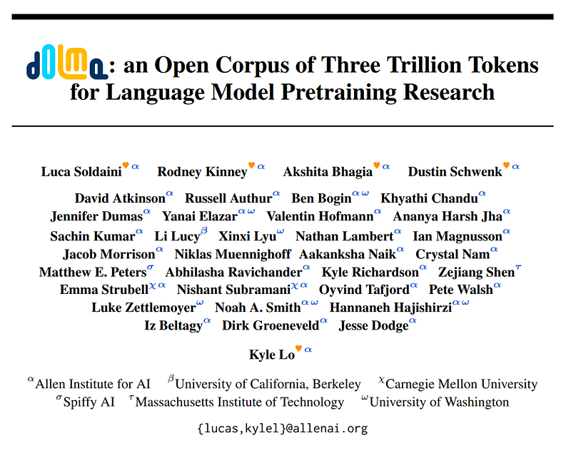 | Title card: Dolma. |
| 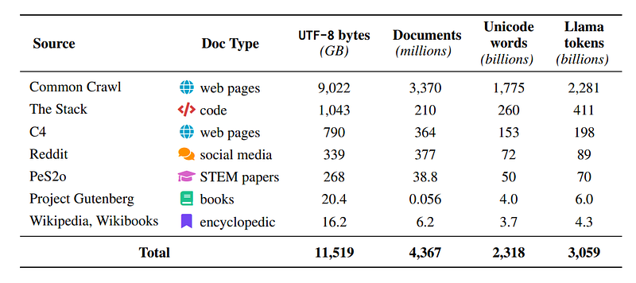 | The Dolma corpus at-a-glance. |
| 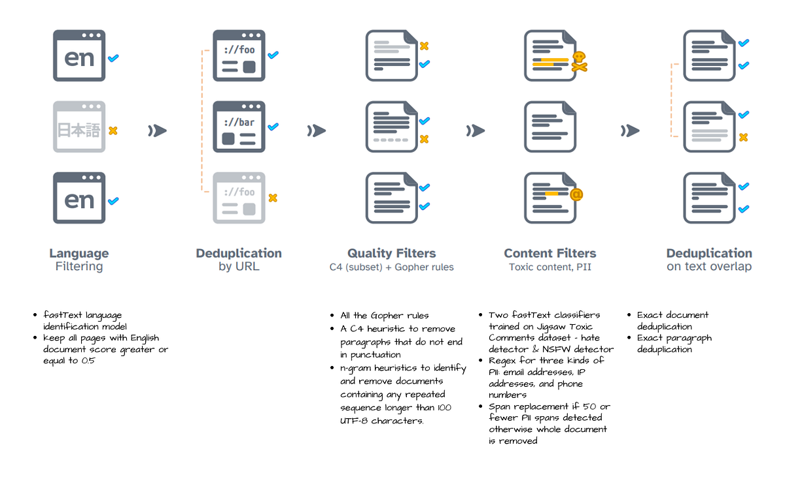 | The web subset of Dolma was derived from Common Crawl. |
| 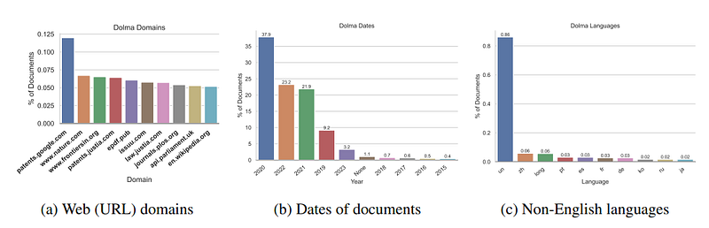 | Data distribution. |
| 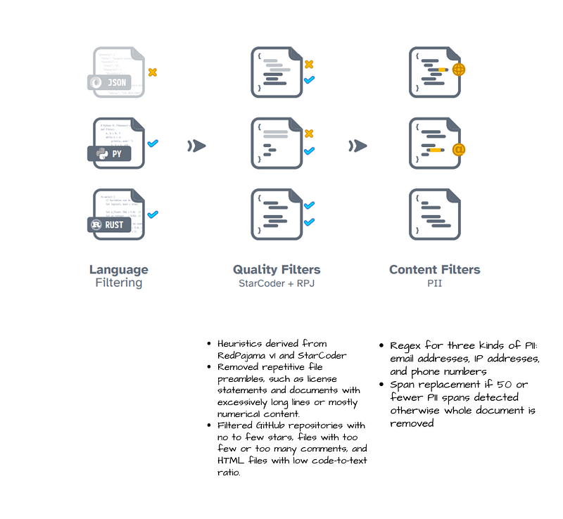 | The code subset of Dolma is derived from The Stack. |
| 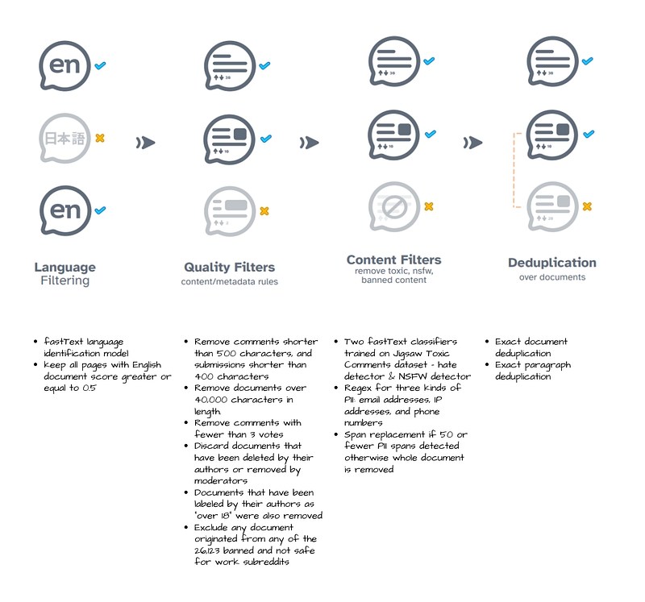 | The conversational subset of Dolma was derived from the Pushshift Reddit dataset. |
| 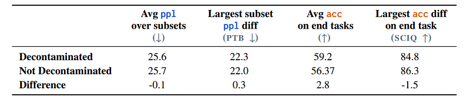 | Performance differences with and without our decontamination on 1B models trained on RedPajama v1. |
| 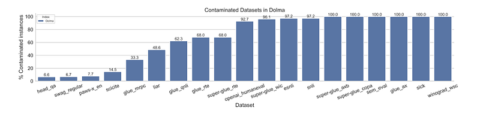 | Contamination percentages of datasets from PromptSource. |
| 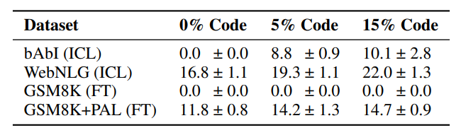 | Performance of three models pre-trained with increasing amounts of code on three datasets, across 5 random seeds. |
| 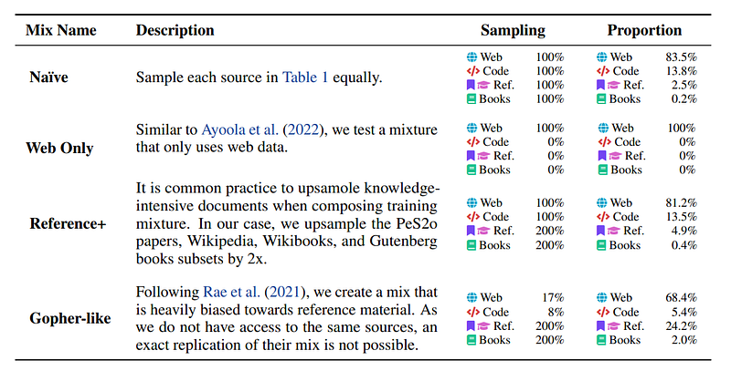 | Overview of the mixtures and their composition. |
| 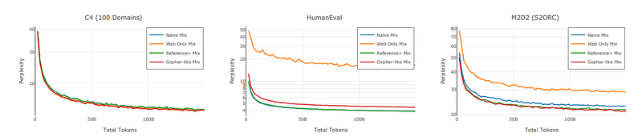 | 1B model ablations for different proportions of Dolma data. |
## Related

- [[Papers Explained Corpus]]
- [[Large Language Models]]
- [[Synthetic Data]]
- [[Code Models]]
- [[Papers Explained 96 - Matryoshka Representation Learning]]
- [[Papers Explained 98 - OLMo]]

#summary #topic
