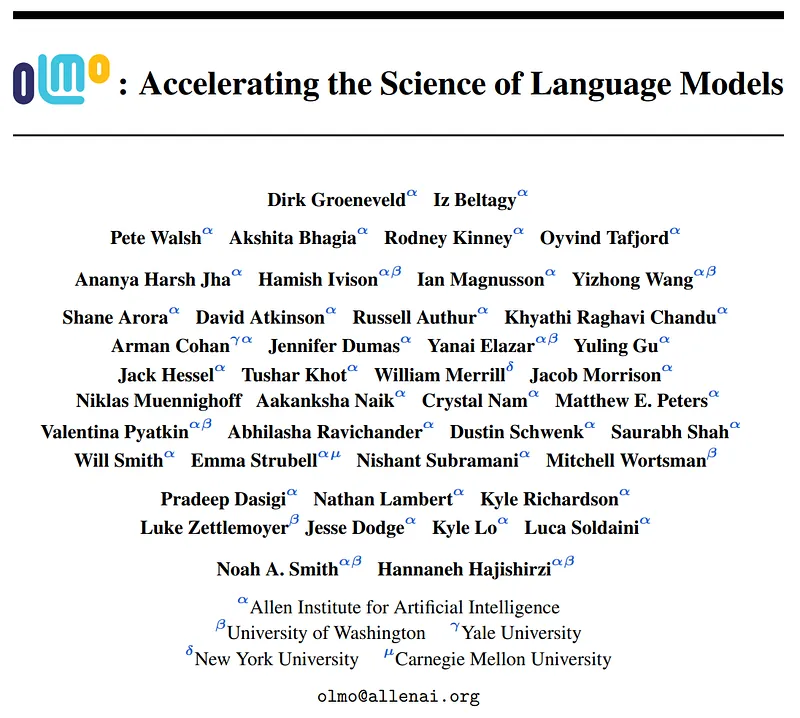
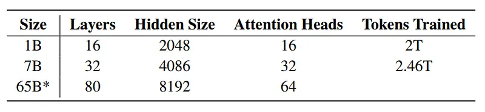
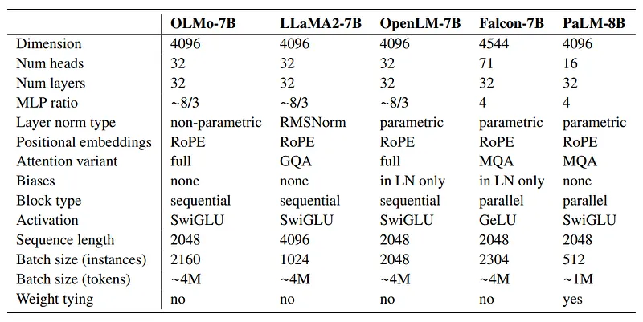
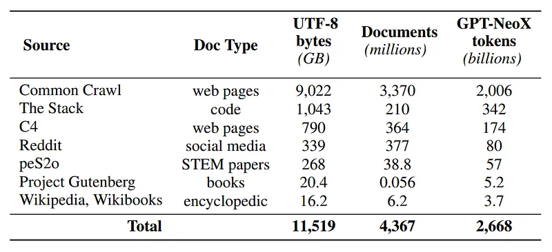
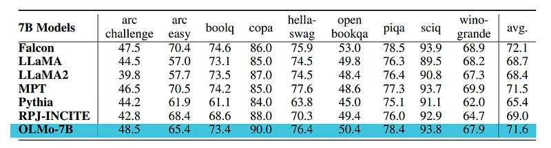
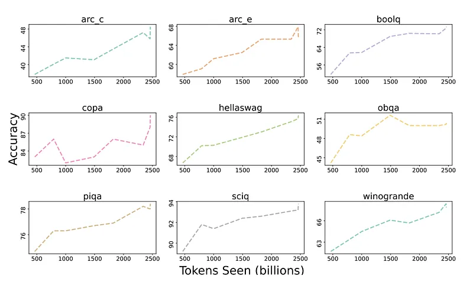
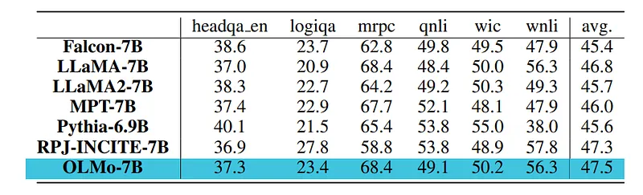
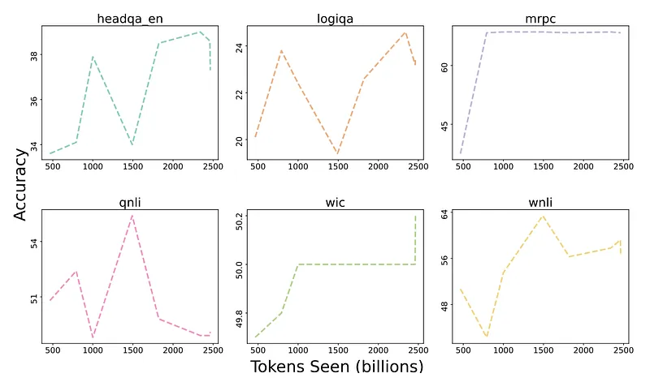
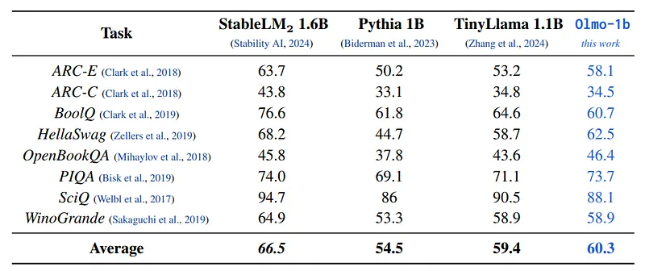

# Papers Explained 98 - OLMo

The entire framework, including the [code](https://github.com/allenai/OLMo), [model](https://huggingface.co/allenai/OLMo-7B), and [data](https://huggingface.co/datasets/allenai/dolma), is released as open source.

This page ingests the source article into the wiki and connects it to [[Papers Explained Corpus]], [[Large Language Models]], [[Embedding and Retrieval]], [[Code Models]].

## Source Metadata

- Source file: `raw/2024-02-07_Papers-Explained-98--OLMo-fdc358326f9b.md`
- Source title: Papers Explained 98: OLMo
- Published: 2024-02-07
- Canonical: [https://medium.com/@ritvik19/papers-explained-98-olmo-fdc358326f9b](https://medium.com/@ritvik19/papers-explained-98-olmo-fdc358326f9b)

## Key Ideas

- OLMo adopts a decoder-only transformer architecture and has a 1B and 7B variant and a 65B version still in training.
- OLMo includes several improvements over the vanilla transformer:
- No biases in order to improve training stability.
- Non-parametric layer norm i.e. without adaptive gain and bias.
- Instead of ReLU, SwiGLU activation function with activation hidden size approximately 8/3d, increased to the closest multiple of 128 to improve throughput.

## Notes

OLMo (Open Language Model) is a state-of-the-art, truly open language model and framework that aims to provide the research community with access to powerful language models. Unlike other models that are gated behind proprietary interfaces, OLMo releases the entire framework, including training data, training and evaluation code, and model checkpoints. It allows researchers to study and advance language models, understand their strengths and weaknesses, biases, and potential risks. OLMo is the first step in a series of planned releases, with the goal of catalysing research into various aspects of language models.

The entire framework, including the [code](https://github.com/allenai/OLMo), [model](https://huggingface.co/allenai/OLMo-7B), and [data](https://huggingface.co/datasets/allenai/dolma), is released as open source.

## OLMo Model and Architecture

OLMo adopts a decoder-only transformer architecture and has a 1B and 7B variant and a 65B version still in training.

*Figure: OLMo model sizes and the maximum number of tokens trained to.*

OLMo includes several improvements over the vanilla transformer:

- No biases in order to improve training stability.

- Non-parametric layer norm i.e. without adaptive gain and bias.

- Instead of ReLU, SwiGLU activation function with activation hidden size approximately 8/3d, increased to the closest multiple of 128 to improve throughput.

- Rotary positional embeddings in place of absolute positional embeddings.

*Figure: LM architecture comparison at the 7–8B scale.*

A modified version of the BPE-based tokenizer from GPT-NeoX-20B is used with additional tokens for masking personal identifiable information (PII). The final vocabulary size of 50,280 is increased to 50,304 (multiple of 128) to maximize training throughput.

## Pre Training Data: Dolma

Dolma is a diverse, multi-source corpus of 3T tokens across 5B documents acquired from 7 different data sources that are commonly seen in large-scale language model pretraining and accessible to the general public.

*Figure: Composition of Dolma.*

Dolma is built using a pipeline of language filtering, quality filtering, content filtering, deduplication, multi-source mixing, and tokenization.

Additional details of Dolma including design principles, details about its construction, and a more detailed summary of its contents are covered in [Papers Explained 97: Dolma](https://ritvik19.medium.com/papers-explained-97-dolma-a656169269cb).

## Results

- The OLMo-7B checkpoint is evaluated after being trained on the Dolma dataset with a linear learning rate decay schedule.

- Tuning the OLMo-7B checkpoint further on the Dolma dataset for 1000 steps with a linearly decayed learning rate improves model performance on perplexity and end-task evaluation suites.

- OLMo is compared with other publicly available models including LLaMA-7B, LLaMA2–7B, MPT-7B, Pythia-6.9B, Falcon-7B, and RPJ-INCITE-7B.

- The core downstream evaluation suite consists of: arc (both arc easy and arc challenge), boolq, openbookqa, sciq, hellaswag, piqa, copa and winogrande.

- 6 additional end-tasks apart from the 9 core evaluation suite include: headqa en, logiqa, mrpc, qnli, wic, and wnli.

*Figure: Zero-shot evaluation of OLMo-7B and 6 other publicly available comparable model checkpoints on 9 core tasks.*

- OLMo-7B checkpoint outperforms all other publicly available models on 2 end-tasks and remains in top-3 on 8/9 end-tasks from the evaluation suite.

- On aggregate, OLMo-7B is competitive against all 6 publicly available model checkpoints in the comparison table.

*Figure: Accuracy score progression of OLMo-7B on 9 core end-tasks,*

- All tasks, except OBQA, show an upward trend in accuracy numbers as OLMo-7B is trained on more tokens.

- A sharp upward tick in accuracy of many tasks between the last and the second to last step shows us the benefit of linearly reducing the LR to 0 over the final 1000 training steps.

*Figure: Zero-shot evaluation of OLMo-7B on 6 additional end-tasks.*

- OLMo-7B outperforms the other models on aggregate.

- However, in contrast to the core evaluation set, these additional end-tasks were found to have less stable performance during model development and provided a limited signal.

*Figure: Accuracy score progression of OLMo-7B on 6 additional end-tasks.*

- While tasks such as mrpc and wic appear more stable, they offered additional difficulties related to performance being tied to random chance (e.g., wic) or the tendency of models to make spurious predictions (e.g., always predicting a single label) that either inflate or deflate performance due to dataset class imbalances (e.g., mrpc).

*Figure: Comparison of Olmo-1b against other similarly sized language models.*

- Olmo-1b was trained on 3 trillion tokens from a preliminary version of Dolma (v. 1.5).

- Overall, Olmo-1b shows better performance than TinyLlama, which has been trained on a similar number of tokens.

- Olmo-1b outperforms Pythia 1B, but the latter has been trained on one order of magnitude fewer tokens.

- StableLM2 is included in this table as a reference, but it cannot be fairly compared with the other works since composition of its training data is not known.

## Paper

OLMo: Accelerating the Science of Language Models [2402.00838](https://arxiv.org/abs/2402.00838)

Recommended Reading: [Decoder-Only Language Transformers](https://ritvik19.medium.com/list/decoderonly-language-transformers-5448110c6046) [Language Models](https://ritvik19.medium.com/list/language-models-11b008ddc292)

## Figures

Figures from the Medium HTML export (`raw/2024-02-07_Papers-Explained-98--OLMo-fdc358326f9b.md`); local copies under `wiki/assets/papers-explained-98-olmo/` when download succeeded.

| Figure | Caption |
|--------|---------|
|  | Title card: OLMo. |
|  | OLMo model sizes and the maximum number of tokens trained to. |
|  | LM architecture comparison at the 7–8B scale. |
|  | Composition of Dolma. |
|  | Zero-shot evaluation of OLMo-7B and 6 other publicly available comparable model checkpoints on 9 core tasks. |
|  | Accuracy score progression of OLMo-7B on 9 core end-tasks,. |
|  | Zero-shot evaluation of OLMo-7B on 6 additional end-tasks. |
|  | Accuracy score progression of OLMo-7B on 6 additional end-tasks. |
|  | Comparison of Olmo-1b against other similarly sized language models. |
## Related

- [[Papers Explained Corpus]]
- [[Large Language Models]]
- [[Embedding and Retrieval]]
- [[Code Models]]
- [[Papers Explained 97 - Dolma]]
- [[Papers Explained 99 - BLOOMZ, mT0]]

#summary #topic
