# Papers Explained 99 - BLOOMZ, mT0

The study applies Multitask prompted fine tuning to the pretrained multilingual BLOOM and mT5 model families to produce finetuned variants called BLOOMZ and mT0.

This page ingests the source article into the wiki and connects it to [[Papers Explained Corpus]], [[Large Language Models]], [[Multilingual Models]], [[Code Models]], [[Supervised Fine-Tuning]].

## Source Metadata

- Source file: `raw/2024-02-12_Papers-Explained-99--BLOOMZ--mT0-8932577dcd1d.md`
- Source title: Papers Explained 99: BLOOMZ, mT0
- Published: 2024-02-12
- Canonical: [https://medium.com/@ritvik19/papers-explained-99-bloomz-mt0-8932577dcd1d](https://medium.com/@ritvik19/papers-explained-99-bloomz-mt0-8932577dcd1d)

## Key Ideas

- It is found that finetuning large multilingual language models on English tasks with English prompts allows for task generalization to non-English languages that appear only in the pretraining corpus.
- Fine Tuning on multilingual tasks with English prompts further improves performance on English and non-English tasks leading to various state-of the-art zero-shot results.
- In addition, xP3, a composite of supervised datasets in 46 languages with English and machine-translated prompts is also introduced.
- The code, datasets and models are freely available at [GitHub](https://github.com/bigscience-workshop/xmtf).
- Recommended Reading [Papers Explained 44: T5](https://medium.com/dair-ai/papers-explained-44-t5-9d974a3b7957) [Papers Explained 52: BLOOM](https://medium.com/dair-ai/papers-explained-52-bloom-9654c56cd2)

## Notes

The study applies Multitask prompted fine tuning to the pretrained multilingual BLOOM and mT5 model families to produce finetuned variants called BLOOMZ and mT0.

It is found that finetuning large multilingual language models on English tasks with English prompts allows for task generalization to non-English languages that appear only in the pretraining corpus.

Fine Tuning on multilingual tasks with English prompts further improves performance on English and non-English tasks leading to various state-of the-art zero-shot results.

In addition, xP3, a composite of supervised datasets in 46 languages with English and machine-translated prompts is also introduced.

The code, datasets and models are freely available at [GitHub](https://github.com/bigscience-workshop/xmtf).

Recommended Reading [Papers Explained 44: T5](https://medium.com/dair-ai/papers-explained-44-t5-9d974a3b7957) [Papers Explained 52: BLOOM](https://medium.com/dair-ai/papers-explained-52-bloom-9654c56cd2)

## Dataset

*Figure: An overview of datasets in xP3. Datasets added to P3 in this work are marked bold. Yellow datasets are trained on. Green datasets are held out for evaluation.*

Building upon P3 four new task clusters are introduced: translation, simplification, program synthesis, and miscellaneous code datasets.

*Figure: Language composition of xP3, ROOTS, and the corpus of mT5. All ROOTS and xP3 languages are depicted. The mT5 corpus covers additional languages that are not included in the graph.*

The xP3 is aimed to replicate the language distribution of the ROOTS corpus used to pretrain BLOOM.

*Figure: Comparison of dataset variants P3, xP3, and xP3mt on a sample from PAWS for P3 and PAWS-X for xP3 and xP3mt.*

To study the importance of non-English prompts, a machine-translated variant of xP3, called xP3mt, is constructed. The prompts of monolingual datasets are translated into the respective dataset language, using the Google Cloud API for machine translation. For cross lingual datasets prompts remain in English in xP3mt.

## Models

The publicly available pretrained BLOOM models ranging from 560M to 176B parameters are used. BLOOM models are large decoder-only language models pretrained for around 350 billion tokens with an architecture similar to GPT-3. The mT5 models are finetuned using the T5X framework. mT5 uses the same encoder-decoder architecture, pre-training objective (masked language modeling), and pre-training length (1 trillion tokens) as T5.

Three core model variants are produced in different sizes:

- BLOOMZ-P3 / mT0-P3: Models fine tuned on the English-only P3.

- BLOOMZ / mT0: Models fine tuned on xP3, which consists of multilingual datasets with English prompts.

- BLOOMZ-MT / mT0-MT: Models fine tuned on xP3mt, which consists of multilingual datasets with English and machine translated prompts.

## Evaluation

### Task generalization

*Figure: Zero-shot multilingual task generalization with English prompts.*

- Finetuned BLOOMZ and BLOOMZ-P3 models significantly improve over BLOOM and XGLM on held-out tasks

- mT0 (13 billion parameters) is ahead of BLOOMZ (176 billion parameters) despite having an order of magnitude fewer parameters

- The encoder-decoder architecture paired with a masked language modeling pretraining objective and longer pretraining contribute to mT0’s performance

- mTk-Instruct performs significantly worse than mT0, possibly due to the prompting style and more structured prompts

- T0 performs worse than Tk-Instruct on their prompts

- Models finetuned on the 39% English xP3 outperform models finetuned on the 100% English P3 on English tasks

- mT0–13B model outperforms the fully English T0–11B model on entirely English tasks

### Language generalization

*Figure: Zero-shot task and language generalization using English prompts on tasks and languages not intentionally seen during pretraining nor finetuning.*

- BLOOMZ-P3 improves by over 50% on multilingual sentence completion compared to BLOOM.

- Zero-shot task performance in languages only seen during pretraining improves after finetuning on English.

- Multitask finetuning on xP3 allows models to perform unseen tasks in languages that were not intentionally trained on.

### Multilingual prompting

*Figure: Comparison between EN (English), MT (machine-translated) and HT (human-translated) prompts for 176B BLOOMZ and 13B mT0 models finetuned on either only English or English and machine-translated multilingual prompts (-MT).*

- The performance of BLOOMZ is better on English prompts compared to non-English prompts.

- BLOOMZ-MT, which is finetuned on xP3mt, improves performance on multilingual prompts.

- On XNLI, BLOOMZ-MT raises the average performance on human-translated prompts from 41.13 to 45.55.

- BLOOMZ-MT’s performance on English prompts decreases from 53.58 to 49.74.

- The MT version of mT0 provides similar performance gains on XNLI and XWinograd non-English prompts.

- Results on XCOPA and XStoryCloze for mT0 are mixed.

- Models perform better on human-translated prompts than machine-translated ones for XNLI.

### Scaling

*Figure: Aggregate performance vs. size. Transparent lines correspond to individual languages, while thick lines are average accuracy scores.*

- Multitask finetuning improves zero-shot generalization, even with 560M parameters.

- The gap between pretrained and multitask finetuned models increases as the number of parameters increases

- Scaling up parameters benefits all evaluated languages

### Generation tasks

*Figure: Validation performance during training on natural language understanding (NLU) and natural language generation (NLG) tasks.*

- Multitask finetuning has a positive impact on natural language understanding tasks, but it has a negative impact on generative tasks.

- Performance on generative tasks initially jumps but then decreases with multitask finetuning.

*Figure: Code continuation on HumanEval.*

- Multitask finetuning does not improve performance on HumanEval.

- Small models show meaningful performance gains with multitask finetuning.

- Excluding code data from finetuning significantly decreases performance.

- mT0 models, which have not been pretrained on code, fail to solve any HumanEval problems.

### Effect of language proportions

*Figure: Performance across languages by size in the BLOOM pretraining corpus, ROOTS.*

- Finetuned BLOOM models perform better on languages seen extensively during pretraining.

- High-resource languages such as English, Spanish, and French show significantly better performance on XCOPA and XNLI.

- The trend is less consistent for XWinograd, possibly due to different language subsets having different difficulty levels.

## Paper

Crosslingual Generalization through Multitask Finetuning [2211.01786](https://arxiv.org/abs/2211.01786)

Recommended Reading: [Multi Task Language Models](https://ritvik19.medium.com/list/multi-task-language-models-e6a2a1e517e6)

## Figures

Figures from the Medium HTML export (`raw/2024-02-12_Papers-Explained-99--BLOOMZ--mT0-8932577dcd1d.md`); local copies under `wiki/assets/papers-explained-99-bloomz-mt0/` when download succeeded.

| Figure | Caption |
|--------|---------|
| 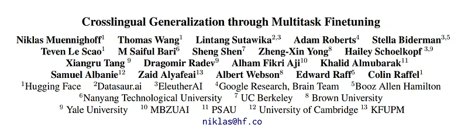 | Title card: BLOOMZ, mT0. |
| 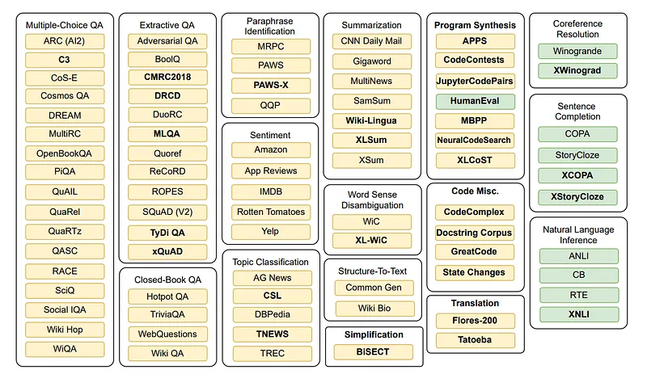 | An overview of datasets in xP3. Datasets added to P3 in this work are marked bold. Yellow datasets are trained on. Green datasets are held out for evaluation. |
| 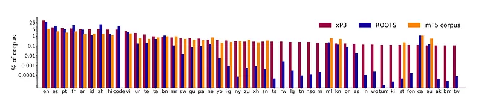 | Language composition of xP3, ROOTS, and the corpus of mT5. All ROOTS and xP3 languages are depicted. The mT5 corpus covers additional languages that are not included in the graph. |
| 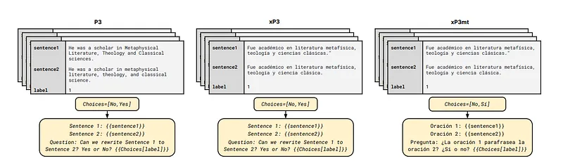 | Comparison of dataset variants P3, xP3, and xP3mt on a sample from PAWS for P3 and PAWS-X for xP3 and xP3mt. |
| 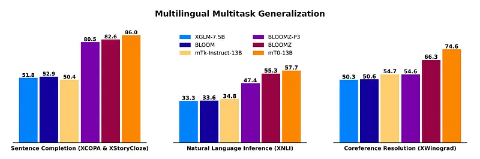 | Zero-shot multilingual task generalization with English prompts. |
| 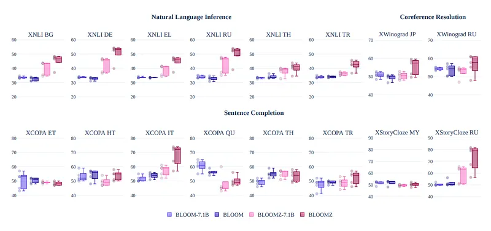 | Zero-shot task and language generalization using English prompts on tasks and languages not intentionally seen during pretraining nor finetuning. |
| 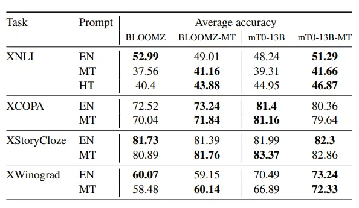 | Comparison between EN (English), MT (machine-translated) and HT (human-translated) prompts for 176B BLOOMZ and 13B mT0 models finetuned on either only English or English and machine-translated multilingual prompts (-MT). |
| 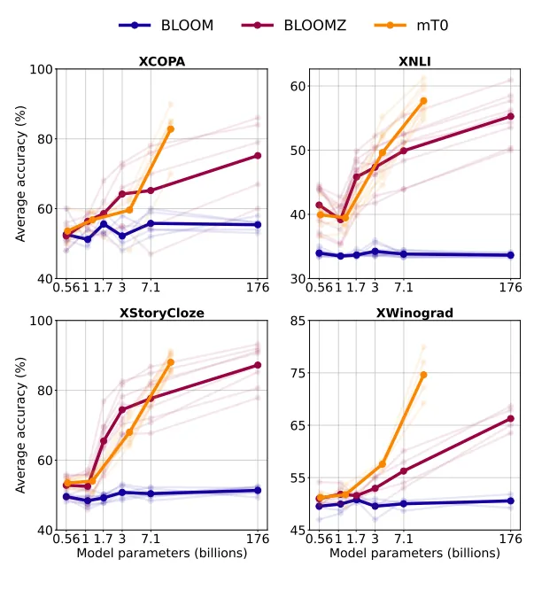 | Aggregate performance vs. size. Transparent lines correspond to individual languages, while thick lines are average accuracy scores. |
| 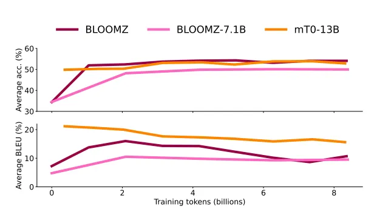 | Validation performance during training on natural language understanding (NLU) and natural language generation (NLG) tasks. |
| 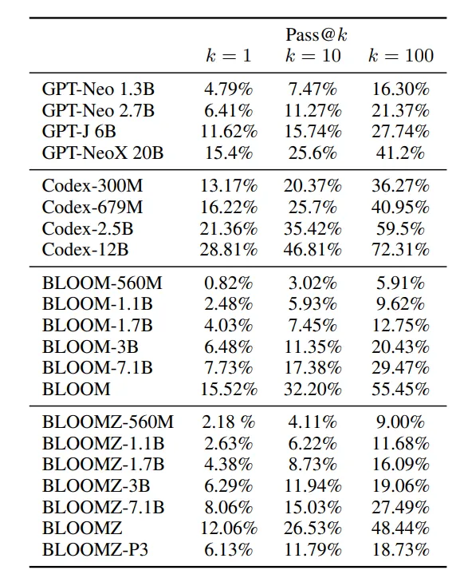 | Code continuation on HumanEval. |
| 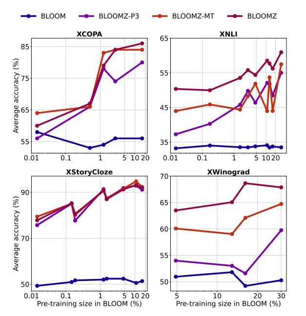 | Performance across languages by size in the BLOOM pretraining corpus, ROOTS. |
## Related

- [[Papers Explained Corpus]]
- [[Large Language Models]]
- [[Multilingual Models]]
- [[Code Models]]
- [[Supervised Fine-Tuning]]
- [[Papers Explained 98 - OLMo]]
- [[Papers Explained 100 - CLIP]]

#summary #topic
