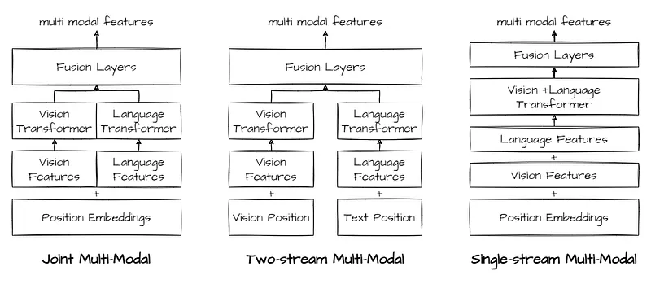
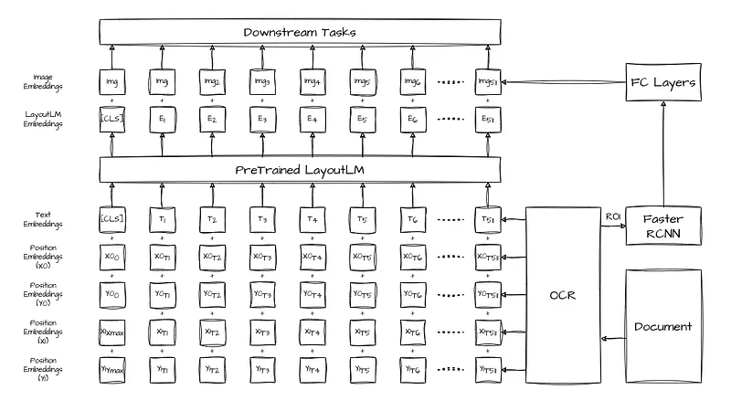
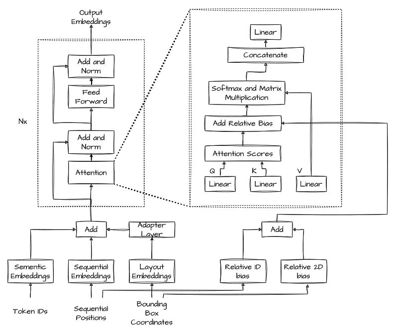
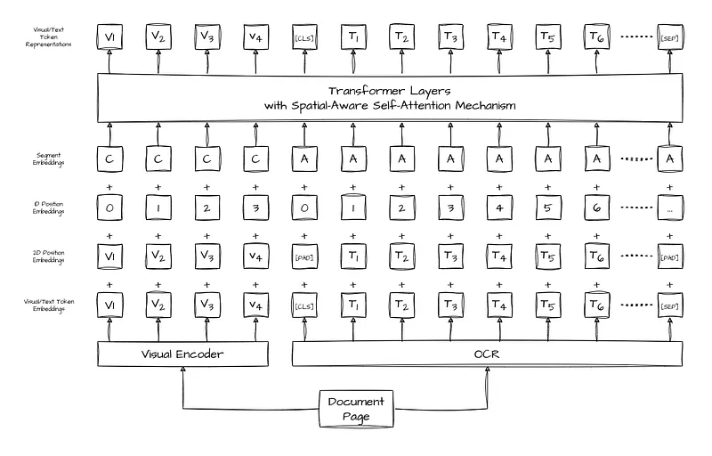
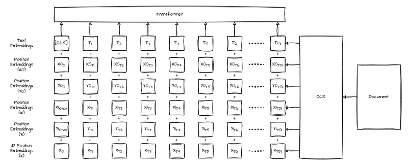
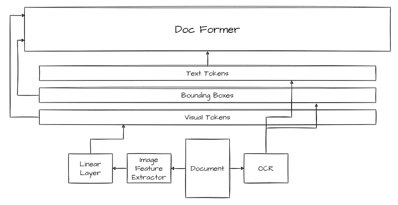
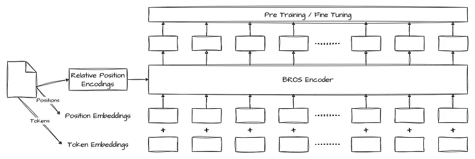
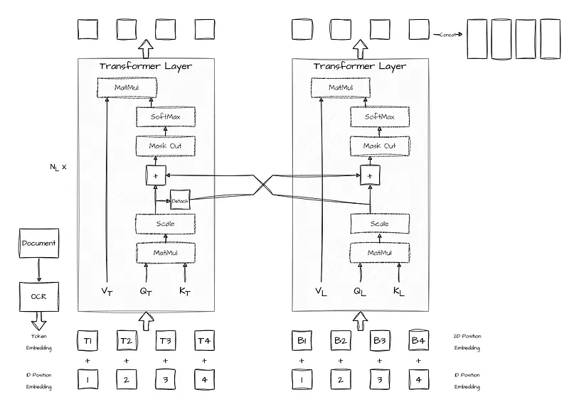
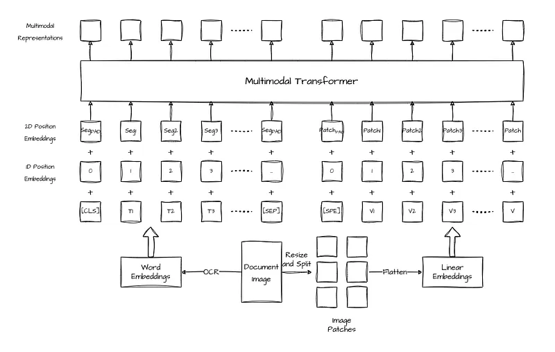
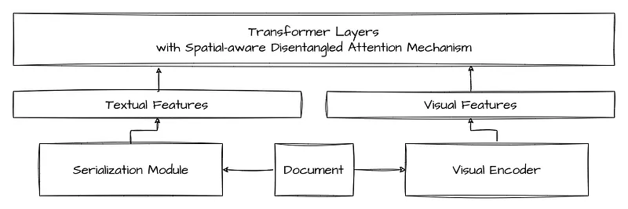

# Papers Explained Review 02 - Layout Transformers

[LayoutLM: Pre-training of Text and Layout for Document Image Understanding](https://arxiv.org/abs/1912.13318)

This page ingests the source article into the wiki and connects it to [[Papers Explained Corpus]], [[Document AI]], [[Large Language Models]], [[Vision Language Models]], [[Embedding and Retrieval]].

## Source Metadata

- Source file: `raw/2023-02-07_Papers-Explained-Review-02--Layout-Transformers-b2d165c94ad5.md`
- Source title: Papers Explained Review 02: Layout Transformers
- Published: 2023-02-07
- Canonical: [https://medium.com/@ritvik19/papers-explained-review-02-layout-transformers-b2d165c94ad5](https://medium.com/@ritvik19/papers-explained-review-02-layout-transformers-b2d165c94ad5)

## Key Ideas

- LayoutLM utilises the BERT architecture as the backbone and adds two new input embeddings: a 2-D position embedding and an image embedding (Only for downstream tasks).
- LayoutLM model is pre-trained on the IIT-CDIP Test Collection for the following tasks:
- Masked Visual-Language Modeling: randomly mask some of the input tokens but keep the corresponding 2-D position embeddings, and then the model is trained to predict the masked tokens given the contexts.
- Multi-label Document Classification: Given a set of scanned documents, we use the document tags to supervise the pre-training process so that the model can cluster the knowledge from different domains and generate better document-level representation.
- For further details refer to my article about [LayoutLM](https://ritvik19.medium.com/papers-explained-10-layout-lm-32ec4bad6406).

## Notes

## Table of Contents

- [LayoutLM (Dec 2019)](#6463)

- [LAMBERT (Feb 2020)](#035c)

- [LayoutLMv2 (Dec 2020)](#82a2)

- [StructuralLM (May 2021)](#c726)

- [DocFormer (Jun 2021)](#bf13)

- [BROS (Aug 2021)](#eaf8)

- [LiLT (Feb 2022)](#c726)

- [LayoutLMv3 (Apr 2022)](#3f0b)

- [ERNIE Layout (Oct 2022)](#c2a3)

## LayoutLM

[LayoutLM: Pre-training of Text and Layout for Document Image Understanding](https://arxiv.org/abs/1912.13318)

### Architecture

LayoutLM utilises the BERT architecture as the backbone and adds two new input embeddings: a 2-D position embedding and an image embedding (Only for downstream tasks).

### PreTraining

LayoutLM model is pre-trained on the IIT-CDIP Test Collection for the following tasks:

- Masked Visual-Language Modeling: randomly mask some of the input tokens but keep the corresponding 2-D position embeddings, and then the model is trained to predict the masked tokens given the contexts.

- Multi-label Document Classification: Given a set of scanned documents, we use the document tags to supervise the pre-training process so that the model can cluster the knowledge from different domains and generate better document-level representation.

For further details refer to my article about [LayoutLM](https://ritvik19.medium.com/papers-explained-10-layout-lm-32ec4bad6406).

[Back to Top](#6e9f)

## LAMBERT

[LAMBERT: Layout-Aware (Language) Modeling for information extraction](https://arxiv.org/abs/2002.08087v5)

### Architecture

LAMBERT introduces a simple new approach to the problem of understanding documents where non-trivial layout influences the local semantics. LAMBERT is a modification the Transformer encoder architecture in a way that allows it to use layout features obtained from an OCR system, without the need to re-learn language semantics from scratch. We only augment the input of the model with the coordinates of token bounding boxes, avoiding, in this way, the use of raw images. This leads to a layout-aware language model which can then be fine-tuned on downstream tasks.

### PreTraining

LAMBERT is trained on a collection of PDFs extracted from Common Crawl made up of a variety of documents, totaling to approximately 315k documents (3.12M pages) on a masked language modeling objective.

For further details refer to my article about [LAMBERT](https://ritvik19.medium.com/papers-explained-41-lambert-8f52d28f20d9).

[Back to Top](#6e9f)

## LayoutLMv2

[LayoutLMv2: Multi-modal Pre-training for Visually-Rich Document Understanding](https://arxiv.org/abs/2012.14740)

### Architecture

LayoutLMv2 uses a multi-modal Transformer model, similar to UniLMv2, to integrate the document text, layout, and visual information in the pre-training stage, which learns the cross-modal interaction end-to-end in a single framework. Meanwhile, a spatial-aware self-attention mechanism is integrated into the Transformer architecture.

### PreTraining

LayoutLMv2 model is pre-trained on the IIT-CDIP Test Collection for the following tasks:

- Masked Visual-Language Modeling

- Text-Image Alignment: some tokens lines are randomly selected, and their image regions are covered on the document image, a classification layer is built above the encoder outputs, which predicts a label for each text token depending on whether it is covered or not

- Text-Image Matching: We feed the output representation at CLS token into a classifier to predict whether the image and text are from the same document page. It is applied to help the model learn the correspondence between document image and textual content.

For further details refer to my article about [LayoutLMv2](https://ritvik19.medium.com/papers-explained-11-layout-lm-v2-9531a983e659).

[Back to Top](#6e9f)

## StructuralLM

[StructuralLM: Structural Pre-training for Form Understanding](https://arxiv.org/abs/2105.11210)

### Architecture

Given a set of tokens from different cells and the layout information of cells, the cell level input embeddings are computed by summing the corresponding word embeddings, cell-level 2Dposition embeddings, and original 1D-position embeddings. Then, these input embeddings are passed through a bidirectional Transformer encoder that can generate contextualized representations with an attention mechanism.

### PreTraining

StruturalLM model is pre-trained on the IIT-CDIP Test Collection for the following tasks:

- Cell Position Classification: First, we split the image into N areas of the same size. Then we calculate the area to which the cell belongs to through the center 2D-position of the cell. Meanwhile, some cells are randomly selected, and the 2D-positions of tokens in the selected cells are replaced with (0; 0; 0; 0). A classification layer is built above the encoder outputs. This layer predicts a label [1,N] of the area where the selected cell is located, and computes the cross-entropy loss.

- Masked Visual-Language Modeling: We randomly mask some of the input tokens but keep the corresponding cell-level position embeddings, and then the model is pre-trained to predict the masked tokens. Compared with the MVLM in LayoutLM, StructuralLM makes use of the cell-level layout information and predicts the mask tokens more accurately.

For further details refer to my article about [StruturalLM](https://ritvik19.medium.com/papers-explained-23-structural-lm-36e9df91e7c1).

[Back to Top](#6e9f)

## DocFormer

[DocFormer: End-to-End Transformer for Document Understanding](https://arxiv.org/abs/2106.11539)

### Architecture

Joint Multi-Modal: VL-BERT, LayoutLMv2, VisualBERT, MMBT]: In this type of architecture, vision and text are concatenated into one long sequence which makes transformers self-attention hard due to the cross-modality feature correlation referenced in the introduction.

Two-Stream Multi-Modal: CLIP, VilBERT: It is a plus that each modality is a separate branch which allows one to use an arbitrary model for each branch. However, text and image interact only at the end which is not ideal. It might be better to do early fusion.

Single-stream Multi-Modal: treats vision features also as tokens (just like language) and adds them with other features. Combining visual features with language tokens this way (simple addition) is unnatural as vision and language features are different types of data.

Discrete MultiModal: DocFormer unties visual, text and spatial features. i.e. spatial and visual features are passed as residual connections to each transformer layer. In each transformer layer, visual and language features separately undergo self-attention with shared spatial features

### PreTraining

Multi-Modal Masked Language Modeling (MMMLM): This is a modification of the original masked language modeling. i.e. for a text sequence t, a corrupted sequence is generated et. The transformer encoder predicts tˆ and is trained with an objective to reconstruct entire sequence.

We intentionally do not mask visual regions corresponding to [MASK] text. This is to encourage visual features to supplement text features and thus minimize the text reconstruction loss.

Learn To Reconstruct (LTR): This task is similar to an auto-encoder image reconstruction but with multi-modal features. The intuition is that in the presence of both image and text features, the image reconstruction would need the collaboration of both modalities.

Text Describes Image (TDI): In this task, we try to teach the network if a given piece of text describes a document image. For this, we pool the multi-modal features using a linear layer to predict a binary answer. In a batch, 80% of the time the correct text and image are paired, for the remaining 20% the wrong image is paired with the text.

For further details refer to my article about [DocFormer](https://ritvik19.medium.com/papers-explained-30-docformer-228ce27182a0).

[Back to Top](#6e9f)

## BROS

[BROS: A Pre-trained Language Model Focusing on Text and Layout for Better Key Information Extraction from Documents](https://arxiv.org/abs/2108.04539)

### Architecture

The main structure of BROS follows LayoutLM, but there are two critical advances:

LayoutLM simply encodes absolute x- and y-axis positions to each text blocks but the specific-point encoding is not robust on the minor position changes of text blocks. Instead, BROS employs relative positions between text blocks to explicitly encode spatial relations.

Use of more advanced 2D pre-training objectives designed for text blocks on 2D space.

### PreTraining

TMLM randomly masks tokens while keeping their spatial information, and then the model predicts the masked tokens with the clues of spatial information and the other un-masked tokens. The process is identical to MLM of BERT and MVLM of LayoutLM.

AMLM masks all text blocks allocated in a randomly chosen area. It can be interpreted as a span masking for text blocks in 2D space. Specifically, AMLM consists of the following four steps: (1) randomly selects a text block, (2) identifies an area by expanding the region of the text block, (3) determines text blocks allocated in the area, and (4) masks all tokens of the text blocks and predicts them.

For further details refer to my article about [BROS](https://ritvik19.medium.com/papers-explained-246-bros-1f1127476f73).

[Back to Top](#6e9f)

## LiLT

[LiLT: A Simple yet Effective Language-Independent Layout Transformer for Structured Document Understanding](https://arxiv.org/abs/2202.13669)

### Architecture

LiLT uses a parallel dual-stream Transformer. Given an input document image, first an off-the-shelf OCR engine is used to get text bounding boxes and contents. Then, the text and layout information are separately embedded and fed into the corresponding Transformer-based architecture to obtain enhanced features. Bi-directional attention complementation mechanism (BiACM) is introduced to accomplish the cross-modality interaction of text and layout clues. Finally, the encoded text and layout features are concatenated

### PreTraining

LiLT model is pre-trained on the IIT-CDIP Test Collection for the following tasks:

- Masked Visual-Language Modeling: MVLM improves model learning on the language side with cross-modality information. The given layout embedding can also help the model better capture both inter- and intra-sentence relationships.

- Key Point Location: KPL equally divides the entire layout into several regions (7×7=49 regions by default) and randomly masks some of the input bounding boxes. The model is required to predict which regions the key points (top-left corner, bottom-right corner, and center point) of each box belong to using separate heads.
KPL makes the model to fully understand the text content and know where to put a specific word/sentence when the surrounding ones are given.

- Cross-modal Alignment Identification: CMAI collects those encoded features of token-box pairs that are masked by MVLM and KPL, and build an additional head upon them to identify whether each pair is aligned.
CMAI makes the model to learn the cross-modal perception capacity.

For further details refer to my article about [LiLT](https://ritvik19.medium.com/papers-explained-12-lilt-701057ec6d9e).

[Back to Top](#6e9f)

## LayoutLMv3

[LayoutLMv3: Pre-training for Document AI with Unified Text and Image Masking](https://arxiv.org/abs/2204.08387)

### Architecture

LayoutLMv3 applies a unified text-image multimodal Transformer to learn cross-modal representations. The Transformer has a multilayer architecture and each layer mainly consists of multi-head self-attention and position-wise fully connected feed-forward networks. The input of Transformer is a concatenation of text embedding Y = y1:𝐿 and image embedding X = x1:𝑀 sequences, where 𝐿 and 𝑀 are sequence lengths for text and image respectively. Through the Transformer, the last layer outputs text-and-image contextual representations. LayoutLMv3
is initialized from the pre-trained weights of RoBERTa

### PreTraining

LayoutLMv3 model is pre-trained on the IIT-CDIP Test Collection for the following tasks:

- Masked Language Modeling (MLM): 30% of text tokens are masked with a span masking strategy with span lengths drawn from a Poisson distribution (𝜆 = 3). The pre-training objective is to maximize the log-likelihood of the correct masked text tokens y𝑙 based on the contextual representations of corrupted sequences of image tokens X𝑀′ and text tokens Y𝐿′, where 𝑀′ and 𝐿′ represent the masked positions. As the layout informationis kept unchanged, this objective facilitates the model to learn the correspondence between layout information and text and image context.

- Masked Image Modelling (MIM): The MIM objective is a symmetry to the MLM objective, about 40% image tokens are randomly masked with the blockwise masking strategy. The MIM objective is driven by a cross-entropy loss to reconstruct the masked image tokens x𝑚 under the context of their surrounding text and image tokens. MIM facilitates learning high-level layout structures rather than noisy low-level details.

- Word-Patch Alignment (WPA): The WPA objective is to predict whether the corresponding image patches of a text word are masked. Specifically, an aligned label is assigned to an unmasked text token when its corresponding image tokens are also unmasked. Otherwise, an unaligned label is assigned. The masked text tokens are excluded when calculating WPA loss to prevent the model from learning a correspondence between masked text words and image patches.

For further details refer to my article about [LayoutLMv3](https://ritvik19.medium.com/papers-explained-13-layout-lm-v3-3b54910173aa).

[Back to Top](#6e9f)

## ERNIE Layout

[ERNIE-Layout: Layout Knowledge Enhanced Pre-training for Visually-rich Document Understanding](https://arxiv.org/abs/2210.06155)

### Architecture

Given a document, ERNIE-Layout rearranges the token sequence with the layout knowledge and extracts visual features from the visual encoder. The
textual and layout embeddings are combined into textual features through a linear projection, and similar operations are executed for visual embeddings. Next, these features are concatenated and fed into the stacked multi-modal transformer layers, which are equipped with the spatial aware disentangled attention mechanism.

### Pre Training

Reading Order Prediction: To make the model understand the relationship between layout knowledge and reading order and still work well when receiving input in inappropriate order, we give Aˆ ij an additional meaning, i.e., the probability that the j-th token is the next token of the i-th token. Besides, the ground truth is a 0–1 matrix G, where 1 indicates that there is a reading order relationship between the two tokens and vice versa. For the end position, the next token is itself. In pre-training, we calculate the loss with Cross-Entropy.

Replaced Region Prediction: To enable the model perceive fine-grained correspondence between image patches and text, with the help of layout knowledge, Specifically, 10% of the patches are randomly selected and replaced with a patch from another image, the processed image is encoded by the visual encoder and input into the multi-modal transformer. Then, the [CLS] vector output by the transformer is used to predict which patches are replaced.

Masked Visual-Language Modeling

Text-Image Alignment

For further details refer to my article about [ERNIE Layout](https://ritvik19.medium.com/papers-explained-24-ernie-layout-47a5a38e321b).

[Back to Top](#6e9f)

## References

- [LayoutLM: Pre-training of Text and Layout for Document Image Understanding](https://arxiv.org/abs/1912.13318)

- [LayoutLMv2: Multi-modal Pre-training for Visually-Rich Document Understanding](https://arxiv.org/abs/2012.14740)

- [StructuralLM: Structural Pre-training for Form Understanding](https://arxiv.org/abs/2105.11210)

- [DocFormer: End-to-End Transformer for Document Understanding](https://arxiv.org/abs/2106.11539)

- [BROS: A Pre-trained Language Model Focusing on Text and Layout for Better Key Information Extraction from Documents](https://arxiv.org/abs/2108.04539)

- [LiLT: A Simple yet Effective Language-Independent Layout Transformer for Structured Document Understanding](https://arxiv.org/abs/2202.13669)

- [LayoutLMv3: Pre-training for Document AI with Unified Text and Image Masking](https://arxiv.org/abs/2204.08387)

- [ERNIE-Layout: Layout Knowledge Enhanced Pre-training for Visually-rich Document Understanding](https://arxiv.org/abs/2210.06155)

## Figures

Figures from the Medium HTML export (`raw/2023-02-07_Papers-Explained-Review-02--Layout-Transformers-b2d165c94ad5.md`); local copies under `wiki/assets/papers-explained-review-02-layout-transformers/` when download succeeded.

| Figure | Caption |
|--------|---------|
|  | Title card: Layout Transformers. |
|  | LayoutLM: Pre-training of Text and Layout for Document Image Understanding. |
|  | Back to Top. |
|  | Back to Top. |
|  | Back to Top. |
|  | Back to Top. |
|  | Back to Top. |
|  | Back to Top. |
|  | Back to Top. |
|  | Back to Top. |
## Related

- [[Papers Explained Corpus]]
- [[Document AI]]
- [[Large Language Models]]
- [[Vision Language Models]]
- [[Embedding and Retrieval]]
- [[Papers Explained 23 - Structural LM]]
- [[Papers Explained Review 03 - RCNNs]]

#summary #topic
