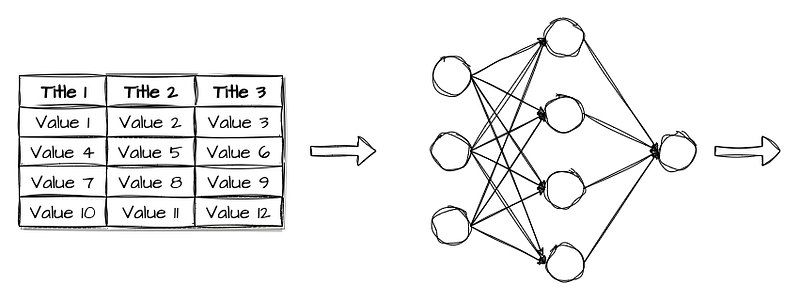
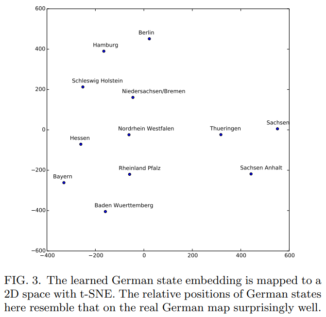
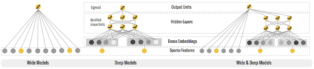
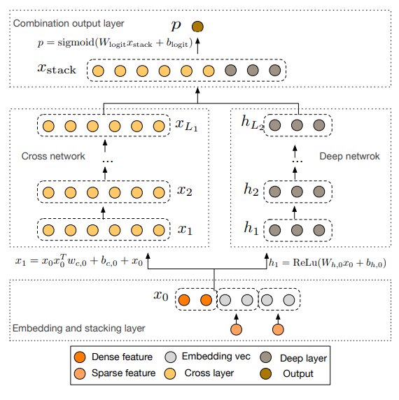
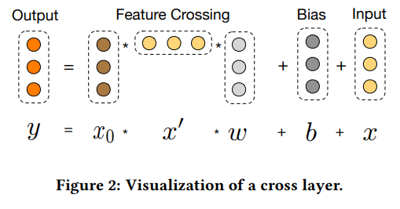
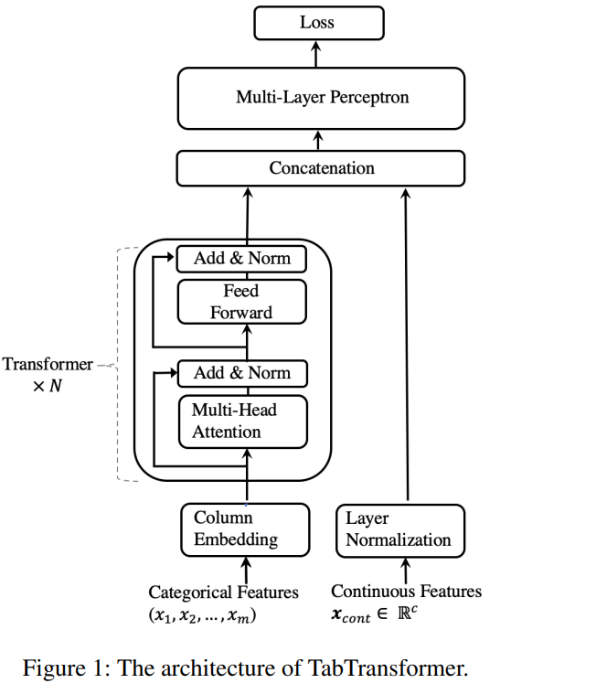
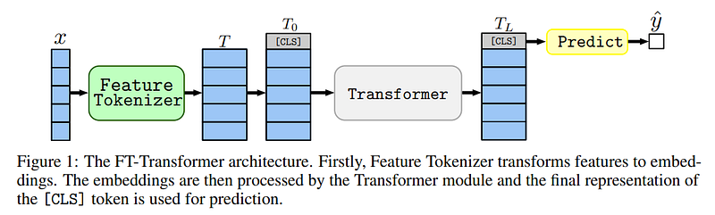
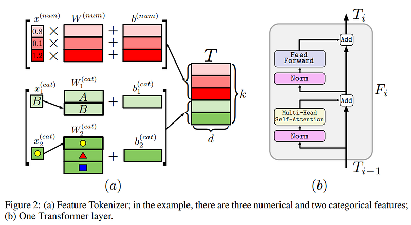
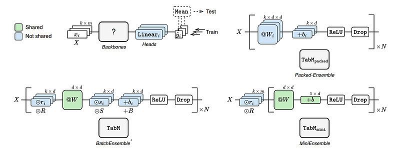
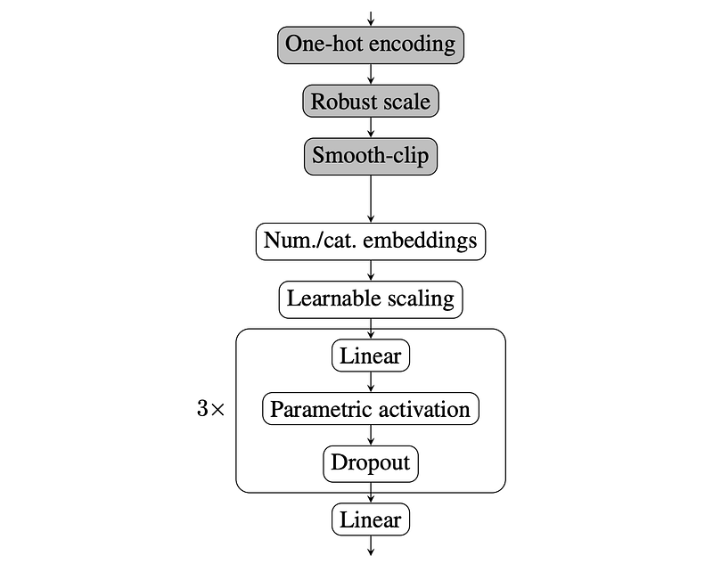

# Papers Explained Review 04 - Tabular Deep Learning

Neural networks are not as prominent when dealing with machine learning problems with structured data. This can be easily seen by the fact that the top teams in many online machine learning competitions like those hosted on Kaggle use tree based methods more often than neural networks.

This page ingests the source article into the wiki and connects it to [[Papers Explained Corpus]], [[Embedding and Retrieval]].

## Source Metadata

- Source file: `raw/2023-03-01_Papers-Explained-Review-04--Tabular-Deep-Learning-776db04f965b.html`
- Source title: Papers Explained Review 04: Tabular Deep Learning
- Published: 2023-03-01
- Canonical: [https://medium.com/@ritvik19/papers-explained-review-04-tabular-deep-learning-776db04f965b](https://medium.com/@ritvik19/papers-explained-review-04-tabular-deep-learning-776db04f965b)

## Key Ideas

- [Entity Embeddings of Categorical Variables](https://arxiv.org/abs/1604.06737)
- Neural networks are not as prominent when dealing with machine learning problems with structured data.
- In principle a neural network can approximate any continuous function and piece wise continuous function. However, it is not suitable to approximate arbitrary non-continuous functions as it assumes certain level of continuity in its general form.
- On the other hand decision trees do not assume any continuity of the feature variables and can divide the states of a variable as fine as necessary.
- Interestingly the problems we usually face in nature are often continuous if we use the right representation of data. Whenever we find a better way to reveal the continuity of the data we increase the power of neural networks to learn the data.

## Notes

## Table of Contents

- [Entity Embeddings](#932e)

- [Tabular ResNet](#46af)

- [Wide and Deep Learning](#bfdc)

- [Deep and Cross Network](#0017)

- [Tab Transformer](#48c4)

- [Feature Tokenizer Transformer](#1ab8)

- [TabM](#db36)

- [RealMLP](#3cf9)

## Entity Embeddings

[Entity Embeddings of Categorical Variables](https://arxiv.org/abs/1604.06737)

Neural networks are not as prominent when dealing with machine learning problems with structured data. This can be easily seen by the fact that the top teams in many online machine learning competitions like those hosted on Kaggle use tree based methods more often than neural networks.

In principle a neural network can approximate any continuous function and piece wise continuous function. However, it is not suitable to approximate arbitrary non-continuous functions as it assumes certain level of continuity in its general form. During the training phase the continuity of the data guarantees the convergence of the optimization, and during the prediction phase it ensures that slightly changing the values of the input keeps the output stable.

On the other hand decision trees do not assume any continuity of the feature variables and can divide the states of a variable as fine as necessary.

Interestingly the problems we usually face in nature are often continuous if we use the right representation of data. Whenever we find a better way to reveal the continuity of the data we increase the power of neural networks to learn the data.

For example, convolutional neural networks group pixels in the same neighborhood together. This increases the continuity of the data compared to simply representing the image as a flattened vector of all the pixel values of the images.

The rise of neural networks in natural language processing is based on the word embedding which puts words with similar meaning closer to each other in a word space thus increasing the continuity of the words compared to using one-hot encoding of words.

Unlike unstructured data found in nature, structured data with categorical features may not have continuity at all and even if it has it may not be so obvious.

To learn the approximation of the function we map each state of a discrete variable to a vector, This mapping is equivalent to an extra layer of linear neurons on top of the one-hot encoded input.

The main goal of entity embedding is to map similar categories close to each other in the embedding space.

In the experiments we use both one-hot encoding and entity embedding to represent input features of neural networks. We use two fully connected layers (1000 and 500 neurons respectively) on top of either the embedding layer or directly on top of the one-hot encoding layer. The fully connected layer uses ReLU activation function. The output layer contains one neuron with sigmoid activation function. No dropout is used as we found that it did not improve the result.

[Back to Top](#a800)

## Tabular ResNet

[Revisiting Deep Learning Models for Tabular Data](https://arxiv.org/abs/2106.11959)

Given ResNet’s success story in computer vision, the idea is to construct a simple variation of ResNet for Tabular Data. The main building block is simplified compared to the original architecture, and there is an almost clear path from the input to output which we find to be beneficial for the optimization. Overall, we expect this architecture to outperform MLP on tasks where deeper representations can be helpful.

[Back to Top](#a800)

## Wide and Deep Learning

[Wide & Deep Learning](https://ai.googleblog.com/2016/06/wide-deep-learning-better-together-with.html)

The human brain is a sophisticated learning machine, forming rules by memorizing everyday events and generalizing those learnings to apply to things we haven’t seen before. Perhaps more powerfully, memorization also allows us to further refine our generalized rules with exceptions.

By jointly training a wide linear model (for memorization) alongside a deep neural network (for generalization), one can combine the strengths of both to bring us one step closer. This is the premise of Wide and Deep Learning.

It’s useful for generic large-scale regression and classification problems with sparse inputs (categorical features with a large number of possible feature values), such as recommender systems, search, and ranking problems.

[Back to Top](#a800)

## Deep and Cross Network

[Deep & Cross Network for Ad Click Predictions](https://arxiv.org/abs/1708.05123)

Feature engineering has been the key to the success of many prediction models. However, the process is nontrivial and often requires manual feature engineering or exhaustive searching. DNNs are able to automatically learn feature interactions; however, they generate all the interactions implicitly, and are not necessarily efficient in learning all types of cross features.

DCN explicitly applies feature crossing at each layer, requires no manual feature engineering, and adds negligible extra complexity to the DNN model.

To reduce the dimensionality, we employ an embedding procedure to transform the one hot features into dense vectors of real values (Entity Embeddings).

The cross network is composed of cross layers, with each layer having the following formula:

This special structure of the cross network causes the degree of cross features to grow with layer depth. Œe highest polynomial degree (in terms of input x0) for an l-layer cross network isl +1.

A combination layer concatenates the outputs from two networks and feed the concatenated vector into a standard logits layer.

[Back to Top](#a800)

## TabTransformer

[TabTransformer: Tabular Data Modeling Using Contextual Embeddings](https://arxiv.org/abs/2012.06678)

The TabTransformer is built upon self-attention based Transformers. The Transformer layers transform the embeddings of categorical features into robust contextual embeddings to achieve higher prediction accuracy.

The contextual embeddings learned from TabTransformer are highly robust against both missing and noisy data features, and provide better interpretability.

The tree-based models have several limitations in comparison to deep learning models.

- They are not suitable for continual training from streaming data, and do not allow efficient end-to-end learning of image/text encoders in presence of multi-modality along with tabular data.

- In their basic form they are not suitable for state-of-the-art semi-supervised learning methods.

The MLPs usually learn parametric embeddings to encode categorical data features. But due to their shallow architecture and context-free embeddings, they have the following limitations:

- neither the model nor the learned embeddings are interpretable

- it is not robust against missing and noisy data

- for semi-supervised learning, they do not achieve competitive performance. Most importantly, MLPs do not match the performance of tree-based models such as GBDT on most of the datasets.

Motivated by the successful applications of Transformers in NLP, we adapt them in tabular domain. In particular, TabTransformer applies a sequence of multi-head attention-based Transformer layers on parametric embeddings to transform them into contextual embeddings, bridging the performance gap between baseline MLP and GBDT models.

Setup: For the TabTransformer, the hidden (embedding) dimension, the number of layers and the number of attention heads are fixed to 32, 6, and 8 respectively. The MLP layer sizes are set to {4 × l, 2 × l}, where l is the size of its input.

[Back to Top](#a800)

## Feature Tokenizer Transformer

[Revisiting Deep Learning Models for Tabular Data](https://arxiv.org/abs/2106.11959)

In a nutshell, FT-Transformer model transforms all features (categorical and numerical) to embeddings and applies a stack of Transformer layers to the embeddings. Thus, every Transformer layer operates on the feature level of one object.

[Back to Top](#a800)

## TabM

[TabM: Advancing Tabular Deep Learning with Parameter-Efficient Ensembling](https://arxiv.org/abs/2410.24210)

TabM is designed to make multiple predictions by representing an ensemble of k MLPs. Unlike conventional deep ensembles, TabM’s k MLPs are trained in parallel and share most of their weights by default, leading to improved performance and efficiency.

The foundational architecture for TabM is an MLP, defined as:

MLP(x) = Linear(BlockN(…(Block1(x)))) where Blocki(x)

= Dropout(ReLU(Linear((x)))).

The development of TabM involved several iterative steps, each introducing improvements in performance and efficiency:

MLP×k (Traditional Deep Ensemble):

- Consists of k independently trained MLPs. Hyperparameters are tuned for a single MLP, and training is stopped based on individual validation scores.

- Already showed better and more stable results than attention-based baselines like FT-Transformer.

- Not optimized for the ensemble’s overall performance; individual stopping and tuning can be suboptimal for the combined ensemble.

TabMpacked (MLP + Packed-Ensemble):

- Implements k MLPs as one large model using Packed-Ensemble. Architecturally equivalent to MLP×k (no weight sharing), but critically, it processes k inputs in parallel.

- Enables monitoring the ensemble’s performance during training and stopping training when optimal for the whole ensemble, allowing for ensemble-aware hyperparameter tuning.

- Delivers significantly better performance compared to MLP×k.

- Runtime overhead is noticeably less than k due to parallel execution, but the model size overhead is still k.

TabMnaive (MLP + BatchEnsemble):

- Reduces the size of TabMpacked by applying BatchEnsemble for weight sharing. Its architecture (but not initialization) is equivalent to the final TabM.

- Injects “adapters” (non-shared weights R, S, B) into the linear layers of the shared MLP backbone.

- ℓi(xi)=(ri⊙(W(si⊙xi)))+bi

- Surprisingly, TabMnaive shows higher performance than TabMpacked. This indicates that constraining the ensemble with weight sharing acts as a highly effective regularization technique for tabular tasks.

- By construction, it has 3N adapters (R, S, and B in each of the N blocks).

TabMbad:

- A variant of TabMnaive where the very first adapter (the first R in the first linear layer) is removed, while the remaining 3N-1 adapters are untouched.

- Exhibits worse performance than TabMnaive, highlighting the criticality of this initial adapter.

TabMmini (MLP + MiniEnsemble):

- The “minimal” version of TabM. It keeps only the very first adapter of TabMnaive and removes the remaining 3N-1 adapters.

- Informally, this adapter maps the k inputs from a single representation space to k different representation spaces before feature mixing.

- Performs even slightly better than TabMnaive, despite having significantly fewer parameters (only one adapter instead of 3N).

TabM (Final Version):

- Reverts to the architecture of TabMnaive (with all 3N adapters) but incorporates a “better initialization” strategy. All multiplicative adapters R and S, except for the very first one, are initialized deterministically with 1.

- At initialization, the deterministically initialized adapters have no effect, making the model behave like TabMmini. However, these adapters are free to learn and add more expressivity during training.

- Demonstrated to be the best performing variation among all tested TabM variants.

[Back to Top](#a800)

## RealMLP

[Better by Default: Strong Pre-Tuned MLPs and Boosted Trees on Tabular Data](https://arxiv.org/abs/2407.04491)

RealMLP is an improved Multilayer Perceptron (MLP) designed for classification and regression on tabular data, featuring strong meta-tuned default parameters. It incorporates a “bag of tricks” across its architecture, training, preprocessing, hyperparameters, and initialization.

Before data enters the neural network, RealMLP applies specific preprocessing steps:

Categorical Encoding:

- One-hot encoding is applied to categorical columns with at most eight distinct values (excluding missing values).

- Binary categories are encoded to a single feature with values {-1, 1}.

- Missing values in categorical columns are encoded to zero.

Numerical Preprocessing: All numerical columns, including the one-hot encoded ones, are preprocessed independently.

Robust Scaling / Min-Max Scaling:

- If q3/4 != q1/4 (interquartile range is non-zero), it applies a RobustScaler-like transformation: sj * (xj - q1/2) / (q3/4 - q1/4).

- If q3/4 = q1/4 and q1 != q0 (all values are the same but not zero), it applies a MinMaxScaler-like transformation: sj * (xj - q1/2) / (q1 - q0).

- Otherwise (all values are zero or undefined), sj is 0.

Smooth Clipping: After scaling, the values are passed through a smooth clipping function f(x) := x / sqrt(1 + (x/3)^2), which clips the input to the range (-3, 3). This prevents large outliers from overly influencing the result.

RealMLP-TD is fundamentally an MLP with three hidden layers, each containing 256 neurons, augmented with several key additions and modifications:

Categorical Embedding Layers: Used to embed categorical features with cardinality greater than 8.

PBLD (Periodic Bias Linear DenseNet) Embeddings:

- Applied to numerical features (excluding one-hot encoded ones).

- Concatenates the original numerical value xi with "PL embeddings" proposed by Gorishniy et al. [16].

- Uses a different periodic embedding with biases.

- Applies separate small two-layer MLPs to each feature xi to compute the embedding: (xi, W(2,i)emb * cos(2πw(1,i)emb * xi + b(1,i)emb) + b(2,i)emb).

- For efficiency, 4-dimensional embeddings are used.

Scaling Layer:

- Introduced before the first linear layer.

- It’s a matrix-vector product with a diagonal weight matrix, effectively computing xi,out = si * xi,in with a learnable scaling factor si for each feature i.

- A larger learning rate is used for this layer.

Neural Tangent Parametrization (NTP) for Linear Layers:

- Linear layers compute z(l+1) = W(l)x(l) + b(l) but with a scaling factor 1/sqrt(dl), where dl is the dimension of the layer input x(l).

- This modifies the learning rate for weight matrices based on input dimension, aiming to prevent excessively large steps when the number of columns is high.

Parametric Activation Functions:

- Inspired by PReLU, these are defined as σαi(xi) = (1 - αi)xi + αiσ(xi), where αi are separate learnable parameters for each neuron.

- When αi = 1, it recovers the standard activation σ. When αi = 0, it becomes linear.

- SELU is used as the base activation σ for classification.

- Mish is used as the base activation σ for regression.

Dropout: Applied after each activation function. Alpha-dropout (for SELU) was not used due to poor results.

Regression Output Clipping: For regression tasks, at test time, the MLP outputs are clipped to the observed range during training. This is particularly helpful for suboptimal hyperparameters.

[Back to Top](#a800)

## References

- [Entity Embeddings of Categorical Variables](https://arxiv.org/abs/1604.06737)

- [Revisiting Deep Learning Models for Tabular Data](https://arxiv.org/abs/2106.11959)

- [Wide & Deep Learning](https://ai.googleblog.com/2016/06/wide-deep-learning-better-together-with.html)

- [Deep & Cross Network for Ad Click Predictions](https://arxiv.org/abs/1708.05123)

- [TabTransformer: Tabular Data Modeling Using Contextual Embeddings](https://arxiv.org/abs/2012.06678)

- [TabM: Advancing Tabular Deep Learning with Parameter-Efficient Ensembling](https://arxiv.org/abs/2410.24210)

- [Better by Default: Strong Pre-Tuned MLPs and Boosted Trees on Tabular Data](https://arxiv.org/abs/2407.04491)

## Figures

Figures from the Medium HTML export (`raw/2023-03-01_Papers-Explained-Review-04--Tabular-Deep-Learning-776db04f965b.html`); local copies under `wiki/assets/papers-explained-review-04-tabular-deep-learning/` when download succeeded.

| Figure | Caption |
|--------|---------|
|  | Title card: Tabular Deep Learning. |
|  | Entity Embeddings of Categorical Variables: Entity Embeddings of Categorical Variables. |
|  | Given ResNet’s success story in computer vision, the idea is to construct a simple variation of ResNet for Tabular Data. |
|  | Given ResNet’s success story in computer vision, the idea is to construct a simple variation of ResNet for Tabular Data. |
|  | Given ResNet’s success story in computer vision, the idea is to construct a simple variation of ResNet for Tabular Data. |
|  | Back to Top. |
|  | Back to Top. |
|  | The cross network is composed of cross layers, with each layer having the following formula. |
|  | This special structure of the cross network causes the degree of cross features to grow with layer depth. |
|  | Back to Top. |
|  | Back to Top. |
|  | Revisiting Deep Learning Models for Tabular Data: Back to Top. |
|  | Back to Top. |
|  | Back to Top. |
## Related

- [[Papers Explained Corpus]]
- [[Embedding and Retrieval]]
- [[TabFM]] — Google zero-shot tabular foundation model using in-context learning over full tables.
- [[Tabular In-Context Learning]] — ICL paradigm for tabular prediction.
- [[Papers Explained 32 - ColD Fusion]]
- [[Papers Explained 33 - ELMo]]

#summary #topic
