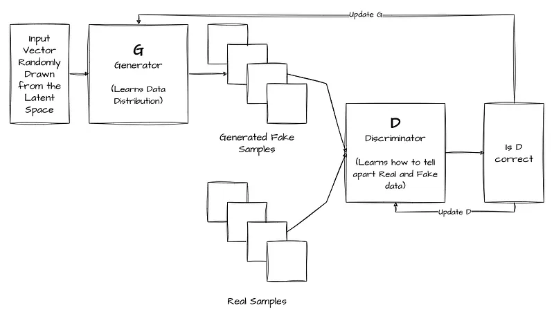
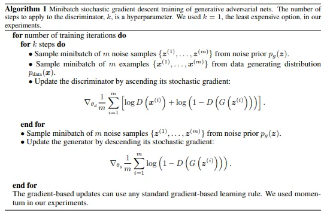
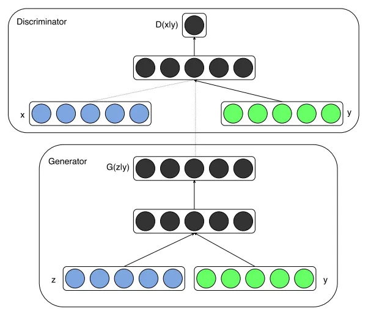
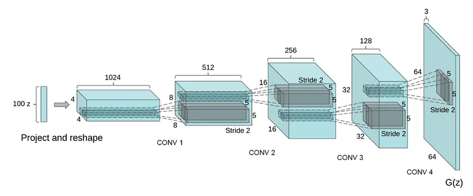
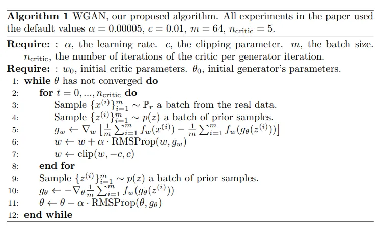
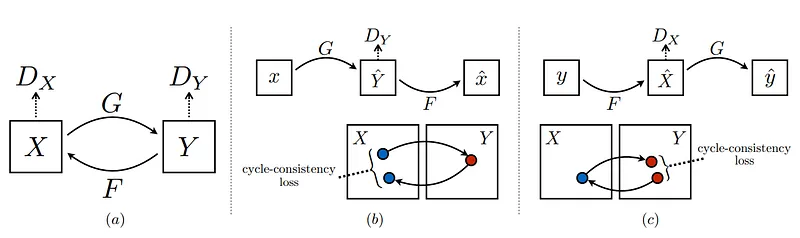
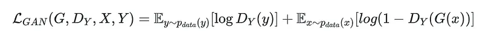
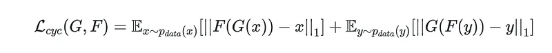
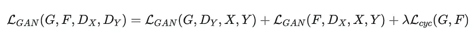
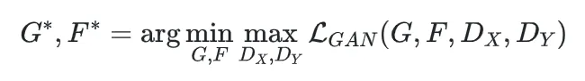

# Papers Explained Review 05 - Generative Adversarial Networks

Generative Adversarial Networks (GANs) are a class of machine learning models that consist of two components: a generator and a discriminator.

This page ingests the source article into the wiki and connects it to [[Papers Explained Corpus]], [[Embedding and Retrieval]]. For pedagogical walkthroughs with training code and demos, see [[GANs in Computer Vision: Introduction to Generative Learning]] (part 1), [[GANs in Computer Vision: Conditional Image Synthesis and 3D Object Generation]] (part 2), [[GANs in Computer Vision: Improved Training with Wasserstein Distance, Game Theory Control, and Progressively Growing Schemes]] (part 3), and [[GANs in Computer Vision: 2K Image and Video Synthesis, and Large-Scale Class-Conditional Image Generation]] (part 4: Pix2PixHD, BigGAN).

## Source Metadata

- Source file: `raw/2024-01-26_Papers-Explained-Review-05--Generative-Adversarial-Networks-bbb51b160d5e.md`
- Source title: Papers Explained Review 05: Generative Adversarial Networks
- Published: 2024-01-26
- Canonical: [https://medium.com/@ritvik19/papers-explained-review-05-generative-adversarial-networks-bbb51b160d5e](https://medium.com/@ritvik19/papers-explained-review-05-generative-adversarial-networks-bbb51b160d5e)

## Key Ideas

- [Generative Adversarial Networks (Jun 2014)](#7041)
- [Conditional Generative Adversarial Networks (Nov 2014)](#86aa)
- [Deep Convolutional Generative Adversarial Networks (Nov 2015)](#fe42)
- [Wasserstein Generative Adversarial Networks (Jan 2017)](#6f8f)
- [Generative Adversarial Networks](https://arxiv.org/abs/1406.2661)

## Notes

## Table of Contents

- [Generative Adversarial Networks (Jun 2014)](#7041)

- [Conditional Generative Adversarial Networks (Nov 2014)](#86aa)

- [Deep Convolutional Generative Adversarial Networks (Nov 2015)](#fe42)

- [Improved GAN (Jun 2016)](#9a55)

- [Wasserstein Generative Adversarial Networks (Jan 2017)](#6f8f)

- [Cycle GAN (Mar 2017)](#7f8b)

## Generative Adversarial Networks

*Figure: GAN Algorithm*

[Generative Adversarial Networks](https://arxiv.org/abs/1406.2661)

Generative Adversarial Networks (GANs) are a class of machine learning models that consist of two components: a generator and a discriminator. The main idea behind GANs is to train these two components simultaneously, with the generator learning to generate realistic data samples, and the discriminator learning to differentiate between real and fake samples.

### Architecture

- Generator: The generator takes random input, often called a latent vector or noise, and maps it to the data space. It transforms the random input into a complex output that resembles real data samples. The generator is typically designed as a deep neural network with multiple layers.

- Discriminator: The discriminator is another neural network that takes data samples as input and predicts whether they are real or fake. The goal of the discriminator is to accurately classify real and generated data samples.

### Training Process

- Initialization: The generator and discriminator networks are initialized with random weights.

- Data Preparation: A training dataset consisting of real data samples is collected. These samples can be images, text, audio, or any other type of data that the GAN aims to generate.

- Iterative Training: The training process of GANs involves alternating between two main steps: the generator step and the discriminator step.

- Generator Step:

- The generator takes a batch of random noise as input and generates a batch of fake samples.

- These fake samples are then passed to the discriminator for evaluation.

- The generator aims to generate fake samples that are indistinguishable from real samples, fooling the discriminator into classifying them as real.

- The generator’s weights are updated based on the feedback from the discriminator to improve its ability to generate realistic samples.

- Discriminator Step:

- The discriminator takes a batch of real samples from the training dataset and a batch of fake samples generated by the generator.

- It predicts the probability of each sample being real or fake.

- The discriminator’s weights are updated based on the feedback from the real and fake samples to improve its ability to correctly classify them.

- The generator and discriminator steps are repeated for multiple iterations, allowing both components to learn and improve their performance.

- The overall objective of the GAN is to find an equilibrium point where the generator produces realistic samples that the discriminator cannot distinguish from real samples.

### Loss Function

- The loss function plays a crucial role in GAN training.

- For the discriminator, the loss is typically the sum of two components: the loss associated with misclassifying real samples and the loss associated with misclassifying fake samples.

- The generator’s loss is computed based on the discriminator’s feedback. The generator aims to minimize the discriminator’s ability to distinguish between real and fake samples.

### Generating New Data

- Once the GAN is trained, the generator can be used to generate new data samples.

- Random noise is fed into the generator, which transforms it into a generated sample.

- The generated sample can be an image, a text paragraph, or any other type of data that the GAN was trained on.

- By adjusting the input noise, the generator can produce a wide variety of data samples.

[Back to Top](#d06a)

## Conditional Generative Adversarial Networks

*Figure: cGAN*

[Conditional Generative Adversarial Nets](https://arxiv.org/abs/1411.1784)

In Conditional GANs (cGANs), the generator and discriminator are conditioned on additional information, typically referred to as “conditional information” or “labels”. This conditioning allows the generator to generate samples based on specific attributes or classes.

Generative adversarial nets are extended to a conditional model conditioning both the generator and discriminator on some extra information y. y could be any kind of auxiliary information, such as class labels or data from other modalities. We can perform the conditioning by feeding y into the both the discriminator and generator as additional input layer.

In the generator the prior input noise, and y are combined in joint hidden representation, and the adversarial training framework allows for considerable flexibility in how this hidden representation is composed.

In the discriminator x and y are presented as inputs and to a discriminative function.

[Back to Top](#d06a)

## Deep Convolutional Generative Adversarial Networks

*Figure: DCGAN generator used for LSUN scene modeling*

[Unsupervised Representation Learning with Deep Convolutional Generative Adversarial Networks](https://arxiv.org/abs/1511.06434)

DCGANs are a specific type of GAN architecture that incorporates convolutional layers, making them well-suited for image generation tasks and have since become a popular choice for generating realistic and high-quality images.

DCGANs identified a family of architectures that resulted in stable training across a range of datasets and allowed for training higher resolution and deeper generative models.

Architecture guidelines for stable Deep Convolutional GANs:

- Replace any pooling layers with strided convolutions (discriminator) and fractional-strided convolutions (generator).

- Use batchnorm in both the generator and the discriminator.

- Remove fully connected hidden layers for deeper architectures.

- Use ReLU activation in generator for all layers except for the output, which uses Tanh.

- Use LeakyReLU activation in the discriminator for all layers

[Back to Top](#d06a)

## Improved GAN

[Improved Techniques for Training GANs](https://arxiv.org/abs/1606.03498)

This paper presents a variety of new architectural features and training procedures that can be applied to the generative adversarial networks (GANs) framework. All code and hyperparameters may be found at: [GitHub](https://github.com/openai/improved_gan).

Training GANs consists in finding a Nash equilibrium to a two-player non-cooperative game. Each player wishes to minimize its own cost function, J(D)(θ(D), θ(G)) for the discriminator and J(G)(θ(D), θ(G)) for the generator. A Nash equilibrium is a point (θ(D), θ(G)) such that J(D) is at a minimum with respect to θ(D) and J(G) is at a minimum with respect to θ(G).

A modification to θ(D) that reduces J(D) can increase J(G), and a modification to θ(G) that reduces J(G) can increase J(D). Gradient descent thus fails to converge for many games.

Previous approaches to GAN training have thus applied gradient descent on each player’s cost simultaneously, despite the lack of guarantee that this procedure will converge.

Some of the techniques introduced by the paper includes:

- Feature matching addresses the instability of GANs by specifying a new objective for the generator that prevents it from overtraining on the current discriminator. Instead of directly maximizing the output of the discriminator, the new objective requires the generator to generate data that matches the statistics of the real data, where we use the discriminator only to specify the statistics that we think are worth matching.

- Minibatch discrimination: any discriminator model that looks at multiple examples in combination, rather than in isolation, could potentially help avoid collapse of the generator. When applying this technique, each player’s cost is modified to include a term representing, historical average of the parameters.

- Replacing positive classification targets with α and negative targets with β leaves no incentive for large erroneous samples to move nearer to the data. Therefore only the positive labels are smoothened to α, leaving negative labels set to 0.

- Batch normalization causes the output of a neural network for an input example x to be highly dependent on several other inputs x in the same minibatch. To avoid this problem virtual batch normalization (VBN) is introduced, in which each example x is normalized based on the statistics collected on a reference batch of examples that are chosen once and fixed at the start of training, and on x itself.

[Back to Top](#d06a)

## Wasserstein Generative Adversarial Networks

*Figure: WGAN Algorithm*

[Wasserstein GAN](https://arxiv.org/abs/1701.07875)

Wasserstein distance, also known as Earth Mover’s Distance (EMD) or Kantorovich-Rubinstein metric, is a way to measure the dissimilarity between two probability distributions. Unlike other distance metrics such as Euclidean distance or Kullback-Leibler divergence, Wasserstein distance takes into account the underlying geometry and structure of the distributions.

In the context of GANs, the Wasserstein distance is used as a metric to measure the difference between the real data distribution and the generated data distribution.

In WGAN, the critic network is trained to estimate the Wasserstein distance between the real data distribution and the generated data distribution. The generator network is trained to minimize this estimated distance, effectively learning to generate samples that are closer to the real data.

To compute the Wasserstein distance, the critic network is designed to output a real-valued score instead of a probability like the discriminator in traditional GANs. The output of the critic network represents the critic’s estimate of the difference between the distributions.

The training process in WGAN involves an iterative optimization between the critic and the generator networks. During each iteration, the critic network is trained to maximize the difference between the average scores of real and generated samples. At the same time, the generator network is trained to minimize the average score assigned to the generated samples.

To enforce the Lipschitz constraint, which is a requirement for ensuring the Wasserstein distance is well-defined, a weight clipping technique is often used in WGAN. This involves clipping the weights of the critic network to a small range after each update. However, weight clipping can sometimes lead to optimization issues and instability.

To address the problems associated with weight clipping, an alternative approach called gradient penalty was introduced. Instead of clipping weights, gradient penalty adds a regularization term to the critic loss that encourages the gradients of the critic network to have a norm of 1. This ensures the Lipschitz constraint without the need for weight clipping.

[Back to Top](#d06a)

## Cycle GAN

[Unpaired Image-to-Image Translation using Cycle-Consistent Adversarial Networks](https://arxiv.org/abs/1703.10593)

Cycle GAN presents an approach for learning to translate an image from a source domain X to a target domain Y in the absence of paired examples.

The goal is to learn a mapping G : X → Y such that the distribution of images from G(X) is indistinguishable from the distribution Y using an adversarial loss. Because this mapping is highly under-constrained, it is coupled with an inverse mapping F : Y → X and a cycle consistency loss is introduced to enforce F(G(X)) ≈ X (and vice versa).

In Cycle GAN the models includes two mappings G : X → Y and F : Y → X and two adversarial discriminators DX and DY, where DX aims to distinguish between images {x} and translated images {F(y)}; in the same way, DY aims to discriminate between {y} and {G(x)}. The objective contains two types of terms: adversarial losses for matching the distribution of generated images to the data distribution in the target domain; and cycle consistency losses to prevent the learned mappings G and F from contradicting each other.

### Adversarial Loss

Adversarial losses are applied to both mapping functions. For the mapping function G : X → Y and its discriminator DY, the objective is:

### Cycle Consistency Loss

Cycle consistency means that the mappings between domains should not only generate outputs that match the target distribution but should also be reversible in a cycle: x → G(x) → F(G(x)) ≈ x and y → F(y) → G(F(y)) ≈ y. To ensure this cycle consistency loss is used.

### Full Objective

Where the aim is to solve

[Back to Top](#d06a)

## References

- [Generative Adversarial Networks](https://arxiv.org/abs/1406.2661)

- [Conditional Generative Adversarial Nets](https://arxiv.org/abs/1411.1784)

- [Unsupervised Representation Learning with Deep Convolutional Generative Adversarial Networks](https://arxiv.org/abs/1511.06434)

- [Improved Techniques for Training GANs](https://arxiv.org/abs/1606.03498)

- [Wasserstein GAN](https://arxiv.org/abs/1701.07875)

- [Unpaired Image-to-Image Translation using Cycle-Consistent Adversarial Networks](https://arxiv.org/abs/1703.10593)

## Figures

Figures from the Medium HTML export (`raw/2024-01-26_Papers-Explained-Review-05--Generative-Adversarial-Networks-bbb51b160d5e.md`); local copies under `wiki/assets/papers-explained-review-05-generative-adversarial-networks/` when download succeeded.

| Figure | Caption |
|--------|---------|
|  | Title card: Generative Adversarial Networks. |
|  | GAN Algorithm. |
|  | cGAN. |
|  | DCGAN generator used for LSUN scene modeling. |
|  | WGAN Algorithm. |
|  | Back to Top. |
|  | Adversarial losses are applied to both mapping functions. For the mapping function G: X → Y and its discriminator DY, the objective is. |
|  | Back to Top. |
|  | Back to Top. |
|  | Where the aim is to solve: Back to Top. |
## Related

- [[Papers Explained Corpus]]
- [[Embedding and Retrieval]]
- [[Papers Explained 94 - ConvNeXt V2]]
- [[Papers Explained 95 - Mixtral 8x7B]]

#summary #topic
