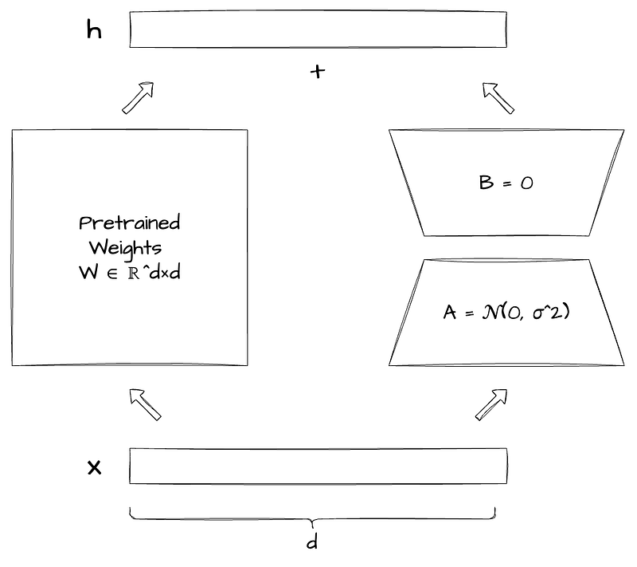

# Papers Explained Review 06 - Parameter Efficient FineTuning

[LoRA](https://ritvik19.medium.com/papers-explained-review-06-parameter-efficient-finetuning-6934fafa74e5#05fa) (Jun 2021)

This page ingests the source article into the wiki and connects it to [[Papers Explained Corpus]], [[Model Compression and Efficiency]], [[Long Context]], [[Document AI]], [[Supervised Fine-Tuning]].

## Source Metadata

- Source file: `raw/2024-11-04_Papers-Explained-Review-06--Parameter-Efficient-FineTuning-6934fafa74e5.html`
- Source title: Papers Explained Review 06: Parameter Efficient FineTuning
- Published: 2024-11-04
- Canonical: [https://medium.com/@ritvik19/papers-explained-review-06-parameter-efficient-finetuning-6934fafa74e5](https://medium.com/@ritvik19/papers-explained-review-06-parameter-efficient-finetuning-6934fafa74e5)

## Key Ideas

- [DyLoRA](https://ritvik19.medium.com/papers-explained-review-06-parameter-efficient-finetuning-6934fafa74e5#7fb6) (Oct 2022)
- [AdaLoRA](https://ritvik19.medium.com/papers-explained-review-06-parameter-efficient-finetuning-6934fafa74e5#620f) (Mar 2023)
- [QLoRA](https://ritvik19.medium.com/papers-explained-review-06-parameter-efficient-finetuning-6934fafa74e5#3992) (May 2023)
- [LoRA-FA](https://ritvik19.medium.com/papers-explained-review-06-parameter-efficient-finetuning-6934fafa74e5#c229) (Aug 2023)
- [Delta-LoRA](https://ritvik19.medium.com/papers-explained-review-06-parameter-efficient-finetuning-6934fafa74e5#a4ec) (Sep 2023)

## Notes

## Table of Contents

- [LoRA](https://ritvik19.medium.com/papers-explained-review-06-parameter-efficient-finetuning-6934fafa74e5#05fa) (Jun 2021)

- [DyLoRA](https://ritvik19.medium.com/papers-explained-review-06-parameter-efficient-finetuning-6934fafa74e5#7fb6) (Oct 2022)

- [AdaLoRA](https://ritvik19.medium.com/papers-explained-review-06-parameter-efficient-finetuning-6934fafa74e5#620f) (Mar 2023)

- [QLoRA](https://ritvik19.medium.com/papers-explained-review-06-parameter-efficient-finetuning-6934fafa74e5#3992) (May 2023)

- [LoRA-FA](https://ritvik19.medium.com/papers-explained-review-06-parameter-efficient-finetuning-6934fafa74e5#c229) (Aug 2023)

- [Delta-LoRA](https://ritvik19.medium.com/papers-explained-review-06-parameter-efficient-finetuning-6934fafa74e5#a4ec) (Sep 2023)

- [LongLoRA](https://ritvik19.medium.com/papers-explained-review-06-parameter-efficient-finetuning-6934fafa74e5#8108) (Sep 2023)

- [VeRA](https://ritvik19.medium.com/papers-explained-review-06-parameter-efficient-finetuning-6934fafa74e5#5bb3) (Oct 2023)

- [LoRA+](https://ritvik19.medium.com/papers-explained-review-06-parameter-efficient-finetuning-6934fafa74e5#fd31) (Feb 2024)

- [MoRA](https://ritvik19.medium.com/papers-explained-review-06-parameter-efficient-finetuning-6934fafa74e5#21a4) (May 2024)

- [DoRA](https://ritvik19.medium.com/papers-explained-review-06-parameter-efficient-finetuning-6934fafa74e5#028e) (May 2024)

## LoRA: Low-Rank Adaptation

LoRA is a technique that makes training large language models more efficient and less resource-intensive. Instead of fine-tuning all the parameters of a large pre-trained model for specific tasks, LoRA freezes the pre-trained weights and injects trainable rank decomposition matrices into each layer of the Transformer architecture. These matrices, denoted as A and B, have a lower rank (r) than the original weight matrix (W0). During training, only A and B are optimized, drastically reducing the number of trainable parameters and the required GPU memory.

When deploying the model, the trained matrices A and B can be merged with the frozen weights W0, resulting in no additional inference latency compared to a fully fine-tuned model. This also allows for efficient task switching by simply swapping different A and B matrices while keeping the pre-trained weights shared. LoRA has shown to perform on par or better than full fine-tuning on various language models and downstream tasks.

Read More: [LoRA: Low-Rank Adaptation of Large Language Models](https://arxiv.org/abs/2106.09685)

[Back To Top](https://ritvik19.medium.com/papers-explained-review-06-parameter-efficient-finetuning-6934fafa74e5#a8ca)

## DyLoRA: Dynamic Search-Free Low-Rank Adaptation

DyLoRA is a technique for fine-tuning large language models that addresses two issues with traditional Low-Rank Adaptation (LoRA): rank selection and static training.

- Rank Selection: LoRA performance is sensitive to the rank (r) of the adapter matrices. Finding the optimal rank requires exhaustive training and searching across different rank values.

- Static Training: LoRA models are typically trained for a specific rank. If a different rank is desired, the model needs to be retrained from scratch.

DyLoRA solves these problems by training LoRA blocks for a range of ranks instead of a single, fixed rank. During training, DyLoRA randomly samples a rank (b) within a predefined range [rmin, rmax] and truncates the adapter matrices (Wup and Wdw) accordingly. The model is then optimized for the selected rank (b) in each training iteration. This process is repeated for multiple iterations, exposing the model to a variety of rank values.

By training with a range of ranks, DyLoRA becomes dynamic at inference time. This means that the model can be deployed with any rank within the trained range without retraining. This also eliminates the need for the expensive search process of finding the optimal rank.

DyLoRA achieves this by ordering the information content of different ranks during training. This is inspired by the concept of nested dropout, which enforces ordered representations in autoencoders. However, DyLoRA differs from nested dropout in several aspects:

- It applies the ordering to low-rank matrix decomposition instead of vector representations.

- It uses a different distribution function for rank selection and a more efficient loss function.

- It introduces a “frozen” mode that only updates the parameters associated with the selected rank (b), further enhancing efficiency.

As a result, DyLoRA offers a more flexible and efficient way to fine-tune large language models, enabling their deployment on devices with varying computational capabilities and avoiding the costly rank search process.

Read More: [DyLoRA: Parameter Efficient Tuning of Pre-trained Models using Dynamic Search-Free Low-Rank Adaptation](https://arxiv.org/abs/2210.07558)

[Back To Top](https://ritvik19.medium.com/papers-explained-review-06-parameter-efficient-finetuning-6934fafa74e5#a8ca)

## AdaLoRA: Adaptive Budget Allocation

AdaLoRA is a parameter-efficient fine-tuning method that improves upon LoRA by adaptively allocating the parameter budget across different weight matrices in a large language model based on their importance.

Instead of using a fixed, pre-defined rank for all LoRA adapters, AdaLoRA parameterizes the low-rank matrices (A and B) using Singular Value Decomposition (SVD). This allows AdaLoRA to dynamically prune less important singular values while retaining the singular vectors. The importance of each singular value and its corresponding vectors (called a “triplet”) is evaluated using a novel importance metric that takes into account the sensitivity of each entry in the triplet to the training loss. Triplets with low importance scores are pruned by setting their singular values to zero, effectively reducing their rank and freeing up the parameter budget.

AdaLoRA employs a global budget scheduler that starts with an initial budget slightly higher than the target budget and gradually decreases it throughout the training process. This gradual reduction allows the model to explore a larger parameter space initially and then focus on the most critical weights later.

AdaLoRA’s adaptive approach to budget allocation results in improved performance compared to LoRA, especially in low-budget settings, where it can outperform LoRA even with significantly fewer parameters.

Read More: [AdaLoRA: Adaptive Budget Allocation for Parameter-Efficient Fine-Tuning](https://arxiv.org/abs/2303.10512)

[Back To Top](https://ritvik19.medium.com/papers-explained-review-06-parameter-efficient-finetuning-6934fafa74e5#a8ca)

## QLoRA: Quantized Low-Rank Adaptation

QLoRA builds upon the LoRA technique to further reduce the memory footprint and make fine-tuning large language models (LLMs) accessible on a single GPU. QLoRA quantizes the pre-trained model weights to 4-bit precision while keeping the LoRA adapters in full precision (typically 16-bit BFloat16). Gradients are back propagated through the quantized model into the LoRA adapters, which are the only parameters updated during training. This allows for fine-tuning large models like a 65B parameter LLaMA on a single 48GB GPU without any performance degradation compared to full 16-bit fine-tuning.

To achieve high fidelity with 4-bit quantization, QLoRA introduces:

- 4-bit NormalFloat (NF4): An information-theoretically optimal data type for quantizing the normally distributed weights of pre-trained models. NF4 results in better empirical performance compared to standard 4-bit integers (Int4) or 4-bit floats (FP4).

- Double Quantization: Further reduces the memory footprint by quantizing the quantization constants themselves, using 8-bit floats (FP8).

- Paged Optimizers: Leverage NVIDIA unified memory to handle memory spikes during gradient checkpointing, enabling training on a single GPU even with large models.

As a result, QLoRA makes fine-tuning large LLMs significantly more accessible, enabling researchers and developers with limited resources to experiment with and adapt powerful models for various downstream tasks.

Read More: [QLoRA: Efficient Finetuning of Quantized LLMs](https://arxiv.org/abs/2305.14314)

[Back To Top](https://ritvik19.medium.com/papers-explained-review-06-parameter-efficient-finetuning-6934fafa74e5#a8ca)

## LoRA-FA: Freezing the Projection-Down Weight

LoRA-FA (LoRA with Frozen-A) is another technique for fine-tuning large language models with reduced memory requirements. Like LoRA, LoRA-FA freezes the pre-trained weights (W) of a linear layer and adds a low-rank adapter (A and B) as a parallel pathway. However, LoRA-FA goes a step further and freezes not only the pre-trained weights but also the projection-down weight (A) in the LoRA adapter. This means that during training, only the projection-up weight (B) is updated.

By freezing A, the input activations (X) are projected down to a much smaller, low-rank representation (XA) before being used to calculate the gradient of B. This significantly reduces the activation memory required compared to standard LoRA, where the full input activation needs to be stored for calculating the gradient of A. For example, in a LLaMA-65B model with a hidden dimension of 8192, LoRA-FA can reduce the activation memory by 2048 times compared to full parameter fine-tuning, assuming a rank size (r) of 4 for the LoRA adapter.

During inference, the product of A and B can be merged back into the original pre-trained weights (W), resulting in no additional inference latency compared to a fully fine-tuned model. Experiments show that LoRA-FA can achieve close accuracy to full fine-tuning and standard LoRA across various tasks and model sizes. Overall, LoRA-FA offers a more memory-efficient alternative to LoRA without compromising performance, enabling the fine-tuning of large language models on more resource-constrained hardware.

Read More: [LoRA-FA: Memory-efficient Low-rank Adaptation for Large Language Models Fine-tuning](https://arxiv.org/abs/2308.03303)

[Back To Top](https://ritvik19.medium.com/papers-explained-review-06-parameter-efficient-finetuning-6934fafa74e5#a8ca)

## Delta-LoRA: Updating Pre-Trained Weights

Delta-LoRA is a parameter-efficient fine-tuning (PEFT) method, like LoRA, that aims to reduce the memory overhead and computational cost of training large language models (LLMs). Unlike LoRA and other low-rank adaptation methods that only update the low-rank matrices (A and B), Delta-LoRA proposes to update the pre-trained weights (W) as well, using the delta of the product of the low-rank matrices in consecutive iterations (A(t+1)B(t+1) — A(t)B(t)).

Delta-LoRA is based on the observation that the gradients of the loss function (L) with respect to AB and W are identical when the dropout layer is removed from the LoRA module. This means that the delta of AB can serve as a surrogate gradient to update W without requiring extra memory to store its gradients and momentums. By updating W alongside A and B, Delta-LoRA introduces more learnable parameters into the optimization process, leading to improved learning capability and performance.

Additionally, Delta-LoRA removes the dropout layer in the low-rank branch to ensure that the gradients of W and AB are indeed equivalent. This modification further reduces memory consumption and can mitigate under-fitting issues that may arise when training with a limited number of parameters. Experiments on various NLP tasks demonstrate that Delta-LoRA consistently outperforms other low-rank adaptation methods, including LoRA, AdaLoRA, and DyLoRA, and achieves results closer to full fine-tuning.

Read More: [Delta-LoRA: Fine-Tuning High-Rank Parameters with the Delta of Low-Rank Matrices](https://arxiv.org/abs/2309.02411)

[Back To Top](https://ritvik19.medium.com/papers-explained-review-06-parameter-efficient-finetuning-6934fafa74e5#a8ca)

## LongLoRA: Combining Shifted Sparse Attention and Improved LoRA

LongLoRA is a technique for efficiently fine-tuning large language models (LLMs) to handle longer context lengths. It combines two key innovations: Shifted Sparse Attention (S2-Attn) and an improved version of Low-Rank Adaptation (LoRA).

S2-Attn replaces the computationally expensive full self-attention mechanism during training with a more efficient sparse attention approach. It splits the input sequence into groups and performs attention within each group. To ensure information flow between groups, half of the attention heads shift the tokens by half the group size. This approximation allows LongLoRA to train on longer contexts with significantly reduced computational cost.

During inference, the model reverts to the standard full attention mechanism, ensuring compatibility with existing LLM optimizations.

LongLoRA also enhances standard LoRA by making the embedding and normalization layers trainable, which is crucial for effective long context adaptation. These layers require minimal additional parameters but significantly improve performance.

As a result, LongLoRA enables fine-tuning LLMs to much longer context lengths. For example, it can extend Llama2 7B to 100k context length and Llama2 70B to 32k context length.

Read More: [LongLoRA: Efficient Fine-tuning of Long-Context Large Language Models](https://arxiv.org/abs/2309.12307)

[Back To Top](https://ritvik19.medium.com/papers-explained-review-06-parameter-efficient-finetuning-6934fafa74e5#a8ca)

## VeRA: Vector-based Random Matrix Adaptation

VeRA is a parameter-efficient fine-tuning method, similar to LoRA, but it further reduces the number of trainable parameters while maintaining comparable performance. Instead of training separate low-rank matrices (A and B) for each layer, VeRA uses a single pair of frozen random matrices (A and B) shared across all layers.

VeRA introduces trainable scaling vectors, d and b, that adapt the frozen matrices A and B for each layer. These scaling vectors are much smaller than the low-rank matrices used in LoRA, resulting in significant memory savings.

During inference, the trained scaling vectors and the shared random matrices can be merged into the original weight matrix, resulting in no additional inference latency. VeRA has demonstrated competitive performance with LoRA on various tasks, including the GLUE and E2E benchmarks, instruction tuning, and image classification. Notably, VeRA achieved these results with a 10-fold reduction in parameters on GLUE and image classification tasks and a 3-fold reduction on the E2E benchmark.

Read More: [VeRA: Vector-based Random Matrix Adaptation](https://arxiv.org/abs/2310.11454)

[Back To Top](https://ritvik19.medium.com/papers-explained-review-06-parameter-efficient-finetuning-6934fafa74e5#a8ca)

## LoRA+: Different Learning Rates for A and B

LoRA+ is a method for fine-tuning large language models that builds upon the Low-Rank Adaptation (LoRA) technique. LoRA freezes the pre-trained weights of a model and introduces trainable low-rank adapter matrices, A and B, for each layer. LoRA+ addresses the suboptimality of the original LoRA method when fine-tuning models with large embedding dimensions (widths) by setting different learning rates for the adapter matrices A and B.

The key insight of LoRA+ is that using the same learning rate for A and B, as in standard LoRA, leads to inefficient feature learning in wide models. By setting the learning rate of B (ηB) much larger than the learning rate of A (ηA) with a fixed ratio λ (ηB = ληA), LoRA+ improves both performance and fine-tuning speed.

This is because the shapes of the A and B matrices are “transposed,” and their updates should be scaled differently for optimal training dynamics. Using a large learning rate for B ensures that both the direction and weights of the learned features are effectively updated. Experiments with various language models and tasks, including GPT-2, RoBERTa, and LLaMA, have shown that LoRA+ consistently leads to improved performance compared to standard LoRA.

Read More: [LoRA+: Efficient Low Rank Adaptation of Large Models](https://arxiv.org/abs/2402.12354)

[Back To Top](https://ritvik19.medium.com/papers-explained-review-06-parameter-efficient-finetuning-6934fafa74e5#a8ca)

## MoRA: High-Rank Updating with Square Matrices

MoRA (More RAnk) is a parameter-efficient fine-tuning (PEFT) method for large language models (LLMs) that addresses the limitations of low-rank updating in traditional LoRA. MoRA proposes using a square matrix (M) instead of the two low-rank matrices (A and B) employed in LoRA to achieve higher-rank updates while maintaining the same number of trainable parameters.

MoRA introduces non-parameterized operators, fcomp and fdecomp, to reduce the input dimension and increase the output dimension of the square matrix, respectively. These operators ensure that the square matrix can be merged back into the original LLM weights after training, similar to LoRA, allowing for efficient deployment.

The sources explore four different implementations of these operators: truncation, sharing rows and columns, reshaping (decoupling), and incorporating rotation. The choice of operators depends on the rank used and the specific requirements of the task. For instance, rotation is more efficient for smaller ranks, while sharing rows and columns is suitable for larger ranks.

The key advantage of MoRA’s high-rank updating is its improved ability to memorize new knowledge during fine-tuning, leading to better performance on memory-intensive tasks. Experiments show that MoRA outperforms LoRA on continual pre-training and memory tasks while achieving comparable performance on other tasks like instruction tuning and mathematical reasoning.

Read More: [MoRA: High-Rank Updating for Parameter-Efficient Fine-Tuning](https://arxiv.org/abs/2405.12130)

[Back To Top](https://ritvik19.medium.com/papers-explained-review-06-parameter-efficient-finetuning-6934fafa74e5#a8ca)

## DoRA: Decomposing LoRA into Single-Rank Components for Dynamic Pruning

DoRA (Dynamic low-rank adaptation) is a parameter-efficient fine-tuning (PEFT) method that enhances LoRA by dynamically allocating the parameter budget across different weight matrices based on their importance to the task.

Unlike AdaLoRA, which uses SVD to prune singular values and their corresponding vectors, DoRA decomposes the high-rank LoRA matrices into a sum of multiple single-rank components. Each component consists of two single-rank matrices (Ai and Bi) and a scalar (ci) that controls whether the component is pruned.

DoRA employs an importance scoring mechanism that quantifies the contribution of each component to the overall update of the weight matrix using the Frobenius norm. Components with smaller scores are deemed less important and are pruned by setting their corresponding ci to 0. This dynamic pruning allows DoRA to adapt the rank of each LoRA adapter during training, focusing the limited parameter budget on the most critical components.

To ensure stable pruning and prevent drastic changes in the weight matrix, DoRA introduces a Dimensional Equilibrium Modulator (DEM) loss that penalizes the variance of the components. This encourages a more uniform distribution of values within each component, mitigating potential issues like gradient explosion.

DoRA’s approach results in more efficient use of the parameter budget, leading to competitive performance compared to LoRA and full model fine-tuning, especially in low-budget settings.

Read More: [DoRA: Enhancing Parameter-Efficient Fine-Tuning with Dynamic Rank Distribution](https://arxiv.org/abs/2405.17357)

[Back To Top](https://ritvik19.medium.com/papers-explained-review-06-parameter-efficient-finetuning-6934fafa74e5#a8ca)

## References

- [LoRA: Low-Rank Adaptation of Large Language Models](https://arxiv.org/abs/2106.09685)

- [DyLoRA: Parameter Efficient Tuning of Pre-trained Models using Dynamic Search-Free Low-Rank Adaptation](https://arxiv.org/abs/2210.07558)

- [AdaLoRA: Adaptive Budget Allocation for Parameter-Efficient Fine-Tuning](https://arxiv.org/abs/2303.10512)

- [QLoRA: Efficient Finetuning of Quantized LLMs](https://arxiv.org/abs/2305.14314)

- [LoRA-FA: Memory-efficient Low-rank Adaptation for Large Language Models Fine-tuning](https://arxiv.org/abs/2308.03303)

- [Delta-LoRA: Fine-Tuning High-Rank Parameters with the Delta of Low-Rank Matrices](https://arxiv.org/abs/2309.02411)

- [LongLoRA: Efficient Fine-tuning of Long-Context Large Language Models](https://arxiv.org/abs/2309.12307)

- [VeRA: Vector-based Random Matrix Adaptation](https://arxiv.org/abs/2310.11454)

- [LoRA+: Efficient Low Rank Adaptation of Large Models](https://arxiv.org/abs/2402.12354)

- [MoRA: High-Rank Updating for Parameter-Efficient Fine-Tuning](https://arxiv.org/abs/2405.12130)

- [DoRA: Enhancing Parameter-Efficient Fine-Tuning with Dynamic Rank Distribution](https://arxiv.org/abs/2405.17357)

## Figures

Figures from the Medium HTML export (`raw/2024-11-04_Papers-Explained-Review-06--Parameter-Efficient-FineTuning-6934fafa74e5.html`); local copies under `wiki/assets/papers-explained-review-06-parameter-efficient-finetuning/` when download succeeded.

| Figure | Caption |
|--------|---------|
|  | Title card: Parameter Efficient FineTuning. |
## Related

- [[Papers Explained Corpus]]
- [[Model Compression and Efficiency]]
- [[Long Context]]
- [[Document AI]]
- [[Supervised Fine-Tuning]]
- [[Papers Explained 187e - Quantized Llama 3.2, Llama 3.3]]
- [[Papers Explained 245 - Layout Parser]]

#summary #topic
