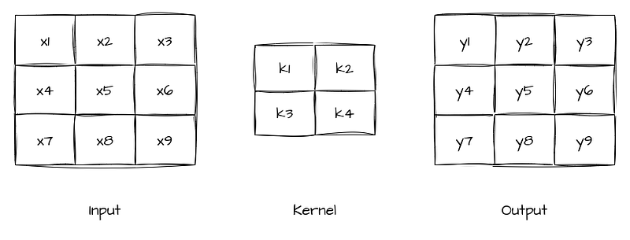
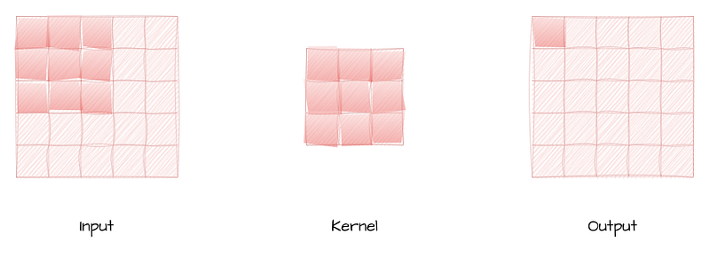
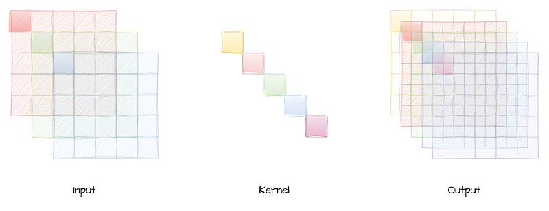
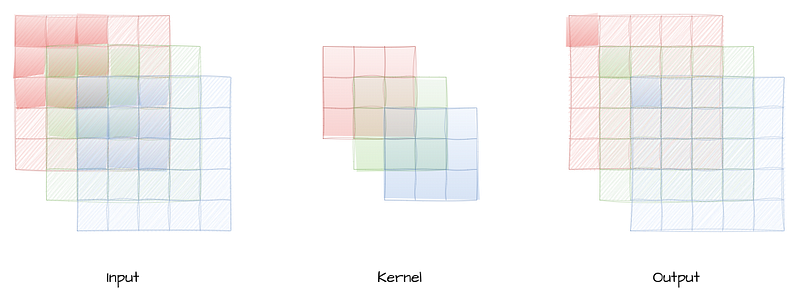
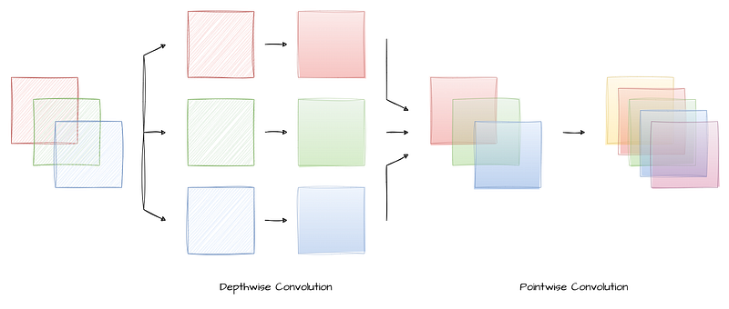
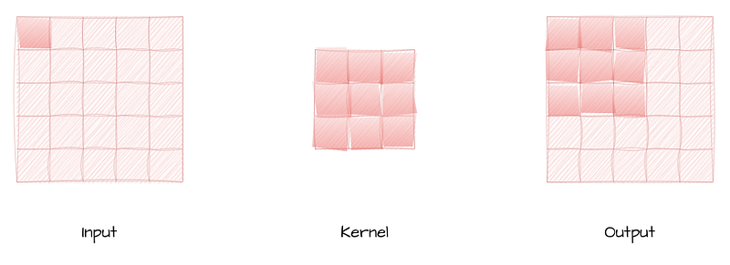

# Papers Explained Review 07 - Convolution Layers

Convolutional layers consist of a set of learnable filters, also known as kernels or feature detectors. Each filter is a small matrix, typically square, with weights initialized randomly. The filters slide (convolve) over the input image, which is usually represented as a 3D tensor (height, width, channels).

This page ingests the source article into the wiki and connects it to [[Papers Explained Corpus]], [[Model Compression and Efficiency]], [[Document AI]].

## Source Metadata

- Source file: `raw/2024-12-25_Papers-Explained-Review-07--Convolution-Layers-c083e7410cd3.html`
- Source title: Papers Explained Review 07: Convolution Layers
- Published: 2024-12-25
- Canonical: [https://medium.com/@ritvik19/papers-explained-review-07-convolution-layers-c083e7410cd3](https://medium.com/@ritvik19/papers-explained-review-07-convolution-layers-c083e7410cd3)

## Key Ideas

- Convolutional layers consist of a set of learnable filters, also known as kernels or feature detectors. Each filter is a small matrix, typically square, with weights initialized randomly.
- The Convolution Operation involves taking the element-wise product of the filter with a corresponding portion of the input image, and then summing up the results to obtain a single value.
- The pointwise convolution layer is a specialized form of convolutional layer in CNNs that employs a kernel size of 1x1.
- The Depthwise Convolution Layer is a specialized type of convolutional layer that aims to capture spatial information within an image without increasing the number of output channels.
- It performs a convolution operation on each input channel independently, using its corresponding filter. In other words, it applies a single filter to each channel, resulting in a set of feature maps equal to the number of input channels.

## Notes

## Table of Contents

- [Convolution](#4176)

- [Pointwise Convolution](#8f24)

- [Depthwise Convolution](#20e4)

- [Separable Convolution](#539f)

- [Convolution Transpose](#a302)

## Convolution

*Figure: Convolution*

Convolutional layers consist of a set of learnable filters, also known as kernels or feature detectors. Each filter is a small matrix, typically square, with weights initialized randomly. The filters slide (convolve) over the input image, which is usually represented as a 3D tensor (height, width, channels).

The Convolution Operation involves taking the element-wise product of the filter with a corresponding portion of the input image, and then summing up the results to obtain a single value. This process is performed for each position of the filter sliding over the input image. The output of the convolution operation forms the feature map, capturing different patterns present in the input image.

[Back to Top](#c57f)

## Pointwise Convolution

*Figure: Pointwise Convolution*

The pointwise convolution layer is a specialized form of convolutional layer in CNNs that employs a kernel size of 1x1. Unlike traditional convolution layers that use larger kernel sizes (e.g., 3x3, 5x5), the pointwise convolution layer operates with a single element from the input at a time, without considering spatial relationships. Essentially, it performs element-wise operations and linear combinations on the input data along the depth dimension, also known as channels or feature maps.

[Back to Top](#c57f)

## Depthwise Convolution

*Figure: Depthwise Convolution*

The Depthwise Convolution Layer is a specialized type of convolutional layer that aims to capture spatial information within an image without increasing the number of output channels.

It performs a convolution operation on each input channel independently, using its corresponding filter. In other words, it applies a single filter to each channel, resulting in a set of feature maps equal to the number of input channels. This process captures spatial features for each channel separately, helping the model to learn spatial information more efficiently.

[Back to Top](#c57f)

## Separable Convolution

*Figure: Separable Convolution*

The separable convolution layer aims to reduce computation while maintaining the representation power of traditional convolutions. It achieves this by breaking down a 2D convolution into two separate convolution operations: a depthwise convolution and a pointwise convolution.

Since, the depthwise convolution uses a 3D kernel with a depth of 1, effectively applying a 2D convolutional filter independently to each channel. This step is computationally efficient and helps capture channel-wise patterns in the data.

Pointwise convolution combines the output of the depthwise convolution with a 1x1 kernel, hence creating new features by linearly combining the depthwise output.

[Back to Top](#c57f)

## Convolution Transpose

*Figure: Convolution Transpose*

A Convolution Transpose performs a reverse operation to the standard convolution, hence the name “transpose.”

The convolution transpose layer takes an input feature map and applies a set of filters as usual. However, the critical difference lies in the output dimensions. While standard convolution reduces spatial dimensions, the convolution transpose layer increases them, achieving upsampling.

Similar to regular convolution, the filters in the convolution transpose layer are also applied across the input feature map. However, instead of reducing the spatial dimensions, this operation increases them by inserting fractional strides between elements.

After the element-wise multiplication, the values at each position in the output feature map are summed up to obtain the final output.

[Back to Top](#c57f)

## Figures

Figures from the Medium HTML export (`raw/2024-12-25_Papers-Explained-Review-07--Convolution-Layers-c083e7410cd3.html`); local copies under `wiki/assets/papers-explained-review-07-convolution-layers/` when download succeeded.

| Figure | Caption |
|--------|---------|
|  | Title card: Convolution Layers. |
|  | Convolution. |
|  | Pointwise Convolution. |
|  | Depthwise Convolution. |
|  | Separable Convolution. |
|  | Convolution Transpose. |
## Related

- [[Papers Explained Corpus]]
- [[Model Compression and Efficiency]]
- [[Document AI]]
- [[Papers Explained 278 - Phi-4]]
- [[Papers Explained Review 08 - Recurrent Layers]]

#summary #topic
