# Papers Explained Review 08 - Recurrent Layers

Input Propagation: At each time step t, the input vector X(t) is fed into the Input Layer. The hidden state H(t-1) from the previous time step t-1 is also passed into the Hidden Layer.

This page ingests the source article into the wiki and connects it to [[Papers Explained Corpus]], [[Embedding and Retrieval]], [[Document AI]].

## Source Metadata

- Source file: `raw/2024-12-26_Papers-Explained-Review-08--Recurrent-Layers-ff2f224af059.md`
- Source title: Papers Explained Review 08: Recurrent Layers
- Published: 2024-12-26
- Canonical: [https://medium.com/@ritvik19/papers-explained-review-08-recurrent-layers-ff2f224af059](https://medium.com/@ritvik19/papers-explained-review-08-recurrent-layers-ff2f224af059)

## Key Ideas

- The Simple Recurrent Layer comprises three main components:
- Hidden State Update: The hidden state H(t) is computed using the following equation:
- Output Generation: The output at the current time step, Y(t), is obtained using the hidden state H(t)
- x_t represents the input at time step t.
- h_{t-1} represents the previous hidden state.

## Notes

*Figure: Compressed and unfolded basic recurrent neural network*

## Table of Contents

- [Simple Recurrent](#e405)

- [LSTM](#0947)

- [GRU](#4571)

## Simple Recurrent

*Figure: Simple Recurrent Cell*

The Simple Recurrent Layer comprises three main components:

Input Propagation: At each time step t, the input vector X(t) is fed into the Input Layer. The hidden state H(t-1) from the previous time step t-1 is also passed into the Hidden Layer.

Hidden State Update: The hidden state H(t) is computed using the following equation:

Output Generation: The output at the current time step, Y(t), is obtained using the hidden state H(t)

Where:

- x_t represents the input at time step t.

- h_{t-1} represents the previous hidden state.

- W are weight matrices, and b denotes the bias vectors.

- g() is the activation function, which depends on the specific problem (e.g., softmax for classification).

[Back to Top](#1be4)

## LSTM

*Figure: LSTM Cell*

Long Short-Term Memory (LSTM) are a type of recurrent neural network (RNN) that excel at capturing long-term dependencies and mitigating the vanishing gradient problem, which often plagues traditional RNNs.

The cell of an LSTM comprises three essential gates and a memory cell, working together to control the flow of information: the input gate (i-gate), the forget gate (f-gate), the output gate (o-gate), and the memory cell (Ct). Each of these components plays a crucial role in allowing LSTMs to manage and manipulate information over time.

### Forget Gate (f-gate)

*Figure: Forget Gate*

The forget gate regulates the information that should be discarded from the memory cell. It takes input from the current time step and the previous hidden state and, similar to the input gate, passes the values through a sigmoid activation function. The output, denoted as ft, determines which information in the memory cell is no longer relevant and should be forgotten.

### Input Gate (i-gate)

*Figure: Input Gate*

The input gate determines the relevance of new information coming into the cell. It takes input from the current time step (xt) and the previous hidden state (ht-1) and passes it through a sigmoid activation function. The output of the sigmoid function, denoted as it, decides which parts of the new information are essential to retain.

### Memory Cell (Ct)

*Figure: Memory Cell*

The memory cell is responsible for retaining and updating information over time. It combines the information from the input gate and the forget gate using element-wise multiplication and addition operations. The result is a new memory cell state, Ct, that preserves the relevant information while discarding obsolete data.

### Output Gate (o-gate)

*Figure: Output Gate*

The output gate controls the flow of information from the memory cell to the output of the LSTM cell. Like the input and forget gates, the output gate takes input from the current time step and the previous hidden state and processes them through a sigmoid activation function. The output, denoted as ot, determines which parts of the memory cell should be revealed as the output of the LSTM cell at the current time step.

Where:

- x_t represents the input at time step t.

- h_{t-1} represents the previous hidden state.

- W are weight matrices, and b denotes the bias vectors.

- C~ represents Candidate State

[Back to Top](#1be4)

## GRU

*Figure: GRU Cell*

The GRU is a variation of the standard RNN that utilizes gated mechanisms to control the flow of information through the network.

The GRU layer consists of the following components:

### Update Gate (z)

*Figure: Update Gate*

The update gate determines how much of the previous hidden state should be preserved for the current time step. It takes the input at the current time step and the previous hidden state and outputs a value between 0 and 1, where 0 means “ignore” and 1 means “keep.”

### Reset Gate (r)

*Figure: Reset Gate*

The reset gate controls how much of the previous hidden state should be forgotten when calculating the new candidate state. Like the update gate, it takes the input and the previous hidden state and produces a value between 0 and 1.

### Candidate State (h~)

*Figure: Candidate State*

The candidate state represents the new hidden state candidate at the current time step, combining information from the previous hidden state and the current input.

### Current Hidden State (h_t)

*Figure: Current Hidden State*

This is the output of the GRU layer at the current time step, and it is a weighted average of the previous hidden state (scaled by the update gate) and the candidate state (scaled by the complementary update gate).

Where:

- x_t represents the input at time step t.

- h_{t-1} represents the previous hidden state.

- W are weight matrices, and b denotes the bias vectors.

[Back to Top](#1be4)

## Figures

Figures from the Medium HTML export (`raw/2024-12-26_Papers-Explained-Review-08--Recurrent-Layers-ff2f224af059.md`); local copies under `wiki/assets/papers-explained-review-08-recurrent-layers/` when download succeeded.

| Figure | Caption |
|--------|---------|
| 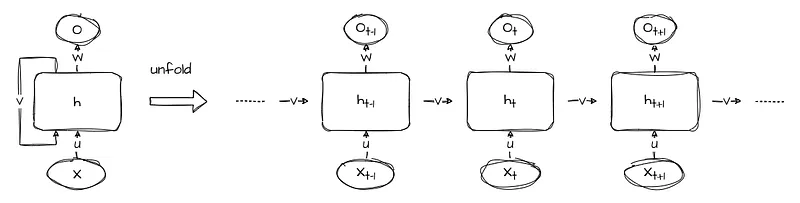 | Compressed and unfolded basic recurrent neural network. |
| 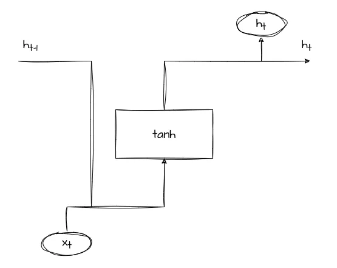 | Simple Recurrent Cell. |
| 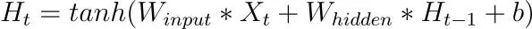 | Hidden State Update: The hidden state H(t) is computed using the following equation. |
| 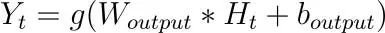 | Where. |
| 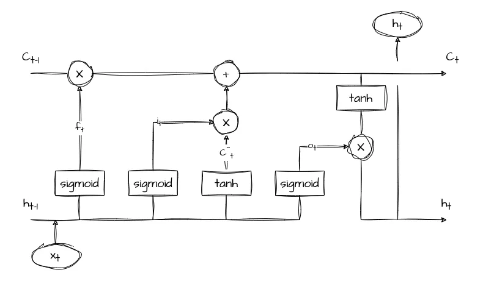 | LSTM Cell. |
| 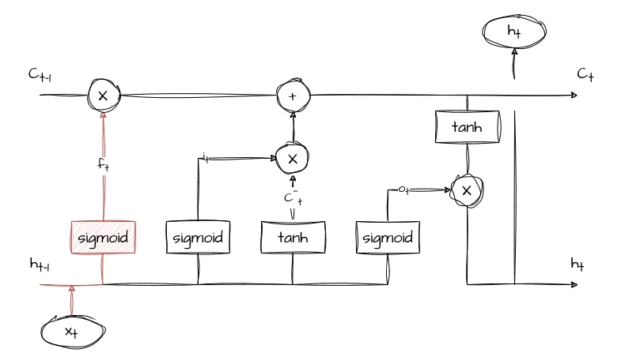 | Forget Gate. |
| 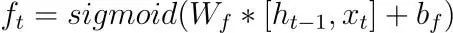 | The forget gate regulates the information that should be discarded from the memory cell. |
| 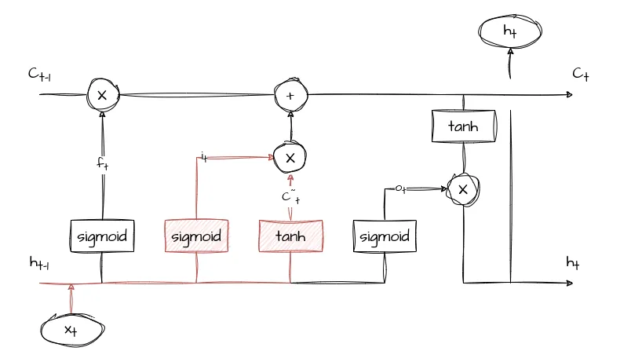 | Input Gate. |
| 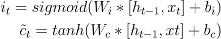 | The input gate determines the relevance of new information coming into the cell. |
| 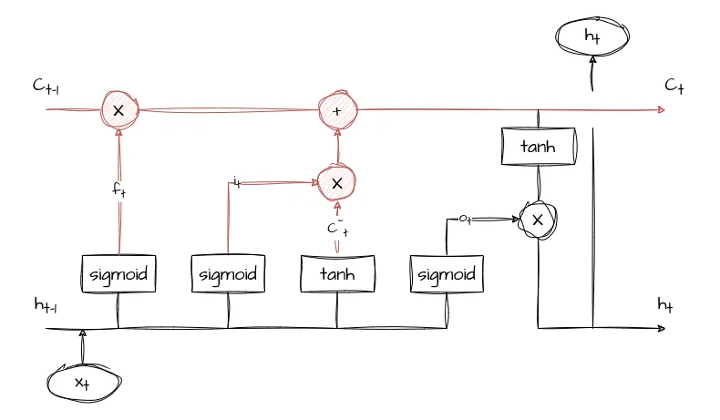 | Memory Cell. |
| 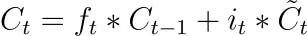 | The memory cell is responsible for retaining and updating information over time. |
| 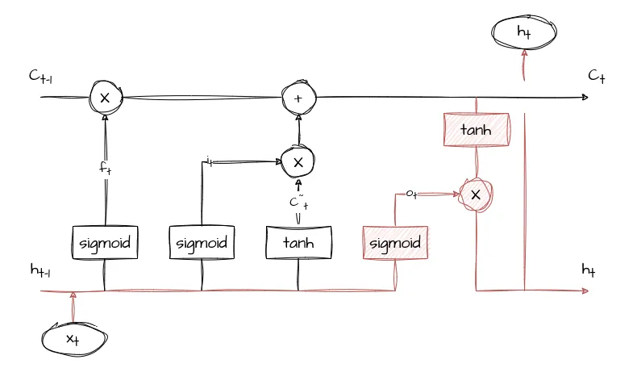 | Output Gate. |
| 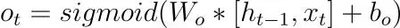 | Where. |
| 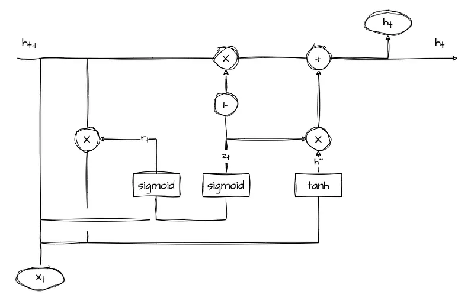 | GRU Cell. |
| 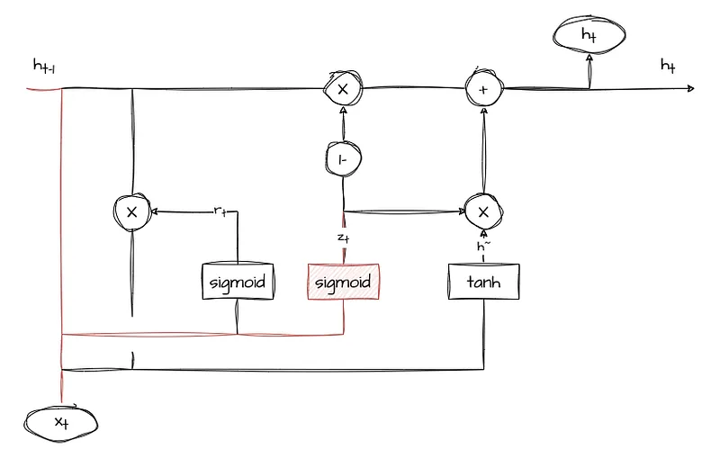 | Update Gate. |
| 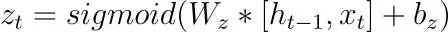 | The update gate determines how much of the previous hidden state should be preserved for the current time step. |
| 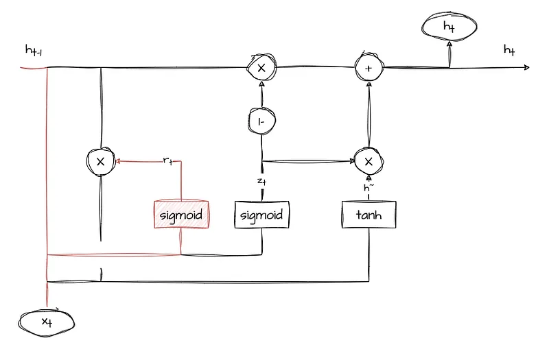 | Reset Gate. |
| 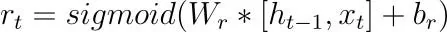 | The reset gate controls how much of the previous hidden state should be forgotten when calculating the new candidate state. |
| 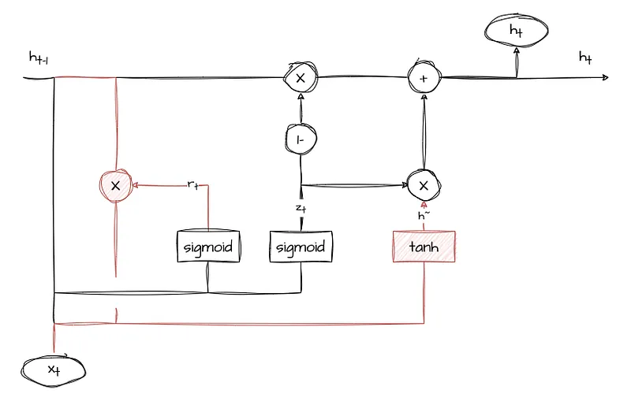 | Candidate State. |
| 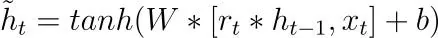 | Back to Top. |
| 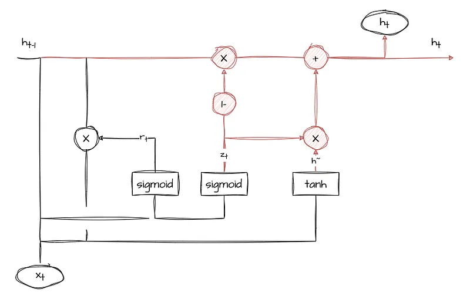 | Current Hidden State. |
| 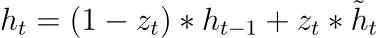 | Where. |
## Related

- [[Papers Explained Corpus]]
- [[Embedding and Retrieval]]
- [[Document AI]]
- [[Papers Explained Review 07 - Convolution Layers]]
- [[Papers Explained Review 09 - Attention Layers]]

#summary #topic
