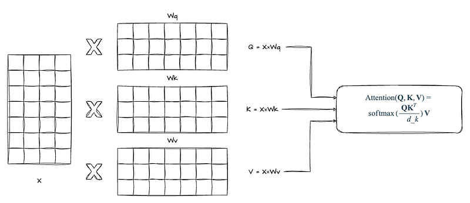

# Papers Explained Review 09 - Attention Layers

Scaled Dot-Product Attention is a mechanism designed to enhance model focus on relevant parts of input data by dynamically adjusting the input values’ weights. This process operates on queries, keys of dimension dk, and values of dimension dv. The attention mechanism unfolds in three steps:

This page ingests the source article into the wiki and connects it to [[Papers Explained Corpus]], [[Large Language Models]], [[Multilingual Models]], [[Model Compression and Efficiency]], [[Evaluation and Benchmarks]], [[Document AI]].

## Source Metadata

- Source file: `raw/2024-12-27_Papers-Explained-Review-09--Attention-Layers-beeef323e7f5.html`
- Source title: Papers Explained Review 09: Attention Layers
- Published: 2024-12-27
- Canonical: [https://medium.com/@ritvik19/papers-explained-review-09-attention-layers-beeef323e7f5](https://medium.com/@ritvik19/papers-explained-review-09-attention-layers-beeef323e7f5)

## Key Ideas

- Scaled Dot-Product Attention is a mechanism designed to enhance model focus on relevant parts of input data by dynamically adjusting the input values’ weights. This process operates on queries, keys of dimension dk, and values of dimension dv.
- Dot Product and Scaling: Initially, the dot product between each query and all keys is calculated, resulting in a measure of compatibility. To prevent gradient vanishing problems in the softmax stage, these dot products are scaled down by 1/sqrt(dk1).
- Softmax Application: Next, a softmax function is applied to the scaled dot products. This step transforms the dot products into weights that sum to 1, offering a probabilistic interpretation.
- Weighted Sum Computation: The final output is a weighted sum of the values, with weights provided by the softmax function. This mechanism allows the output to concentrate on more significant parts of the input, as determined by the attention scores.
- This mechanism’s efficiency and its capacity to emphasize relevant input sections based on computed scores make it integral to transformer architectures.

## Notes

## Table of Contents

- [Scaled Dot Product Attention](#c18c)

- [Multi Head Attention](#be63)

- [Cross Attention](#0f28)

- [Causal Attention](#14c7)

- [Sliding Window Attention](#324c)

- [Multi Query Attention](#0bfd)

- [Grouped Query Attention](#d5fb)

## Scaled Dot Product Attention

Scaled Dot-Product Attention is a mechanism designed to enhance model focus on relevant parts of input data by dynamically adjusting the input values’ weights. This process operates on queries, keys of dimension dk, and values of dimension dv. The attention mechanism unfolds in three steps:

- Dot Product and Scaling: Initially, the dot product between each query and all keys is calculated, resulting in a measure of compatibility. To prevent gradient vanishing problems in the softmax stage, these dot products are scaled down by 1/sqrt(dk1).

- Softmax Application: Next, a softmax function is applied to the scaled dot products. This step transforms the dot products into weights that sum to 1, offering a probabilistic interpretation. The softmax function ensures that higher dot products (indicating greater relevance between query and key) lead to higher weights.

- Weighted Sum Computation: The final output is a weighted sum of the values, with weights provided by the softmax function. This mechanism allows the output to concentrate on more significant parts of the input, as determined by the attention scores.

The key innovation of Scaled Dot-Product Attention lies in its ability to capture long-range dependencies within the data. Unlike RNNs and CNNs, which struggle with distant relationships due to their sequential processing and local receptive fields, respectively, this attention mechanism enables each output element to attend to all positions in the input sequence simultaneously. The scaling factor (1/sqrt(dk1) plays a crucial role in maintaining the softmax function’s effectiveness, preventing early saturation during training and facilitating a smoother learning process.

This mechanism’s efficiency and its capacity to emphasize relevant input sections based on computed scores make it integral to transformer architectures. Transformers leverage this attention to process sequences in parallel, significantly outperforming traditional models in capturing complex data relationships and dependencies.

[Back to Top](#59ed)

## Multi-Head Attention

Multi-Head Attention is a cornerstone of the Transformer model architecture, enhancing the model’s capacity to concurrently process distinct facets of an input sequence. This mechanism employs parallel attention mechanisms, each termed a “head,” allowing the model to capture a comprehensive spectrum of sequence relationships, from long to short-term dependencies, across various representational subspaces.

The operation of Multi-Head Attention begins with the division of the input into multiple heads. For each head, the input — comprising queries, keys, and values — is linearly projected into lower-dimensional spaces using unique, learned projections. In these subspaces, scaled dot-product attention is computed in parallel. The resulting outputs are concatenated and subjected to another linear transformation. This structure enables simultaneous attention to different sequence parts, enriching the model’s contextual understanding vital for complex tasks like translation, where word relevance is multifaceted.

At its core, Multi-Head Attention facilitates independent attention score computation for each head. These scores dictate the emphasis on different input sequence segments when generating an output element. The concatenated outputs from all heads undergo a final linear transformation, culminating in the output. This methodology is instrumental in the Transformer model’s adeptness at handling a wide array of sequence transduction tasks, ensuring robust performance across diverse applications.

[Back to Top](#59ed)

## Cross Attention

Cross-attention is a mechanism that differs from self-attention by mixing or combining two different input sequences, rather than focusing on a single sequence. In the context of the original transformer architecture, cross-attention involves the sequence returned by the encoder module and the input sequence being processed by the decoder module. This allows for the interaction between two distinct sequences, where the queries usually come from the decoder, and the keys and values typically come from the encoder. The two input sequences, (x_1) and (x_2), can have different numbers of elements, but their embedding dimensions must match.

The CrossAttention class is implemented by taking two distinct inputs, (x_1) and (x_2), where the queries are derived from (x_1), and the keys and values are derived from (x_2). This setup enables the attention mechanism to evaluate the interaction between two different inputs. The attention scores are calculated by taking the dot product of the queries (from (x_1)) and keys (from (x_2)). Each context vector is a weighted sum of the values, but in CrossAttention, these values are derived from the second input ((x_2)), and the weights are based on the interaction between (x_1) and (x_2).

In practice, cross-attention is useful for tasks like language translation in transformers, where it goes from an input sentence to an output sentence. The input sentence represents one input sequence, and the translation represents the second input sequence. Another example of cross-attention usage is in the Stable Diffusion model, where cross-attention is used between the generated image in the U-Net model and the text prompts used for conditioning.

[Back to Top](#59ed)

## Causal Attention

Causal attention, often referred to as “masked self-attention,” is a specialized form of self-attention mechanism designed specifically for autoregressive models like GPT (Generative Pre-trained Transformer). The primary distinction between causal attention and self-attention lies in the constraint that, in causal attention, the model is prevented from accessing “future” information in the sequence during training or inference. This is crucial for tasks like text generation, where the model generates one token at a time, and each token can only depend on previously generated tokens, not on tokens that have not been generated yet.

The implementation of causal attention involves applying a mask to the attention weights, ensuring that for any given token, the model can only attend to that token and the ones before it in the sequence. This is achieved by zeroing out (masking) all weights that correspond to “future” tokens. This masking process ensures that during the computation of attention weights, each position can only influence the current and preceding positions in the sequence, adhering to the autoregressive property.

The calculation of causal attention involves several steps:

- Compute the unnormalized attention scores (also known as logits) by taking the dot product of queries and keys.

- Apply a mask to these scores before normalization, setting the scores for disallowed connections (i.e., future tokens attending to past tokens) to negative infinity.

- Normalize the masked scores using the softmax function, which effectively zeroes out the influence of masked tokens due to the properties of softmax applied to negative infinity.

- Use these normalized, masked attention scores to compute the weighted sum of value vectors, producing the output of the attention mechanism for each position in the sequence.

In autoregressive transformers, causal attention enables the model to generate coherent sequences by ensuring that the prediction for the next token is conditioned only on the known past, not on the future. This mechanism is fundamental to the operation of models like GPT, where the goal is to predict the next token in a sequence given the tokens that have come before it.

[Back to Top](#59ed)

## Sliding Window Attention

Sliding Window Attention is designed to efficiently handle long input sequences in attention-based models, such as those found in the Longformer architecture. It addresses the inefficiency of the traditional full attention mechanism in Transformers, which has a quadratic time and memory complexity ((O(n²))) with respect to the input sequence length (n). This traditional approach becomes impractical for long sequences due to its high computational cost.

The Sliding Window Attention mechanism works by limiting each token’s attention to a fixed-size window of surrounding tokens. Specifically, given a window size (w), each token attends to (1/2 w) tokens on each side. This approach significantly reduces the computational complexity to (O(n x w)), which scales linearly with the input sequence length (n), making it much more efficient for processing long sequences. The efficiency is further enhanced by keeping (w) relatively small compared to (n).

The use of multiple stacked layers of sliding window attention allows for a large receptive field, meaning that higher layers can access information from all input locations. This stacking approach enables the model to build representations that incorporate information across the entire input sequence, despite the local focus of individual layers. This mechanism is somewhat analogous to how convolutional neural networks (CNNs) operate, where stacking layers with small kernels leads to high-level features built from a large portion of the input.

Sliding Window Attention is particularly beneficial for tasks involving long documents or sequences where the full context is essential for accurate modeling. By efficiently managing the computational resources, it enables the processing of much longer sequences than would be feasible with full attention, without sacrificing the ability to capture long-range dependencies within the data.

[Back to Top](#59ed)

## Multi-Query Attention

Multi-Query Attention (MQA) is a variation of the multi-head attention mechanism designed to improve the efficiency of transformer models, particularly during the inference phase. Unlike the standard Multi-Head Attention (MHA) where each attention head computes its own unique set of query (Q), key (K), and value (V) vectors, MQA modifies this approach by having all the Q heads share the same set of K and V heads. This means that while the original number of heads for Q is maintained, only one head is used for K and V. This approach is illustrated as keeping the original number of heads for Q but having only one head for K and V, hence the name Multi-Query, as all the Q heads share the same K and V.

The calculation process for MQA is essentially the same as for MHA, with the primary difference being the removal of the “h” dimension (representing the number of heads) from the equations for K, V, P_k, and P_v in the tensor operations. This results in a significant reduction in the size of the key and value tensors, which in turn reduces the memory bandwidth requirements and accelerates inference speed. Specifically, the KV cache size is reduced by a factor of h (the number of heads), which not only decreases the amount of data that needs to be stored in GPU memory but also allows for an increase in batch size, thereby improving efficiency.

[Back to Top](#59ed)

## Grouped Query Attention

Grouped Query Attention (GQA) is a technique that optimizes the balance between computational efficiency and model performance within Transformer architectures. It is a generalization of multi-head attention (MHA) and multi-query attention (MQA), with each of them being a special case of GQA. GQA addresses the inefficiencies inherent in the traditional attention mechanism using MHA, particularly concerning memory bandwidth demands during inference. The technique is developed as an evolution of the MQA technique, reducing the number of key-value heads without diminishing the model’s capacity to capture complex data relationships. This reduction is achieved by dividing the query heads into groups, each sharing a single key and value head.

The calculation and working mechanism of GQA involve dividing the query heads (Q) from a traditional multi-head model into G groups. Each group is assigned a single key (K) and value (V) head. This configuration is denoted as GQA-G, where G represents the number of groups. The key and value projection matrices of the original heads within each group are mean-pooled to convert a multi-head model into a GQA model. This technique averages the projection matrices of each head in a group, resulting in a single key and value projection for that group.

GQA differs from MQA in that MQA uses multiple query heads but only a single key and value head, significantly reducing the memory load and enhancing inference speed. However, this approach can lead to quality degradation due to reduced capacity for capturing complex patterns. In contrast, GQA adopts an intermediate approach between MHA and MQA, maintaining a higher level of model capacity than MQA while offering speed benefits. It minimizes the number of key-value pairs across groups, mitigating the memory bandwidth challenge associated with key-value caching in MHA, and strikes a balance between the efficiency of MQA and the model expressiveness of MHA.

[Back to Top](#59ed)

## Figures

Figures from the Medium HTML export (`raw/2024-12-27_Papers-Explained-Review-09--Attention-Layers-beeef323e7f5.html`); local copies under `wiki/assets/papers-explained-review-09-attention-layers/` when download succeeded.

| Figure | Caption |
|--------|---------|
|  | Title card: Attention Layers. |
## Related

- [[Papers Explained Corpus]]
- [[Large Language Models]]
- [[Multilingual Models]]
- [[Model Compression and Efficiency]]
- [[Evaluation and Benchmarks]]
- [[Document AI]]
- [[Papers Explained Review 08 - Recurrent Layers]]
- [[Papers Explained Review 10 - Normalization Layers]]

#summary #topic
