# Papers Explained Review 10 - Normalization Layers

Batch Normalization was first discussed in the paper [Batch Normalization: Accelerating Deep Network Training by Reducing Internal Covariate Shift](https://arxiv.org/pdf/1502.03167.pdf)

This page ingests the source article into the wiki and connects it to [[Papers Explained Corpus]], [[Document AI]], [[Synthetic Data]], [[Model Compression and Efficiency]]. For a pedagogical axis-by-axis survey with style-transfer and SPADE coverage, see [[In-layer Normalization Techniques for Training Very Deep Neural Networks]] (AI Summer, 2020).

## Source Metadata

- Source file: `raw/2024-12-30_Papers-Explained-Review-10--Normalization-Layers-56b556c9646e.html`
- Source title: Papers Explained Review 10: Normalization Layers
- Published: 2024-12-30
- Canonical: [https://medium.com/@ritvik19/papers-explained-review-10-normalization-layers-56b556c9646e](https://medium.com/@ritvik19/papers-explained-review-10-normalization-layers-56b556c9646e)

## Key Ideas

- They define Internal Covariate Shift as the change in the distribution of network activations due to the change in network parameters during training. This adversely affects training speed because the later layers have to adapt to the shifted distribution.
- They proposed that by whitening the inputs to each layer,we would take a step towards achieving the fixed distributions of inputs that would remove the ill effects of the internal covariate shift.
- Whitening is linearly transforming inputs to have zero mean, unit variance, and be uncorrelated.
- The paper introduces Batch Normalization as follows:
- Normalize each feature independently to have zero mean and unit variance:

## Notes

## Table of Contents

- [Batch Normalization](#00ea)

- [Layer Normalization](#9439)

- [Instance Normalization](#7783)

- [Group Normalization](#cd7f)

- [Weight Standardization](#3944)

- [Batch-Channel Normalization](#3944)

```text
import
tensorflow
as
tf
from
tensorflow
import
keras
from
tensorflow.keras
import
layers
as
L
```

## Batch Normalization

Batch Normalization was first discussed in the paper [Batch Normalization: Accelerating Deep Network Training by Reducing Internal Covariate Shift](https://arxiv.org/pdf/1502.03167.pdf)

They define Internal Covariate Shift as the change in the distribution of network activations due to the change in network parameters during training. This adversely affects training speed because the later layers have to adapt to the shifted distribution.

They proposed that by whitening the inputs to each layer,we would take a step towards achieving the fixed distributions of inputs that would remove the ill effects of the internal covariate shift.

Whitening is linearly transforming inputs to have zero mean, unit variance, and be uncorrelated.

The paper introduces Batch Normalization as follows:

Normalize each feature independently to have zero mean and unit variance:

where x=(x(1)…x(d)) is the d-dimensional input.

The estimates of mean and variance are from the mini-batch for normalization; instead of calculating the mean and variance across the whole dataset.

Normalizing each feature to zero mean and unit variance could affect what the layer can represent. To overcome this each feature is scaled and shifted by two trained parameters.

where y(k) is the output of the batch normalization layer.

An exponential moving average of mean and variance is calculated during the training phase and is then used during inference.

```text
class
BatchNormalization
(L.Layer):
def
__init__
(
self, eps=
1e-5
, momentum=
0.1
, **kwargs
):
super
().__init__(**kwargs)
self.eps = eps
self.momentum = momentum
def
build
(
self, input_shape
):
self.exp_mean = self.add_weight(shape=input_shape[-
1
], initializer=
'zeros'
, trainable=
False
)
self.exp_var = self.add_weight(shape=input_shape[-
1
], initializer=
'ones'
, trainable=
False
)
self.scale = self.add_weight(shape=input_shape[-
1
], initializer=
'zeros'
, trainable=
True
)
self.shift = self.add_weight(shape=input_shape[-
1
], initializer=
'ones'
, trainable=
True
)
def
call
(
self, x
):
x_shape = x.shape
batch_size = x_shape[
0
]
channels = x.shape[-
1
]
x = tf.reshape(x, (batch_size, -
1
, channels))
mean = tf.reduce_mean(x, [
0
,
1
])
mean_x2 = tf.reduce_mean((x **
2
), [
0
,
1
])
var = mean_x2 - mean **
2
self.exp_mean = (
1
- self.momentum) * self.exp_mean + self.momentum * mean
self.exp_var = (
1
- self.momentum) * self.exp_var + self.momentum * var
mean = self.exp_mean
var = self.exp_var
x_norm = (x - tf.reshape(mean, (
1
,
1
, -
1
))) / tf.reshape(tf.sqrt(var + self.eps), (
1
,
1
, -
1
))
x_norm = tf.reshape(self.scale, (
1
,
1
, -
1
)) * x_norm +tf.reshape(self.shift, (
1
,
1
, -
1
))
return
tf.reshape(x_norm, x_shape)
```

[Back to Top](#1c9b)

## Layer Normalization

Layer normalization, introduced in the paper [Layer Normalization](https://arxiv.org/pdf/1607.06450.pdf) is a simpler normalization method that is generally used for NLP tasks but works on a wider range of settings.

```text
class
LayerNormalization
(L.Layer):
def
__init__
(
self, eps=
1e-5
, **kwargs
):
super
().__init__(**kwargs)
self.eps = eps
def
build
(
self, input_shape
):
self.gain = self.add_weight(shape=input_shape, initializer=
'zeros'
, trainable=
True
)
self.bias = self.add_weight(shape=input_shape, initializer=
'ones'
, trainable=
True
)
def
call
(
self, x
):
normalized_shape = x.shape[
1
:]
dims = [-(i +
1
)
for
i
in
range
(
len
(normalized_shape))]
mean = tf.reduce_mean(x, dims, keepdims=
True
)
mean_x2 = tf.reduce_mean((x**
2
), dims, keepdims=
True
)
var = mean_x2 - mean **
2
x_norm = (x - mean) / tf.sqrt(var + self.eps)
x_norm = self.gain * x_norm + self.bias
return
x_norm
```

[Back to Top](#1c9b)

## Instance Normalization

Instance normalization was introduced in the paper [Instance Normalization: The Missing Ingredient for Fast Stylization](https://arxiv.org/pdf/1607.08022.pdf) to improve style transfer.

```text
class
InstanceNormalization
(L.Layer):
def
__init__
(
self, eps=
1e-5
, **kwargs
):
super
().__init__(**kwargs)
self.eps = eps
def
build
(
self, input_shape
):
self.scale = self.add_weight(shape=input_shape[-
1
], initializer=
'zeros'
, trainable=
True
)
self.shift = self.add_weight(shape=input_shape[-
1
], initializer=
'ones'
, trainable=
True
)
def
call
(
self, x
):
x_shape = x.shape
batch_size = x_shape[
0
]
channels = x.shape[-
1
]
x = tf.reshape(x, (batch_size, -
1
, channels))
mean = tf.reduce_mean(x, [
1
], keepdims=
True
)
mean_x2 = tf.reduce_mean((x **
2
), [
1
], keepdims=
True
)
var = mean_x2 - mean **
2
x_norm = (x - mean) / tf.sqrt(var + self.eps)
x_norm = tf.reshape(self.scale, (
1
,
1
, -
1
)) * x_norm +tf.reshape(self.shift, (
1
,
1
, -
1
))
return
tf.reshape(x_norm, x_shape)
```

[Back to Top](#1c9b)

## Group Normalization

Batch Normalization works well for large enough batch sizes but not well for small batch sizes, because it normalizes over the batch. Training large models with large batch sizes is not possible due to the memory capacity of the devices.

Group Normalization introduced in the paper [Group Normalization](https://arxiv.org/pdf/1803.08494.pdf), normalizes a set of features together as a group. This is based on the observation that classical features such as SIFT and HOG are group-wise features. The paper proposes dividing feature channels into groups and then separately normalizing all channels within each group.

All normalization layers can be defined by the following computation.

where μi and σi are mean and standard deviation

Si is the set of indexes across which the mean and standard deviation are calculated for index i. m is the size of the set Si which is the same for all i.

The definition of Si is different for Batch normalization, Layer normalization, and Instance normalization.

Batch Normalization

The values that share the same feature channel are normalized together.

Layer Normalization

The values from the same sample in the batch are normalized together.

Instance Normalization

The values from the same sample and same feature channel are normalized together.

Group Normalization

where G is the number of groups and C is the number of channels.

Group normalization normalizes values of the same sample and the same group of channels together.

```text
class
GroupNormalization
(L.Layer):
def
__init__
(
self, groups, channels, eps=
1e-5
, **kwargs
):
super
().__init__(**kwargs)
self.eps = eps
self.groups = groups
self.channels = channels
self.scale = self.add_weight(shape=channels, initializer=
'zeros'
, trainable=
True
)
self.shift = self.add_weight(shape=channels, initializer=
'ones'
, trainable=
True
)
def
call
(
self, x
):
x_shape = x.shape
batch_size = x_shape[
0
]
x = tf.reshape(x, (batch_size, -
1
, self.groups))
mean = tf.reduce_mean(x, [
1
], keepdims=
True
)
mean_x2 = tf.reduce_mean((x **
2
), [
1
], keepdims=
True
)
var = mean_x2 - mean **
2
x_norm = (x - mean) / tf.sqrt(var + self.eps)
x_norm = tf.reshape(x_norm, (batch_size, -
1
, self.channels))
x_norm = tf.reshape(self.scale, (
1
,
1
, -
1
)) * x_norm +tf.reshape(self.shift, (
1
,
1
, -
1
))
return
tf.reshape(x_norm, x_shape)
```

[Back to Top](#1c9b)

## Weight Standardization

Batch Normalization doesn’t work well when the batch size is too small, which happens when training large networks because of device memory limitations. The paper [Micro-Batch Training with Batch-Channel Normalization and Weight Standardization](https://arxiv.org/pdf/1903.10520.pdf) introduces Weight Standardization with Batch-Channel Normalization as a better alternative.

for a 2D-convolution layer O is the number of output channels and I is the number of input channels times the kernel size (I=C_in×K_H×K_W)

```text
def
weight_standardization
(
weight
):
c_out, c_in, *kernel_shape = weight.shape
weight = tf.reshape(weight, (c_out, -
1
))
mean = tf.reduce_mean(weight, [
1
], keepdims=
True
)
mean_x2 = tf.reduce_mean((weight **
2
), [
1
], keepdims=
True
)
var = mean_x2 - mean **
2
weight = (weight - mean) / (tf.sqrt(var + eps))
return
tf.reshape(weight, (c_out, c_in, *kernel_shape))
```

[Back to Top](#1c9b)

## Batch-Channel Normalization

This first performs a batch normalization. Then a channel normalization is performed.

Channel Normalization is similar to Group Normalization but affine transform is done group wise.

```text
class
ChannelNormalization
(L.Layer):
def
__init__
(
self, groups, channels, eps=
1e-5
, **kwargs
):
super
().__init__(**kwargs)
self.eps = eps
self.groups = groups
self.channels = channels
self.scale = self.add_weight(shape=groups, initializer=
'zeros'
, trainable=
True
)
self.shift = self.add_weight(shape=groups, initializer=
'ones'
, trainable=
True
)
def
call
(
self, x
):
x_shape = x.shape
batch_size = x_shape[
0
]
x = tf.reshape(x, (batch_size, -
1
, self.groups))
mean = tf.reduce_mean(x, [
1
], keepdims=
True
)
mean_x2 = tf.reduce_mean((x **
2
), [
1
], keepdims=
True
)
var = mean_x2 - mean **
2
x_norm = (x - mean) / tf.sqrt(var + self.eps)
x_norm = tf.reshape(self.scale, (
1
,
1
, -
1
)) * x_norm +tf.reshape(self.shift, (
1
,
1
, -
1
))
return
tf.reshape(x_norm, x_shape)
```

## References

- [Batch Normalization: Accelerating Deep Network Training by Reducing Internal Covariate Shift](https://arxiv.org/pdf/1502.03167.pdf)

- [Layer Normalization](https://arxiv.org/pdf/1607.06450.pdf)

- [Instance Normalization: The Missing Ingredient for Fast Stylization](https://arxiv.org/pdf/1607.08022.pdf)

- [Group Normalization](https://arxiv.org/pdf/1803.08494.pdf)

- [Micro-Batch Training with Batch-Channel Normalization and Weight Standardization](https://arxiv.org/pdf/1903.10520.pdf)

## Figures

Figures from the Medium HTML export (`raw/2024-12-30_Papers-Explained-Review-10--Normalization-Layers-56b556c9646e.html`); local copies under `wiki/assets/papers-explained-review-10-normalization-layers/` when download succeeded.

| Figure | Caption |
|--------|---------|
| 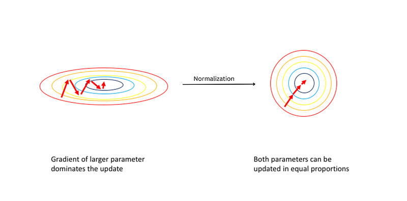 | Title card: Normalization Layers. |
| 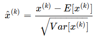 | Normalize each feature independently to have zero mean and unit variance. |
| 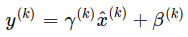 | Normalizing each feature to zero mean and unit variance could affect what the layer can represent. |
| 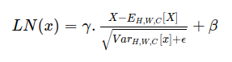 | Back to Top: Back to Top. |
| 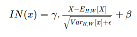 | Instance normalization was introduced in the paper Instance Normalization: The Missing Ingredient for Fast Stylization to improve style... |
| 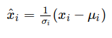 | All normalization layers can be defined by the following computation. |
| 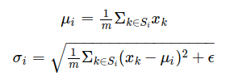 | where μi and σi are mean and standard deviation. |
| 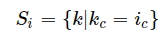 | Batch Normalization. |
| 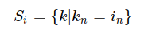 | Layer Normalization. |
| 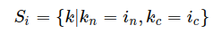 | Instance Normalization. |
| 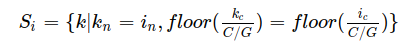 | Group Normalization. |
| 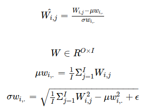 | Back to Top. |
## Related

- [[Papers Explained Corpus]]
- [[Document AI]]
- [[Synthetic Data]]
- [[Model Compression and Efficiency]]
- [[Papers Explained Review 09 - Attention Layers]]
- [[Papers Explained Review 11 - Auto Encoders]]

#summary #topic
