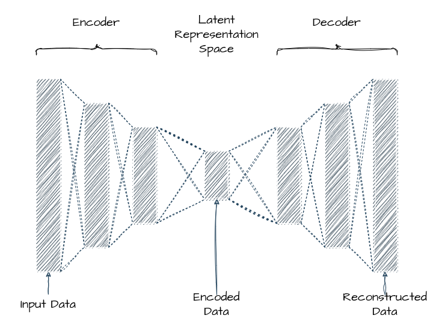

# Papers Explained Review 11 - Auto Encoders

Autoencoders are a type of neural network architecture used for unsupervised learning and dimensionality reduction. They are primarily designed to learn efficient representations of input data by compressing it into a lower-dimensional latent space and then reconstructing the original data from this compressed representation.

This page ingests the source article into the wiki and connects it to [[Papers Explained Corpus]], [[Model Compression and Efficiency]], [[Document AI]].

## Source Metadata

- Source file: `raw/2024-12-31_Papers-Explained-Review-11--Auto-Encoders-3b8f08b4eac0.html`
- Source title: Papers Explained Review 11: Auto Encoders
- Published: 2024-12-31
- Canonical: [https://medium.com/@ritvik19/papers-explained-review-11-auto-encoders-3b8f08b4eac0](https://medium.com/@ritvik19/papers-explained-review-11-auto-encoders-3b8f08b4eac0)

## Key Ideas

- [Sequence to Sequence Auto Encoders](#73e0)
- Autoencoders are a type of neural network architecture used for unsupervised learning and dimensionality reduction.
- The architecture of an autoencoder consists of two main components: an encoder and a decoder. The encoder takes the input data and transforms it into a lower-dimensional representation, which is typically called the latent or bottleneck representation.
- Once the input data is encoded into the latent space, the decoder part of the autoencoder takes over. The decoder aims to reconstruct the original data from the compressed representation.
- During training, the autoencoder learns to minimize the difference between the input data and the reconstructed output.

## Notes

## Table of Contents

- [Auto Encoders](#b8a0)

- [Sparse Auto Encoders](#f605)

- [K Sparse Auto Encoders](#23b0)

- [Contractive Auto Encoders](#23b3)

- [Convolutional Auto Encoders](#59a1)

- [Sequence to Sequence Auto Encoders](#73e0)

- [Denoising Auto Encoders](#1829)

- [Variational Auto Encoders](#a626)

- [Masked Auto Encoders](#2247)

## Auto Encoders

Autoencoders are a type of neural network architecture used for unsupervised learning and dimensionality reduction. They are primarily designed to learn efficient representations of input data by compressing it into a lower-dimensional latent space and then reconstructing the original data from this compressed representation. In simple terms, autoencoders learn to encode the essence of the input data and then decode it back to its original form.

The architecture of an autoencoder consists of two main components: an encoder and a decoder. The encoder takes the input data and transforms it into a lower-dimensional representation, which is typically called the latent or bottleneck representation. This process involves a series of hidden layers that progressively reduce the dimensionality of the input data. The last hidden layer of the encoder is responsible for creating the compressed representation.

Once the input data is encoded into the latent space, the decoder part of the autoencoder takes over. The decoder aims to reconstruct the original data from the compressed representation. It consists of a series of hidden layers that gradually expand the dimensionality of the latent representation, mirroring the reduction performed by the encoder. The final output layer of the decoder generates the reconstructed data.

During training, the autoencoder learns to minimize the difference between the input data and the reconstructed output. This is typically done by using a loss function, such as mean squared error, to measure the dissimilarity between the original and reconstructed data. By minimizing this loss, the autoencoder adjusts the weights and biases of its layers to improve its ability to reconstruct the input data accurately.

The power of autoencoders lies in their ability to learn meaningful representations of the input data in an unsupervised manner. By compressing the data into a lower-dimensional latent space, they can capture the most important features or patterns in the data. This can be particularly useful for tasks such as data compression, denoising, anomaly detection, and dimensionality reduction.

[Back to Top](#9ec6)

## Sparse Auto Encoders

A sparse autoencoder is a type of autoencoder that incorporates a sparsity constraint on the hidden layer’s activations. the sparsity constraint encourages the hidden units to be mostly inactive or “sparse.” This means that only a small subset of the hidden units should be active or have non-zero values for a given input. By promoting sparsity, the autoencoder is forced to learn more meaningful and discriminative features from the data.

To achieve sparsity, the sparse autoencoder typically employs one of two approaches:

- L1 Regularization: This method adds an L1 penalty term to the loss function during training. The L1 penalty encourages most of the hidden units to have zero or very small activations. By minimizing the L1 regularization term, the autoencoder learns to activate only a sparse set of hidden units, resulting in a more concise representation.

- Kullback-Leibler (KL) Divergence: Instead of using L1 regularization, the KL divergence approach directly incorporates a sparsity penalty term into the loss function. The KL divergence measures the difference between the activation probability of each hidden unit and a predefined target sparsity. During training, the autoencoder tries to minimize the KL divergence, which encourages the hidden units to match the target sparsity.

[Back to Top](#9ec6)

## K Sparse Auto Encoders

The k-sparse autoencoder is based on an autoencoder with linear activation functions and tied weights.

In the feedforward phase, after computing the hidden code z = W⊺x+b, rather than reconstructing the input from all of the hidden units, we identify the k largest hidden units and set the others to zero. This can be done by sorting the activities or by using ReLU hidden units with thresholds that are adaptively adjusted until the k larges activities are identified. This results in a vector of activities with the support set of supp_k (W⊺x+b). Note that once the k largest activities are selected, the function computed by the network is linear. So the only non-linearity comes from the selection of the k largest activities. This selection step acts as a regularizer that prevents the use of an overly large number of hidden units when reconstructing the input.

Once the weights are trained, the sparse representations obtained can be used for downstream classification tasks. However, it has been found that using a slightly different encoding for classification than the one used for training yields better results. For example, instead of using only the k largest elements, using the αk largest hidden units (where α ≥ 1) selected through validation data improves performance. Therefore, during the test phase, the support set defined by suppαk(W⊺x + b) is used.

[Back to Top](#9ec6)

## Contractive Auto Encoders

Contractive autoencoders (CAEs) are a variant of autoencoders that incorporate an additional regularization term to the loss function during training. The purpose of this regularization term is to encourage the learned latent space to be robust to small perturbations in the input space. In other words, a contractive autoencoder aims to learn a compressed representation of the data that is invariant to small variations or noise.

The regularization term in contractive autoencoders is typically based on the concept of the Jacobian matrix, which measures the sensitivity of the hidden units of the encoder to changes in the input. By penalizing the norm (e.g., Frobenius norm or L2 norm) of the Jacobian matrix, the contractive autoencoder encourages the encoder to have smaller derivatives with respect to the input space. This results in a more stable and robust representation, as even small changes in the input will have minimal effect on the encoded representation.

The regularization term is added to the loss function during training, effectively balancing the reconstruction loss (the difference between the input and the reconstructed output) with the regularization term. The overall objective of the contractive autoencoder is to minimize this combined loss.

By incorporating the regularization term, contractive autoencoders can learn more robust representations that capture the underlying structure of the data while being less sensitive to small variations or noise. This can be particularly useful in scenarios where the input data is noisy or contains subtle patterns that are important for the learning task.

[Back to Top](#9ec6)

## Convolutional Auto Encoders

Convolutional autoencoders are a type of autoencoder architecture that utilizes convolutional neural networks (convnets) as both the encoder and the decoder components. Autoencoders are neural networks designed to learn a compressed representation of input data and then reconstruct the original input from this compressed representation.

In the case of convolutional autoencoders, the input data is typically images or other spatial data, and convnets are used to capture the spatial structure and patterns present in the data. Convolutional layers in the encoder perform feature extraction by applying a set of learnable filters (kernels) to the input data, capturing different visual features at multiple spatial scales.

The encoder part of the convolutional autoencoder gradually reduces the spatial dimensions of the input while increasing the number of feature channels, effectively compressing the information. This reduction in spatial dimensions is typically achieved through convolutional layers with stride greater than 1 and/or pooling layers.

Once the input is encoded into a compressed representation, the decoder part of the convolutional autoencoder aims to reconstruct the original input from this compressed representation. The decoder utilizes convolutional layers to upsample the encoded features, gradually increasing the spatial dimensions while decreasing the number of feature channels. This process is often achieved through transposed convolutions (also known as deconvolutions) or upsampling layers.

[Back to Top](#9ec6)

## Sequence to Sequence Auto Encoders

A sequence-to-sequence autoencoder is an implementation of an autoencoder that is specifically designed to handle sequential data using a recurrent architecture.

The encoder is typically implemented using recurrent neural networks (RNNs), such as Long Short-Term Memory (LSTM) or Gated Recurrent Unit (GRU) networks. The encoder processes the input sequence step by step, capturing the temporal dependencies and encoding them into a fixed-length vector or a sequence of hidden states.

Similar to the encoder, the decoder is also implemented using an RNN. It takes the encoded representation or hidden states and generates the output sequence step by step, leveraging the learned dependencies to produce an output that resembles the input sequence.

[Back to Top](#9ec6)

## Denoising Auto Encoders

Denoising autoencoders are a variant of traditional autoencoders that are specifically designed to learn and reconstruct clean data from noisy or corrupted inputs. The main idea behind denoising autoencoders is to train a neural network to remove noise or corruption from data by learning a latent representation of the underlying clean data.

To train a denoising autoencoder, noise is deliberately added to the input data. This noise can be in various forms, such as random pixel values, Gaussian noise, or dropout (randomly setting some input values to zero). The noisy data is then fed into the encoder.

During training, the denoising autoencoder aims to minimize the reconstruction error between the output of the decoder and the original, clean data. The network learns to remove the noise and capture the essential information needed for reconstruction.

The denoising autoencoder learns a meaningful latent representation of the clean data during the training process. The latent space captures the most important features or patterns in the data, making it a useful tool for data compression, denoising, and even feature extraction.

[Back to Top](#9ec6)

## Variational Auto Encoders

Variational autoencoders (VAEs) are generative models that combine ideas from autoencoders and probabilistic modeling. VAEs are capable of learning a latent representation (a compressed and abstract representation) of input data, and they can generate new samples that resemble the training data.

The encoder takes an input data point and maps it to a latent space. Instead of directly outputting the latent vector, the encoder outputs the parameters of a probability distribution in the latent space. This distribution is typically assumed to be a multivariate Gaussian. The encoder learns to capture the important features of the input data in this distribution.

To generate a latent vector from the learned distribution, the reparameterization trick is used. Instead of sampling directly from the distribution outputted by the encoder, a sample is obtained by sampling from a standard Gaussian distribution and then transforming it using the mean and variance from the encoder’s output.

The decoder takes a latent vector as input and maps it back to the original data space.

The objective of the VAE is to maximize the evidence lower bound (ELBO), which serves as a proxy for the log-likelihood of the data. The ELBO consists of two terms: the reconstruction loss, which measures how well the decoder reconstructs the input data, and the KL divergence, which measures the difference between the learned distribution in the latent space and a prior distribution (usually a standard Gaussian). Minimizing the KL divergence encourages the learned latent space to be close to the prior distribution, promoting generative capabilities.

[Back to Top](#9ec6)

## Masked Auto Encoders

MAE masks random patches from the input image and reconstructs the missing patches in the pixel space. It has an asymmetric encoder-decoder design. The encoder operates only on the visible subset of patches (without mask tokens), and the decoder is lightweight and reconstructs the input from the latent representation along with mask tokens.

Following ViT, an image is divided into regular non-overlapping patches. Then a subset of patches is sampled and the remaining ones are masked.

The encoder is a ViT but applied only on visible, unmasked patches. Thus the encoder only operates on a small subset (~25%) of the full et. Masked patches are removed, no mask tokens are used. This allows is to train very large encoders with only a fraction of compute and memory. The full set is handled by a lightweight decoder.

The input to the MAE decoder is the full set of tokens consisting of (i) encoded visible patches, and (ii) mask tokens. Each mask token is a shared, learned vector that indicates the presence of a missing patch to be predicted. Positional embeddings are added to all tokens in this full set; without this, mask tokens would have no information about their location in the image. The decoder has another series of Transformer blocks. The MAE decoder is only used during pre-training to perform the image reconstruction task. Therefore, the decoder architecture can be flexibly designed in a manner that is independent of the encoder design.

MAE reconstructs the input by predicting the pixel values for each masked patch. Each element in the decoder’s output is a vector of pixel values representing a patch. The last layer of the decoder is a linear projection whose number of output channels equals the number of pixel values in a patch. The decoder’s output is reshaped to form a reconstructed image. The loss function computes the mean squared error (MSE) between the reconstructed and original images in the pixel space. Loss is computed only on masked patches, similar to BERT.

[Read More](https://ritvik19.medium.com/papers-explained-28-masked-autoencoder-38cb0dbed4af)

[Back to Top](#9ec6)

## References

- [Reducing the Dimensionality of Data with Neural Networks](https://www.science.org/doi/10.1126/science.1127647)

- [Sparse Autoencoder](https://web.stanford.edu/class/cs294a/sparseAutoencoder.pdf)

- [k-Sparse Autoencoders](https://arxiv.org/abs/1312.5663)

- [Contractive Auto-Encoders: Explicit Invariance During Feature Extraction](https://icml.cc/2011/papers/455_icmlpaper.pdf)

- [A Better Autoencoder for Image: Convolutional Autoencoder](http://users.cecs.anu.edu.au/~Tom.Gedeon/conf/ABCs2018/paper/ABCs2018_paper_58.pdf)

- [Sequence To Sequence Autoencoders for Unsupervised Representation Learning from Audio](https://dcase.community/documents/challenge2017/technical_reports/DCASE2017_Amiriparian_173.pdf)

- [Extracting and Composing Robust Features with Denoising Autoencoders](https://www.cs.toronto.edu/~larocheh/publications/icml-2008-denoising-autoencoders.pdf)

- [Auto-Encoding Variational Bayes](https://arxiv.org/abs/1312.6114)

- [Masked Autoencoders Are Scalable Vision Learners](https://arxiv.org/abs/2111.06377)

## Figures

Figures from the Medium HTML export (`raw/2024-12-31_Papers-Explained-Review-11--Auto-Encoders-3b8f08b4eac0.html`); local copies under `wiki/assets/papers-explained-review-11-auto-encoders/` when download succeeded.

| Figure | Caption |
|--------|---------|
|  | Title card: Auto Encoders. |
## Related

- [[Papers Explained Corpus]]
- [[Model Compression and Efficiency]]
- [[Document AI]]
- [[Papers Explained Review 10 - Normalization Layers]]
- [[Papers Explained Review 12 - LLMs for Maths]]

#summary #topic
