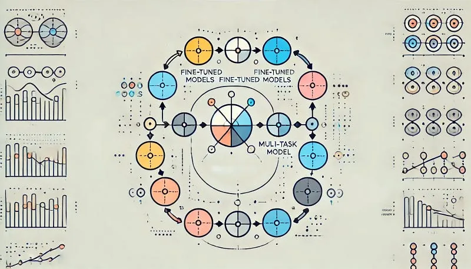
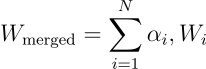
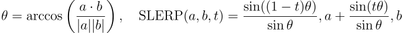
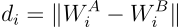
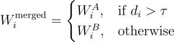
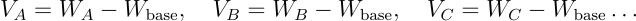
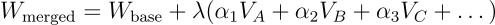
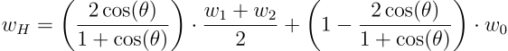
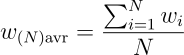
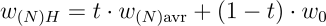

# Papers Explained Review 13 - Model Merging

Model merging techniques offer a powerful way to combine multiple fine-tuned models, leveraging their strengths to enhance performance without additional training. This article explores various model merging strategies and provides sample configurations using MergeKit, demonstrating how to apply these techniques in real-world scenarios.

This page ingests the source article into the wiki and connects it to [[Papers Explained Corpus]], [[Papers Explained Corpus]].

## Source Metadata

- Source file: `raw/2025-04-28_Papers-Explained-Review-13--Model-Merging-d0db49797b90.md`
- Source title: Papers Explained Review 13: Model Merging
- Published: 2025-04-28
- Canonical: [https://medium.com/@ritvik19/papers-explained-review-13-model-merging-d0db49797b90](https://medium.com/@ritvik19/papers-explained-review-13-model-merging-d0db49797b90)

## Key Ideas

- Model merging techniques offer a powerful way to combine multiple fine-tuned models, leveraging their strengths to enhance performance without additional training.
- [Spherical Linear Interpolation (SLERP)](#745f)
- [Trim, Elect Sign & Merge (TIES)](#5901)
- [Drop and rEscaLe via sampLing with mAgnitude (DELLA)](#2e71)
- [Select, Calculate, and Erase (SCE)](#5ed3)

## Notes

Model merging techniques offer a powerful way to combine multiple fine-tuned models, leveraging their strengths to enhance performance without additional training. This article explores various model merging strategies and provides sample configurations using MergeKit, demonstrating how to apply these techniques in real-world scenarios. Whether you’re optimizing model ensembles or exploring weight-space geometry, this guide will help you navigate the landscape of model merging effectively.

## Table of contents

- [Model Soup](#29bf)

- [Spherical Linear Interpolation (SLERP)](#745f)

- [Nearswap](#1bdb)

- [Task Arithmetic](#38ff)

- [Trim, Elect Sign & Merge (TIES)](#5901)

- [Drop And REscale (DARE)](#ae3d)

- [Model Breadcrumbs](#4aca)

- [Model Stock](#2570)

- [NuSLERP (Normalized SLERP)](#e2e2)

- [Drop and rEscaLe via sampLing with mAgnitude (DELLA)](#2e71)

- [Select, Calculate, and Erase (SCE)](#5ed3)

## Model Soup (linear)

Model Soup refers to the simple idea of averaging model weights across multiple fine‑tuned models. The underlying assumption is that models fine‑tuned from the same pre-trained backbone (and on related tasks or domains) lie in a “connected” region of parameter space so that their simple linear combination can yield improved generalization.

Given a set of models with weights (W_1, W_2,…, W_N) and nonnegative coefficients (α_1, α_2, … α_N) that sum to 1, the merged model is:

Model Soups: Averaging Weights of Multiple Fine-Tuned Models Improves Accuracy Without Retraining [2203.05482](https://arxiv.org/abs/2203.05482).

### Parameters

- weight (α) — relative (or absolute if normalize=False) weighting of a given tensor

- normalize — if true, the weights of all models contributing to a tensor will be normalized. Default behavior.

```text
models:
-
model:
meta-llama/Llama-3.1-8B-Instruct
parameters:
weight:
0.5
-
model:
NousResearch/Hermes-3-Llama-3.1-8B
parameters:
weight:
0.15
-
model:
deepseek-ai/DeepSeek-R1-Distill-Llama-8B
parameters:
weight:
0.35
merge_method:
linear
dtype:
float16
```

[Back To Top](#cd1c)

## Spherical Linear Interpolation (slerp)

SLERP performs interpolation along a great circle on the sphere of normalized weight vectors. Rather than a straight (Euclidean) interpolation, it preserves angular relationships. This is especially useful when weight vectors are normalized, ensuring that the interpolated model stays “on the manifold.”

For two weight vectors (a) and (b) and an interpolation parameter (t in [0,1]):

### Parameters

- t (Interpolation Factor): Controls the position along the great circle between the two models.

```text
models:
-
model:
deepseek-ai/DeepSeek-R1-Distill-Llama-8B
merge_method:
slerp
base_model:
meta-llama/Llama-3.1-8B-Instruct
parameters:
t:
0.5
dtype:
float16
```

[Back To Top](#cd1c)

## Nearswap (nearswap)

“Nearswap” is designed to identify and leverage regions in the parameter space where two models are “close” (i.e. similar) while merging. In practice, the method partitions the model’s parameters (or layers) and then “swaps” or averages only those parameters whose difference is within a specified threshold.

- Compute the distance:

2. Merge based on the threshold τ:

### Parameters

- t (Similarity Threshold ()): Distance below which parameters are considered “near” and thus eligible for swapping.

```text
models:
-
model:
meta-llama/Llama-3.1-8B-Instruct
-
model:
deepseek-ai/DeepSeek-R1-Distill-Llama-8B
merge_method:
nearswap
base_model:
meta-llama/Llama-3.1-8B-Instruct
parameters:
t:
0.5
dtype:
float16
```

[Back To Top](#cd1c)

## Task Arithmetic (task_arithmetic)

Task Arithmetic leverages the idea that model parameters often encode “directions” related to specific tasks. By subtracting the common (shared) representation and adding a task-specific component, one can compose models that better perform a composite task.

Editing Models with Task Arithmetic [2212.04089](https://arxiv.org/abs/2212.04089).

### Parameters

- weight (α) — relative (or absolute if normalize=False) weighting of a given tensor

- normalize — if true, the weights of all models contributing to a tensor will be normalized. Default behavior.

- lambda — scaling factor applied after weighted sum of task vectors

```text
models:
-
model:
NousResearch/Hermes-3-Llama-3.1-8B
parameters:
weight:
0.3
-
model:
deepseek-ai/DeepSeek-R1-Distill-Llama-8B
parameters:
weight:
0.7
merge_method:
task_arithmetic
base_model:
meta-llama/Llama-3.1-8B-Instruct
parameters:
lambda:
0.5
dtype:
float16
```

[Back To Top](#cd1c)

## Trim, Elect Sign & Merge (ties)

The TIES-MERGING algorithm addresses interference issues when merging multiple task-specific models by employing a three-step process: Trim, Elect Sign, and Disjoint Merge. This process aims to create a merged model that effectively combines the knowledge from individual task-specific models while mitigating conflicting parameter updates.

- For each task vector, retain the top k% of parameters with the highest magnitudes and set the remaining (bottom (100 — k)%) to zero. This creates a trimmed task vector.

- For each parameter, calculate the total magnitude of positive and negative signs across all trimmed task vectors. Assign the sign with the larger total magnitude to the merged model’s sign vector.

- For each parameter, define a set containing task indices where the sign of the trimmed task vector agrees with the elected sign. Compute the disjoint mean by averaging the values of the parameter.

TIES-Merging: Resolving Interference When Merging Models [2306.01708](https://arxiv.org/abs/2306.01708).

### Parameters

- weight (α) — relative (or absolute if normalize=False) weighting of a given tensor

- normalize — if true, the weights of all models contributing to a tensor will be normalized. Default behavior.

- lambda — scaling factor applied after weighted sum of task vectors

- density (k) — fraction of weights in differences from the base model to retain

```text
models:
-
model:
NousResearch/Hermes-3-Llama-3.1-8B
parameters:
weight:
0.3
-
model:
deepseek-ai/DeepSeek-R1-Distill-Llama-8B
parameters:
weight:
0.7
merge_method:
ties
base_model:
meta-llama/Llama-3.1-8B-Instruct
parameters:
lambda:
0.5
density:
0.7
dtype:
float16
```

[Back To Top](#cd1c)

## Drop And REscale (DARE)

The DARE (Drop and Rescale) algorithm reduces redundancy in delta parameters (changes from pre-training to fine-tuning) of large language models. It randomly sets a proportion of delta parameters to zero and rescales the remaining ones by a factor of 1/(1-p), where p is the drop rate, then adds them back to the pre-trained parameters.

- Given a pre-trained LM with weights W_PRE and a fine-tuned LM for task t with weights W_SFT_t, the delta parameters (Δ_t) are computed.

- Randomly set a proportion p of the delta parameters to zero using a Bernoulli distribution. For each element in Δ_t, a random variable m_t is drawn from Bernoulli(p).

- The remaining non-zero delta parameters are rescaled by a factor of 1 / (1 — p) to compensate for the dropped values

- Finally, the rescaled delta parameters (Δ̂_t) are added back to the pre-trained weights W_PRE to obtain the DARE-adapted weights W_DARE_t

DARE can be used either with the sign consensus algorithm of TIES (dare_ties) or without (dare_linear).

Language Models are Super Mario: Absorbing Abilities from Homologous Models as a Free Lunch [2311.03099](https://arxiv.org/abs/2311.03099).

### Parameters (dare_ties)

- weight (α) — relative (or absolute if normalize=False) weighting of a given tensor

- normalize — if true, the weights of all models contributing to a tensor will be normalized. Default behavior.

- lambda — scaling factor applied after weighted sum of task vectors

- Density (k) — fraction of weights in differences from the base model to retain

### Parameters (dare_linear)

- weight (α) — relative (or absolute if normalize=False) weighting of a given tensor

- normalize — if true, the weights of all models contributing to a tensor will be normalized. Default behavior.

- lambda — scaling factor applied after weighted sum of task vectors

```text
models:
-
model:
NousResearch/Hermes-3-Llama-3.1-8B
parameters:
weight:
0.3
-
model:
deepseek-ai/DeepSeek-R1-Distill-Llama-8B
parameters:
weight:
0.7
merge_method:
dare_ties
base_model:
meta-llama/Llama-3.1-8B-Instruct
parameters:
lambda:
0.5
density:
0.7
dtype:
float16
```

```text
models:
-
model:
NousResearch/Hermes-3-Llama-3.1-8B
parameters:
weight:
0.3
-
model:
deepseek-ai/DeepSeek-R1-Distill-Llama-8B
parameters:
weight:
0.7
merge_method:
dare_linear
base_model:
meta-llama/Llama-3.1-8B-Instruct
parameters:
lambda:
0.5
dtype:
float16
```

[Back To Top](#cd1c)

## Model Breadcrumbs

An extension of task arithmetic that discards both small and extremely large differences from the base model. The Model Breadcrumbs algorithm can be used with (breadcrumbs_ties) or without (breadcrumbs) the sign consensus algorithm of TIES.

- Task Vector Creation: For each fine-tuned model corresponding to a specific task, calculate the difference between its weights and the original pre-trained foundation model’s weights. This difference vector is referred to as the task vector.

- Outlier and Negligible Perturbation Removal: Define two thresholds, β (left tail) and γ (right tail), representing percentages. Mask out (set to zero) the weights in the bottom β% and the top (100-γ)% of the sorted weights in each layer. This eliminates both large outliers and negligible perturbations.

- Combining Task Vectors: Aggregate the masked task vectors across all tasks by summing them.

- Scaling and Integration: Scale the summed task vectors by a strength parameter (α) and add them to the original pre-trained model’s weights.

Model Breadcrumbs: Scaling Multi-Task Model Merging with Sparse Masks [2312.06795](https://arxiv.org/abs/2312.06795).

### Parameters:

- weight (α) — relative (or absolute if normalize=False) weighting of a given tensor

- normalize — if true, the weights of all models contributing to a tensor will be normalized. Default behavior.

- lambda — scaling factor applied after weighted sum of task vectors

- density — fraction of weights in differences from the base model to retain

- gamma — fraction of largest magnitude differences to remove

Note that gamma corresponds with the parameter β described in the paper, while density is the final density of the sparsified tensors (related to γ and β by density = 1 — γ — β).

```text
models:
-
model:
NousResearch/Hermes-3-Llama-3.1-8B
parameters:
weight:
0.3
-
model:
deepseek-ai/DeepSeek-R1-Distill-Llama-8B
parameters:
weight:
0.7
merge_method:
breadcrumbs
base_model:
meta-llama/Llama-3.1-8B-Instruct
parameters:
lambda:
0.5
density:
0.9
gamma:
0.01
dtype:
float16
```

```text
models:
-
model:
NousResearch/Hermes-3-Llama-3.1-8B
parameters:
weight:
0.3
-
model:
deepseek-ai/DeepSeek-R1-Distill-Llama-8B
parameters:
weight:
0.7
merge_method:
breadcrumbs_ties
base_model:
meta-llama/Llama-3.1-8B-Instruct
parameters:
lambda:
0.5
density:
0.9
gamma:
0.01
dtype:
float16
```

[Back To Top](#cd1c)

## Model Stock (model_stock)

The Model Stock algorithm is a cost-efficient weight merging method that aims to improve model performance by approximating the center of weight distribution (µ) using a pre-trained model as an anchor point and a few fine-tuned models. It leverages the geometric properties of weight vectors, specifically the angle between them, to determine the optimal merging ratio.

- Plane Definition: A plane is defined using the pre-trained model’s weight vector (w0) and two fine-tuned models’ weight vectors (w1 and w2). This plane represents the search space for the merged weight.

- Perpendicular Foot Calculation: The algorithm aims to find the point on this plane (wH) that is closest to the center of the weight distribution (µ). This point is the perpendicular foot from µ to the plane.

θ is the angle between the two fine-tuned model weight vectors (w1 and w2).

wH is the merged weight vector.

w0 is the pre-trained model’s weight vector.

(w1 + w2)/2 represents the average of the two fine-tuned weight vectors which relates to w12 in the original text.

- Interpolation Ratio: The interpolation ratio t = 2 * cos(θ) / (1 + cos(θ)) determines the contribution of the averaged fine-tuned weights and the pre-trained weight to the merged weight. This ratio is solely dependent on the angle θ. A smaller angle means less reliance on the pre-trained model.

- Extension to N Fine-tuned Models:

t = N * cos(θ) / (1 + (N — 1) * cos(θ))

θ is the angle between the pre-trained model and the N fine-tuned models.

w(N)H is the merged weight vector.

Model Stock: All we need is just a few fine-tuned models [2403.19522](https://arxiv.org/abs/2403.19522).

### Parameters:

- filter_wise: if true, weight calculation will be per-row rather than per-tensor. Not recommended.

```text
models:
-
model:
NousResearch/Hermes-3-Llama-3.1-8B
-
model:
deepseek-ai/DeepSeek-R1-Distill-Llama-8B
merge_method:
model_stock
base_model:
meta-llama/Llama-3.1-8B-Instruct
dtype:
float16
```

[Back To Top](#cd1c)

## NuSLERP (nuslerp)

NuSLERP modifies standard SLERP by explicitly normalizing the weight vectors before interpolation. This “normalized” version is particularly useful when models have been trained with different scaling (e.g. due to adaptive normalization layers) so that the interpolation does not “mix” incompatible scales.

### Parameters:

- weight: relative weighting of a given tensor

- nuslerp_flatten: set to false to do row-wise/column-wise interpolation instead of treating tensors as vectors

- nuslerp_row_wise: SLERP row vectors instead of column vectors

```text
models:
-
model:
deepseek-ai/DeepSeek-R1-Distill-Llama-8B
parameters:
weight:
0.5
-
model:
NousResearch/Hermes-3-Llama-3.1-8B
parameters:
weight:
0.5
merge_method:
nuslerp
base_model:
meta-llama/Llama-3.1-8B-Instruct
dtype:
float16
```

[Back To Top](#cd1c)

## Drop and rEscaLe via sampLing with mAgnitude (DELLA)

DELLA can be used with (della) or without (della_linear) the sign elect step of TIES.

- Drop: This step uses a novel magnitude-based pruning approach called MAGPRUNE:

- Rank delta parameters for each node in the neural network based on their magnitude (absolute value).

- Assign a drop probability (Pd) to each parameter inversely proportional to its magnitude. Larger magnitude parameters have a lower probability of being dropped. This is controlled by a hyperparameter ∆ that determines the step size between probabilities.

- A hyperparameter ‘p’ controls the average drop probability. ‘ϵ’ influences the minimum drop probability (pmin = p — ϵ/2).

- Stochastically drop delta parameters based on their assigned probabilities. A parameter is set to zero if dropped.

- Scaling: Rescale the remaining (undropped) delta parameters by 1 / (1 — pi) where pi is the drop probability of the i-th parameter. This compensates for the effect of dropping parameters and ensures the model’s output embeddings are preserved.

2. Elect: Determine the dominant direction for each parameter position by calculating the sign of the sum of all corresponding delta parameters across experts. Select (elect) only the delta parameters at position that have the same sign as the dominant direction.

3. Fuse: Calculate the average of the elected delta parameters for each position.

4. Obtain Merged Model: Add the fused delta parameters (scaled by a factor λ) to the base model’s parameters.

DELLA-Merging: Reducing Interference in Model Merging through Magnitude-Based Sampling [2406.11617](https://arxiv.org/abs/2406.11617).

### Parameters:

- weight (α) — relative (or absolute if normalize=False) weighting of a given tensor

- normalize — if true, the weights of all models contributing to a tensor will be normalized. Default behavior.

- lambda — scaling factor applied after weighted sum of task vectors

- density — fraction of weights in differences from the base model to retain

- epsilon — maximum change in drop probability based on magnitude. Drop probabilities assigned will range from density — epsilon to density + epsilon. (When selecting values for density and epsilon, ensure that the range of probabilities falls within 0 to 1)

```text
models:
-
model:
NousResearch/Hermes-3-Llama-3.1-8B
parameters:
weight:
0.3
-
model:
deepseek-ai/DeepSeek-R1-Distill-Llama-8B
parameters:
weight:
0.7
merge_method:
della
base_model:
meta-llama/Llama-3.1-8B-Instruct
parameters:
lambda:
0.5
density:
0.7
epsilon:
0.01
dtype:
float16
```

```text
models:
-
model:
NousResearch/Hermes-3-Llama-3.1-8B
parameters:
weight:
0.3
-
model:
deepseek-ai/DeepSeek-R1-Distill-Llama-8B
parameters:
weight:
0.7
merge_method:
della_linear
base_model:
meta-llama/Llama-3.1-8B-Instruct
parameters:
lambda:
0.5
density:
0.7
epsilon:
0.01
dtype:
float16
```

[Back To Top](#cd1c)

## Select, Calculate, and Erase (sce)

The SCE (Select, Calculate, Erase) method is a technique for merging multiple target LLMs that share the same architecture and scale but have been individually fine-tuned with knowledge from different source LLMs. It operates on “fusion vectors,” which represent the difference in weights between a pivot LLM and each target LLM after the pairwise knowledge fusion stage.

- For each parameter matrix in the set of fusion vectors, select the top k% of elements with the highest variance across the different target LLMs.

- For each parameter matrix, calculate the merging coefficient for each target LLM as the sum of squares of the selected elements in its corresponding filtered fusion vector, normalized by the total sum of squares across all target LLMs for that matrix.

- For each parameter in the filtered fusion vectors, sum the values across all target LLMs. If the sum for a given parameter is positive (or negative), set all negative (or positive) values for that parameter to zero. This eliminates conflicting update directions.

- After the SCE process, the final merged LLM’s parameter matrix is calculated as Task Arithmetic:

FuseChat: Knowledge Fusion of Chat Models [2408.07990](https://arxiv.org/abs/2408.07990).

### Parameters:

- weight (α) — relative (or absolute if normalize=False) weighting of a given tensor

- normalize — if true, the weights of all models contributing to a tensor will be normalized. Default behavior.

- lambda— scaling factor applied after weighted sum of task vectors

- select_topk — fraction of elements with the highest variance in the delta parameters to retain.

```text
models:
-
model:
NousResearch/Hermes-3-Llama-3.1-8B
parameters:
weight:
0.3
-
model:
deepseek-ai/DeepSeek-R1-Distill-Llama-8B
parameters:
weight:
0.7
merge_method:
sce
base_model:
meta-llama/Llama-3.1-8B-Instruct
parameters:
lambda:
0.5
select_topk:
0.7
dtype:
float16
```

[Back To Top](#cd1c)

## References

- Model Soups: Averaging Weights of Multiple Fine-Tuned Models Improves Accuracy Without Retraining [2203.05482](https://arxiv.org/abs/2203.05482)

- Editing Models with Task Arithmetic [2212.04089](https://arxiv.org/abs/2212.04089)

- TIES-Merging: Resolving Interference When Merging Models [2306.01708](https://arxiv.org/abs/2306.01708)

- Language Models are Super Mario: Absorbing Abilities from Homologous Models as a Free Lunch [2311.03099](https://arxiv.org/abs/2311.03099)

- Model Breadcrumbs: Scaling Multi-Task Model Merging with Sparse Masks [2312.06795](https://arxiv.org/abs/2312.06795)

- Model Stock: All we need is just a few fine-tuned models [2403.19522](https://arxiv.org/abs/2403.19522)

- DELLA-Merging: Reducing Interference in Model Merging through Magnitude-Based Sampling [2406.11617](https://arxiv.org/abs/2406.11617)

- FuseChat: Knowledge Fusion of Chat Models [2408.07990](https://arxiv.org/abs/2408.07990)

## Figures

Figures from the Medium HTML export (`raw/2025-04-28_Papers-Explained-Review-13--Model-Merging-d0db49797b90.md`); local copies under `wiki/assets/papers-explained-review-13-model-merging/` when download succeeded.

| Figure | Caption |
|--------|---------|
|  | Title card: Model Merging. |
|  | Given a set of models with weights (W_1, W_2,…, W_N) and nonnegative coefficients (α_1, α_2, … α_N) that sum to 1, the merged model is. |
|  | For two weight vectors (a) and (b) and an interpolation parameter (t in [0,1]). |
|  | 2. Merge based on the threshold τ. |
|  | 2. Merge based on the threshold τ. |
|  | Task Arithmetic leverages the idea that model parameters often encode “directions” related to specific tasks. |
|  | Task Arithmetic leverages the idea that model parameters often encode “directions” related to specific tasks. |
|  | Back To Top: θ is the angle between the two fine-tuned model weight vectors (w1 and w2). |
|  | (w1 + w2)/2 represents the average of the two fine-tuned weight vectors which relates to w12 in the original text. |
|  | (w1 + w2)/2 represents the average of the two fine-tuned weight vectors which relates to w12 in the original text. |
## Related

- [[Papers Explained Corpus]]
- [[Papers Explained 355 - OpenMath Nemotron]]
- [[Papers Explained 356 - CLIMB]]

#summary #topic
