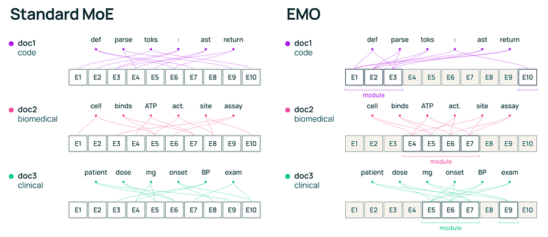
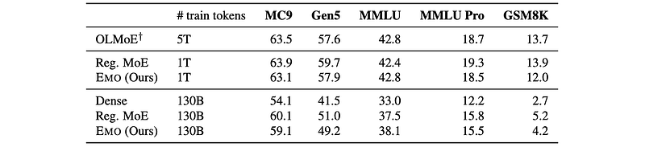
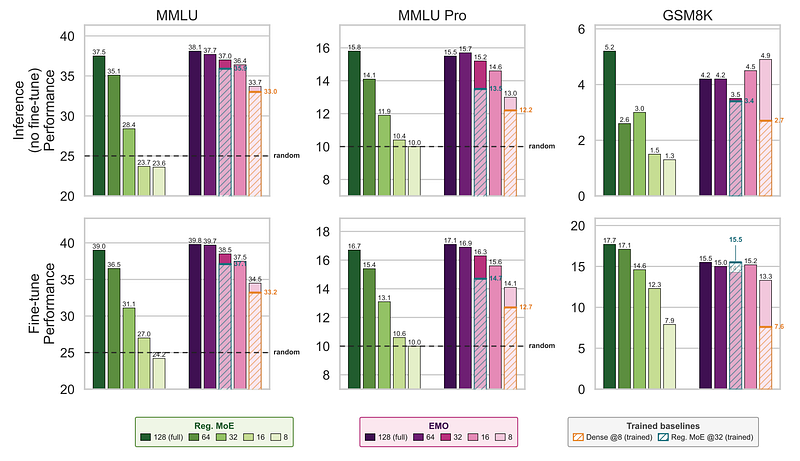
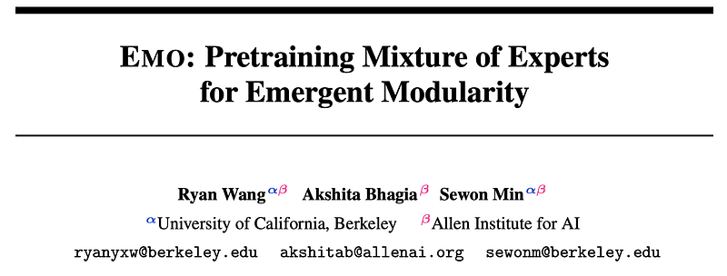

# Papers Explained: EMO

EMO is a mixture-of-experts pretraining design that encourages emergent, document-level modularity so selected expert subsets can be used at inference with much smaller quality loss than standard MoEs.

This page ingests the source article into the wiki and connects it to [[Papers Explained Corpus]], [[Mixture of Experts]], [[Large Language Models]], [[Model Compression and Efficiency]], and [[EMO]].

## Source Metadata

- Source file: `raw/emo/full-article.html`
- Source title: Papers Explained: EMO
- Exported: 2026-05-18
- Canonical: [https://medium.com/p/9ab88479e1f2](https://medium.com/p/9ab88479e1f2)
- Paper: [EMO: Pretraining Mixture of Experts for Emergent Modularity](https://arxiv.org/abs/2605.06663)

## Summary

The article presents [[EMO]] as an MoE training method aimed at making modularity a first-class objective rather than a hoped-for side effect. Standard [[Mixture of Experts]] models route tokens sparsely, but their experts often specialize around low-level lexical patterns. As a result, dropping or isolating expert subsets at inference can cause large quality regressions even when the subset appears relevant to a task.

EMO changes the training constraint: for each document, the model computes an average routing distribution, selects a document-level expert pool, and forces every token in that document to choose active experts only from that pool. The weak supervision comes from document boundaries, based on the assumption that tokens in one document usually share a domain or style. This avoids hand-labeled semantic domains like math, biology, or code, while still nudging experts toward coherent domain-level specialization.

Two practical details matter. First, EMO uses global load balancing because document-level routing can fight standard micro-batch load balancing when only a few documents appear in a batch. Second, the expert pool size is sampled during pretraining so the model does not overfit to one fixed subset size and can support different inference budgets.

Experimentally, the article describes a 1B active / 14B total parameter MoE trained on 1T tokens from the OLMoE pretraining corpus plus a 50B-token annealing phase. Full-model EMO matches the standard MoE baseline, while selective expert use degrades far less: the article reports about a 1% drop when retaining 25% of experts and about a 3% drop at 12.5%, whereas standard MoEs lose much more under subset restriction.

## Key Claims

- Standard MoEs are sparse at token level but not necessarily modular at task or domain level.
- Hand-defining expert domains is brittle because labels are costly, ambiguous, biased, and inflexible.
- Document boundaries can serve as weak supervision for coherent expert-pool specialization.
- EMO constrains all tokens in a document to route within a selected document expert pool.
- Global load balancing helps resolve the conflict between document-level pools and expert utilization.
- Randomizing pool size during pretraining improves inference-time flexibility across different subset sizes.
- EMO can preserve near full-model performance under selective expert use, unlike standard MoEs that degrade sharply when experts are pruned.

## Approach

### Standard MoE Baseline

The article starts from a decoder-only Transformer MoE where the feedforward sublayer is replaced by routed and shared experts. Each token hidden state is passed through a router, top-k routed experts are selected, and their outputs are combined with any shared expert outputs. Standard auxiliary losses encourage balanced expert utilization, but this does not ensure that an isolated expert subset remains useful for a downstream domain.

### Document Expert Pools

For EMO, every token first receives a routing distribution over all experts. Within each document, these distributions are averaged, and the top-d experts become the document expert pool. Token routing is then masked and renormalized so each token chooses only from the document's pool. In effect, EMO keeps token-level routing but bounds it by a higher-level document routing decision.

The pool size d controls modularity granularity. Smaller pools encourage stronger specialization but limit expressive capacity. Larger pools are more flexible but weaken the modular structure. Sampling d during pretraining is the source's answer to this tension.

## Evaluation

Full-model evaluation covers MC9, Gen5, MMLU, MMLU-Pro, and GSM8K. The main result is that EMO keeps the full model competitive with a standard MoE trained under the same broad recipe.

The more important evaluation is selective expert use. The source compares task- or domain-specific subsets selected by simple aggregation of routing probabilities or by Easy-EP. Standard MoEs degrade sharply when retaining only a fraction of experts, while EMO remains much closer to full-model quality.

## Questions & Gaps

- The article summarizes the result but does not deeply analyze whether document-boundary supervision can fail for mixed-topic, multi-domain, or synthetic documents.
- The source does not discuss serving-system complexity: EMO makes expert subsets more useful, but production routing, caching, and sharding constraints still matter.
- It would be useful to compare EMO directly with other modular MoE designs in the wiki, such as [[Papers Explained 528 - FlexOlmo]] and the Arcee Trinity article.

## Figures

Figures from the Medium HTML export (`raw/emo/full-article.html`); local copies are under `wiki/assets/emo/`.

| Figure | Caption |
|--------|---------|
|  | Title card for EMO. |
|  | Router logits over routed experts. |
|  | Standard MoE feedforward output equation. |
|  | Load-balancing loss for expert utilization. |
|  | Full MoE training objective with auxiliary losses. |
|  | Comparison of training a standard MoE and EMO. |
|  | Document-level selection of a top-d expert pool. |
|  | Masked and renormalized routing distribution within the document pool. |
|  | Routed expert selection after EMO pool masking. |
|  | EMO feedforward output equation. |
|  | Full-model evaluation. |
|  | Selective expert use of MoEs. |

## Entities

- [[EMO]] - the modular MoE pretraining method described by the source.
- [[Mixture of Experts]] - the sparse architecture family EMO modifies.
- [[Papers Explained 270 - OLMoE]] - related baseline/corpus lineage for open MoE pretraining.

## Related

- [[EMO]] - concept page for the method.
- [[Mixture of Experts]] - broader sparse-routing topic.
- [[Papers Explained 270 - OLMoE]] - open MoE architecture and pretraining reference point.
- [[Papers Explained 448 - Sparsely-Gated Mixture-of-Experts Layer]] - earlier sparse expert architecture.
- [[Model Compression and Efficiency]] - deployment motivation for selective expert use.
- [[Large Language Models]] - broader model-family context.

#summary #topic
