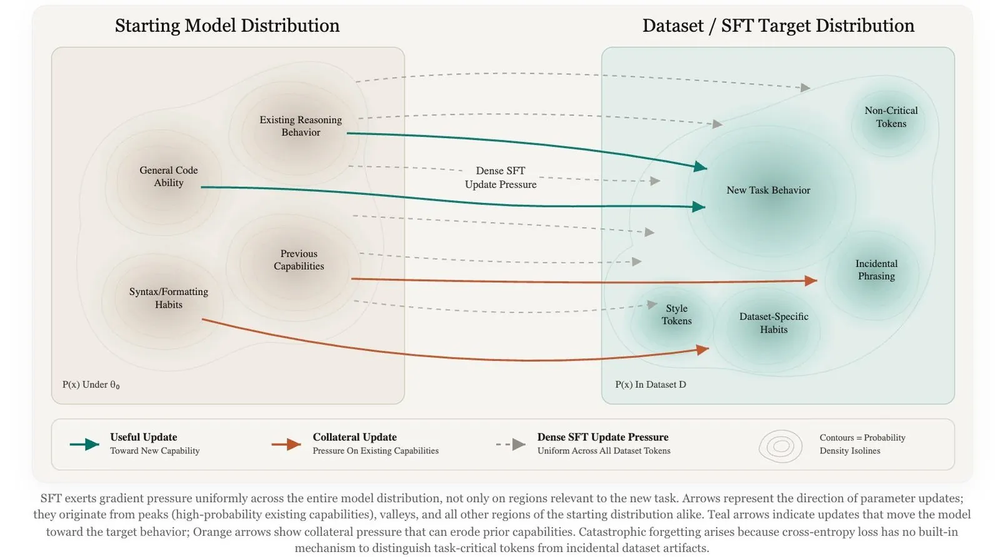
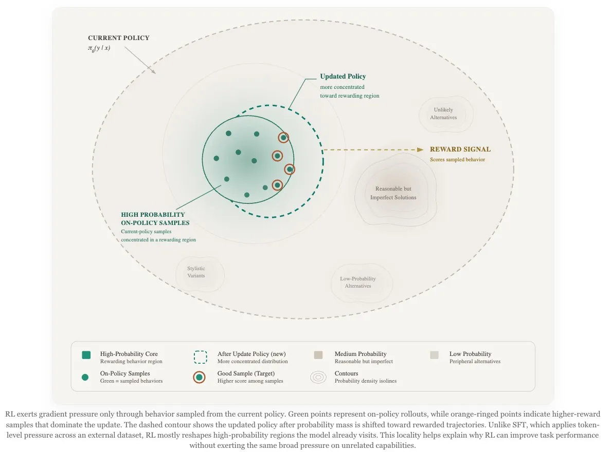
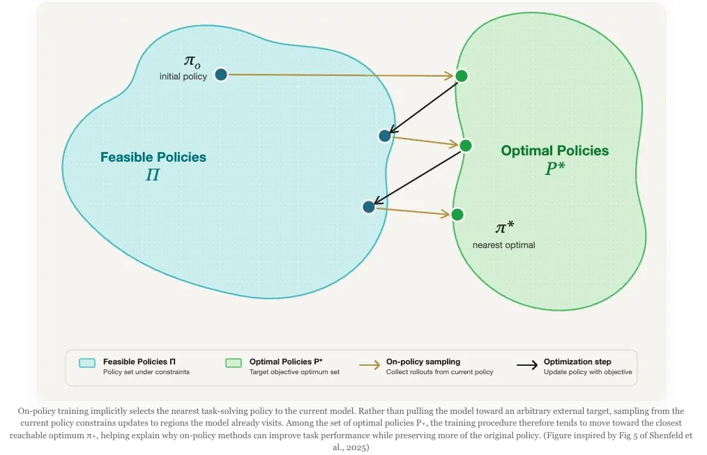
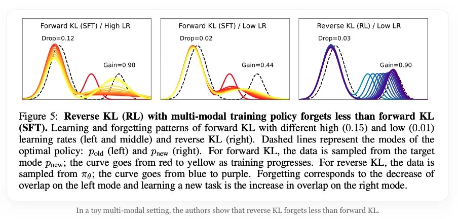
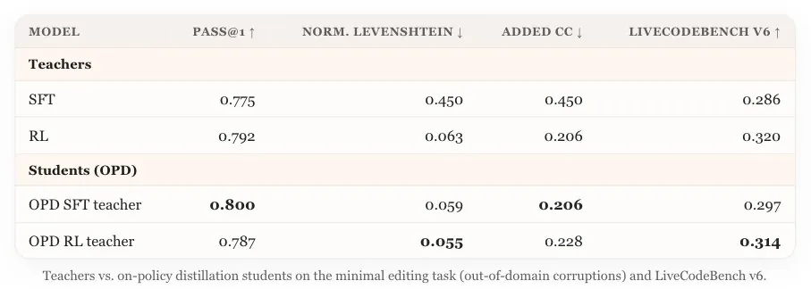
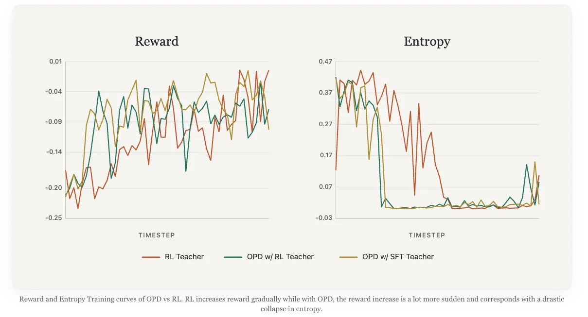
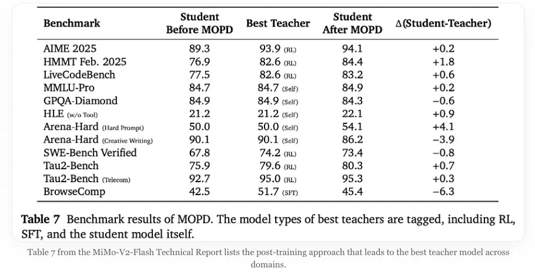
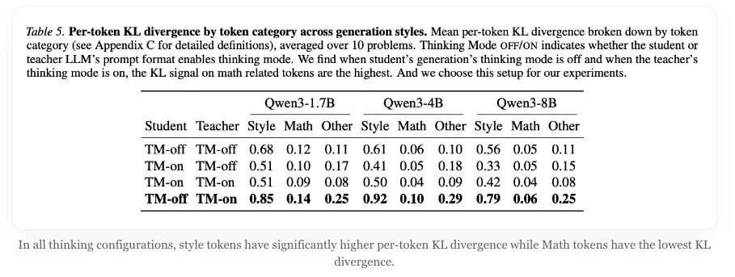
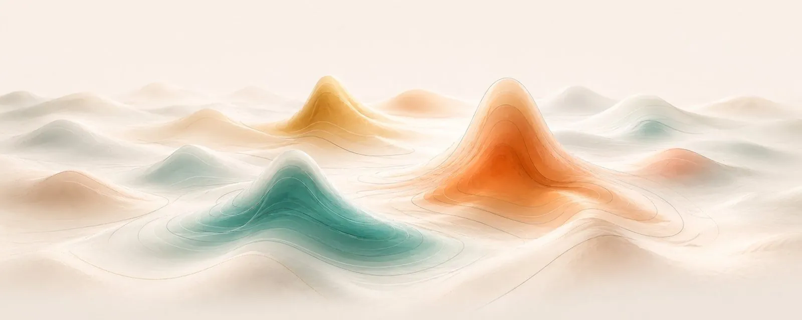

# SFT, RL, and On-Policy Distillation Visual Notes

#summary #topic

This X article by `nrehiew_` visually compares [[Supervised Fine-Tuning]], [[Reinforcement Learning]], and [[On-Policy Distillation]] as different ways of moving a model through policy space. Its main contribution to the wiki is a geometric intuition: SFT applies dense forward-KL-like pressure across a target dataset, RL applies sparse but compounding pressure on current-policy samples, and OPD/MOPD tries to get on-policy state coverage with a dense same-family teacher signal.

Source: [https://x.com/nrehiew_/article/2053482349300797526](https://x.com/nrehiew_/article/2053482349300797526); readable raw source preserved at `raw/x-nrehiew-on-policy-distillation/full-article.md`.

## Summary

The article frames SFT as a broad dataset-matching update. Because every target token can contribute to cross-entropy, SFT can teach useful task behavior quickly, but it can also push the model toward incidental phrasing, formatting, and dataset-specific habits. This extends [[Distillation Regimes Compared]] by showing why completion-style distillation via SFT is mechanically different from token-level teacher scoring on student rollouts.

RL is presented as the opposite tradeoff. It samples from the current policy, scores sampled behavior, and therefore updates the model in regions it already visits. That makes improvements able to compound over training rounds, but the signal is usually sparse and expensive. The article's on-policy geometry matches the wiki's existing account of [[Reinforcement Learning]] and [[Policy Gradient]]: the update is constrained by the rollout distribution rather than by an external static dataset.

[[On-Policy Distillation]] sits between those regimes. The student samples responses from its current policy, then a same-family teacher supplies dense token-level pressure, often reverse-KL flavored, on those sampled tokens. The article's OPD and MOPD figures support the existing wiki claim that OPD can be a consolidation or recovery phase after RL: it can transfer teacher strengths back into the student while staying closer to the student's own state distribution than offline SFT.

The cautionary thread is that dense teacher signals can still be biased and concentrated. The thinking-mode KL table shows style tokens carrying the highest per-token KL across configurations, so token-level distillation may spend much of its pressure on formatting or mode-control tokens rather than mathematical content. The reward/entropy plot also suggests OPD can raise reward quickly while collapsing entropy, making KL control and teacher calibration central.

## Key Claims

- SFT behaves like dense dataset-matching pressure: useful for cheap imitation, but prone to learning incidental style and dataset artifacts alongside task behavior.
- RL is sparse but on-policy, so updates are limited to sampled behavior and can compound as the current policy improves.
- OPD/MOPD combines on-policy samples with dense same-family teacher scoring, giving a middle ground between SFT's density and RL's state coverage.
- Reverse-KL-style updates can preserve prior modes better than forward-KL SFT in multimodal policy landscapes, at least in the toy example shown.
- Dense OPD signals are not automatically capability-focused: style and thinking-mode tokens can dominate token-level KL.
- Fast OPD reward gains may come with entropy collapse, so teacher choice, KL budgets, and rollout calibration are part of the method rather than implementation details.

## Figures

| Figure | Caption | Source Location |
| --- | --- | --- |
|  | SFT applies dense update pressure across a dataset target distribution, including useful task behavior and incidental style or dataset artifacts. | Article export |
|  | RL updates only through behavior sampled from the current policy, concentrating probability mass around rewarded on-policy trajectories. | Article export |
|  | On-policy training tends to move the model toward a nearby task-solving policy rather than an arbitrary external target. | Article export |
|  | A toy multimodal example showing reverse KL preserving an old mode better than forward-KL SFT while learning a new task mode. | Article export |
|  | Minimal-editing and LiveCodeBench results comparing teachers with OPD students trained from SFT and RL teachers. | Article export |
|  | Reward and entropy curves showing OPD reward rising sharply while entropy collapses compared with a gradual RL teacher run. | Article export |
|  | MiMo-V2-Flash MOPD benchmark table, with the student after MOPD sometimes matching or exceeding the tagged best teacher. | Article export |
|  | Per-token KL by token category under student and teacher thinking-mode configurations, with style tokens carrying the highest KL signal. | Article export |
|  | Abstract policy landscape illustration used as a visual separator in the article. | Article export |

## Entities

- [[Supervised Fine-Tuning]] — treated as the dense offline imitation baseline.
- [[Reinforcement Learning]] — treated as the sparse but compounding on-policy baseline.
- [[On-Policy Distillation]] — the article's central hybrid regime.
- [[KL Regularization]] — the lens for forward-KL, reverse-KL, entropy collapse, and teacher pressure.
- [[Model Distillation]] — broader family that OPD and completion-style SFT both connect to.

## Questions & Gaps

- The local X export did not include a clean static article body, so this page is grounded in the saved article figures plus the local reconstruction rather than a verbatim text archive.
- The figures cite results from minimal editing, MiMo-V2-Flash, and thinking-mode KL analyses; the underlying primary papers should be linked directly if they are later ingested.
- The article suggests OPD can be much more compute-efficient than RL in some settings, but the saved figures alone do not provide a full compute accounting.

## Related

- [[Distillation Regimes Compared]]
- [[On SFT RL and On-Policy Distillation]]
- [[On-Policy Distillation]]
- [[Model Distillation]]
- [[Supervised Fine-Tuning]]
- [[Reinforcement Learning]]
- [[Policy Gradient]]
- [[KL Regularization]]
- [[On-Policy Self-Distillation]]
