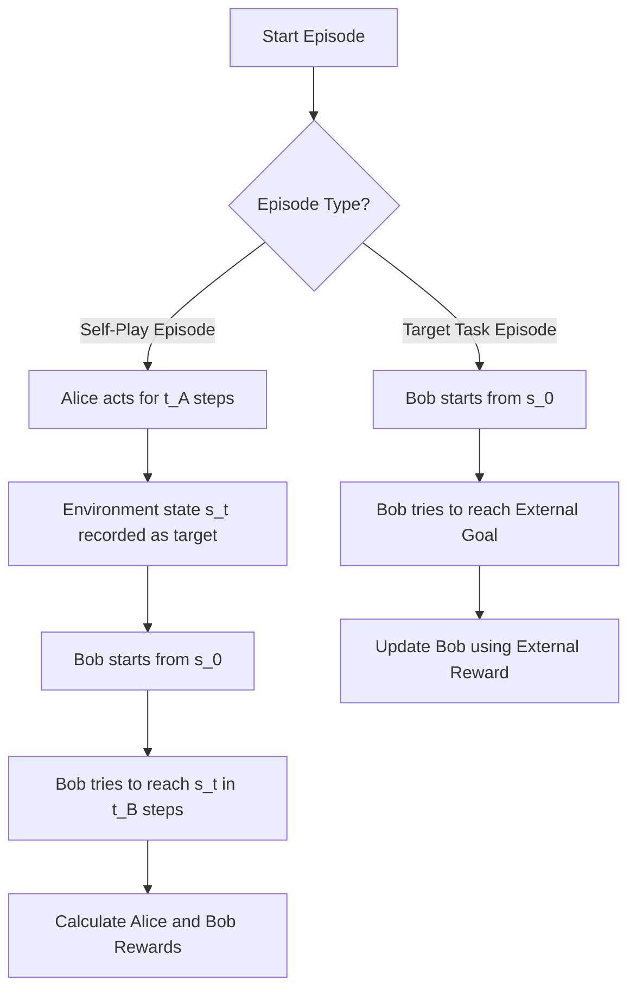

# Asymmetric Self-Play

**Type**: concept  
**Tags**: #concept

## Overview

**Asymmetric Self-Play** (Sukhbaatar et al., 2017) is an elegant, automated curriculum learning framework designed specifically for Reinforcement Learning. In this paradigm, two agents—**Alice** (the "teacher" or "proposer") and **Bob** (the "student" or "solver")—interact within the same environment. Alice is trained to search for states that are challenging for Bob but still solvable, while Bob is trained to replicate those states as efficiently as possible.

The most critical architectural feature of Asymmetric Self-Play is that **it guarantees that every generated task is solvable**. Because Alice must physically navigate the environment to establish a target state before Bob is challenged to reproduce it, the environment dynamics themselves prove that a valid path to the goal exists. This eliminates the risk of an automated teacher generating mathematically impossible goals, which is a common failure mode in generative models (like [[Goal GAN]]) or parametric distributions (like [[Automatic Domain Randomization]]).

---

## Game Setup and Episode Dynamics

Asymmetric Self-Play operates by dividing training into two distinct kinds of episodes:



### 1. Self-Play Episode
- **Alice's Turn**: Alice starts from a reset environment state $s_0$. She executes actions $a^A_1, a^A_2, \dots, a^A_{t_A}$ for $t_A$ steps, terminating at some state $s_{t_A}$. The environment state $s_{t_A}$ is marked as the target state for Bob.
- **Bob's Turn**: The environment is reset back to $s_0$ (or Bob is placed back at the beginning, depending on the implementation). Bob is shown the target state $s_{t_A}$ and must execute actions $a^B_1, a^B_2, \dots, a^B_{t_B}$ to reach $s_{t_A}$. 
- **Termination**: Bob's turn ends when he successfully matches $s_{t_A}$ or when he runs out of time ($t_B > t_{max} - t_A$).

### 2. Target Task Episode
- Bob is trained on the actual, final environment task (e.g., escaping a maze, picking up an object).
- Alice does not participate. Bob receives the standard external environment reward. This step ensures that Bob's capabilities translate from self-play practice to the target objective.

---

## Reward Formulation (The Asymmetry)

The incentives for Alice and Bob are asymmetric, establishing a natural competitive push-and-pull that grows the curriculum:

### Bob's Reward
Bob is penalized for every step he takes. He wants to reach the target state as fast as possible:

$$R_B = -\gamma \cdot t_B$$

Where $\gamma > 0$ is a step penalty coefficient, and $t_B$ is the number of steps Bob took to reach Alice's target state. If Bob fails to reach the target, $t_B$ is set to a maximum timeout value:

$$t_B = t_{max} - t_A \quad (\text{if Bob fails})$$

### Alice's Reward
Alice wants to find states that are hard for Bob, but she is penalized if she proposes tasks that take *herself* too long to set up, or if Bob easily solves them. Her reward is proportional to the difference in their path lengths:

$$R_A = \gamma \cdot \max(0, t_B - t_A)$$

### Analyzing the Competitive Dynamics:

1. **If the task is too easy**: Bob solves it instantly ($t_B \approx t_A$ or $t_B < t_A$ due to Bob finding a shortcut). Alice's reward $R_A \approx 0$. Alice is discouraged from proposing trivial tasks.
2. **If the task is impossible for Bob (but Alice solved it in $t_A$ steps)**: Bob times out ($t_B = t_{max} - t_A$). Alice's reward is maximized: $R_A = \gamma(t_{max} - 2t_A)$. This incentivizes Alice to find the absolute limit of Bob's capability.
3. **As Bob improves**: He learns to solve the hard tasks faster, which drives Alice's reward down. To gain reward, Alice must explore further into the environment to find new, more distant, or more complex target states. This automatically moves the "frontier" of the curriculum forward.

---

## Algorithm Pseudocode

```python
import numpy as np

class AsymmetricSelfPlayRunner:
    def __init__(self, env, alice_agent, bob_agent, t_max=100, gamma=0.1):
        self.env = env
        self.alice = alice_agent
        self.bob = bob_agent
        self.t_max = t_max
        self.gamma = gamma

    def run_self_play_episode(self):
        # 1. Reset Env
        s_0 = self.env.reset()
        
        # 2. Alice's Turn (Set target)
        s_t = s_0
        t_A = 0
        alice_trajectory = []
        
        # Alice chooses how many steps to take (up to t_max - 1)
        # In practice, Alice has a special 'stop' action to terminate early
        while t_A < self.t_max - 1:
            action_A = self.alice.get_action(s_t)
            next_state, _, done, _ = self.env.step(action_A)
            alice_trajectory.append((s_t, action_A))
            s_t = next_state
            t_A += 1
            if done or self.alice.chose_stop_action(action_A):
                break
                
        target_state = s_t
        
        # 3. Bob's Turn (Solve target)
        self.env.set_state(s_0) # Reset back to start state
        s_B = s_0
        t_B = 0
        bob_trajectory = []
        bob_success = False
        
        max_bob_steps = self.t_max - t_A
        while t_B < max_bob_steps:
            # Bob is conditioned on both current state and target state
            action_B = self.bob.get_action(s_B, target_state)
            next_state, _, done, _ = self.env.step(action_B)
            bob_trajectory.append((s_B, action_B))
            s_B = next_state
            t_B += 1
            
            # Check if Bob matched Alice's target state
            if self.env.states_equal(s_B, target_state):
                bob_success = True
                break
            if done:
                break
                
        # 4. Calculate Rewards
        if not bob_success:
            t_B = self.t_max - t_A
            
        r_B = -self.gamma * t_B
        r_A = self.gamma * max(0, t_B - t_A)
        
        # 5. Train Agents
        self.alice.update(alice_trajectory, r_A)
        self.bob.update(bob_trajectory, r_B)
        
        return bob_success, t_A, t_B
```

---

## Strengths and Limitations

### Strengths
- **Solvability Guarantee**: Unlike GANs or domain randomizations which can output physical contradictions or impossible geometries, Alice's actions provide constructive proof of solvability.
- **Unsupervised Skill Discovery**: If Bob is trained to reach any state proposed by Alice, Bob naturally becomes a highly general goal-conditioned policy capable of navigating the entire reachable state space.
- **No Hand-Crafted Difficulty**: The curriculum scales organically based on the empirical performance difference between the two agents.

### Limitations
- **Reversibility / Reset Requirement**: The environment must be resettable to $s_0$ between Alice and Bob's turns. In real physical robotics, this is often impossible without human intervention (e.g., if Alice knocks over a tower of blocks, a human or a specialized script must rebuild it before Bob starts).
- **Harnessing Competitive Traps**: If Alice finds a "cheat" or an exploit in the environment simulator (e.g. glitching through a wall) that Bob's policy architecture cannot physically reproduce, Alice will collect maximum reward indefinitely without driving Bob's learning forward.
- **Co-adaptation Traps**: The two policies can easily get stuck in local limit cycles, where Alice proposes the same three moderately difficult states repeatedly, and Bob learns only to solve those.

## Appearances

- [[Curriculum for Reinforcement Learning]] — Discussed under the Self-Play section as an alternative to teacher-student structures.

## Related

- [[Teacher-Student Curriculum Learning]] — Discrete task curriculum where the teacher does not enter the environment.
- [[Goal GAN]] — Uses GANs instead of self-play to generate targets.
- [[Curriculum Learning]] — Foundational parent concept.
- [[Exploration Strategies in Deep Reinforcement Learning]] — General exploration methods.
- [[Exploration-Exploitation Tradeoff]] — Crucial in Alice's choice of target states.
- [[Reinforcement Learning Topic]] — Main parent page.
