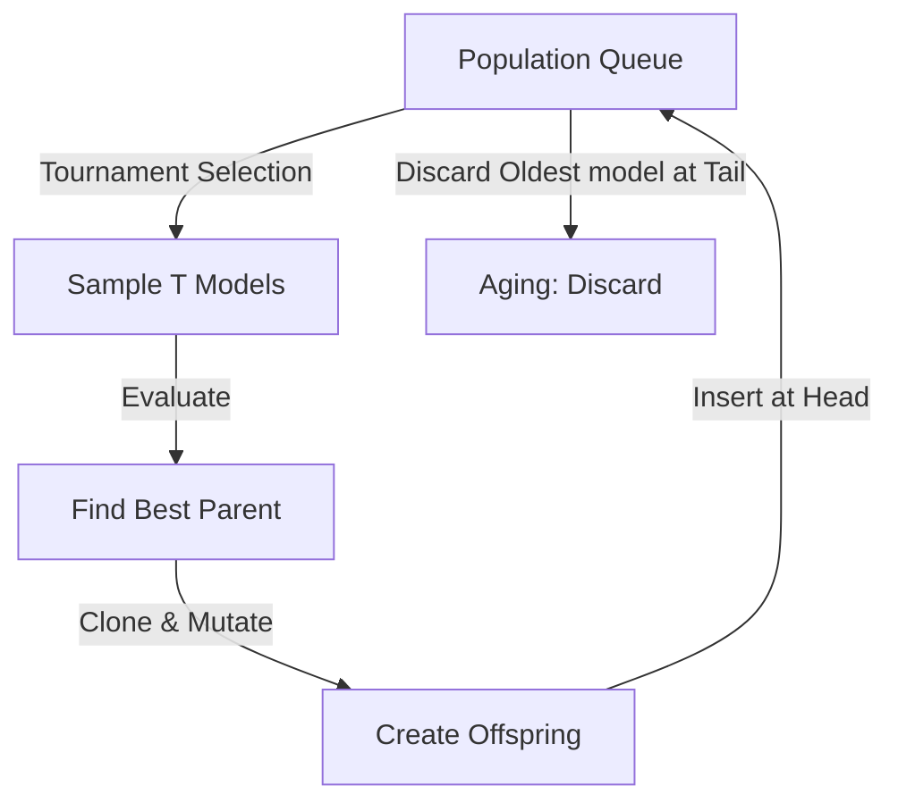

# AutoML-Zero

**Type**: concept  
**Tags**: #concept

## Overview

AutoML-Zero is a foundational neuroevolution framework introduced by Real et al. (2020). While traditional [[Neural Architecture Search]] approaches focus on optimizing structural topologies (e.g., cell arrangements, kernel sizes) within pre-designed, human-engineered functional blocks, AutoML-Zero aims to **discover entire machine learning algorithms from scratch**. Starting from completely random computer code containing only high-school mathematical primitives, it uses aging (regularized) evolution to construct fully functioning ML pipelines (e.g., gradient descent, linear neural networks, backpropagation) with zero human-designed bias.

## Three Component Functions

AutoML-Zero structures its search space by dividing algorithms into three distinct, repeated component functions that operate over a set of register memories (scalars, vectors, and matrices):

```
+-------------------------------------------------------------+
| SETUP: Initializes parameters (e.g., weights, registers)    |
+-------------------------------------------------------------+
| For each training step:                                     |
|   LEARN: Updates parameters given target y and input x      |
+-------------------------------------------------------------+
| For each test step:                                         |
|   PREDICT: Computes predictions given new inputs            |
+-------------------------------------------------------------+
```

1. **`Setup`**: Runs once at the beginning of a task to initialize registers, constants, and weight parameters.
2. **`Predict`**: Computes a model prediction given an input sample $x$ and current register parameters.
3. **`Learn`**: Adjusts registers and parameters using the input sample $x$, the true label $y$, and the prediction to optimize future accuracy.

By searching over the commands inside these three skeletons, the algorithm is forced to figure out not just model representations (in `Predict`), but also weight optimization rules (in `Learn`) and weight initializations (in `Setup`).

## Mathematical Primitives

The instruction set of the search space is restricted to basic high-school mathematical operations operating on registers of scalars, vectors, and matrices. It contains zero machine learning libraries.

Example instructions include:
- **Unary Scalar/Vector/Matrix Operations**: `sin(a)`, `cos(a)`, `exp(a)`, `log(a)`, `transpose(A)`.
- **Binary Operations**: Addition, subtraction, multiplication, division (e.g., `vector_add(v1, v2)`, `matrix_vector_multiply(A, v)`).
- **Reductions**: Vector dot products (`dot_product(v1, v2)`), L2 norm calculations.
- **Initialization**: Setting a register to a constant, standard normal randomization.

## Search Algorithm: Aging (Regularized) Evolution

AutoML-Zero utilizes **Aging (Regularized) Evolution** (AmoebaNet paradigm) as its primary search engine. Maintaining a population of candidate programs in a queue, the optimization operates via continuous, tournament-based mutations:



1. **Tournament Selection**: A subset of size $T$ is sampled randomly from the active population.
2. **Evaluation**: The sampled models are run on standard learning tasks (e.g., binary classification on MNIST or CIFAR-10) to obtain validation scores.
3. **Cloning & Mutation**: The candidate with the best score in the tournament is selected as a parent, cloned, and mutated.
4. **Mutations**: Three types of random mutations are applied:
   - **Instruction Insertion/Deletion**: Add or remove a primitive command at a random line index in `Setup`, `Predict`, or `Learn`.
   - **Instruction Modification**: Swap an operation (e.g., changing `vector_add` to `vector_sub`).
   - **Argument Re-targeting**: Modify the register address inputs or output of a command.
5. **Aging**: The mutated offspring is placed at the head of the population queue. To keep the population size constant, the *oldest* model at the tail of the queue is discarded. This aging mechanic prevents early stagnation, maintains high diversity, and forces models to re-evaluate under active, shifting mutations.

## Discoveries Evolved from Scratch

Through this simple evolutionary loop, AutoML-Zero successfully reconstructed key milestones in the history of machine learning without human guidance:
- **Gradient Descent**: Discovered the gradient calculation for linear models and simple neural networks inside the `Learn` function.
- **Learning Rate Schedules**: Evolved learning rate decay patterns (e.g., step decays or cosine schedules) inside `Learn`.
- **Weight Initialization**: Reconstructed Xavier-style variance scaling for weights in `Setup`.
- **Stochastic Optimizers**: Discovered simple running-average gradients, approximating algorithms like AdaGrad or Adam.

AutoML-Zero demonstrates that complex optimization and representational structures are emergent properties of evolution under simple task constraints.

## Related

- [[Neural Architecture Search]] — General AutoML design taxonomy.
- [[Reinforcement Learning Topic]] — Key alternative search controller optimization.
- [[Model Compression and Efficiency]] — Optimizing representation structures.
