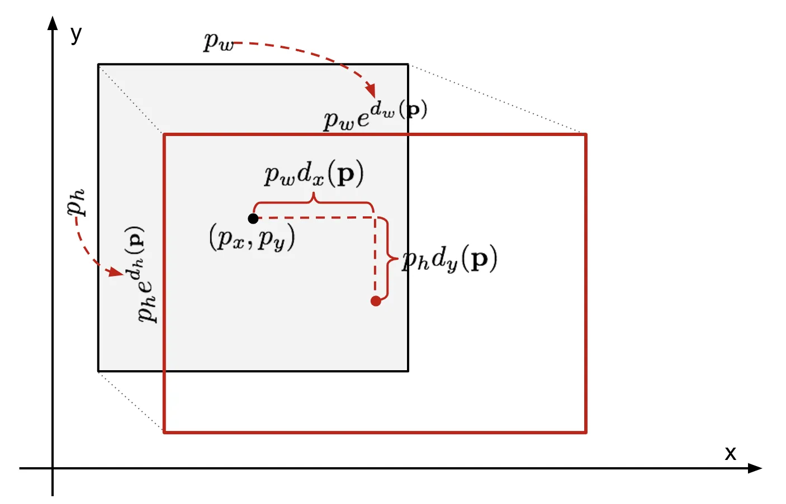

# Bounding Box Regression

**Type**: concept  
**Tags**: #concept

## Overview

**Bounding box regression** refines detector proposals by predicting **scale-invariant** offsets from a reference box \(\mathbf{p}=(p_x,p_y,p_w,p_h)\) (center, width, height) to ground truth \(\mathbf{g}\). Used from R-CNN through Faster/Mask R-CNN and [[SSD Object Detection]] (R-CNN-style targets).

## Appearances

- [[Object Detection for Dummies Part 3]] — full derivation, SSE + regularization.
- [[Object Detection for Dummies Part 2]] — Overfeat edge regression (different parameterization).
- [[Object Detection Part 4]] — SSD loc loss targets \(t_x,t_y,t_w,t_h\).

## Prediction form (R-CNN family)

\[
\hat{g}_x = p_w \, d_x(\mathbf{p}) + p_x, \quad
\hat{g}_y = p_h \, d_y(\mathbf{p}) + p_y
\]
\[
\hat{g}_w = p_w \exp(d_w(\mathbf{p})), \quad
\hat{g}_h = p_h \exp(d_h(\mathbf{p}))
\]

\(d_i(\mathbf{p})\) unbounded → stable regression targets:

\[
t_x = (g_x - p_x)/p_w, \quad t_y = (g_y - p_y)/p_h, \quad
t_w = \log(g_w/p_w), \quad t_h = \log(g_h/p_h)
\]

## Training

Minimize \(\mathcal{L}_{reg} = \sum_i (t_i - d_i(\mathbf{p}))^2 + \lambda \|\mathbf{w}\|^2\) (SSE + L2 on weights). **Only** pairs with sufficient [[Intersection over Union|IoU]] (e.g. ≥ 0.6 in R-CNN)—no GT ⇒ no regression target.

## Fast R-CNN variant

Per-RoI, **class-specific** corrections \(t^u\) vs \(v\); loss via [[Smooth L1 Loss]] on foreground RoIs only.

## YOLOv2 variant (Part 4)

Anchor \((p_w,p_h)\), cell \((c_x,c_y)\): \(b_x = \sigma(t_x)+c_x\), \(b_w = p_w e^{t_w}\)—same log-scale width/height idea with grid constraints.

## Related

- [[Smooth L1 Loss]], [[Intersection over Union]], [[R-CNN]], [[Fast R-CNN]]
- [[Object Detection for Dummies Part 3]], [[Object Detection Part 4]]
