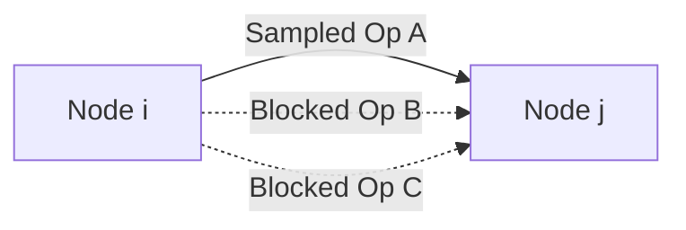

# DARTS

**Type**: concept  
**Tags**: #concept

## Overview

Differentiable Architecture Search (DARTS) is a state-of-the-art AutoML framework introduced by Liu et al. (2019). Unlike early reinforcement learning or evolutionary [[Neural Architecture Search]] algorithms that treat network design as a discrete optimization problem over graphs, DARTS introduces a **continuous relaxation** of the search space. This continuous mapping transforms the search from discrete node selection into a differentiable objective, enabling optimization via standard gradient descent. It reduces search budgets to a fraction of a day using a single GPU.

## Continuous Relaxation

In a typical cell-based search space, a cell is represented as a directed acyclic graph (DAG) where nodes $x^{(i)}$ represent latent feature maps and edges $(i, j)$ represent discrete information flow operations $o^{(i,j)}$ chosen from a candidate set $\mathcal{O}$ (e.g., $3 \times 3$ convolution, max pooling, identity).

DARTS relaxes this discrete choice by replacing it with a continuous softmax mixture over all possible operations in $\mathcal{O}$:

$$
\bar{o}^{(i,j)}(x) = \sum_{o \in \mathcal{O}} \frac{\exp(\alpha_o^{(i,j)})}{\sum_{o' \in \mathcal{O}} \exp(\alpha_{o'}^{(i,j)})} o(x)
$$

where:
- $\alpha^{(i,j)}$ is a vector of continuous, real-valued architecture parameters (mixing weights) assigned to the operations on edge $(i, j)$.
- $\bar{o}^{(i,j)}(x)$ is the relaxed mixed operation applied to node $x$.

At the end of the search, the discrete architecture is recovered by selecting the operation with the highest parameter weight: $\arg\max_{o \in \mathcal{O}} \alpha_o^{(i,j)}$.

## Bilevel Optimization

Continuous relaxation shifts the optimization goal to finding the joint parameters: the operational weights $w$ (convolution filters, etc.) and the structural architecture parameters $\alpha$. This is framed as a **bilevel optimization** problem, where $\alpha$ is the upper-level variable and $w$ is the lower-level variable:

$$
\min_\alpha \mathcal{L}_\text{val}(w^*(\alpha), \alpha) \quad \text{s.t.} \quad w^*(\alpha) = \arg\min_w \mathcal{L}_\text{train}(w, \alpha)
$$

This formulation implies that the architecture parameters $\alpha$ are optimized to minimize validation loss $\mathcal{L}_\text{val}$, using operational weights $w^*(\alpha)$ that have already been trained to convergence to minimize training loss $\mathcal{L}_\text{train}$.

### Gradient Approximation (Virtual Step)
Solving $w^*(\alpha)$ exactly at every step of $\alpha$-gradient calculation is computationally impossible. DARTS approximates the gradient of validation loss using a single virtual step of the weights:

$$
\nabla_\alpha \mathcal{L}_\text{val}(w^*(\alpha), \alpha) \approx \nabla_\alpha \mathcal{L}_\text{val}\Big( w - \xi \nabla_w \mathcal{L}_\text{train}(w, \alpha), \alpha \Big)
$$

where:
- $\xi$ is the learning rate of the virtual step.
- The virtual update $w - \xi \nabla_w \mathcal{L}_\text{train}(w, \alpha)$ acts as a cheap proxy for the fully converged lower-level weights $w^*(\alpha)$.

Applying the chain rule to the right-hand side yields:

$$
\nabla_\alpha \mathcal{L}_\text{val}(w', \alpha) - \xi \nabla^2_{\alpha, w} \mathcal{L}_\text{train}(w, \alpha) \nabla_{w'} \mathcal{L}_\text{val}(w', \alpha)
$$

where $w' = w - \xi \nabla_w \mathcal{L}_\text{train}(w, \alpha)$ represents the weights after the virtual step. The second term contains an expensive matrix-vector product (Hessian), which is approximated via finite differences to avoid instantiating second-order tensors.

## Memory Bottleneck & ProxylessNAS

### The Memory Challenge in DARTS
Because DARTS computes a softmax mixture of *all* candidate operations on every edge, it must store the activation maps of every single operation in GPU memory simultaneously. This limits DARTS to searching on small "proxy" tasks (e.g., down-scaled cells on CIFAR-10) before transferring the discovered cell to the target task (e.g., ImageNet), leading to a **suboptimality gap** due to task mismatch.

### ProxylessNAS: Path-Level Binarization
ProxylessNAS (Cai et al. 2019) eliminates the memory bottleneck by binarizing path choices. Using a **BinaryConnect** framework, only a single candidate path on each edge is sampled and held in memory during the forward pass:

- **Operational Weights Update**: Samples a single active path stochastically using current path probabilities, runs a forward pass, and updates its weights $w$.
- **Architecture Parameters Update**: Samples *two* paths according to probabilities, binarizes their gates, runs a forward pass, and updates the structural parameter $\alpha$ using gradient updates over the sampled pair. This scales GPU memory consumption to that of a single standard model, enabling direct search on ImageNet.

### Hardware-Aware Latency Loss
ProxylessNAS integrates a differentiable hardware latency loss function directly into the optimization objective, allowing the search to prioritize low-latency topologies on target devices:

$$
\mathcal{L} = \mathcal{L}_\text{accuracy} + \lambda \mathbb{E}[\text{Latency}]
$$

The expected latency is calculated as a weighted sum of the latency metrics of individual operations:

$$
\mathbb{E}[\text{Latency}] = \sum_{o \in \mathcal{O}} p_o \cdot \text{Latency}(o)
$$

By modeling a lookup table of measured operational latencies on target chips, the gradient of the latency loss with respect to the continuous probability parameters $p_o$ can be computed analytically, guiding the search toward hardware-optimal architectures.

## Related

- [[Neural Architecture Search]] — General three-pillar optimization taxonomy.
- [[ENAS]] — Parameter-sharing efficiency in discrete graph search.
- [[Model Compression and Efficiency]] — Latency optimization and network pruning algorithms.
