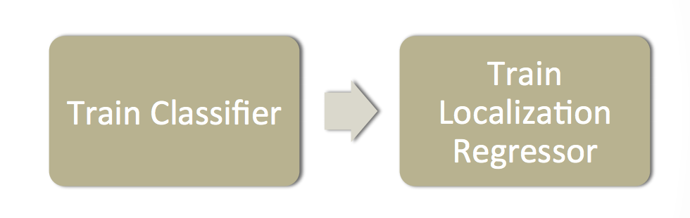

# Deformable Parts Model

**Type**: concept  
**Tags**: #concept

## Overview

The **Deformable Parts Model (DPM)** (Felzenszwalb, Girshick, McAllester, Ramanan; PAMI 2010) represents objects as mixtures of a coarse **root filter** and higher-resolution **part filters** with a spatial model penalizing deformation. Scoring uses dot products between filters and region features \(\Phi(x)\)—typically [[Histogram of Oriented Gradients|HOG]].

## Appearances

- [[Object Detection for Dummies Part 2]] — graphical model, matching, DPM-as-CNN (Girshick CVPR 2015).

## Three components

1. **Root filter**: covers full object at coarse scale; high score ⇒ object-like region.
2. **Part filters**: smaller parts at **2× resolution** relative to root.
3. **Spatial model**: scores part placement relative to root; **deformation cost** if parts deviate from ideal layout.

## Matching score

\[
f(\text{model}, x) = f(\beta_{root}, x) + \sum_{\beta_{part}} \max_y \big[ f(\beta_{part}, y) - \text{cost}(\beta_{part}, x, y) \big]
\]

- \(x\): image at position/scale; \(y\): subregion for a part.
- Base filter score: \(f(\beta, x) = \beta \cdot \Phi(x)\).

High root score proposes hypothesis; consistent high part scores **confirm** it. Training: **latent SVM** (parts' best alignment latent during learning).

## DPM and CNNs

Girshick et al. (CVPR 2015) **unroll DPM inference** into equivalent CNN layers—DPM and CNN are not separate paradigms but related computations. Bridge to [[R-CNN]] era deep features.

## Related

- [[Histogram of Oriented Gradients]]
- [[Pedro Felzenszwalb]]
- [[Ross Girshick]]
- [[Overfeat]]
- [[Object Detection for Dummies Part 2]]
