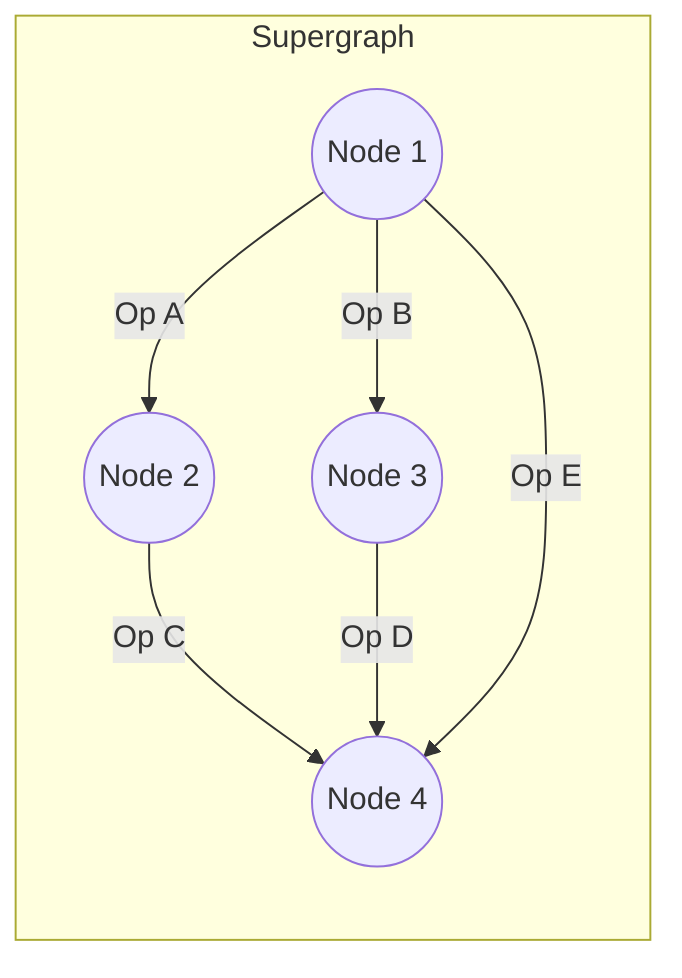

# ENAS

**Type**: concept  
**Tags**: #concept

## Overview

Efficient Neural Architecture Search (ENAS) is an efficiency-focused AutoML framework introduced by Pham et al. (2018). It addresses the primary bottleneck of early [[Neural Architecture Search]] approaches—namely, the massive computational cost of training thousands of candidate child models from scratch. ENAS achieves a 1000x reduction in GPU-hours by framing NAS as finding an optimal subgraph within a large, over-parameterized supergraph, enabling direct weight sharing across all candidate architectures.

## The Supergraph and Weight Sharing

Instead of treating each architecture as an isolated, standalone model that must be initialized and trained independently, ENAS represents the entire search space as a single directed acyclic graph (DAG)—the **supergraph**. 

Every child model is a specific subgraph of this supergraph:
- Nodes in the supergraph represent local operations or layers.
- Edges represent data flow connections.
- Subgraphs share the identical set of trainable parameters (weights) for identical operations on the same edges.

Because the candidate models share weights, we do not need to train any child model to convergence. Instead, we can evaluate a sampled child model immediately using the current weights in the supergraph.

## Dual Optimization Loop

ENAS operates via an alternating optimization procedure containing two primary phases, typically optimized by an RNN controller and the shared supergraph weights:

### Phase 1: Training the Shared Supergraph Weights ($w$)
During this phase, the controller's parameters $\theta$ are fixed. The model samples a specific child architecture $a$ from the controller's policy $P(a; \theta)$. 
- The supergraph runs a forward pass using this sampled subgraph on a mini-batch of training data.
- The gradients of the loss with respect to the active subgraph's shared weights $w$ are computed.
- The shared weights are updated using standard gradient descent (e.g., SGD or Adam):
  
  $$
  w \leftarrow w - \eta \nabla_w \mathcal{L}_\text{train}(a(w))
  $$

### Phase 2: Training the Controller Parameters ($\theta$)
During this phase, the shared supergraph weights $w$ are frozen. 
- The controller samples a child architecture $a \sim P(a; \theta)$.
- The child model is evaluated on a validation mini-batch, and its validation accuracy is recorded as the reinforcement learning reward $R(a, w)$.
- The controller is optimized using policy gradients (REINFORCE) with an exponential moving average baseline $b$ to reduce variance:

  $$
  \theta \leftarrow \theta + \eta \nabla_\theta \log P(a; \theta) \left( R(a, w) - b \right)
  $$

## Computational Efficiency vs. Weight Entanglement

### Advantages
- **Unprecedented Speedup**: ENAS reduced the search budget from 22,400 GPU-days (Zoph & Le 2017) to a mere **16 hours on a single GPU**, democratizing NAS research for standard labs.
- **High Performance**: Found architectures that achieved competitive top-1 and top-5 accuracies on ImageNet and CIFAR-10, demonstrating that weight sharing is a highly effective search proxy.

### Limitations & Gaps (Weight Entanglement)
- **Rank Correlation Degradation**: The fundamental assumption of weight sharing is that the performance ranking of architectures evaluated with shared weights correlates strongly with their rankings when trained from scratch. In practice, this correlation can be weak.
- **Favoring Simple Architectures**: Because weights are updated jointly, operations that converge quickly (like identity/skip connections or small convolutions) are systematically favored early in the search, potentially biasing the controller away from complex structures that require longer to optimize.

## Related

- [[Neural Architecture Search]] — The parent automation paradigm.
- [[DARTS]] — Moving from discrete supergraph sampling to continuous differentiable optimization.
- [[Model Compression and Efficiency]] — Structural efficiency and weight reuse.
