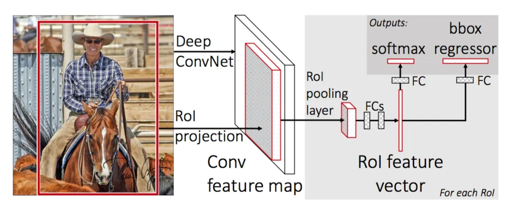

# Fast R-CNN

**Type**: concept  
**Tags**: #concept

## Overview

**Fast R-CNN** (Girshick, ICCV 2015) computes **one CNN forward pass per image**, then applies [[RoI Pooling]] to each [[Region Proposal|proposal]] on the shared feature map. **Softmax classification** and [[Bounding Box Regression]] train **jointly** with a multi-task loss—unifying R-CNN's three stages into one network (except external proposals).

## Appearances

- [[Object Detection for Dummies Part 3]] — architecture, loss, RoI pooling.
- [[Papers Explained 15 - Fast RCNN]]

## Architecture changes vs R-CNN

| Replace | With |
|---------|------|
| Last max-pool | [[RoI Pooling]] → fixed-length vector per RoI |
| K-way softmax + FC | **(K+1)-way** softmax (background class 0) |
| External SVMs | Softmax probabilities per RoI |
| External bbox | Parallel bbox head per RoI |

Overlapping proposals share conv computation—large speedup when proposals heavily overlap.

## Multi-task loss

\[
\mathcal{L}(p, u, t^u, v) = \mathcal{L}_{cls}(p, u) + \mathbb{1}[u \geq 1] \, \mathcal{L}_{box}(t^u, v)
\]

| Symbol | Meaning |
|--------|---------|
| \(u\) | True class; \(u=0\) background |
| \(p\) | Softmax over \(K+1\) classes |
| \(v\) | GT box \((v_x,v_y,v_w,v_h)\) |
| \(t^u\) | Predicted corrections for class \(u\) |

\[
\mathcal{L}_{cls} = -\log p_u, \qquad
\mathcal{L}_{box} = \sum_{i \in \{x,y,w,h\}} L_1^{smooth}(t^u_i - v_i)
\]

Background RoIs (\(u=0\)): **no** box loss—indicator \(\mathbb{1}[u\geq1]\) zeroes \(\mathcal{L}_{box}\).

## Remaining bottleneck

[[Selective Search]] still external and slow—addressed by [[Faster R-CNN]] RPN.

## Related

- [[R-CNN]], [[RoI Pooling]], [[Smooth L1 Loss]], [[Faster R-CNN]]
- [[Papers Explained 15 - Fast RCNN]]
- [[Object Detection for Dummies Part 3]]
