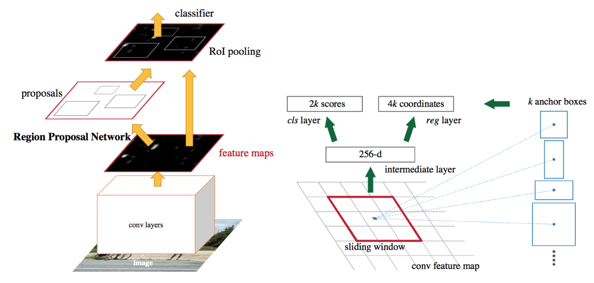

# Faster R-CNN

**Type**: concept  
**Tags**: #concept

## Overview

**Faster R-CNN** (Ren et al., NIPS 2015) trains a [[Region Proposal Network]] on the **same convolutional feature map** as [[Fast R-CNN]], replacing [[Selective Search]] with learned anchors. Near real-time detection when proposals and classification share GPU conv.

## Appearances

- [[Object Detection for Dummies Part 3]] — alternating training, RPN loss, anchors.
- [[Papers Explained 16 - Faster RCNN]]

## Architecture

Shared conv trunk → **RPN** (objectness + box deltas per anchor) + **Fast R-CNN head** (class + box per RoI from RPN proposals).

## RPN mechanics

- Slide **n×n** window (e.g. 3×3) over conv feature map.
- At each position predict **k anchors** = (center, scale, aspect ratio); e.g. 3 scales × 3 ratios = **9 anchors**.
- Each anchor: binary **objectness** + 4 **box deltas** (same parameterization as [[Bounding Box Regression]]).

## Training schedule (Weng summary)

1. Pre-train CNN on classification.
2. Fine-tune **RPN** alone (initialized from classifier weights).
3. Train Fast R-CNN using RPN proposals.
4. Fine-tune RPN with shared conv (detector weights init RPN).
5. Fine-tune Fast R-CNN unique layers.
6. Optionally **alternate** steps 4–5.

## RPN loss

\[
\mathcal{L}(\{p_i\}, \{t_i\}) = \frac{1}{N_{cls}} \sum_i \mathcal{L}_{cls}(p_i, p_i^*) + \frac{\lambda}{N_{box}} \sum_i p_i^* L_1^{smooth}(t_i - t_i^*)
\]

\[
\mathcal{L}_{cls}(p_i, p_i^*) = -p_i^* \log p_i - (1-p_i^*) \log(1-p_i)
\]

| Label | IoU rule (Weng) |
|-------|-----------------|
| Positive \(p_i^*=1\) | IoU > **0.7** |
| Negative \(p_i^*=0\) | IoU < **0.3** |

\(N_{cls} \approx 256\) (mini-batch); \(N_{box} \approx\) anchor count; \(\lambda \approx 10\) balances terms.

## Related

- [[Region Proposal Network]], [[Fast R-CNN]], [[Smooth L1 Loss]]
- [[Shaoqing Ren]], [[Ross Girshick]]
- [[Papers Explained 16 - Faster RCNN]]
- [[Object Detection for Dummies Part 3]]
