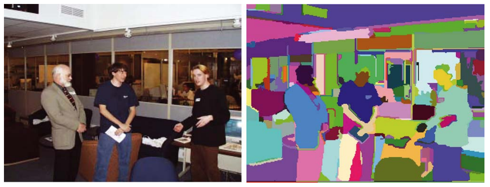
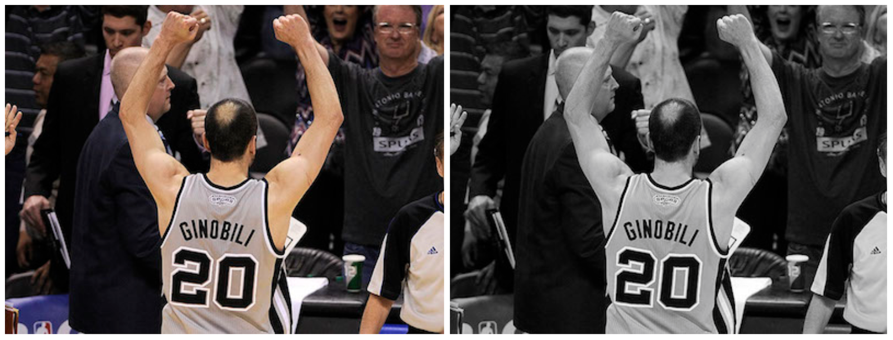
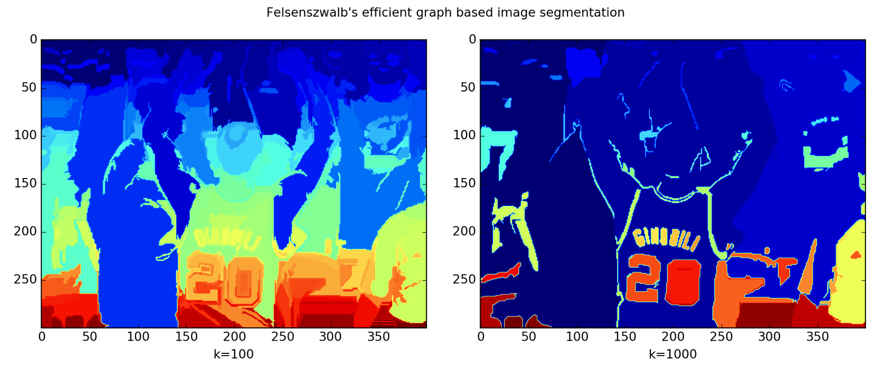

# Felzenszwalb Segmentation

**Type**: concept  
**Tags**: #concept

## Overview

**Felzenszwalb–Huttenlocher graph-based segmentation** (IJCV 2004) partitions an image by merging pixel regions on a weighted graph until a scale-dependent predicate says two components are sufficiently different. It initializes [[Selective Search]] and many classical region-proposal pipelines.

## Appearances

- [[Object Detection for Dummies Part 1]] — graph construction, merge predicate, `skimage.segmentation.felzenszwalb` demo (\(k=100\) vs \(k=1000\)).

## Graph construction

| Graph type | Vertices | Edge weight |
|------------|----------|-------------|
| **Grid** | Pixels | \(\|I(p_i) - I(p_j)\|\) on 4- or 8-neighbors |
| **Nearest neighbor** | Pixels in \((x,y,r,g,b)\) | Euclidean distance in position + color |



## Key quantities

- **Internal difference** \(Int(C) = \max_{e \in MST(C)} w(e)\): strongest edge in the minimum spanning tree of component \(C\)—threshold below which \(C\) stays connected.
- **Difference between components** \(Dif(C_1, C_2) = \min_{v_i \in C_1, v_j \in C_2} w(v_i, v_j)\); \(\infty\) if no cross-edge.
- **Minimum internal difference** \(MInt(C_1, C_2) = \min(Int(C_1)+\tau(C_1), Int(C_2)+\tau(C_2))\) with \(\tau(C) = k/|C|\).

## Merge predicate

\[
D(C_1, C_2) = \begin{cases} \text{True} & \text{if } Dif(C_1, C_2) > MInt(C_1, C_2) \\ \text{False} & \text{otherwise} \end{cases}
\]

**True** → components are **distinct** (stop merging). **False** → segmentation too fine; merge \(C_1, C_2\) when edge \(w(e) \leq MInt\).

## Bottom-up algorithm

Given \(|V|=n\), \(|E|=m\):

1. Sort edges by weight ascending: \(e_1, \ldots, e_m\).
2. Start with \(n\) singleton components.
3. For \(k = 1,\ldots,m\): take \(e_k = (v_i, v_j)\); if \(v_i, v_j\) in different components and \(w(e_k) \leq MInt(C_i, C_j)\), merge; else skip.

Larger **\(k\)** → larger \(\tau\) → coarser segments (fewer, bigger regions).

 

```python
import skimage.segmentation
segment_mask1 = skimage.segmentation.felzenszwalb(img, scale=100)   # fine
segment_mask2 = skimage.segmentation.felzenszwalb(img, scale=1000)  # coarse
```

## Role in detection

Selective Search **step 1** runs Felzenszwalb (often multiple \(k\) and color spaces) to obtain initial superpixels/regions before hierarchical merging—see [[Selective Search]].

## Related

- [[Selective Search]]
- [[Pedro Felzenszwalb]]
- [[Region Proposal]]
- [[Object Detection for Dummies Part 1]]
