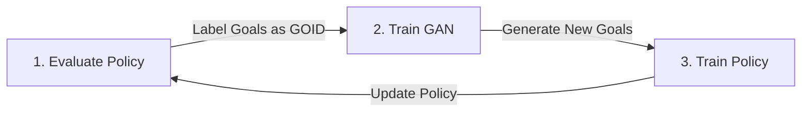

# Goal GAN

**Type**: concept  
**Tags**: #concept

## Overview

**Goal GAN** (Generative Goal Learning; Florensa et al., 2018) is an automated curriculum learning framework that uses a Generative Adversarial Network (GAN) to propose goals of **intermediate difficulty** for a Reinforcement Learning agent. By training a generator to target the agent's current learning frontier, Goal GAN bypasses the need for manual curriculum engineering or heuristic reward shaping in goal-conditioned RL tasks.

The key mathematical construct in Goal GAN is the definition of **Goals of Intermediate Difficulty (GOID)**:

$$\text{GOID}_i := \{g \in \mathcal{G} : R_{min} \le R^g(\pi_i) \le R_{max}\}$$

Where:
- $\mathcal{G}$ is the continuous space of all possible goals in the environment.
- $\pi_i$ is the policy at iteration $i$.
- $R^g(\pi_i)$ is the expected success rate (or return) of policy $\pi_i$ when trying to achieve goal $g$.
- $R_{min}$ and $R_{max}$ are minimum and maximum threshold constants (typically set to $0.1$ and $0.9$ respectively).

Goals with $R^g(\pi_i) > R_{max}$ are too easy (the agent has already mastered them); goals with $R^g(\pi_i) < R_{min}$ are too hard (the agent cannot make any learning progress on them). Goal GAN attempts to train a generator $G(z)$ to produce goals exclusively belonging to the $\text{GOID}_i$ set.

---

## The Goal GAN Training Loop

Goal GAN alternates between policy training and generative model updates in a three-step loop:



### 1. Labeling and Data Collection
At the start of iteration $i$, a set of candidate goals $\{g_k\}$ are sampled. The current policy $\pi_i$ is executed to attempt to reach each goal $g_k$. The success rate is recorded, and each goal is assigned a binary label $y_g$:

$$y_g = \begin{cases} 1 & \text{if } g \in \text{GOID}_i \quad (R_{min} \le R^g(\pi_i) \le R_{max}) \\ 0 & \text{otherwise} \end{cases}$$

### 2. GAN Training (LSGAN formulation)
To prevent vanishing gradients and mode collapse common in standard GANs, Goal GAN uses the **Least-Squares GAN (LSGAN)** formulation. The discriminator $D(g)$ is trained to output a real-valued score representing the likelihood of $g$ being a GOID goal. The generator $G(z)$ learns to map latent noise vectors $z \sim \mathcal{N}(0, I)$ to goals that trick the discriminator.

The discriminator loss objective is:

$$\min_D V_{LSGAN}(D) = \frac{1}{2} \mathbb{E}_{g \sim p_{data}} \left[ (D(g) - 1)^2 \right] + \frac{1}{2} \mathbb{E}_{z \sim p_z} \left[ (D(G(z)))^2 \right]$$

The generator loss objective is:

$$\min_G V_{LSGAN}(G) = \frac{1}{2} \mathbb{E}_{z \sim p_z} \left[ (D(G(z)) - 1)^2 \right]$$

To ensure that the generator also explores new goals rather than only generating known easy goals, Goal GAN introduces an **exploration bonus** into the generator objective, encouraging the generation of goals with high variance.

---

## Extension: The Setter-Judge-Solver Framework

Racaniere & Lampinen et al. (2019) expanded on the Goal GAN concept, formalizing it as a three-component system:
- **Setter ($G$)**: Generates a goal $g$ conditioned on a desired feasibility score $f \in [0, 1]$ and current environmental state $s$: $g \sim G(z | s, f)$.
- **Judge ($D$)**: Evaluates whether the generated goal $g$ is appropriate, outputting a probability that the Solver can achieve goal $g$ starting from state $s$.
- **Solver ($\pi$)**: The policy being trained to reach goal $g$ from state $s$.

```
   [ Latent z ] ---\
                    v
[ Env State s ] -> [ Setter G ] ---> [ Goal g ] ---> [ Solver Policy ]
                    ^                                      |
[ Feasibility f ] -/                                       v
                                                    [ Actual Success ]
                                                           |
                                                           v
                                                    [ Judge D (Loss) ]
```

The Setter is optimized using three distinct mathematical objectives:

### 1. Goal Validity
Ensures that the generated goals are physically achievable in the environment (equivalent to Asymmetric Self-Play's solvability guarantee). It uses an expert dataset or historical solver trajectories to verify:

$$\mathcal{L}_{valid} = \mathbb{E} \left[ \log D(G(z | s, f), s) \right]$$

### 2. Goal Feasibility
Forces the setter to respect the feasibility parameter $f$ selected by the user (or sampled uniformly). If $f=0.5$, the setter must generate a goal with an expected $50\%$ success rate:

$$\mathcal{L}_{feasible} = \mathbb{E} \left[ \| D(G(z | s, f), s) - f \|^2 \right]$$

### 3. Goal Coverage
Prevents the setter from focusing on a single region (mode collapse). The framework enforces high entropy over the generated goals. This is achieved by making the Setter architecture a **reversible network** (e.g., using Normalizing Flows), allowing direct computation and minimization of the negative log-likelihood:

$$\mathcal{L}_{coverage} = \mathbb{E} \left[ -\log p_G(g) \right]$$

---

## Strengths vs. Weaknesses

### Strengths
- **Fully Automated Difficulty Scaling**: The generator naturally tracks the solver's frontier, shifting from simple nearby goals to highly complex, distant goals over time.
- **Continuous Goal Handling**: Operates natively in continuous coordinate spaces.
- **Controllable Curriculum**: Under the Setter-Judge-Solver extension, the user can manually dial the training difficulty by adjusting $f$ (e.g., setting $f=0.9$ early in training, then $f=0.5$ for optimal frontier learning).

### Weaknesses
- **Impossible Goals (Hallucination)**: Standard Goal GAN has no absolute guarantee of goal solvability. If the discriminator is weak early in training, the generator may produce goals inside obstacles or outside the map boundaries.
- **GAN Instability**: Standard GAN objectives are notorious for unstable training dynamics, requiring careful tuning of the Least-Squares parameters.
- **Sample Inefficiency**: Labeling goals requires running multiple policy evaluation episodes per goal, increasing overall sample complexity.

## Appearances

- [[Curriculum for Reinforcement Learning]] — Core reference; covered under the Automatic Goal Generation section.

## Related

- [[Curriculum for Reinforcement Learning]] — Main survey.
- [[Curriculum Learning]] — Foundational parent concept.
- [[Asymmetric Self-Play]] — Contrastive self-play framework that natively guarantees solvability.
- [[Generative Adversarial Networks]] — Architectural backbone.
- [[Reinforcement Learning Topic]] — Parent topic.
