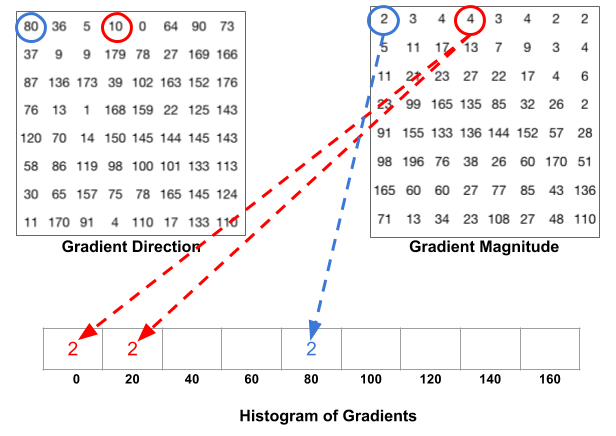
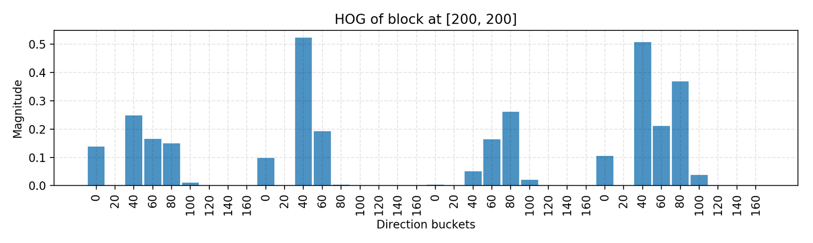

# Histogram of Oriented Gradients

**Type**: concept  
**Tags**: #concept

## Overview

**HOG** (Histogram of Oriented Gradients; Dalal & Triggs, CVPR 2005) summarizes local edge orientation distributions in overlapping, L2-normalized blocks. It was the dominant hand-crafted feature for pedestrian detection and powers [[Deformable Parts Model|DPM]] root/part filters before CNN features dominated.

## Appearances

- [[Object Detection for Dummies Part 1]] — full pipeline with Python walkthrough; Manu Ginobili demo.
- [[Object Detection for Dummies Part 2]] — DPM feature maps \(\Phi(x)\) often HOG-based.

## Pipeline (step by step)

1. **Preprocess**: resize, optional color normalization (grayscale per channel in colored images).
2. **Gradients**: compute \(G_x, G_y\) per pixel; magnitude \(m = \sqrt{G_x^2+G_y^2}\); direction \(\theta\) (often **unsigned** 0–180°).
3. **Cells**: tile image into **8×8** pixel cells; each cell gets a **9-bin** orientation histogram.
4. **Soft binning**: if \(\theta\) falls between bin centers, split magnitude between adjacent bins (e.g. mag 8 at 15° → 2 to 0° bin, 6 to 20° bin)—improves robustness to small deformations.



5. **Blocks**: group **2×2 cells** (16×16 px); concatenate four 9-bin histograms → **36-D** vector; **L2-normalize** the block vector to unit weight.
6. **Descriptor**: concatenate all block vectors over the detection window → input to linear SVM (or similar).



## Parameters (Weng defaults)

| Symbol | Value | Meaning |
|--------|-------|---------|
| `CELL_SIZE` | 8 | Pixels per cell |
| `N_BUCKETS` | 9 | Orientation bins, 0–180° |
| `BLOCK_SIZE` | 2 | Cells per block edge → 4 cells/block |

## Soft-bin assignment (conceptual)

For magnitude \(m\), direction \(d\) (degrees), bin width 20°:

```python
left_bin = int(d / 20.)
right_bin = (int(d / 20.) + 1) % N_BUCKETS
left_val = m * (right_bin * 20 - d) / 20
right_val = m * (d - left_bin * 20) / 20
```

Directions use \(\theta = |\arctan(G_y/G_x)| \cdot 180/\pi\) in the blog demo.

## Why blocks overlap

Blocks overlap (stride < block size) so every cell contributes to multiple normalized descriptors—reduces sensitivity to local contrast changes and partial occlusion.

## Libraries

Production systems use OpenCV `HOGDescriptor`, scikit-image, or SimpleCV; the blog code illustrates mechanics rather than production speed.

## Comparison to CNN features

| Aspect | HOG | CNN conv features |
|--------|-----|-----------------|
| Learning | Hand-designed | Data-driven |
| Invariance | Block norm + soft bins | Pooling + depth |
| Speed (2010s) | Fast on CPU | GPU for training/inference |
| Role today | Pedagogy, DPM history | All mainstream detectors |

## Related

- [[Image Gradient]]
- [[Deformable Parts Model]]
- [[Object Detection for Dummies Part 1]]
