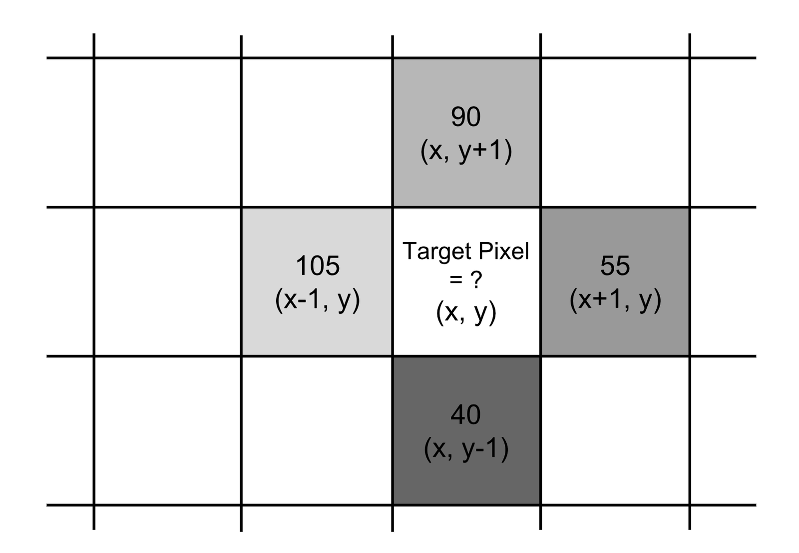
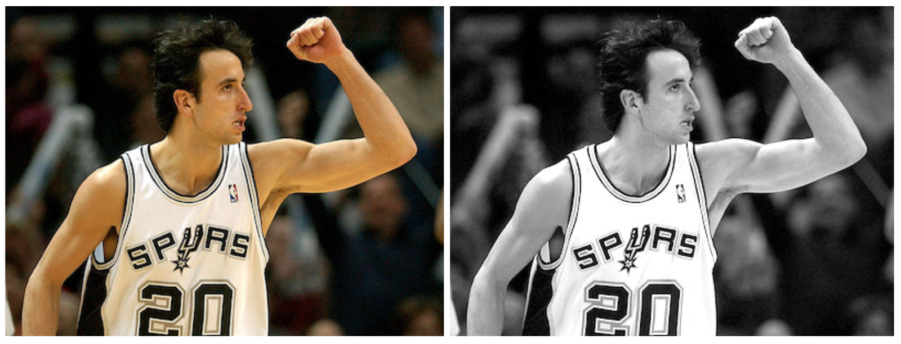
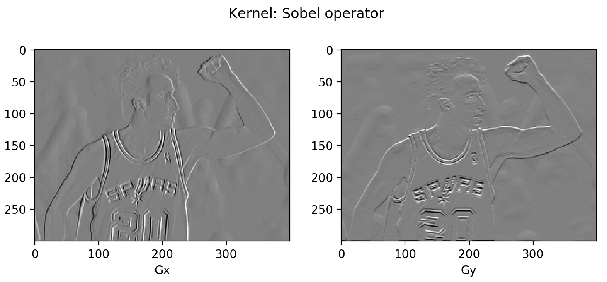

# Image Gradient

**Type**: concept  
**Tags**: #concept

## Overview

An **image gradient** is a per-pixel vector \((g_x, g_y)\) measuring how intensity changes horizontally and vertically on a discrete pixel grid. **Magnitude** \(\|g\|_2\) and **direction** \(\theta = \arctan(g_y/g_x)\) summarize local edge structure. Gradients are the foundation for [[Histogram of Oriented Gradients|HOG]], Sobel/Prewitt operators, and classical edge detection before learned CNN filters.

## Appearances

- [[Object Detection for Dummies Part 1]] — discrete definition, convolution implementation, Manu Ginobili Sobel demo.

## Derivative vs gradient (on images)

| Term | Type | Role in vision |
|------|------|----------------|
| Derivative | Scalar rate of change along one axis | Partial derivatives \(\partial f/\partial x\), \(\partial f/\partial y\) on discrete neighbors |
| Directional derivative | Scalar along unit direction \(\vec{u}\) | Less common at pixel level |
| **Gradient** | **Vector** \((g_x, g_y)\) | Points toward steepest intensity increase; encodes edge orientation |

On images the gradient is **discrete**—each pixel is atomic; neighbors are the left/right and above/below pixels (or an 8-neighborhood for larger kernels).

## Definition

For intensity \(f(x,y)\) at pixel \((x,y)\):

\[
\nabla f(x,y) = \begin{bmatrix} g_x \\ g_y \end{bmatrix} = \begin{bmatrix} f(x+1,y) - f(x-1,y) \\ f(x,y+1) - f(x,y-1) \end{bmatrix}
\]

\[
\|g\|_2 = \sqrt{g_x^2 + g_y^2}, \qquad \theta = \arctan(g_y / g_x)
\]

### Worked 3×3 patch (from Weng)

Center 255, neighbors yielding \(g_x = 55-105 = -50\), \(g_y = 90-40 = 50\):

\[
\|g\|_2 \approx 70.71, \quad \theta = -45^\circ
\]



## Convolution form

Per-pixel loops are slow; gradients are computed by **convolving** the image with derivative kernels:

| Direction | Simple kernel | On row \([105, 255, 55]\) |
|-----------|---------------|---------------------------|
| \(G_x\) | \([-1, 0, 1]\) | \(-105 + 55 = -50\) |
| \(G_y\) | \([+1, 0, -1]^\top\) | \(90 - 40 = 50\) |

```python
import numpy as np
import scipy.signal as sig
data = np.array([ [0, 105, 0], [40, 255, 90], [0, 55, 0] ])
G_x = sig.convolve2d(data, np.array([ [-1, 0, 1] ]), mode='valid')
G_y = sig.convolve2d(data, np.array([ [-1], [0], [1] ]), mode='valid')
```

## Prewitt and Sobel (3×3)

**Prewitt** uses all eight neighbors for smoother estimates:

\[
G_x = \begin{bmatrix} -1 & 0 & +1 \\ -1 & 0 & +1 \\ -1 & 0 & +1 \end{bmatrix} * A, \quad
G_y = \begin{bmatrix} +1 & +1 & +1 \\ 0 & 0 & 0 \\ -1 & -1 & -1 \end{bmatrix} * A
\]

**Sobel** up-weights the center row/column neighbors:

\[
G_x = \begin{bmatrix} -1 & 0 & +1 \\ -2 & 0 & +2 \\ -1 & 0 & +1 \end{bmatrix} * A, \quad
G_y = \begin{bmatrix} +1 & +2 & +1 \\ 0 & 0 & 0 \\ -1 & -2 & -1 \end{bmatrix} * A
\]

 

## Display scaling

Raw differences lie in \([-255, 255]\). For visualization, map \((G + 255)/2\) so zero gradient → mid-gray (125). Constant regions appear gray, not black.

## Downstream use

| Consumer | Uses gradient how |
|----------|-------------------|
| [[Histogram of Oriented Gradients]] | Per-cell histogram of orientations weighted by magnitude |
| Edge detectors | Threshold magnitude or direction |
| [[Convolution]] / CNNs | Learned filters generalize hand-crafted kernels |

## Related

- [[Convolution]]
- [[Histogram of Oriented Gradients]]
- [[Object Detection for Dummies Part 1]]
