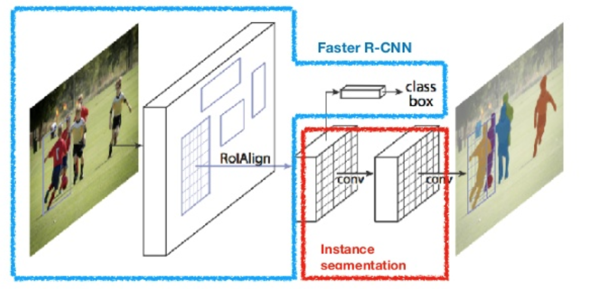
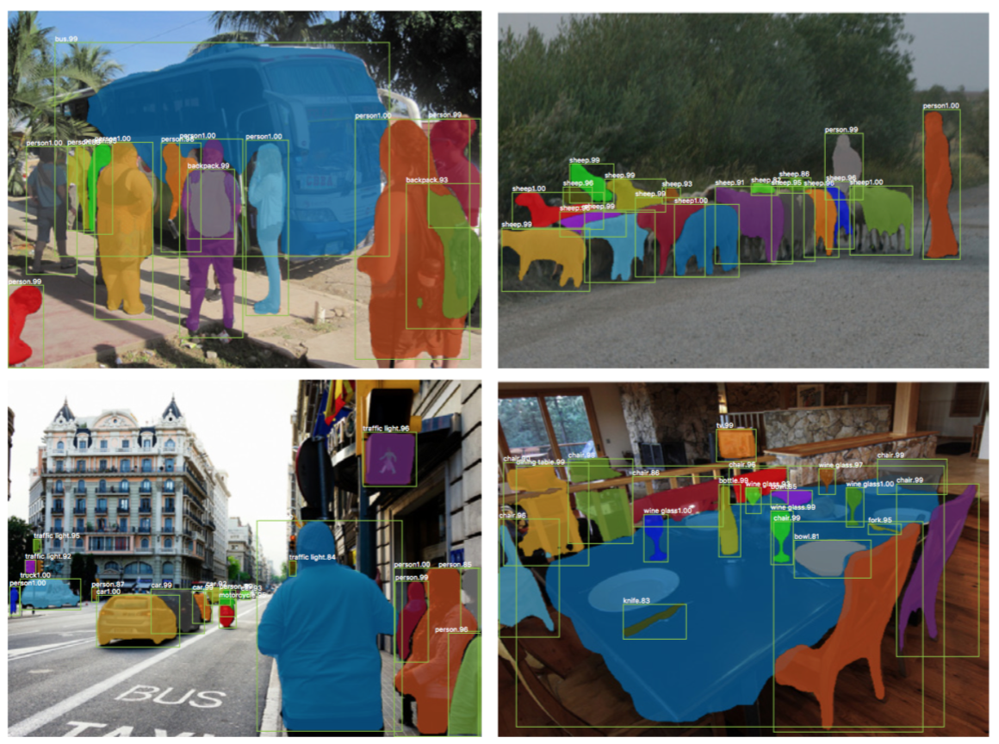

# Mask R-CNN

**Type**: concept  
**Tags**: #concept

## Overview

**Mask R-CNN** (He et al., 2017) extends [[Faster R-CNN]] with a parallel **mask head**: per-RoI **\(m \times m\)** binary segmentation masks per class, decoupled from classification so masks do not compete across classes at pixel level. Uses [[RoIAlign]] instead of [[RoI Pooling]] for accurate pixel alignment.

## Appearances

- [[Object Detection for Dummies Part 3]] — mask loss, RoIAlign, COCO results.
- [[Papers Explained 17 - Mask RCNN]]

## Heads

 

| Branch | Output |
|--------|--------|
| Classification | \(K+1\) softmax (same as Fast R-CNN) |
| Box | Per-class bbox deltas |
| **Mask** | \(K \times m^2\) logits → sigmoid per class channel |

Small FCN applied per RoI; **no** softmax across classes for masks—only the **ground-truth class channel** is supervised.

## Loss

\[
\mathcal{L} = \mathcal{L}_{cls} + \mathcal{L}_{box} + \mathcal{L}_{mask}
\]

\[
\mathcal{L}_{mask} = -\frac{1}{m^2} \sum_{i,j} \big[ y_{ij} \log \hat{y}_{ij}^k + (1-y_{ij}) \log(1-\hat{y}_{ij}^k) \big]
\]

\(k\) = GT class for that RoI; \(y_{ij}\) = GT mask pixel; \(\hat{y}_{ij}^k\) = prediction for class \(k\) only.

## Why RoIAlign matters

Bounding boxes tolerate coarse quantization; **masks** need sub-pixel alignment. [[RoIAlign]] uses bilinear interpolation at floating feature-map coordinates—fixes ~10% mask AP gap vs RoI Pooling in paper.

## Related

- [[Faster R-CNN]], [[RoIAlign]], [[Kaiming He]]
- [[Papers Explained 17 - Mask RCNN]], [[Papers Explained 238 - Segment Anything Model]]
- [[Object Detection for Dummies Part 3]]
