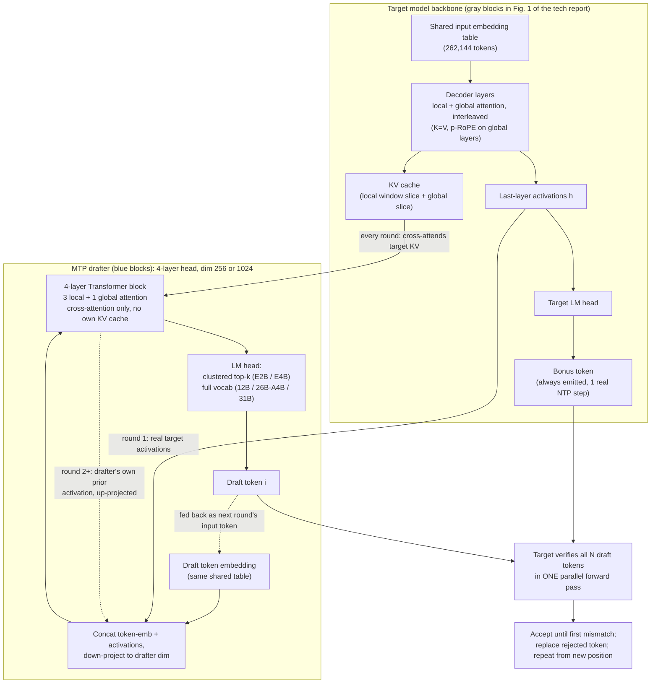

# Multi-Token Prediction

**Type**: concept  
**Tags**: #concept

## Overview

Training auxiliary prediction heads on a language model to forecast one or more future tokens (and associated hidden states) from current activations. At inference, MTP heads serve as lightweight draft models for **speculative decoding**, reusing the target model's embeddings and output projection.

## Appearances

- [[Accelerating Sonar Through Speculation]] — Perplexity trains MTP heads in ~1 day on 8×H100; production uses single-token MTP for Sonar and DeepSeek R1-class models; RMSNorm reintroduction fixes 70B training.
- [[Papers Explained - Composer 2]] — Cursor trains MTP layers with self-distillation for Composer 2 speculative decoding.
- [[Papers Explained - Nemotron 3 Super]] — shared-parameter MTP heads for recursive drafting at inference.
- [[Papers Explained 586: Gemma 4]] — Speculative decoding MTP drafters for dense and MoE architectures with clustered vocabulary projections on E2B and E4B.
- [[Gemma 4 Multi-Token Prediction]] — Google MTP drafters for Gemma 4; shared KV cache and target activations; up to 3× speedup.
- [[Gemma 4 Technical Report]] — Section 2.6 canonical drafter spec: 4-layer cross-attending block, per-size dims, clustered LM head on E2B/E4B.
- [[Gemma 4 MTP Overview]] — Google docs on shared embeddings, target activations, MoE batching caveat.
- [[Gemma4 Assistant Docs]] — `Gemma4AssistantForCausalLM` implementation (shared KV, cross-attention, centroid LM head).
- [[A Visual Guide to Gemma 4]] — illustrated activation and KV-cache flow for MTP drafters.
- [[Gemma 4 MTP Explained in 5 Minutes]] — contrast with EAGLE-3 and DeepSeek V3 MTP designs.
- [[Inkling]] — ships MTP drafter layers with the open release for speculative decoding (`use_mtp=True` in transformers).

## Gemma 4 Architecture

Gemma 4 ships a trained **MTP drafter head** per target size (E2B 76M, E4B 77M, 12B 400M, 26B-A4B 430M, 31B 500M parameters). The drafter is a **4-layer Transformer** (3 local sliding-window + 1 global) with hidden dim **256** (E2B/E4B) or **1024** (26B-A4B/31B) that:

1. **Shares the target input embedding table** — no separate vocabulary embeddings.
2. **Consumes target last-layer activations** — concatenated with the current token embedding, down-projected to drafter dim; round 1 uses target activations, later draft steps use the drafter's own prior-step activation (up-projected).
3. **Cross-attends the target KV cache** — no independent drafter KV cache or prefill; reuses the target's last local KV slice and global KV. Draft steps depend only on the previous draft token's projected state, not self-attention over prior drafts ([[Gemma 4 MTP Explained in 5 Minutes]]).
4. **Clustered LM head (E2B/E4B only)** — predicts top vocabulary clusters first, then token logits within selected clusters; reduces final matmul from `d × 262,000` to `d × 4096` ([[Gemma 4 Technical Report]]).

Unlike EAGLE-style drafters that maintain a growing draft-sequence KV cache, Gemma 4's stateless-drafter design treats the target KV as the sole context memory.

## Notes

MTP differs from full draft-target speculation (separate small LLM) by coupling tightly to target hidden states. Token buffers are shifted one step relative to hidden states at inference. EAGLE is a related family using target features for tree-structured drafts.

## Related

- [[Speculative Decoding]]
- [[EAGLE (Speculative Decoding)]]
- [[Inference Engineering]]
- [[Inkling]]
