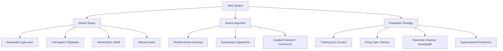

# Neural Architecture Search

**Type**: concept  
**Tags**: #concept

## Overview

Neural Architecture Search (NAS) is a subfield of AutoML that automates the design of neural network topologies. Instead of manually engineering layers, connections, and hyperparameters by trial and error, NAS algorithms systematically explore a defined space of possibilities to discover high-performing, resource-efficient architectures for specific tasks.

## The Three Pillars of NAS

Modern NAS frameworks are structured around three fundamental components:

### 1. Search Space
The search space defines the operations (e.g., standard convolutions, dilated convolutions, pooling, self-attention) and how they are permitted to connect. The design of this space incorporates human domain expertise:
- **Sequential Layer-wise**: Predicts layers one after the other in a linear sequence. While highly expressive, its search space is massive and computationally expensive to traverse.
- **Cell-based Representations**: Restricts the search space to optimizing repeating cell patterns—typically a **Normal Cell** (maintaining spatial dimension) and a **Reduction Cell** (halving width and height, doubling channels). Stacking these cells (as in NASNet) allows easy scaling and robust transferability across datasets.
- **Hierarchical Structures**: Recursively builds higher-level computation graphs (motifs) from a small set of primitive operations (as in Hierarchical NAS / HNAS).
- **Memory-bank Representations**: Incorporates modular blocks reading/writing to memory banks, allowing non-sequential data flow (as in SMASH).

### 2. Search Algorithm
The search algorithm acts as the controller, sampling network candidates from the search space. It modifies its policy based on feedback:
- **Reinforcement Learning (RL)**: Frames architecture design as an agent's sequential decision-making process. Early pioneers (Zoph & Le 2017) utilized an RNN controller optimized via [[Reinforcement Learning]] (specifically REINFORCE) where the reward is the validation accuracy of the child model. Other approaches, like MetaQNN, used Q-learning with an $\epsilon$-greedy policy to select sequential layers.
- **Evolutionary Algorithms**: Evolve a population of architectures by applying mutations (e.g., adding/deleting connections, mutating operations). Algorithms like AmoebaNet introduce *aging evolution* (regularized evolution), prioritizing younger models by discarding the oldest ones to maintain population diversity.
- **Progressive Decision Processes**: Build architectures step-by-step using Sequential Model-based Bayesian Optimization (SMBO) and surrogate models (such as RNNs predicting child performance) to guide search, prune unpromising paths, and reduce compute budgets (as in PNAS).
- **Gradient Descent / Continuous Relaxation**: Converts discrete selection decisions into continuous mixing parameters ($\alpha$), enabling joint optimization of weights and structure parameters via gradient descent (as in [[DARTS]]).

### 3. Evaluation Strategy
Evaluation determines the performance reward of proposed child architectures. Since training every candidate model from scratch is computationally prohibitive, several proxy evaluation strategies have been developed:
- **Proxy Task Performance**: Evaluating on a smaller dataset (e.g., CIFAR-10 instead of ImageNet), down-scaling filters, or using early stopping.
- **Parameter Sharing**: Framing the search space as subgraphs of a single over-parameterized supergraph, allowing child architectures to share weights directly, dramatically cutting training time (pioneered by [[ENAS]]).
- **Weight Prediction**: Training a HyperNetwork to directly predict the weights of a candidate model from its architecture representation (pioneered by SMASH).

## Early Reinforcement Learning Controllers

The foundational breakthroughs in NAS (Zoph & Le 2017) modeled architecture selection as a reinforcement learning problem. An RNN controller acts as the policy network, generating strings that serialize CNN architectures (kernel size, stride, filter size, skip connections). 

The controller is trained using policy gradients (REINFORCE):

$$
\theta \leftarrow \theta + \eta \sum_{k=1}^m \nabla_\theta \log P(a_k; \theta) \left( R_k - b \right)
$$

where $a_k$ represents the sampled child architecture, $R_k$ is the validation accuracy on a proxy dataset, and $b$ is an exponential moving average baseline of validation accuracies.

While highly effective, early RL NAS was computationally staggering, requiring 800 GPUs running in parallel for 28 days to converge. This compute bottleneck drove the field toward parameter sharing and differentiable optimization methods.

## Related

- [[ENAS]] — Parameter-sharing efficiency in search space evaluation.
- [[DARTS]] — Differentiable and continuous relaxation algorithms.
- [[Reinforcement Learning Topic]] — Core policy gradient frameworks behind early controllers.
- [[Model Compression and Efficiency]] — Shared structural optimization goals.
