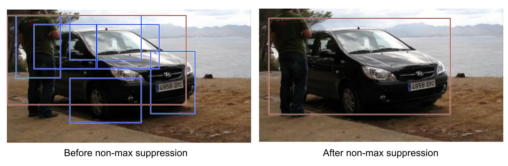

# Non-Maximum Suppression

**Type**: concept  
**Tags**: #concept

## Overview

**Non-maximum suppression (NMS)** removes duplicate detections of the same object: sort boxes by score, greedily keep the highest-scoring box, and **discard** lower-scoring boxes with [[Intersection over Union|IoU]] above a threshold (often **0.5**) to the kept box.

## Appearances

- [[Object Detection for Dummies Part 3]] — car detection example; standard post-processing after R-CNN SVM scores.

## Algorithm (per class)

1. Collect all detections for class \(c\) with confidence above minimum.
2. Sort by **descending** confidence.
3. While boxes remain:
   - Take highest-score box \(b\) → **keep**.
   - Remove all remaining boxes with \(IoU(b, b') > \tau_{nms}\) (typically 0.5).

## Why needed

Classifiers and dense heads often fire **multiple high-scoring boxes** on one object (sliding windows, overlapping anchors, multiple RoIs). NMS enforces one detection per instance per class.

## Variants (beyond Weng 2017)

- **Soft-NMS**: decay scores instead of hard delete.
- **Class-agnostic NMS**: merge across classes for speed (used in some modern pipelines).
- **Learned NMS**: DETR-style set prediction avoids hand-crafted NMS.

## Related

- [[Intersection over Union]], [[Mean Average Precision]], [[R-CNN]], [[YOLO]]
- [[Object Detection for Dummies Part 3]]
- [[Papers Explained 79 - DETR]] — NMS-free alternative
