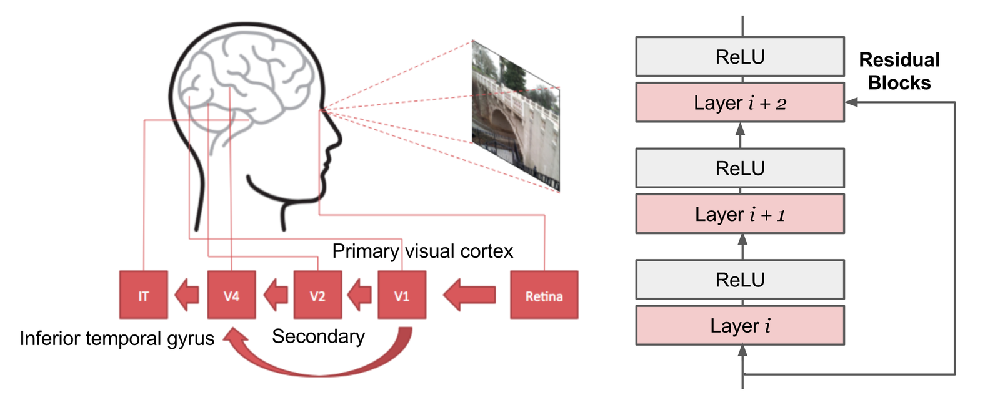

# Overfeat

**Type**: concept  
**Tags**: #concept

## Overview

**Overfeat** (Sermanet et al., 2013) is an early **integrated** CNN for classification, localization, and detection: shared convolutional trunk, **sliding-window** classification at multiple scales, and **class-specific bounding-box regressors** on the same features.

## Appearances

- [[Object Detection for Dummies Part 2]] — two-stage training, L2 box loss, test-time merge.

## Training stages

| Stage | Input | Output | Loss |
|-------|-------|--------|------|
| 1. Classification | ImageNet-scale images | Class label | Classification (AlexNet-like trunk) |
| 2. Localization | Images + GT boxes | \((x_{left}, x_{right}, y_{top}, y_{bottom})\) per class | L2 between predicted and GT box edges |

Architecture similar to **AlexNet**; stage 2 replaces top classifier layers with regression nets—**one regressor per class**.

## Inference

1. Classify at each window/scale with pretrained CNN.
2. Regress box edges on classified regions.
3. **Merge** boxes with sufficient spatial overlap and consistent class confidence.

## Relation to later detectors

| Idea | Overfeat | R-CNN family |
|------|----------|--------------|
| Shared conv | Yes (sliding) | Fast R-CNN onward |
| Proposals | Dense windows | Selective Search / RPN |
| Multi-task | Cls + reg | Cls + reg (+ mask) |

Precursor to unified heads in [[Fast R-CNN]] and dense predictors in [[YOLO]].

## Related

- [[Convolutional Neural Networks]]
- [[Bounding Box Regression]]
- [[Pierre Sermanet]]
- [[Object Detection for Dummies Part 2]]
- [[Object Detection for Dummies Part 3]]
