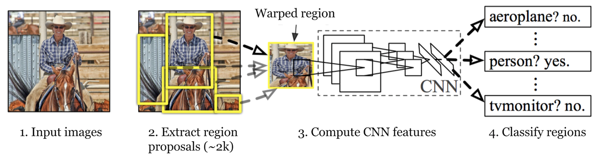

# R-CNN

**Type**: concept  
**Tags**: #concept

## Overview

**R-CNN** (Region-based CNN; Girshick et al., CVPR 2014) applies a CNN independently to each [[Selective Search]] proposal: extract features, classify with **per-class linear SVMs**, refine boxes with [[Bounding Box Regression]]. Three **separately trained** stages with minimal shared computation—accurate but slow.

## Appearances

- [[Object Detection for Dummies Part 3]] — full workflow, IoU thresholds, bottlenecks.
- [[Papers Explained 14 - RCNN]]

## Workflow (5 steps)

1. **Pre-train** CNN on ImageNet (AlexNet, VGG, ResNet, etc.) for \(N\) classes.
2. **Proposals**: [[Selective Search]] → ~**2000** category-independent boxes per image.
3. **Warp** each RoI to fixed CNN input size (e.g. 227×227).
4. **Fine-tune** CNN on warped regions for **\(K+1\)** classes (extra class = **background**); small LR; oversample positives (most proposals are background).
5. **Features → SVM**: one forward pass per region → feature vector; **binary linear SVM per class** (positives: IoU ≥ **0.3** with GT of that class).
6. **BBox regressor**: [[Bounding Box Regression]] on CNN features (train pairs IoU ≥ **0.6**).

## Why three models

| Component | Role | Trained when |
|-----------|------|--------------|
| CNN | Representation + soft fine-tune | Pre-train + proposal fine-tune |
| SVM | Per-class decision boundary | After fixed CNN features |
| Bbox reg | Localization refinement | On features + matched boxes |

No shared backward pass across the full pipeline during original R-CNN training.

## Speed bottlenecks

- Selective Search: seconds per image (CPU).
- **~2000 CNN forwards** per image (dominant GPU/CPU cost).
- Feature disk caching used in practice to amortize training.

Motivated **Fast R-CNN** (shared conv) and **Faster R-CNN** (learned proposals).

## Related

- [[Fast R-CNN]], [[Selective Search]], [[Bounding Box Regression]], [[Hard Negative Mining]], [[Non-Maximum Suppression]]
- [[Papers Explained 14 - RCNN]], [[Papers Explained Review 03 - RCNNs]]
- [[Object Detection for Dummies Part 3]]
