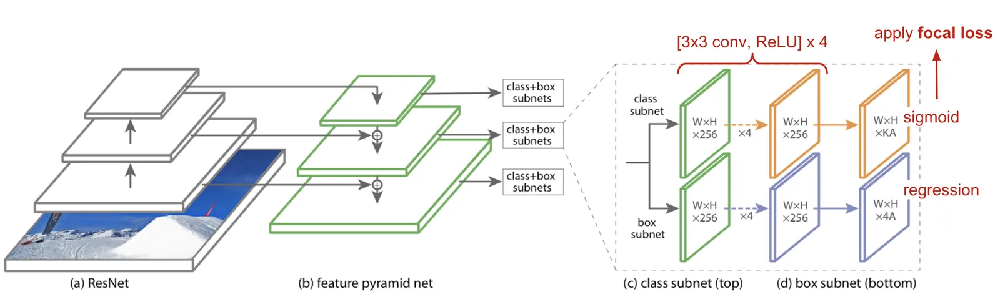
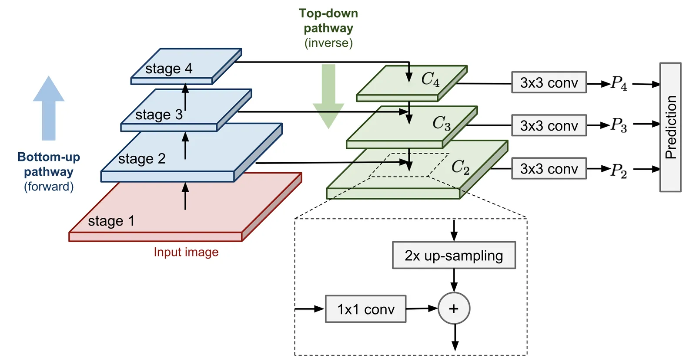
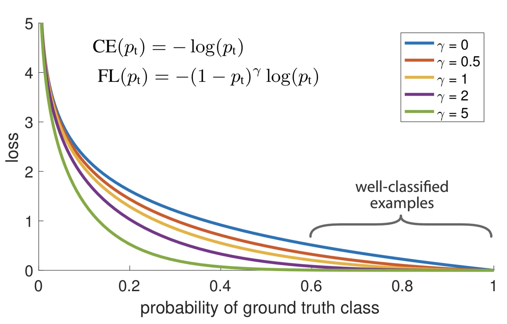
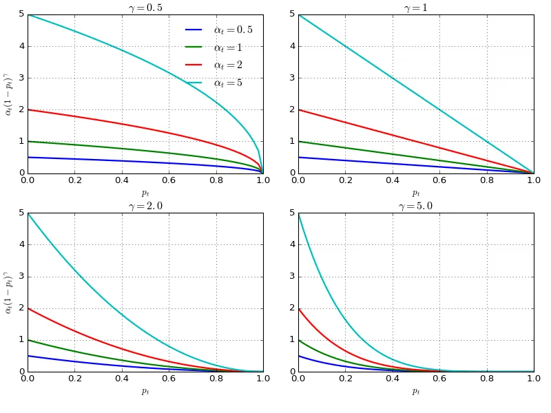

# RetinaNet

**Type**: concept  
**Tags**: #concept

## Overview

**RetinaNet** (Lin et al., ICCV 2017) is a one-stage detector using **ResNet + FPN** backbone and **focal loss** to handle extreme foreground/background imbalance—matching two-stage [[Mean Average Precision|mAP]] with faster inference in the original paper.

## Appearances

- [[Object Detection Part 4]] — focal loss math, FPN backbone diagram.
- [[Papers Explained 22 - Focal Loss for Dense Object Detection (RetinaNet)]]

## Architecture

- **Backbone**: ResNet (e.g. ResNet-50/101).
- **Neck**: [[Papers Explained 21 - Feature Pyramid Network|Feature Pyramid Network]] — top-down pathway + lateral connections merge semantically strong coarse maps with high-resolution fine maps.
- **Heads**: Separate subnet stacks for **classification** and **box regression** at each pyramid level (shared weights across levels within each subnet).

## Focal loss

Binary objectness CE: \(\text{CE}(p_t) = -\log p_t\) where \(p_t = p\) if \(y=1\) else \(1-p\).

**Focal loss** down-weights easy examples:

\[
\text{FL}(p_t) = -(1-p_t)^\gamma \log p_t
\]

**\(\alpha\)-balanced** variant (RetinaNet default \(\alpha=0.25, \gamma=2\)):

\[
\text{FL}(p_t) = -\alpha (1-p_t)^\gamma \log p_t
\]

When \(p_t \to 1\) for easy negatives, \((1-p_t)^\gamma \to 0\)—gradient focuses on hard examples.

## vs two-stage

| Issue | Two-stage R-CNN | RetinaNet |
|-------|-----------------|-----------|
| Imbalance | Few RoIs, balanced sampling | Dense anchors, focal loss |
| Speed | RPN + per-RoI head | Single dense pass |
| Multi-scale | FPN in Faster R-CNN later | FPN native |

## Related

- [[Papers Explained 22 - Focal Loss for Dense Object Detection (RetinaNet)]], [[Papers Explained 21 - Feature Pyramid Network]]
- [[One-Stage Object Detector]], [[SSD Object Detection]], [[YOLO]]
- [[Hard Negative Mining]] — explicit mining vs focal reweighting
- [[Object Detection Part 4]]
