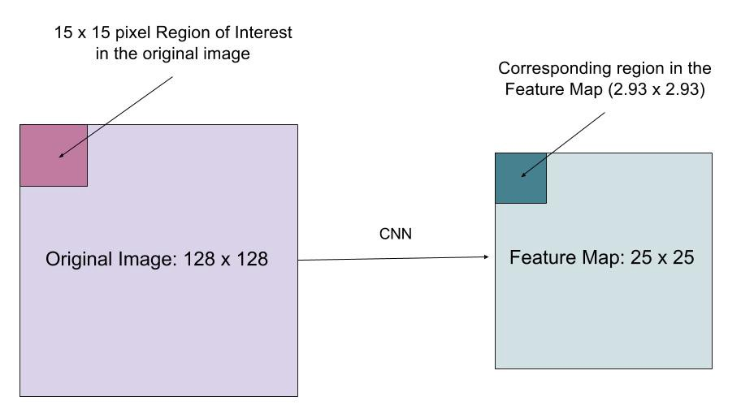

# RoIAlign

**Type**: concept  
**Tags**: #concept

## Overview

**RoIAlign** (Mask R-CNN) samples conv features at **continuous** RoI coordinates using **bilinear interpolation**, eliminating harsh quantization in [[RoI Pooling]]. Critical for instance segmentation and keypoint tasks.

## Appearances

- [[Object Detection for Dummies Part 3]] — contrast with \(\lfloor x/s \rfloor\) pooling.
- [[Papers Explained 17 - Mask RCNN]]

## Problem with RoI Pooling

Mapping image RoI to feature map stride \(s\): pooling uses **rounded** discrete indices. A 16×16 RoI on stride-16 map may misalign by up to half a cell—boxes still OK, **masks** degrade.

## RoIAlign fix

- Use **floating** coordinates (e.g. \(x/16\) not \(\lfloor x/16 \rfloor\)).
- For each output bin sample point, interpolate four neighboring feature cells with **bilinear** weights.
- No rounding of bin boundaries before sampling.

## Impact

Mask R-CNN reports large gains on mask AP vs RoI Pooling; detection AP also improves slightly from better feature alignment.

## Related

- [[RoI Pooling]], [[Mask R-CNN]], [[Kaiming He]]
- [[Papers Explained 17 - Mask RCNN]]
- [[Object Detection for Dummies Part 3]]
