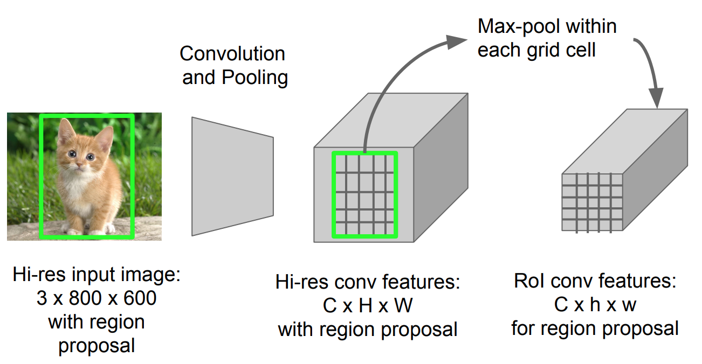

# RoI Pooling

**Type**: concept  
**Tags**: #concept

## Overview

**RoI pooling** (Fast R-CNN) max-pools features from a **variable-size** region on a conv feature map into a fixed **\(H \times W\)** grid (e.g. 7×7). Each bin covers a sub-window of the RoI; max within each bin yields a fixed-length descriptor per proposal.

## Appearances

- [[Object Detection for Dummies Part 3]] — replaces last pooling layer; enables shared conv.
- [[Papers Explained 15 - Fast RCNN]]

## Procedure

Given RoI of size \(h \times w\) on feature map:

1. Divide RoI into \(H \times W\) bins (approximate size \(h/H \times w/W\) each).
2. **Max-pool** inside each bin.
3. Output \(H \times W \times C\) tensor → flatten → FC layers.

## Quantization issue

RoI corners mapped to feature map indices via **rounding** (e.g. \(\lfloor x/16 \rfloor\)). Small objects and fine tasks (masks) suffer **misalignment**—motivates [[RoIAlign]].

## vs global pooling

| | RoI Pooling | Global average pool |
|---|-------------|---------------------|
| Input region | Arbitrary proposal box | Full image |
| Output size | Fixed per RoI | Single vector |

## Related

- [[RoIAlign]], [[Fast R-CNN]], [[Mask R-CNN]], [[Pooling]]
- [[Object Detection for Dummies Part 3]]
