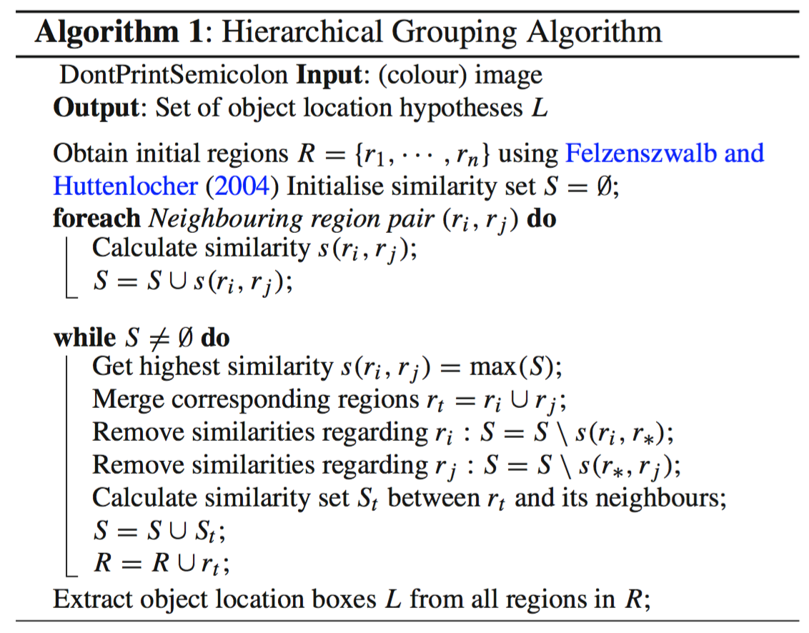

# Selective Search

**Type**: concept  
**Tags**: #concept

## Overview

**Selective Search** (Uijlings et al., IJCV 2013) produces **category-independent region proposals** by hierarchically merging Felzenszwalb superpixels using complementary similarity cues. R-CNN and many two-stage detectors consume ~**2000 proposals per image** from Selective Search instead of exhaustive sliding windows.

## Appearances

- [[Object Detection for Dummies Part 1]] — algorithm, four similarity types, configuration diversity.
- [[Object Detection for Dummies Part 3]] — R-CNN proposal stage (~2k candidates).

## Algorithm

1. **Initialize**: run [[Felzenszwalb Segmentation]] → initial regions.
2. **Greedy merge** (repeat until one region covers the image):
   - Compute similarity between all **neighboring** region pairs.
   - Merge the **most similar** pair.
   - Recompute similarities involving the new merged region.
3. **Output**: all regions generated at any step in the hierarchy (multi-scale proposal set).

## Four similarity measures (for pair \((r_i, r_j)\))

| Measure | Intuition |
|---------|-----------|
| **Color** | Similar color histograms → likely same object/surface |
| **Texture** | SIFT or material cues (texture recognition literature) |
| **Size** | Prefer merging small regions early (avoids one giant blob too soon) |
| **Shape** | One region can "fill" spatial extent of the other |

## Configuration diversity

Best-quality mode combines:

- Multiple Felzenszwalb **\(k\)** thresholds → different initial segmentations.
- Multiple **color spaces** (e.g. RGB, HSV, LAB).
- Different **combinations** of the four similarities.

Tradeoff: more configurations → better recall, higher compute. R-CNN papers prioritize quality over raw proposal speed.

## vs exhaustive search

| Approach | Candidates per image | Typical cost |
|----------|---------------------|--------------|
| Sliding window + pyramid | \(10^5\)–\(10^6\) | Prohibitive for CNN per window |
| Selective Search | ~2000 | Seconds per image (CPU, pre-deep-learning era) |
| [[Region Proposal Network]] | ~300–3000 anchors (learned) | Milliseconds on GPU (Faster R-CNN) |

## Downstream

[[R-CNN]] warps each proposal to CNN input size, extracts features, classifies with per-class SVMs. Bottleneck motivated [[Fast R-CNN]] (shared conv) and [[Faster R-CNN]] (learned RPN).

## Related

- [[Felzenszwalb Segmentation]]
- [[Region Proposal]]
- [[R-CNN]]
- [[Papers Explained 14 - RCNN]]
- [[Object Detection for Dummies Part 1]]
- [[Object Detection for Dummies Part 3]]
